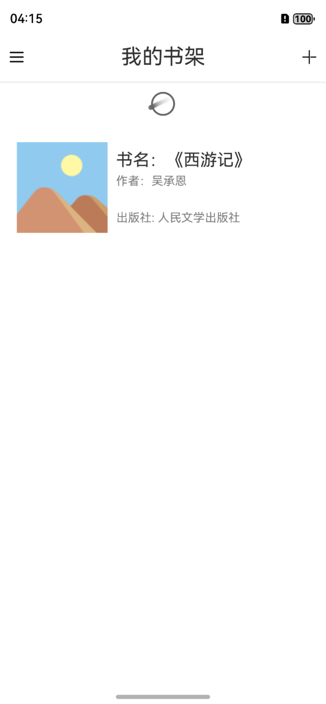
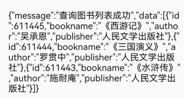
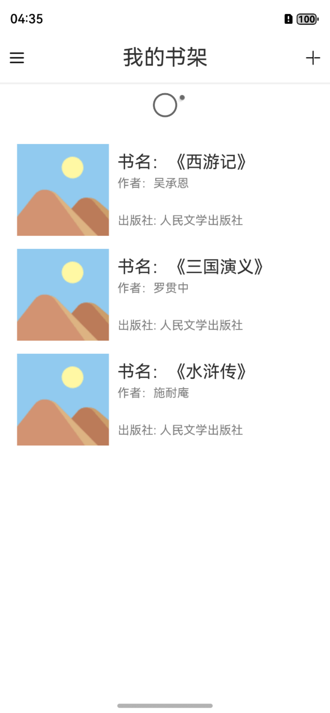
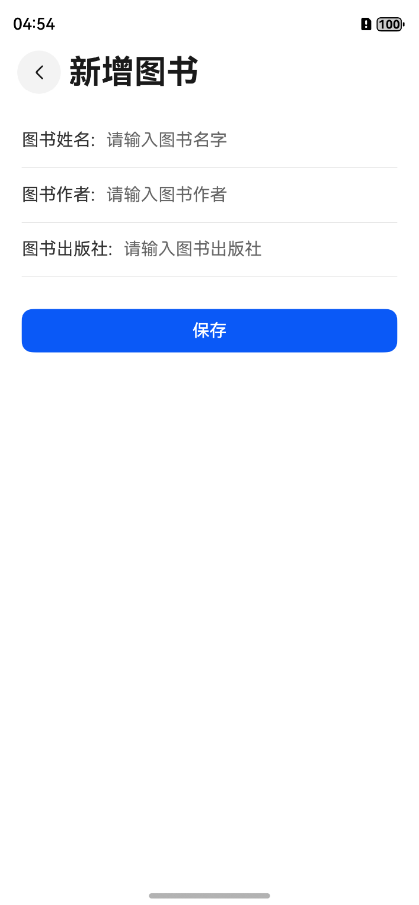
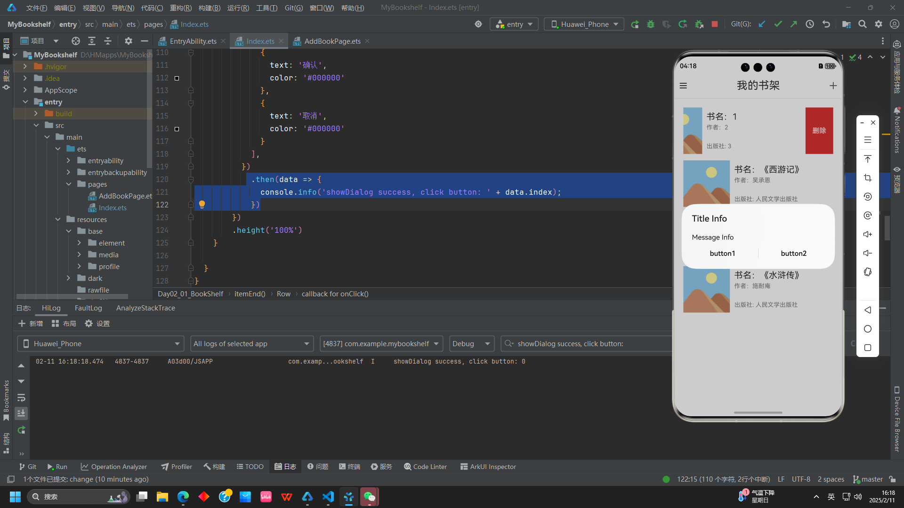

## 项目简介

我的书架是一个基于鸿蒙开发的图书管理应用，用户可以通过该应用实现图书的添加、删除、借阅、归还等功能。
开源地址：[我的书架](https://github.com/XBXyftx/MyBookshelf)

本项目旨在练习鸿蒙开发中的网络请求模块，实现对后端数据的增删改查，同时熟悉V2版本的状态管理。

## 功能实现

本项目主要实现的功能有以下几项：

1. 获取图书
2. 新增图书
3. 删除图书
4. 全部删除
5. 修改图书

### 获取图书

#### 开启网络权限

在`module.json5`中开启网络请求权限

```json5
"requestPermissions": [
  {
    "name": "ohos.permission.INTERNET"
  }
],
```

随后创建网络请求对象

```ArkTS
  req: http.HttpRequest = http.createHttp()
```

#### 用V2版本的状态管理搭建UI

```ArkTS
 import { router } from '@kit.ArkUI'
import { http } from '@kit.NetworkKit'

export interface Book {
  id: number
  bookName: string
  author: string
  publisher: string
}

export const creator: string = 'XBXyftx'

@Entry
@ComponentV2
struct Day02_01_BookShelf {
  creator: string = creator
  @Local books: Book[] = [{
    id: 366351,
    bookName: "《西游记》",
    author: "吴承恩",
    publisher: "人民文学出版社"
  }]
  @Local isLoading: boolean = true
  req: http.HttpRequest = http.createHttp()
  

  build() {
    Column() {
      // 头部
      this.HeaderBuilder()
      LoadingProgress()
        .width(50)

      List({ space: 15 }) {
        ForEach(this.books, (item: Book) => {
          ListItem() {
            bookItem({ data: item })
          }
          .swipeAction({
            end: () => {
              this.itemEnd(item)
            },
            edgeEffect: SwipeEdgeEffect.Spring
          })
          .onClick(() => {

          })
        })
      }
      .padding(20)
    }
    .height('100%')
    .width('100%')
  }

  @Builder
  HeaderBuilder() {
    Row() {
      Image($r('app.media.ic_public_drawer_filled'))
        .width(20);

      Text('我的书架')
        .fontSize(25)

      Image($r('app.media.ic_public_add'))
        .width(20)
        .onClick(() => {
          router.pushUrl({
            url: 'pages/Day02_01_BookShelf_Add'
          })
        })
    }
    .width('100%')
    .justifyContent(FlexAlign.SpaceBetween)
    .height(60)
    .padding(10)
    .border({ width: { bottom: 2 }, color: '#f0f0f0' })
    .backgroundColor(Color.White)
  }

  @Builder
  itemEnd(item: Book) {
    Row() {
      Button('删除')
        .type(ButtonType.Normal)
        .backgroundColor('#da3231')
        .onClick(() => {
          AlertDialog.show({ message: '点了删除' })
        })
        .height('100%')
    }

  }
}

@ComponentV2
struct bookItem {
  @Param data: Partial<Book> = {}

  build() {
    Row({ space: 10 }) {
      Image($r('app.media.ic_public_cover'))
        .width(108)
        .height(108)
      Column({ space: 5 }) {

        Text('书名：' + this.data.bookName)
          .fontSize(20)
        Text('作者：' + this.data.author)
          .fontSize(14)
          .fontColor(Color.Gray)
        Blank()
        Text('出版社: ' + this.data.publisher)
          .fontSize(14)
          .fontColor(Color.Gray)
      }
      .padding({ top: 10, bottom: 10 })
      .height(108)
      .alignItems(HorizontalAlign.Start)
    }
  }
}
```



#### 获取数据格式定义接口

```ArkTS
  aboutToAppear(): void {
    this.req.request(`https://hmajax.itheima.net/api/books?creator=${this.creator}`)
      .then((res)=>{
        AlertDialog.show({message:res.result.toString()})
      })
  }
```



由此可以定义接口

```ArkTS
export interface Book {
  id: number
  bookName: string
  author: string
  publisher: string
}
export interface BookRes{
  message:string
  data:Book[]
}
```

于是针对数据结构进行相应的数据处理如下

```ArkTS
@Local books: Book[] = []
aboutToAppear(): void {
  this.req.request(`https://hmajax.itheima.net/api/books?creator=${this.creator}`)
    .then((res)=>{
      this.books = (JSON.parse(res.result.toString()) as BookRes).data
    })
}
```

显示效果如下


#### 加载效果开关

```ArkTS
    @Local isLoading: boolean = true
  
    aboutToAppear(): void {
      this.isLoading = true
      this.req.request(`https://hmajax.itheima.net/api/books?creator=${this.creator}`)
        .then((res)=>{
          this.books = (JSON.parse(res.result.toString()) as BookRes).data
          this.isLoading = false
        })
        .catch((err:string)=>{
          AlertDialog.show({
            message:err
          })
          this.isLoading = false
        })
    }

    if (this.isLoading){
        LoadingProgress()
            .width(50)
    }
```

### 新增图书

#### 跳转页面

首先从主页跳转至新增页面

```ArkTS
Image($r('app.media.ic_public_add'))
  .width(20)
  .onClick(() => {
    router.pushUrl({
      url: 'pages/AddBookPage'
    })
  })
```

#### 新增图书页面逻辑分析

UI框架如下：

```ArkTS
@Entry
@ComponentV2
struct BookShelf_Add {
  @Local bookname: string = ''
  @Local author: string = ''
  @Local publisher: string = ''

  build() {
    Navigation() {
      Column({ space: 10 }) {
        Row() {
          Text('图书姓名:')
          TextInput({
            placeholder: '请输入图书名字',
            text: $$this.bookname
          })
            .height(30)
            .backgroundColor(Color.Transparent)
            .layoutWeight(1)
            .padding({ left: 10, top: 0, bottom: 0 })
        }

        Divider()
        Row() {
          Text('图书作者:')
          TextInput({
            placeholder: '请输入图书作者',
            text: $$this.author
          })
            .height(30)
            .backgroundColor(Color.Transparent)
            .layoutWeight(1)
            .padding({ left: 10, top: 0, bottom: 0 })
        }

        Divider()
        Row() {
          Text('图书出版社:')
          TextInput({
            placeholder: '请输入图书出版社',
            text: $$this.publisher
          })
            .height(30)
            .backgroundColor(Color.Transparent)
            .layoutWeight(1)
            .padding({ left: 10, top: 0, bottom: 0 })
        }

        Divider()


        Button('保存')
          .width('100%')
          .margin({ top: 20 })
          .type(ButtonType.Normal)
          .borderRadius(10)
          .onClick(() => {
          })

      }
      .padding(20)
    }
    .title('新增图书')
    .titleMode(NavigationTitleMode.Mini)
    .backButtonIcon($r('app.media.ic_public_arrow_left'))
  }
}
```



在点击保存按钮之后，首先要去判断输入框是否为空，为空则提示用户输入，不为空则将数据发送至后端。

```ArkTS
.onClick(() => {
  if (this.bookname.trim() === '' || this.author.trim() === '' || this.publisher.trim() === '') {
    AlertDialog.show({
      message:'新建图书信息均不能为空'
    })
    return
  }
})
```

在不为空的情况下就可去发送请求添加书籍，并返回数据。
请求方法为Post，数据格式为json。

```ArkTS
.onClick(() => {
  if (this.bookname.trim() === '' || this.author.trim() === '' || this.publisher.trim() === '') {
    AlertDialog.show({
      message:'新建图书信息均不能为空'
    })
    return
  }
  const req = http.createHttp()
  req.request('https://hmajax.itheima.net/api/books',{
    method: http.RequestMethod.POST,
    header:{
      contentType:'application/json'
    },
    extraData:{
      bookname:this.bookname,
      author:this.author,
      publisher:this.publisher,
      creator:creator
    }
  })
    .then((res)=>{
      const addRes = JSON.parse(res.result.toString()) as AddResponse
      router.back()
      AlertDialog.show({
        message:addRes.message
      })
    })
})
```

请求是成功的但是首页的图书列表并没有更新，需要刷新页面。
这是因为`aboutToAppear`函数只在页面第一次出现时调用，而不是每次页面重新出现时调用。
所以换位`onPageShow`函数即可。

```ArkTS
  onPageShow(): void {
    this.isLoading = true
    this.req.request(`https://hmajax.itheima.net/api/books?creator=${this.creator}`)
      .then((res)=>{
        this.books = (JSON.parse(res.result.toString()) as BookRes).data
        this.isLoading = false
      })
      .catch((err:string)=>{
        AlertDialog.show({
          message:err
        })
        this.isLoading = false
      })
  }
```

### 删除图书

删除图书操作通过点击ListItem组件的左划删除按钮来触发。
但若点击删除事件直接触发删除函数的话这并不合理，因为用户很可能**误触**。
所以在点击删除按钮时先弹出一个确认框，确认用户是否要删除。
[确认弹窗文档](https://developer.huawei.com/consumer/cn/doc/harmonyos-references-V5/js-apis-promptaction-V5)

```ArkTS
Button('删除')
  .type(ButtonType.Normal)
  .backgroundColor('#da3231')
  .onClick(() => {
    promptAction.showDialog({
      title: '删除确认',
      message: `您是否确认删除${item.bookname}`,
      buttons: [
        {
          text: '确认',
          color: '#000000'
        },
        {
          text: '取消',
          color: '#000000'
        }
      ],
    })
      .then(data => {
        console.info('showDialog success, click button: ' + data.index);
      })
  })
```

通过在日志筛选关键字`showDialog success, click button:`来获取用户点击的按钮`index`。



由此可知`data.index`的索引值与`buttons`对象数组中的索引值一致。
所以当用户点击确认时就可以去发送请求删除图书。

```ArkTS
Button('删除')
  .type(ButtonType.Normal)
  .backgroundColor('#da3231')
  .onClick(() => {
    promptAction.showDialog({
      title: '删除确认',
      message: `您是否确认删除${item.bookname}`,
      buttons: [
        {
          text: '确认',
          color: '#000000'
        },
        {
          text: '取消',
          color: '#000000'
        }
      ],
    })
      .then(data => {
        console.info('showDialog success, click button: ' + data.index);
        if (data.index === 0) {
          this.req.request(`https://hmajax.itheima.net/api/books/${item.id}`,{
            method:http.RequestMethod.DELETE
          })
            .then((rep)=>{
              promptAction.showToast({
                message:'删除成功'
              })
              this.reloadBooks()
            })
        }
      })
  })
```

<video width="100%" controls>
  <source src="6.mp4" type="video/mp4">
  您的浏览器不支持视频标签。
</video>

这样就完成了在提示用户确认删除后再删除对应图书的功能。

### 全部删除

全部删除功能是在删除图书功能的基础上实现的。
由于后端并没有给出删除全部图书的接口，所以需要在前端用删除图书的功能来模拟。

而UI界面上并没有预留全部删除按钮，所以我选择添加一个侧边栏。

1. 首先重构整个页面结构，将最外层组件替换为`SideBarContainer`
2. 然后将侧边栏和主页面的默认内容重构为两个`Builder`。这一步主要为了方便管理代码，提高可读性可省略。
3. 在侧边栏中添加一个删除全部的按钮。
4. 在点击删除全部按钮时弹出确认框，确认用户是否要删除全部图书。
5. 若用户确认删除，则发送请求删除全部图书。

```ArkTS
import { promptAction, router } from '@kit.ArkUI'
import { http } from '@kit.NetworkKit'

export interface Book {
  id: number
  bookname: string
  author: string
  publisher: string
}

export interface BookRes {
  message: string
  data: Book[]
}

export const creator: string = 'XBXyftx'

@Entry
@ComponentV2
struct Day02_01_BookShelf {
  creator: string = creator
  @Local books: Book[] = []
  @Local isLoading: boolean = true
  @Local sideBarShow: boolean = false
  req: http.HttpRequest = http.createHttp()

  onPageShow(): void {
    this.reloadBooks()
  }

  private reloadBooks() {
    this.isLoading = true
    this.req.request(`https://hmajax.itheima.net/api/books?creator=${encodeURIComponent(this.creator)}`)
      .then((res) => {
        this.books = (JSON.parse(res.result.toString()) as BookRes).data
        this.isLoading = false
      })
      .catch((err: string) => {
        AlertDialog.show({
          message: err
        })
        this.isLoading = false
      })
  }

  build() {

    SideBarContainer(SideBarContainerType.Overlay) {
      //默认隐藏的侧边栏
      this.SidebarContent_IndexPage()

      // 显示的主区域
      this.MainPartOf_IndexPage()
    }
    .showControlButton(false)
    .showSideBar($$this.sideBarShow)
    .maxSideBarWidth('75%')
    .minSideBarWidth('50%')

  }

  @Builder
  SidebarContent_IndexPage() {
    //默认隐藏的侧边栏
    Column({ space: 20 }) {
      Image($rawfile('删除全部.svg'))
        .width(50)
        .onClick(() => {
          this.deleteAllBooks()
        })
      Text('删除全部')
        .fontSize(20)
        .fontWeight(500)
    }
    .justifyContent(FlexAlign.Center)
    .backgroundColor(Color.White)
    .height('100%')
    .width('100%')
  }

  private deleteAllBooks() {
    const BooksIds: number[] = this.books.map(item => item.id)
    promptAction.showDialog({
      title: '删除确认',
      message: `您是否确认删除全部书籍`,
      buttons: [
        {
          text: '确认',
          color: '#000000'
        },
        {
          text: '取消',
          color: '#000000'
        }
      ],
    })
      .then(data => {
        console.info('showDialog success, click button: ' + data.index)
        if (data.index === 0) {
          for (let i = 0; i < BooksIds.length; i++) {
            this.req.request(`https://hmajax.itheima.net/api/books/${BooksIds[i]}`, {
              method: http.RequestMethod.DELETE
            })
              .then((rep) => {
                promptAction.showToast({
                  message: (JSON.parse(rep.result.toString()) as BookRes).message
                })
                this.reloadBooks()
              })
          }
        }
      })
  }

  @Builder
  MainPartOf_IndexPage() {
    // 显示的主区域
    Column() {
      // 头部
      this.HeaderBuilder()

      if (this.isLoading) {
        LoadingProgress()
          .width(50)
      }

      List({ space: 15 }) {
        ForEach(this.books, (item: Book) => {
          ListItem() {
            bookItem({ data: item })
          }
          .width('100%')
          .swipeAction({
            end: () => {
              this.itemEnd(item)
            },
            edgeEffect: SwipeEdgeEffect.Spring
          })
          .onClick(() => {
          })
        })
      }
      .padding(20)
    }
    .height('100%')
    .width('100%')
  }

  @Builder
  HeaderBuilder() {
    Row() {
      Image($r('app.media.ic_public_drawer_filled'))
        .width(20)
        .onClick(() => {
          animateTo({ duration: 500, curve: Curve.Ease }, () => {
            this.sideBarShow = true
          })
        })

      Text('我的书架')
        .fontSize(25)

      Image($r('app.media.ic_public_add'))
        .width(20)
        .onClick(() => {
          router.pushUrl({
            url: 'pages/AddBookPage'
          })
        })
    }
    .width('100%')
    .justifyContent(FlexAlign.SpaceBetween)
    .height(60)
    .padding(10)
    .border({ width: { bottom: 2 }, color: '#f0f0f0' })
    .backgroundColor(Color.White)
  }

  @Builder
  itemEnd(item: Book) {
    Row() {
      Button('删除')
        .type(ButtonType.Normal)
        .backgroundColor('#da3231')
        .onClick(() => {
          this.deleteOneBook(item)
        })
        .height('100%')
    }

  }

  private deleteOneBook(item: Book) {
    promptAction.showDialog({
      title: '删除确认',
      message: `您是否确认删除${item.bookname}`,
      buttons: [
        {
          text: '确认',
          color: '#000000'
        },
        {
          text: '取消',
          color: '#000000'
        }
      ],
    })
      .then(data => {
        console.info('showDialog success, click button: ' + data.index)
        if (data.index === 0) {
          this.req.request(`https://hmajax.itheima.net/api/books/${item.id}`, {
            method: http.RequestMethod.DELETE
          })
            .then((rep) => {
              promptAction.showToast({
                message: '删除成功'
              })
              this.reloadBooks()
            })
        }
      })
  }
}

@ComponentV2
struct bookItem {
  @Param data: Partial<Book> = {}

  build() {
    Row({ space: 10 }) {
      Image($r('app.media.ic_public_cover'))
        .width(108)
        .height(108)
      Column({ space: 5 }) {

        Text('书名：' + this.data.bookname)
          .fontSize(20)
        Text('作者：' + this.data.author)
          .fontSize(14)
          .fontColor(Color.Gray)
        Blank()
        Text('出版社: ' + this.data.publisher)
          .fontSize(14)
          .fontColor(Color.Gray)
      }
      .padding({ top: 10, bottom: 10 })
      .height(108)
      .alignItems(HorizontalAlign.Start)
    }
    .width('100%')
  }
}
```

<video width="100%" controls>
  <source src="7.mp4" type="video/mp4">
  您的浏览器不支持视频标签。
</video>

至此我们实现了删除全部的功能。

### 修改图书

修改图书的API接口为`PUT`方法。同时拥有路径参数，也有请求体参数。
路径参数为`id`，请求体参数为`bookname`、`author`、`publisher`、`creator`。

实现思路：

1. 点击图书列表中的图书后携带图书ID跳转到修改页面。
2. 根据ID发送请求获取图书详情。
3. 在修改页面中显示图书详情。
4. 在修改页面中修改图书详情。
5. 点击保存按钮发送请求修改图书。
6. 返回图书列表页面。

获取图书Id可以在`aboutToAppear`函数中获取。

```ArkTS
  bookId:number = 0
  aboutToAppear(): void {
    this.bookId = router.getParams() as number
  }
```

在获取到ID后就需要发送请求获取图书详情。所以还需再`aboutToAppear`函数中发送请求。

```ArkTS
  aboutToAppear(): void {
    this.bookId = (router.getParams() as BookInfo).id

    const req = http.createHttp()
    req.request(`https://hmajax.itheima.net/api/books/${this.bookId}`)
      .then(res => {
        const bookRes = JSON.parse(res.result.toString()) as GetBookResponse
        promptAction.showToast({
          message: bookRes.message
        })
        this.bookname = bookRes.data.bookname
        this.author = bookRes.data.author
        this.publisher = bookRes.data.publisher
      })
  }
```

随后在保存按钮的`onClick`函数中发送请求修改图书。

```ArkTS
Button('保存')
  .width('100%')
  .margin({ top: 20 })
  .type(ButtonType.Normal)
  .borderRadius(10)
  .onClick(() => {
    const req = http.createHttp()
    req.request(`https://hmajax.itheima.net/api/books/${this.bookId}`,{
      method:http.RequestMethod.PUT,
      header:{
        ContentType:"application/json"
      },
      extraData:{
        bookname:this.bookname,
        author:this.author,
        publisher:this.publisher,
        creator:creator
      }
    }).then((req)=>{
      promptAction.showToast({
        message:(JSON.parse(req.result.toString()) as BookChangeRep).message
      })
      router.back()
    })
  })
```

这里要注意的是`extraData`中的数据格式为`json`。所以需要在请求头中添加`ContentType`。

<video width="100%" controls>
  <source src="8.mp4" type="video/mp4">
  您的浏览器不支持视频标签。
</video>

至此我们就完成了修改图书的功能。

## 总结

好啦，这个项目就到此为止了，在春节期间开始，中间拖拖拉拉到了14号才完成。

在技术上主要用到了以下几点：

1. 网络请求：用鸿蒙的网络请求模块来进行增删改查图书信息。
2. 路由：用鸿蒙的路由模块来进行页面跳转。
3. 动画：用鸿蒙的动画模块来实现侧边栏的展开和收起。
4. 弹窗：用鸿蒙的弹窗模块来实现删除确认框和提示框。

当然还有其他一些零碎的点就不一一列举了。

当然这个项目也算是打破了我之前一直不敢迈出的一步，也就是网络请求这一方面，在过去的一些活动中也尝试用过Java，Python，JS等语言的网络请求，我以前我总是认为要学的太多了，如果出bug了我就很难找到原因，它的Debug并不像一段算法代码或是UI一样，它还涉及到硬件、网络、后端等方面的问题。
但是在这次项目中我发现了鸿蒙的网络请求模块的强大之处，它的API非常简单，而且还支持异步请求，这使得我可以在不影响主线程的情况下进行网络请求，这是我之前一直不敢尝试的。

我也是得再次自嘲一下，以前的我也干过不少鼓励其他人走出舒适区的事，但真到自己身上时却又开始犯怵了，笑死了。

行了就先说这么多吧，下次见。


