## 复习课大纲

1. 线性优化 LP 建模
2. 二维的图解法 LP
3. 单纯形表 LP（大M法）闭合、位势 $(u,v)$
4. 运输问题（建模，初始值，检验数，负的检验数用闭回路调整）
5. 指派问题（匈牙利算法）
6. 相关概念、定理（凸集、凸函数、性质、定理）
7. 无约束（最速下降法、牛顿法）
8. 最优性定理（有、无约束，一阶、二阶、KKT条件）
9. 罚函数法、障碍函数的构造
10. 遗传算法

## 22～23最优化理论真题

### 一、用图解法求解线性规划问题

**题目：** 用图解法求解线性规划问题（$10$ 分）

$$
\min \quad f = x_1 + x_2 \quad s.t. \begin{cases} x_1 + x_2 \leq 3 \\ x_1 \leq x_2 \\ x_1 \geq 1 \end{cases}
$$

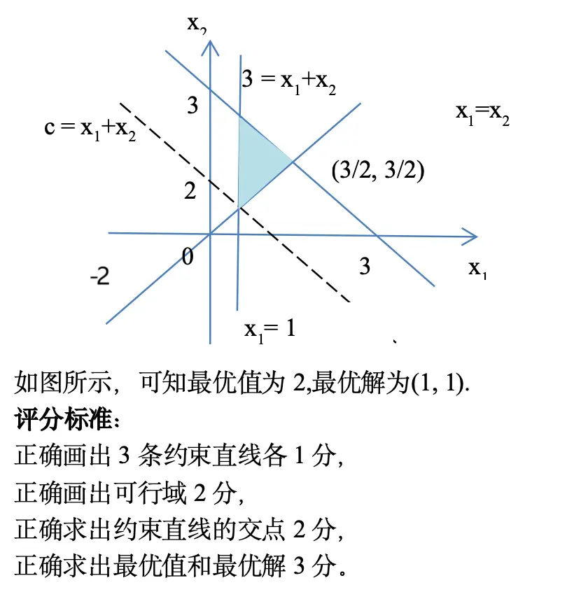

**第一步：将约束条件转化为等式直线方程**

将各不等式约束取等号，得到三条约束直线：

- $x_1 + x_2 = 3$，该直线过点 $(0, 3)$ 和 $(3, 0)$，可行域位于直线下方；
- $x_1 = x_2$，该直线为过原点的 $45^\circ$ 直线，可行域位于直线上方（即 $x_2 \geq x_1$）；
- $x_1 = 1$，该直线为垂直于 $x_1$ 轴的直线，可行域位于直线右侧（即 $x_1 \geq 1$）。

**第二步：求各约束直线的交点（可行域顶点）**

联立各约束直线方程，求可行域的顶点坐标：

- $x_1 = 1$ 与 $x_1 = x_2$ 联立：$x_1 = 1$，代入得 $x_2 = 1$，得交点 $A(1, 1)$；
- $x_1 = 1$ 与 $x_1 + x_2 = 3$ 联立：$1 + x_2 = 3$，解得 $x_2 = 2$，得交点 $B(1, 2)$；
- $x_1 = x_2$ 与 $x_1 + x_2 = 3$ 联立：$2x_1 = 3$，解得 $x_1 = \dfrac{3}{2}$，$x_2 = \dfrac{3}{2}$，得交点 $C\left(\dfrac{3}{2}, \dfrac{3}{2}\right)$。

三条直线围成的三角形区域 $ABC$ 即为可行域。

**第三步：绘制图形并分析目标函数**

**第四步：分析目标函数等值线**

目标函数 $f = x_1 + x_2$ 的等值线方程为 $x_1 + x_2 = c$（$c$ 为常数），即 $x_2 = -x_1 + c$。这是一族斜率为 $-1$ 的平行直线。最小化 $f$ 等价于使等值线沿目标函数梯度方向 $(1, 1)$ 的反方向移动，即让常数 $c$ 不断减小。

**第五步：确定最优解与最优值**

将可行域的三个顶点分别代入目标函数计算：

- 在点 $A(1, 1)$ 处：$f = 1 + 1 = 2$；
- 在点 $B(1, 2)$ 处：$f = 1 + 2 = 3$；
- 在点 $C\left(\dfrac{3}{2}, \dfrac{3}{2}\right)$ 处：$f = \dfrac{3}{2} + \dfrac{3}{2} = 3$。

当等值线 $x_1 + x_2 = 2$ 移动到点 $A(1, 1)$ 时，$c$ 取到最小值 $2$。若继续沿反方向移动，等值线将完全离开可行域。因此，最优解在顶点 $A$ 处取得。

**结论：**

最优解为 $(x_1^*, x_2^*) = (1, 1)$，最优值为 $f^* = 2$。

**评分标准对应：**

- 正确画出 $3$ 条约束直线各 $1$ 分；
- 正确画出可行域 $2$ 分；
- 正确求出约束直线的交点 $2$ 分；
- 正确求出最优值和最优解 $3$ 分。

### 二、叙述并证明无约束最优化问题的一阶必要条件

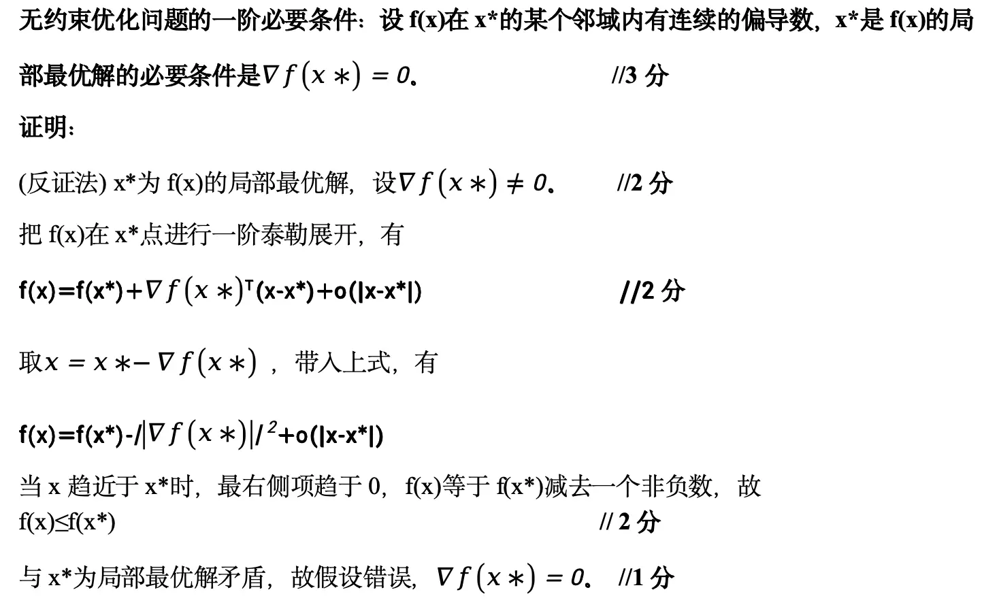

**无约束最优化问题**的一般形式为：

$$
\min_{x \in \mathbb{R}^n} f(x)
$$

其中 $f: \mathbb{R}^n \to \mathbb{R}$ 为连续可微的目标函数。所谓"无约束"，是指决策变量 $x$ 在整个 $n$ 维欧氏空间 $\mathbb{R}^n$ 中自由取值，不受到任何等式或不等式约束的限制。

**一阶必要条件**（定理3）

设 $f(x)$ 在 $x^*$ 的某个邻域内有**连续的偏导数**（即 $f$ 在 $x^*$ 附近连续可微），若 $x^*$ 是 $f(x)$ 的局部最优解，则

$$
\nabla f(x^*) = 0
$$

也就是说：**若 $x^*$ 是局部最优解，则它在该点处的梯度必须为零向量。**

满足 $\nabla f(x^*) = 0$ 的点称为**驻点**（Stationary Point）。驻点可能为局部极小点、局部极大点或鞍点，因此梯度为零只是极值点的必要条件，而非充分条件。

**证明：**（反证法）

设 $x^*$ 为 $f(x)$ 的局部最优解，假设 $\nabla f(x^*) \neq 0$。

由一阶泰勒展开，对 $x^*$ 附近的任意点 $x$ 有：

$$
f(x) = f(x^*) + \nabla f(x^*)^T (x - x^*) + o(\|x - x^*\|)
$$

取 $x = x^* - t\nabla f(x^*)$（$t > 0$），代入得：

$$
\begin{aligned}
f(x) - f(x^*) &= \nabla f(x^*)^T \bigl(-t\nabla f(x^*)\bigr) + o(t) \\
&= -t\|\nabla f(x^*)\|^2 + o(t)
\end{aligned}
$$

由于 $\nabla f(x^*) \neq 0$，有 $\|\nabla f(x^*)\|^2 > 0$。当 $t > 0$ 充分小时，一阶负项占主导，故：

$$
f(x) - f(x^*) < 0 \quad\Longrightarrow\quad f(x) < f(x^*)
$$

这与 $x^*$ 为局部最优解矛盾。因此假设错误，必有 $\nabla f(x^*) = 0$。

**几何解释：** 梯度指向函数值增长最快的方向，若梯度不为零，则沿负梯度方向可使函数值下降，故该点不可能为局部极小点。

**二阶必要条件**（定理4）

设 $f: \mathbb{R}^n \to \mathbb{R}$ 在 $x^*$ 处有二阶连续偏导数，若 $x^*$ 是 $f$ 的局部极小点，则

$$
\nabla f(x^*) = 0 \quad \text{且} \quad \nabla^2 f(x^*) \succeq 0 \; (\text{半正定})
$$

其中 $\nabla^2 f(x^*)$ 为 $f$ 在 $x^*$ 处的**Hesse矩阵**（二阶偏导数矩阵）。该条件说明：局部极小点不仅梯度为零，而且函数在该点的二阶曲率必须"向上开口"（半正定）。

**二阶充分条件**（定理5）

设 $f: \mathbb{R}^n \to \mathbb{R}$ 在 $x^*$ 的某邻域内有连续的二阶偏导数，若

$$
\nabla f(x^*) = 0 \quad \text{且} \quad \nabla^2 f(x^*) \succ 0 \; (\text{正定})
$$

则 $x^*$ 是 $f$ 在该邻域内的**严格局部极小点**。

三者关系总结如下：

| 条件类型 | 前提 | 结论 |
| --- | --- | --- |
| 一阶必要 | $f$ 在 $x^*$ 可微 | $x^*$ 为局部极小点 $\Rightarrow \nabla f(x^*) = 0$ |
| 二阶必要 | $f$ 在 $x^*$ 二阶连续可微 | $x^*$ 为局部极小点 $\Rightarrow \nabla f(x^*) = 0, \nabla^2 f(x^*) \succeq 0$ |
| 二阶充分 | $f$ 在 $x^*$ 邻域二阶连续可微 | $\nabla f(x^*) = 0, \nabla^2 f(x^*) \succ 0$ $\Rightarrow x^*$ 为严格局部极小点 |

### 三、单纯形表法

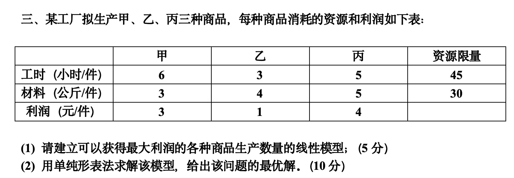

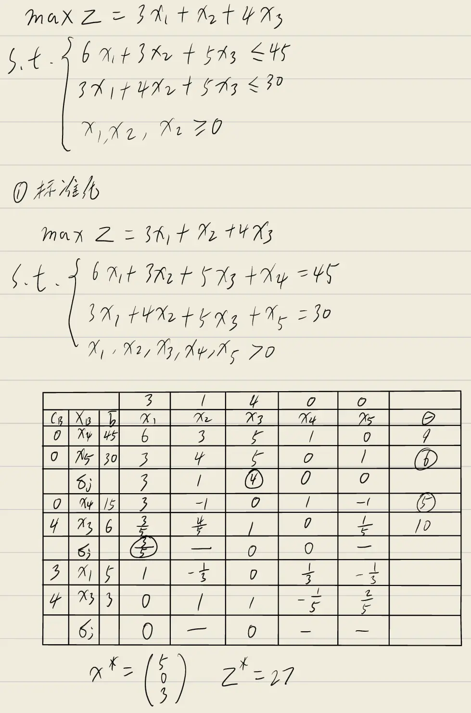

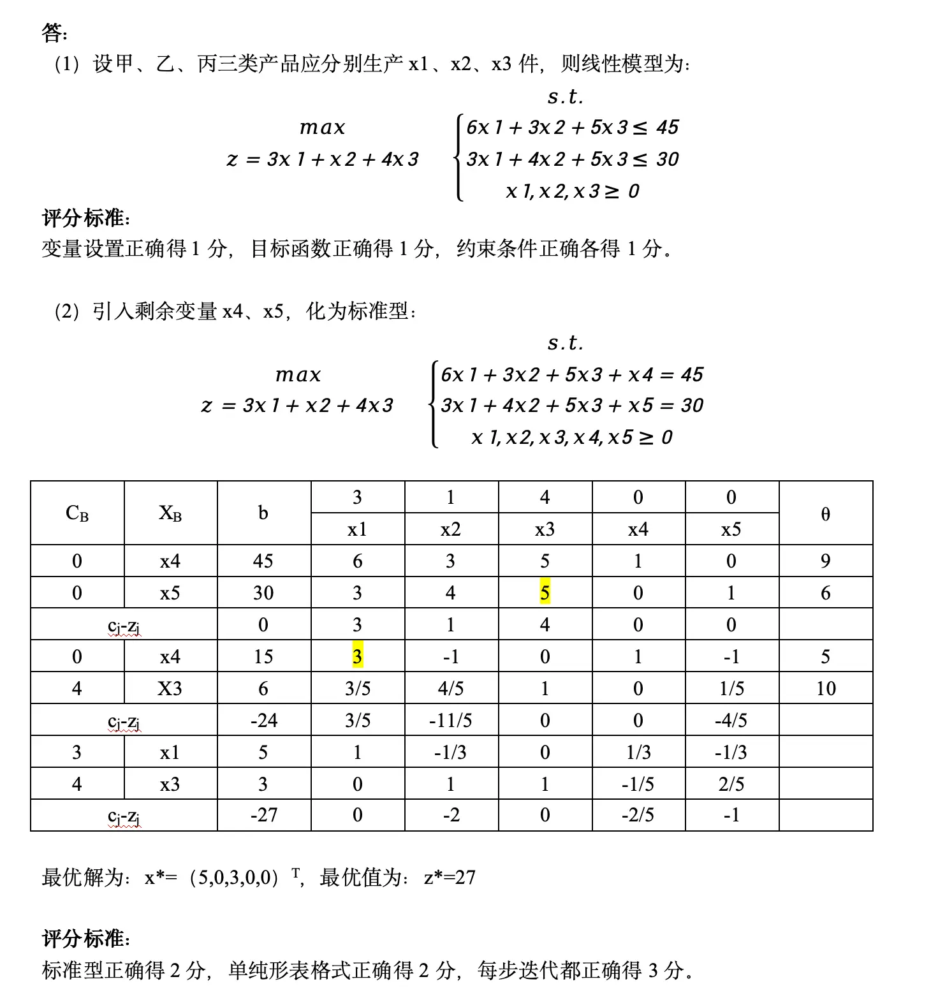

**题目：** 某工厂拟生产甲、乙、丙三种商品，每种商品消耗的资源与利润如下表：

| | 甲 | 乙 | 丙 | 资源限量 |
| --- | --- | --- | --- | --- |
| 工时（小时/件） | 6 | 3 | 5 | 45 |
| 材料（公斤/件） | 3 | 4 | 5 | 30 |
| 利润（元/件） | 3 | 1 | 4 | |

(1) 建立可以获得最大利润的各种商品生产数量的线性模型；（5 分）
(2) 用单纯形表法求解该模型，给出该问题的最优解。（10 分）

**解答：**

**(1) 建立线性规划模型**

设甲、乙、丙三种产品分别生产 $x_1, x_2, x_3$ 件，则线性规划模型为：

$$
\begin{aligned}
\max \quad & z = 3x_1 + x_2 + 4x_3 \\
\text{s.t.} \quad & \begin{cases}
6x_1 + 3x_2 + 5x_3 \leq 45 \\
3x_1 + 4x_2 + 5x_3 \leq 30 \\
x_1, x_2, x_3 \geq 0
\end{cases}
\end{aligned}
$$

**(2) 单纯形表法求解**

引入松弛变量 $x_4, x_5$，将模型化为标准型：

$$
\begin{aligned}
\max \quad & z = 3x_1 + x_2 + 4x_3 + 0x_4 + 0x_5 \\
\text{s.t.} \quad & \begin{cases}
6x_1 + 3x_2 + 5x_3 + x_4 = 45 \\
3x_1 + 4x_2 + 5x_3 + x_5 = 30 \\
x_1, x_2, x_3, x_4, x_5 \geq 0
\end{cases}
\end{aligned}
$$

**初始单纯形表**

<table style="border-collapse: collapse; margin: 10px auto; text-align: center; font-size: 0.95em;">
  <thead>
    <tr>
      <th colspan="3" style="border: 1px solid #555;"></th>
      <th style="border: 1px solid #555;">$3$</th>
      <th style="border: 1px solid #555;">$1$</th>
      <th style="border: 1px solid #555;">$4$</th>
      <th style="border: 1px solid #555;">$0$</th>
      <th style="border: 1px solid #555;">$0$</th>
      <th rowspan="2" style="border: 1px solid #555;">$\theta$</th>
    </tr>
    <tr>
      <th style="border: 1px solid #555;">$C_B$</th>
      <th style="border: 1px solid #555;">$X_B$</th>
      <th style="border: 1px solid #555;">$b$</th>
      <th style="border: 1px solid #555;">$x_1$</th>
      <th style="border: 1px solid #555;">$x_2$</th>
      <th style="border: 1px solid #555;">$x_3$</th>
      <th style="border: 1px solid #555;">$x_4$</th>
      <th style="border: 1px solid #555;">$x_5$</th>
    </tr>
  </thead>
  <tbody>
    <tr>
      <td style="border: 1px solid #555;">$0$</td>
      <td style="border: 1px solid #555;">$x_4$</td>
      <td style="border: 1px solid #555;">$45$</td>
      <td style="border: 1px solid #555;">$6$</td>
      <td style="border: 1px solid #555;">$3$</td>
      <td style="border: 1px solid #555;">$5$</td>
      <td style="border: 1px solid #555;">$1$</td>
      <td style="border: 1px solid #555;">$0$</td>
      <td style="border: 1px solid #555;">$9$</td>
    </tr>
    <tr>
      <td style="border: 1px solid #555;">$0$</td>
      <td style="border: 1px solid #555;">$x_5$</td>
      <td style="border: 1px solid #555;">$30$</td>
      <td style="border: 1px solid #555;">$3$</td>
      <td style="border: 1px solid #555;">$4$</td>
      <td style="border: 1px solid #555; background: #e67e22; color: #fff; font-weight: bold;">$5$</td>
      <td style="border: 1px solid #555;">$0$</td>
      <td style="border: 1px solid #555;">$1$</td>
      <td style="border: 1px solid #555;">$6$</td>
    </tr>
    <tr style="border-top: 2px solid #555;">
      <td colspan="2" style="border: 1px solid #555;">$c_j - z_j$</td>
      <td style="border: 1px solid #555;">$0$</td>
      <td style="border: 1px solid #555;">$3$</td>
      <td style="border: 1px solid #555;">$1$</td>
      <td style="border: 1px solid #555;">$4$</td>
      <td style="border: 1px solid #555;">$0$</td>
      <td style="border: 1px solid #555;">$0$</td>
      <td style="border: 1px solid #555;"></td>
    </tr>
  </tbody>
</table>

检验数 $c_j - z_j$ 中，$x_3$ 的检验数最大（$4 > 0$），故 $x_3$ **进基**。  
计算 $\theta$：$\theta_1 = 45/5 = 9$，$\theta_2 = 30/5 = 6$，最小值为 $6$，故 $x_5$ **出基**，主元 $a_{23} = 5$（表中高亮）。

**第一步迭代**

以 $a_{23} = 5$ 为主元进行行变换：新 $x_3$ 行 $=$ 原 $x_5$ 行 $\div 5$；新 $x_4$ 行 $=$ 原 $x_4$ 行 $- 5 \times$ 新 $x_3$ 行。

<table style="border-collapse: collapse; margin: 10px auto; text-align: center; font-size: 0.95em;">
  <thead>
    <tr>
      <th colspan="3" style="border: 1px solid #555;"></th>
      <th style="border: 1px solid #555;">$3$</th>
      <th style="border: 1px solid #555;">$1$</th>
      <th style="border: 1px solid #555;">$4$</th>
      <th style="border: 1px solid #555;">$0$</th>
      <th style="border: 1px solid #555;">$0$</th>
      <th rowspan="2" style="border: 1px solid #555;">$\theta$</th>
    </tr>
    <tr>
      <th style="border: 1px solid #555;">$C_B$</th>
      <th style="border: 1px solid #555;">$X_B$</th>
      <th style="border: 1px solid #555;">$b$</th>
      <th style="border: 1px solid #555;">$x_1$</th>
      <th style="border: 1px solid #555;">$x_2$</th>
      <th style="border: 1px solid #555;">$x_3$</th>
      <th style="border: 1px solid #555;">$x_4$</th>
      <th style="border: 1px solid #555;">$x_5$</th>
    </tr>
  </thead>
  <tbody>
    <tr>
      <td style="border: 1px solid #555;">$0$</td>
      <td style="border: 1px solid #555;">$x_4$</td>
      <td style="border: 1px solid #555;">$15$</td>
      <td style="border: 1px solid #555; background: #e67e22; color: #fff; font-weight: bold;">$3$</td>
      <td style="border: 1px solid #555;">$-1$</td>
      <td style="border: 1px solid #555;">$0$</td>
      <td style="border: 1px solid #555;">$1$</td>
      <td style="border: 1px solid #555;">$-1$</td>
      <td style="border: 1px solid #555;">$5$</td>
    </tr>
    <tr>
      <td style="border: 1px solid #555;">$4$</td>
      <td style="border: 1px solid #555;">$x_3$</td>
      <td style="border: 1px solid #555;">$6$</td>
      <td style="border: 1px solid #555;">$\dfrac{3}{5}$</td>
      <td style="border: 1px solid #555;">$\dfrac{4}{5}$</td>
      <td style="border: 1px solid #555;">$1$</td>
      <td style="border: 1px solid #555;">$0$</td>
      <td style="border: 1px solid #555;">$\dfrac{1}{5}$</td>
      <td style="border: 1px solid #555;">$10$</td>
    </tr>
    <tr style="border-top: 2px solid #555;">
      <td colspan="2" style="border: 1px solid #555;">$c_j - z_j$</td>
      <td style="border: 1px solid #555;">$-24$</td>
      <td style="border: 1px solid #555;">$\dfrac{3}{5}$</td>
      <td style="border: 1px solid #555;">$-\dfrac{11}{5}$</td>
      <td style="border: 1px solid #555;">$0$</td>
      <td style="border: 1px solid #555;">$0$</td>
      <td style="border: 1px solid #555;">$-\dfrac{4}{5}$</td>
      <td style="border: 1px solid #555;"></td>
    </tr>
  </tbody>
</table>

检验数中 $x_1$ 的检验数为 $\dfrac{3}{5} > 0$，故 $x_1$ **进基**。  
计算 $\theta$：$\theta_1 = 15/3 = 5$，$\theta_2 = 6 \div \dfrac{3}{5} = 10$，最小值为 $5$，故 $x_4$ **出基**，主元 $a_{11} = 3$（表中高亮）。

**第二步迭代**

以 $a_{11} = 3$ 为主元进行行变换：新 $x_1$ 行 $=$ 原 $x_4$ 行 $\div 3$；新 $x_3$ 行 $=$ 原 $x_3$ 行 $- \dfrac{3}{5} \times$ 新 $x_1$ 行。

<table style="border-collapse: collapse; margin: 10px auto; text-align: center; font-size: 0.95em;">
  <thead>
    <tr>
      <th colspan="3" style="border: 1px solid #555;"></th>
      <th style="border: 1px solid #555;">$3$</th>
      <th style="border: 1px solid #555;">$1$</th>
      <th style="border: 1px solid #555;">$4$</th>
      <th style="border: 1px solid #555;">$0$</th>
      <th style="border: 1px solid #555;">$0$</th>
      <th rowspan="2" style="border: 1px solid #555;">$\theta$</th>
    </tr>
    <tr>
      <th style="border: 1px solid #555;">$C_B$</th>
      <th style="border: 1px solid #555;">$X_B$</th>
      <th style="border: 1px solid #555;">$b$</th>
      <th style="border: 1px solid #555;">$x_1$</th>
      <th style="border: 1px solid #555;">$x_2$</th>
      <th style="border: 1px solid #555;">$x_3$</th>
      <th style="border: 1px solid #555;">$x_4$</th>
      <th style="border: 1px solid #555;">$x_5$</th>
    </tr>
  </thead>
  <tbody>
    <tr>
      <td style="border: 1px solid #555;">$3$</td>
      <td style="border: 1px solid #555;">$x_1$</td>
      <td style="border: 1px solid #555;">$5$</td>
      <td style="border: 1px solid #555;">$1$</td>
      <td style="border: 1px solid #555;">$-\dfrac{1}{3}$</td>
      <td style="border: 1px solid #555;">$0$</td>
      <td style="border: 1px solid #555;">$\dfrac{1}{3}$</td>
      <td style="border: 1px solid #555;">$-\dfrac{1}{3}$</td>
      <td style="border: 1px solid #555;"></td>
    </tr>
    <tr>
      <td style="border: 1px solid #555;">$4$</td>
      <td style="border: 1px solid #555;">$x_3$</td>
      <td style="border: 1px solid #555;">$3$</td>
      <td style="border: 1px solid #555;">$0$</td>
      <td style="border: 1px solid #555;">$1$</td>
      <td style="border: 1px solid #555;">$1$</td>
      <td style="border: 1px solid #555;">$-\dfrac{1}{5}$</td>
      <td style="border: 1px solid #555;">$\dfrac{2}{5}$</td>
      <td style="border: 1px solid #555;"></td>
    </tr>
    <tr style="border-top: 2px solid #555;">
      <td colspan="2" style="border: 1px solid #555;">$c_j - z_j$</td>
      <td style="border: 1px solid #555;">$-27$</td>
      <td style="border: 1px solid #555;">$0$</td>
      <td style="border: 1px solid #555;">$-2$</td>
      <td style="border: 1px solid #555;">$0$</td>
      <td style="border: 1px solid #555;">$-\dfrac{1}{5}$</td>
      <td style="border: 1px solid #555;">$-\dfrac{3}{5}$</td>
      <td style="border: 1px solid #555;"></td>
    </tr>
  </tbody>
</table>

此时所有检验数 $c_j - z_j \leq 0$，已达到最优，迭代终止。

**最优解：**

$$
x^* = (5, 0, 3, 0, 0)^T, \quad z^* = 27
$$

即生产甲产品 5 件、丙产品 3 件，乙产品不生产，可获得最大利润 27 元。

---

**评分标准：**
- (1) 变量设置正确 1 分，目标函数正确 1 分，约束条件正确各 1 分；
- (2) 标准型正确 2 分，单纯形表格式正确 2 分，每步迭代都正确 3 分。



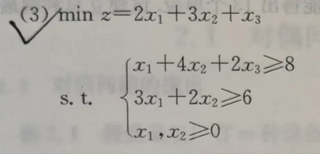

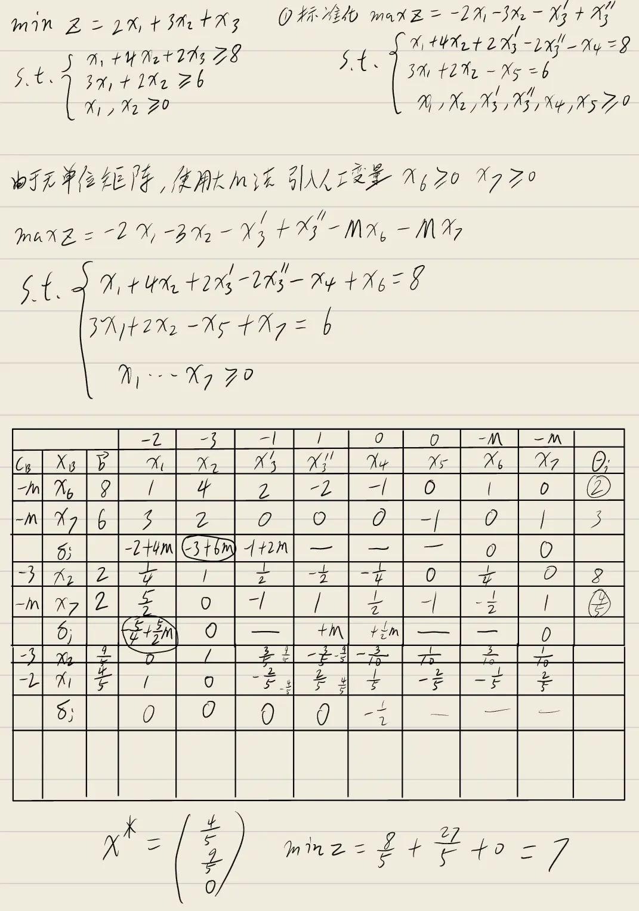



### 四、运输问题

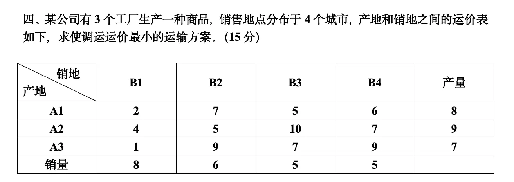

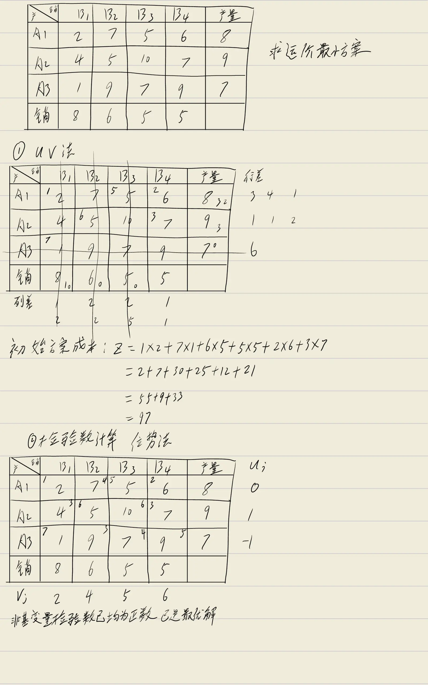

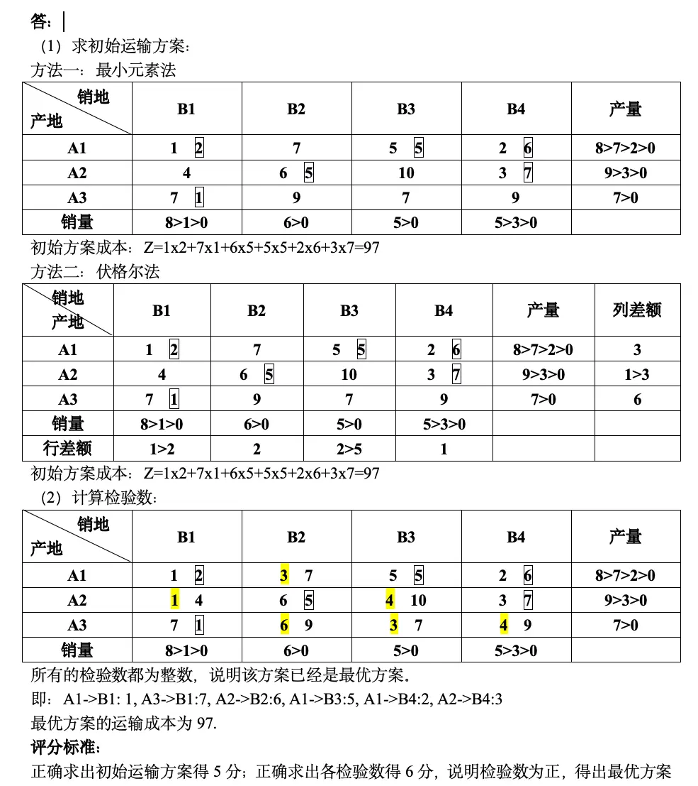

**题目：** 某公司有 $3$ 个工厂生产一种商品，销售地点分布于 $4$ 个城市，产地和销地之间的运价表如下，求使调运运价最小的运输方案。（$15$ 分）

**（1）建立运输模型**

设 $x_{ij}$ 表示从产地 $A_i$ 运往销地 $B_j$ 的运量（$i = 1,2,3$；$j = 1,2,3,4$），则运输问题的线性规划模型为：

$$
\begin{aligned}
\min \quad & Z = \sum_{i=1}^{3} \sum_{j=1}^{4} c_{ij} x_{ij} = 2x_{11} + 7x_{12} + 5x_{13} + 6x_{14} + 4x_{21} + 5x_{22} + 10x_{23} + 7x_{24} + x_{31} + 9x_{32} + 7x_{33} + 9x_{34} \\
\text{s.t.} \quad & \begin{cases}
x_{11} + x_{12} + x_{13} + x_{14} = 8 \\
x_{21} + x_{22} + x_{23} + x_{24} = 9 \\
x_{31} + x_{32} + x_{33} + x_{34} = 7 \\
x_{11} + x_{21} + x_{31} = 8 \\
x_{12} + x_{22} + x_{32} = 6 \\
x_{13} + x_{23} + x_{33} = 5 \\
x_{14} + x_{24} + x_{34} = 5 \\
x_{ij} \geq 0 \quad (i = 1,2,3;\; j = 1,2,3,4)
\end{cases}
\end{aligned}
$$

其中总产量 $8 + 9 + 7 = 24$，总销量 $8 + 6 + 5 + 5 = 24$，产销平衡。

**（2）求初始运输方案**

**方法一：最小元素法**

每次在未划去的运价表中选取运价最小的格子优先分配，直至所有产销均满足。

<table style="border-collapse: collapse; margin: 10px auto; text-align: center; font-size: 0.95em;">
  <thead>
    <tr>
      <th style="border: 1px solid #555; padding: 6px;">产地\销地</th>
      <th style="border: 1px solid #555; padding: 6px;">$B_1$</th>
      <th style="border: 1px solid #555; padding: 6px;">$B_2$</th>
      <th style="border: 1px solid #555; padding: 6px;">$B_3$</th>
      <th style="border: 1px solid #555; padding: 6px;">$B_4$</th>
      <th style="border: 1px solid #555; padding: 6px;">产量</th>
    </tr>
  </thead>
  <tbody>
    <tr>
      <td style="border: 1px solid #555; padding: 6px;">$A_1$</td>
      <td class="transport-cell">$1$$2$</td>
      <td class="transport-cell">$7$</td>
      <td class="transport-cell">$5$$5$</td>
      <td class="transport-cell">$2$$6$</td>
      <td style="border: 1px solid #555; padding: 6px;">$8$</td>
    </tr>
    <tr>
      <td style="border: 1px solid #555; padding: 6px;">$A_2$</td>
      <td class="transport-cell">$4$</td>
      <td class="transport-cell">$6$$5$</td>
      <td class="transport-cell">$10$</td>
      <td class="transport-cell">$3$$7$</td>
      <td style="border: 1px solid #555; padding: 6px;">$9$</td>
    </tr>
    <tr>
      <td style="border: 1px solid #555; padding: 6px;">$A_3$</td>
      <td class="transport-cell" style="background: #e67e22;">$7$$1$</td>
      <td class="transport-cell">$9$</td>
      <td class="transport-cell">$7$</td>
      <td class="transport-cell">$9$</td>
      <td style="border: 1px solid #555; padding: 6px;">$7$</td>
    </tr>
    <tr>
      <td style="border: 1px solid #555; padding: 6px;">销量</td>
      <td style="border: 1px solid #555; padding: 6px;">$8$</td>
      <td style="border: 1px solid #555; padding: 6px;">$6$</td>
      <td style="border: 1px solid #555; padding: 6px;">$5$</td>
      <td style="border: 1px solid #555; padding: 6px;">$5$</td>
      <td style="border: 1px solid #555; padding: 6px;">$24$</td>
    </tr>
  </tbody>
</table>

上表即为最小元素法得到的初始调运方案（高亮格 $c_{31} = 1$ 为首次分配的最小运价）。分配过程如下：

1. 最小运价 $c_{31} = 1$（$A_3 \to B_1$），分配 $\min(7, 8) = 7$，$A_3$ 产量耗尽，$B_1$ 剩余销量 $1$；
2. 剩余最小 $c_{11} = 2$（$A_1 \to B_1$），分配 $\min(8, 1) = 1$，$B_1$ 销量满足，$A_1$ 剩余产量 $7$；
3. 剩余最小 $c_{13} = 5$（$A_1 \to B_3$），分配 $\min(7, 5) = 5$，$B_3$ 销量满足，$A_1$ 剩余产量 $2$；
4. 剩余最小 $c_{14} = 6$（$A_1 \to B_4$），分配 $\min(2, 5) = 2$，$A_1$ 产量耗尽，$B_4$ 剩余销量 $3$；
5. 剩余最小 $c_{24} = 7$（$A_2 \to B_4$），分配 $\min(9, 3) = 3$，$B_4$ 销量满足，$A_2$ 剩余产量 $6$；
6. 最后 $c_{22} = 5$（$A_2 \to B_2$），分配 $\min(6, 6) = 6$，产销全部满足。

初始方案成本：

$$
Z = 1 \times 2 + 5 \times 5 + 2 \times 6 + 6 \times 5 + 3 \times 7 + 7 \times 1 = 2 + 25 + 12 + 30 + 21 + 7 = 97
$$

**方法二：伏格尔法**

伏格尔法通过计算各行、各列的"差额"（次小运价与最小运价之差），优先在差额最大的行或列中选取最小运价进行分配。下表给出了伏格尔法迭代过程中的差额变化与最终方案（右上角橙色数字为调运量，高亮为每次选中的最小运价格）：

<table style="border-collapse: collapse; margin: 10px auto; text-align: center; font-size: 0.95em;">
  <thead>
    <tr>
      <th style="border: 1px solid #555; padding: 6px;">产地\销地</th>
      <th style="border: 1px solid #555; padding: 6px;">$B_1$</th>
      <th style="border: 1px solid #555; padding: 6px;">$B_2$</th>
      <th style="border: 1px solid #555; padding: 6px;">$B_3$</th>
      <th style="border: 1px solid #555; padding: 6px;">$B_4$</th>
      <th style="border: 1px solid #555; padding: 6px;">产量</th>
      <th style="border: 1px solid #555; padding: 6px;">行差额</th>
    </tr>
  </thead>
  <tbody>
    <tr>
      <td style="border: 1px solid #555; padding: 6px;">$A_1$</td>
      <td class="transport-cell">$1$$2$</td>
      <td class="transport-cell">$7$</td>
      <td class="transport-cell">$5$$5$</td>
      <td class="transport-cell">$2$$6$</td>
      <td style="border: 1px solid #555; padding: 6px;">$8$</td>
      <td style="border: 1px solid #555; padding: 6px;">$3 \to 1$</td>
    </tr>
    <tr>
      <td style="border: 1px solid #555; padding: 6px;">$A_2$</td>
      <td class="transport-cell">$4$</td>
      <td class="transport-cell">$6$$5$</td>
      <td class="transport-cell">$10$</td>
      <td class="transport-cell">$3$$7$</td>
      <td style="border: 1px solid #555; padding: 6px;">$9$</td>
      <td style="border: 1px solid #555; padding: 6px;">$1 \to 3$</td>
    </tr>
    <tr>
      <td style="border: 1px solid #555; padding: 6px;">$A_3$</td>
      <td class="transport-cell" style="background: #e67e22;">$7$$1$</td>
      <td class="transport-cell">$9$</td>
      <td class="transport-cell">$7$</td>
      <td class="transport-cell">$9$</td>
      <td style="border: 1px solid #555; padding: 6px;">$7$</td>
      <td style="border: 1px solid #555; padding: 6px;">$6$</td>
    </tr>
    <tr>
      <td style="border: 1px solid #555; padding: 6px;">销量</td>
      <td style="border: 1px solid #555; padding: 6px;">$8$</td>
      <td style="border: 1px solid #555; padding: 6px;">$6$</td>
      <td style="border: 1px solid #555; padding: 6px;">$5$</td>
      <td style="border: 1px solid #555; padding: 6px;">$5$</td>
      <td style="border: 1px solid #555; padding: 6px;"></td>
      <td style="border: 1px solid #555; padding: 6px;"></td>
    </tr>
    <tr>
      <td style="border: 1px solid #555; padding: 6px;">列差额</td>
      <td style="border: 1px solid #555; padding: 6px;">$1 \to 2$</td>
      <td style="border: 1px solid #555; padding: 6px;">$2$</td>
      <td style="border: 1px solid #555; padding: 6px;">$2 \to 5$</td>
      <td style="border: 1px solid #555; padding: 6px;">$1$</td>
      <td style="border: 1px solid #555; padding: 6px;"></td>
      <td style="border: 1px solid #555; padding: 6px;"></td>
    </tr>
  </tbody>
</table>

> 差额演变说明：第一次行差额为 $(3, 1, 6)$，列差额为 $(1, 2, 2, 1)$，最大差额 $6$ 对应 $A_3$ 行，选最小运价 $c_{31} = 1$ 分配 $7$；随后重新计算差额，依次完成全部分配。本题中最小元素法与伏格尔法恰好得到完全相同的初始方案（成本同样为 $Z = 97$）。

**（3）检验数计算——位势法**

对最小元素法得到的初始方案，用位势法计算各非基变量的检验数。设基变量满足 $c_{ij} = u_i + v_j$，令 $u_1 = 0$，依次求解：

- 由 $c_{11} = 2$：$u_1 + v_1 = 0 + v_1 = 2 \;\Rightarrow\; v_1 = 2$
- 由 $c_{13} = 5$：$u_1 + v_3 = 0 + v_3 = 5 \;\Rightarrow\; v_3 = 5$
- 由 $c_{14} = 6$：$u_1 + v_4 = 0 + v_4 = 6 \;\Rightarrow\; v_4 = 6$
- 由 $c_{31} = 1$：$u_3 + v_1 = u_3 + 2 = 1 \;\Rightarrow\; u_3 = -1$
- 由 $c_{24} = 7$：$u_2 + v_4 = u_2 + 6 = 7 \;\Rightarrow\; u_2 = 1$
- 由 $c_{22} = 5$：$u_2 + v_2 = 1 + v_2 = 5 \;\Rightarrow\; v_2 = 4$

得位势：$u = (0, 1, -1)$，$v = (2, 4, 5, 6)$。

非基变量检验数 $\sigma_{ij} = c_{ij} - (u_i + v_j)$ 计算如下：

<table style="border-collapse: collapse; margin: 10px auto; text-align: center; font-size: 0.95em;">
  <thead>
    <tr>
      <th style="border: 1px solid #555; padding: 6px;">产地\销地</th>
      <th style="border: 1px solid #555; padding: 6px;">$B_1$ $(v_1=2)$</th>
      <th style="border: 1px solid #555; padding: 6px;">$B_2$ $(v_2=4)$</th>
      <th style="border: 1px solid #555; padding: 6px;">$B_3$ $(v_3=5)$</th>
      <th style="border: 1px solid #555; padding: 6px;">$B_4$ $(v_4=6)$</th>
      <th style="border: 1px solid #555; padding: 6px;">产量</th>
      <th style="border: 1px solid #555; padding: 6px;">$u_i$</th>
    </tr>
  </thead>
  <tbody>
    <tr>
      <td style="border: 1px solid #555; padding: 6px;">$A_1$</td>
      <td class="transport-cell">$1$$2$</td>
      <td class="transport-cell">$3$$7$</td>
      <td class="transport-cell">$5$$5$</td>
      <td class="transport-cell">$2$$6$</td>
      <td style="border: 1px solid #555; padding: 6px;">$8$</td>
      <td style="border: 1px solid #555; padding: 6px;">$0$</td>
    </tr>
    <tr>
      <td style="border: 1px solid #555; padding: 6px;">$A_2$</td>
      <td class="transport-cell">$1$$4$</td>
      <td class="transport-cell">$6$$5$</td>
      <td class="transport-cell">$4$$10$</td>
      <td class="transport-cell">$3$$7$</td>
      <td style="border: 1px solid #555; padding: 6px;">$9$</td>
      <td style="border: 1px solid #555; padding: 6px;">$1$</td>
    </tr>
    <tr>
      <td style="border: 1px solid #555; padding: 6px;">$A_3$</td>
      <td class="transport-cell">$7$$1$</td>
      <td class="transport-cell">$6$$9$</td>
      <td class="transport-cell">$3$$7$</td>
      <td class="transport-cell">$4$$9$</td>
      <td style="border: 1px solid #555; padding: 6px;">$7$</td>
      <td style="border: 1px solid #555; padding: 6px;">$-1$</td>
    </tr>
    <tr>
      <td style="border: 1px solid #555; padding: 6px;">销量</td>
      <td style="border: 1px solid #555; padding: 6px;">$8$</td>
      <td style="border: 1px solid #555; padding: 6px;">$6$</td>
      <td style="border: 1px solid #555; padding: 6px;">$5$</td>
      <td style="border: 1px solid #555; padding: 6px;">$5$</td>
      <td style="border: 1px solid #555; padding: 6px;"></td>
      <td style="border: 1px solid #555; padding: 6px;"></td>
    </tr>
    <tr>
      <td style="border: 1px solid #555; padding: 6px;">$v_j$</td>
      <td style="border: 1px solid #555; padding: 6px;">$2$</td>
      <td style="border: 1px solid #555; padding: 6px;">$4$</td>
      <td style="border: 1px solid #555; padding: 6px;">$5$</td>
      <td style="border: 1px solid #555; padding: 6px;">$6$</td>
      <td style="border: 1px solid #555; padding: 6px;"></td>
      <td style="border: 1px solid #555; padding: 6px;"></td>
    </tr>
  </tbody>
</table>

> 表格说明：右上角橙色数字为基变量的调运量；左上角橙色底白字数字为非基变量的检验数 $\sigma_{ij}$。

各检验数具体计算：

$$
\begin{aligned}
\sigma_{12} &= c_{12} - (u_1 + v_2) = 7 - (0 + 4) = 3 \\
\sigma_{21} &= c_{21} - (u_2 + v_1) = 4 - (1 + 2) = 1 \\
\sigma_{23} &= c_{23} - (u_2 + v_3) = 10 - (1 + 5) = 4 \\
\sigma_{32} &= c_{32} - (u_3 + v_2) = 9 - (-1 + 4) = 6 \\
\sigma_{33} &= c_{33} - (u_3 + v_3) = 7 - (-1 + 5) = 3 \\
\sigma_{34} &= c_{34} - (u_3 + v_4) = 9 - (-1 + 6) = 4
\end{aligned}
$$

所有非基变量检验数均满足 $\sigma_{ij} > 0$，故该初始方案已是最优方案，无需进行闭回路调整。

**最优调运方案与最小运价**

最优运输方案为：

$$
\begin{cases}
x_{11}^* = 1, \; x_{13}^* = 5, \; x_{14}^* = 2 \\
x_{22}^* = 6, \; x_{24}^* = 3 \\
x_{31}^* = 7
\end{cases}
$$

其余 $x_{ij}^* = 0$。即：$A_1$ 向 $B_1$ 运送 $1$、向 $B_3$ 运送 $5$、向 $B_4$ 运送 $2$；$A_2$ 向 $B_2$ 运送 $6$、向 $B_4$ 运送 $3$；$A_3$ 向 $B_1$ 运送 $7$。

最小总运价：

$$
Z^* = 1 \times 2 + 5 \times 5 + 2 \times 6 + 6 \times 5 + 3 \times 7 + 7 \times 1 = 97
$$

**评分标准：**
- 正确求出初始运输方案得 $5$ 分；
- 正确求出各检验数得 $6$ 分；
- 说明检验数为正、得出最优方案得 $4$ 分。

---

由于这道题涵盖面有点小并没有包含闭回路的调整过程，所以这里再补充一道作业题来进行相关讲解。

#### 运输问题作业题补充

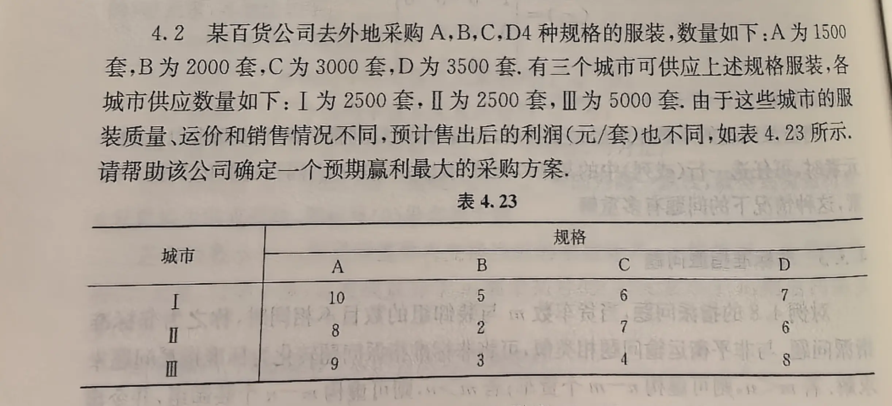

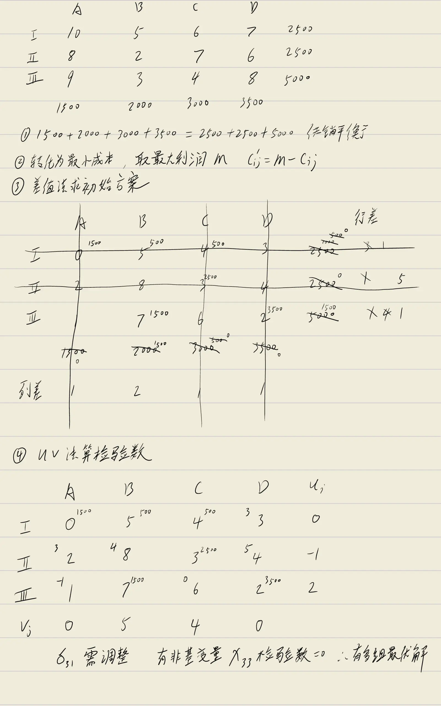

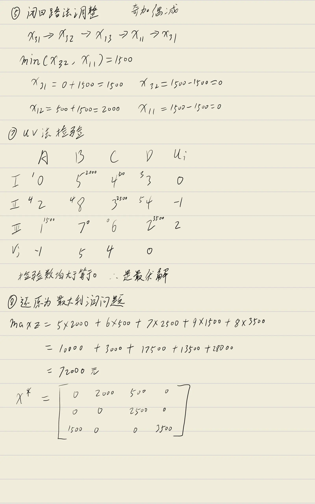

**题目：** 某百货公司去外地采购 $A,B,C,D$ 四种规格的服装，数量如下：$A$ 为 $1500$ 套，$B$ 为 $2000$ 套，$C$ 为 $3000$ 套，$D$ 为 $3500$ 套。有三个城市可供应上述规格服装，各城市供应数量如下：$\text{I}$ 为 $2500$ 套，$\text{II}$ 为 $2500$ 套，$\text{III}$ 为 $5000$ 套。由于这些城市的服装质量、运价和销售情况不同，预计售出后的利润（元/套）如表所示。请帮助该公司确定一个预期赢利最大的采购方案。

**利润表**（单位：元/套）：

<table style="border-collapse: collapse; margin: 10px auto; text-align: center; font-size: 0.95em;">
  <thead>
    <tr>
      <th style="border: 1px solid #555; padding: 6px;">城市\规格</th>
      <th style="border: 1px solid #555; padding: 6px;">$A$</th>
      <th style="border: 1px solid #555; padding: 6px;">$B$</th>
      <th style="border: 1px solid #555; padding: 6px;">$C$</th>
      <th style="border: 1px solid #555; padding: 6px;">$D$</th>
      <th style="border: 1px solid #555; padding: 6px;">供应量</th>
    </tr>
  </thead>
  <tbody>
    <tr>
      <td style="border: 1px solid #555; padding: 6px;">$\text{I}$</td>
      <td style="border: 1px solid #555; padding: 6px;">$10$</td>
      <td style="border: 1px solid #555; padding: 6px;">$5$</td>
      <td style="border: 1px solid #555; padding: 6px;">$6$</td>
      <td style="border: 1px solid #555; padding: 6px;">$7$</td>
      <td style="border: 1px solid #555; padding: 6px;">$2500$</td>
    </tr>
    <tr>
      <td style="border: 1px solid #555; padding: 6px;">$\text{II}$</td>
      <td style="border: 1px solid #555; padding: 6px;">$8$</td>
      <td style="border: 1px solid #555; padding: 6px;">$2$</td>
      <td style="border: 1px solid #555; padding: 6px;">$7$</td>
      <td style="border: 1px solid #555; padding: 6px;">$6$</td>
      <td style="border: 1px solid #555; padding: 6px;">$2500$</td>
    </tr>
    <tr>
      <td style="border: 1px solid #555; padding: 6px;">$\text{III}$</td>
      <td style="border: 1px solid #555; padding: 6px;">$9$</td>
      <td style="border: 1px solid #555; padding: 6px;">$3$</td>
      <td style="border: 1px solid #555; padding: 6px;">$4$</td>
      <td style="border: 1px solid #555; padding: 6px;">$8$</td>
      <td style="border: 1px solid #555; padding: 6px;">$5000$</td>
    </tr>
    <tr>
      <td style="border: 1px solid #555; padding: 6px;">需求量</td>
      <td style="border: 1px solid #555; padding: 6px;">$1500$</td>
      <td style="border: 1px solid #555; padding: 6px;">$2000$</td>
      <td style="border: 1px solid #555; padding: 6px;">$3000$</td>
      <td style="border: 1px solid #555; padding: 6px;">$3500$</td>
      <td style="border: 1px solid #555; padding: 6px;">$10000$</td>
    </tr>
  </tbody>
</table>

**（1）问题分析与模型转化**

总需求量 $1500 + 2000 + 3000 + 3500 = 10000$，总供应量 $2500 + 2500 + 5000 = 10000$，产销平衡。

本题目标是**最大化利润**，需先转化为**最小成本问题**。取最大利润 $M = 10$，令转化后的成本 $c'_{ij} = M - c_{ij} = 10 - c_{ij}$，则：

$$
\max Z = \sum c_{ij} x_{ij} \quad \Longleftrightarrow \quad \min Z' = \sum c'_{ij} x_{ij}
$$

且 $\max Z = 10 \times 10000 - \min Z' = 100000 - \min Z'$。

**转化后的成本表** $c'_{ij}$：

<table style="border-collapse: collapse; margin: 10px auto; text-align: center; font-size: 0.95em;">
  <thead>
    <tr>
      <th style="border: 1px solid #555; padding: 6px;">城市\规格</th>
      <th style="border: 1px solid #555; padding: 6px;">$A$</th>
      <th style="border: 1px solid #555; padding: 6px;">$B$</th>
      <th style="border: 1px solid #555; padding: 6px;">$C$</th>
      <th style="border: 1px solid #555; padding: 6px;">$D$</th>
      <th style="border: 1px solid #555; padding: 6px;">供应量</th>
    </tr>
  </thead>
  <tbody>
    <tr>
      <td style="border: 1px solid #555; padding: 6px;">$\text{I}$</td>
      <td style="border: 1px solid #555; padding: 6px; background: #e67e22; color: #fff; font-weight: bold;">$0$</td>
      <td style="border: 1px solid #555; padding: 6px;">$5$</td>
      <td style="border: 1px solid #555; padding: 6px;">$4$</td>
      <td style="border: 1px solid #555; padding: 6px;">$3$</td>
      <td style="border: 1px solid #555; padding: 6px;">$2500$</td>
    </tr>
    <tr>
      <td style="border: 1px solid #555; padding: 6px;">$\text{II}$</td>
      <td style="border: 1px solid #555; padding: 6px;">$2$</td>
      <td style="border: 1px solid #555; padding: 6px;">$8$</td>
      <td style="border: 1px solid #555; padding: 6px;">$3$</td>
      <td style="border: 1px solid #555; padding: 6px;">$4$</td>
      <td style="border: 1px solid #555; padding: 6px;">$2500$</td>
    </tr>
    <tr>
      <td style="border: 1px solid #555; padding: 6px;">$\text{III}$</td>
      <td style="border: 1px solid #555; padding: 6px;">$1$</td>
      <td style="border: 1px solid #555; padding: 6px;">$7$</td>
      <td style="border: 1px solid #555; padding: 6px;">$6$</td>
      <td style="border: 1px solid #555; padding: 6px;">$2$</td>
      <td style="border: 1px solid #555; padding: 6px;">$5000$</td>
    </tr>
    <tr>
      <td style="border: 1px solid #555; padding: 6px;">需求量</td>
      <td style="border: 1px solid #555; padding: 6px;">$1500$</td>
      <td style="border: 1px solid #555; padding: 6px;">$2000$</td>
      <td style="border: 1px solid #555; padding: 6px;">$3000$</td>
      <td style="border: 1px solid #555; padding: 6px;">$3500$</td>
      <td style="border: 1px solid #555; padding: 6px;">$10000$</td>
    </tr>
  </tbody>
</table>

> 高亮格 $c'_{11} = 0$ 为全表最小运价。

**（2）最小元素法求初始方案**

每次在剩余表格中选取 $c'_{ij}$ 最小的格子优先分配：

1. 最小 $c'_{11} = 0$（$\text{I} \to A$），分配 $\min(2500, 1500) = 1500$，$A$ 满足，$\text{I}$ 剩余 $1000$；
2. 剩余最小 $c'_{34} = 2$（$\text{III} \to D$），分配 $\min(5000, 3500) = 3500$，$D$ 满足，$\text{III}$ 剩余 $1500$；
3. 剩余最小 $c'_{23} = 3$（$\text{II} \to C$），分配 $\min(2500, 3000) = 2500$，$\text{II}$ 耗尽，$C$ 剩余 $500$；
4. 剩余最小 $c'_{13} = 4$（$\text{I} \to C$），分配 $\min(1000, 500) = 500$，$C$ 满足，$\text{I}$ 剩余 $500$；
5. 剩余最小 $c'_{12} = 5$（$\text{I} \to B$），分配 $\min(500, 2000) = 500$，$\text{I}$ 耗尽，$B$ 剩余 $1500$；
6. 最后 $c'_{32} = 7$（$\text{III} \to B$），分配 $\min(1500, 1500) = 1500$，产销全部满足。

**初始调运方案**（右上角橙色数字为调运量，主体为转化成本 $c'_{ij}$）：

<table style="border-collapse: collapse; margin: 10px auto; text-align: center; font-size: 0.95em;">
  <thead>
    <tr>
      <th style="border: 1px solid #555; padding: 6px;">城市\规格</th>
      <th style="border: 1px solid #555; padding: 6px;">$A$</th>
      <th style="border: 1px solid #555; padding: 6px;">$B$</th>
      <th style="border: 1px solid #555; padding: 6px;">$C$</th>
      <th style="border: 1px solid #555; padding: 6px;">$D$</th>
      <th style="border: 1px solid #555; padding: 6px;">供应量</th>
    </tr>
  </thead>
  <tbody>
    <tr>
      <td style="border: 1px solid #555; padding: 6px;">$\text{I}$</td>
      <td class="transport-cell">$1500$$0$</td>
      <td class="transport-cell">$500$$5$</td>
      <td class="transport-cell">$500$$4$</td>
      <td class="transport-cell">$3$</td>
      <td style="border: 1px solid #555; padding: 6px;">$2500$</td>
    </tr>
    <tr>
      <td style="border: 1px solid #555; padding: 6px;">$\text{II}$</td>
      <td class="transport-cell">$2$</td>
      <td class="transport-cell">$8$</td>
      <td class="transport-cell">$2500$$3$</td>
      <td class="transport-cell">$4$</td>
      <td style="border: 1px solid #555; padding: 6px;">$2500$</td>
    </tr>
    <tr>
      <td style="border: 1px solid #555; padding: 6px;">$\text{III}$</td>
      <td class="transport-cell">$1$</td>
      <td class="transport-cell">$1500$$7$</td>
      <td class="transport-cell">$6$</td>
      <td class="transport-cell">$3500$$2$</td>
      <td style="border: 1px solid #555; padding: 6px;">$5000$</td>
    </tr>
    <tr>
      <td style="border: 1px solid #555; padding: 6px;">需求量</td>
      <td style="border: 1px solid #555; padding: 6px;">$1500$</td>
      <td style="border: 1px solid #555; padding: 6px;">$2000$</td>
      <td style="border: 1px solid #555; padding: 6px;">$3000$</td>
      <td style="border: 1px solid #555; padding: 6px;">$3500$</td>
      <td style="border: 1px solid #555; padding: 6px;"></td>
    </tr>
  </tbody>
</table>

初始方案对应的预期利润：

$$
Z = 1500 \times 10 + 500 \times 5 + 500 \times 6 + 2500 \times 7 + 1500 \times 3 + 3500 \times 8 = 70500 \text{（元）}
$$

**（3）位势法检验**

对基变量令 $c'_{ij} = u_i + v_j$，设 $u_1 = 0$，依次求解：

- 由 $c'_{11} = 0$：$v_1 = 0$
- 由 $c'_{12} = 5$：$v_2 = 5$
- 由 $c'_{13} = 4$：$v_3 = 4$
- 由 $c'_{23} = 3$：$u_2 + 4 = 3 \;\Rightarrow\; u_2 = -1$
- 由 $c'_{32} = 7$：$u_3 + 5 = 7 \;\Rightarrow\; u_3 = 2$
- 由 $c'_{34} = 2$：$2 + v_4 = 2 \;\Rightarrow\; v_4 = 0$

得位势：$u = (0, -1, 2)$，$v = (0, 5, 4, 0)$。

非基变量检验数 $\sigma'_{ij} = c'_{ij} - (u_i + v_j)$ 如下表（左上角橙色底白字为检验数，右上角橙色调运量为基变量）：

<table style="border-collapse: collapse; margin: 10px auto; text-align: center; font-size: 0.95em;">
  <thead>
    <tr>
      <th style="border: 1px solid #555; padding: 6px;">城市\规格</th>
      <th style="border: 1px solid #555; padding: 6px;">$A$ $(v_1=0)$</th>
      <th style="border: 1px solid #555; padding: 6px;">$B$ $(v_2=5)$</th>
      <th style="border: 1px solid #555; padding: 6px;">$C$ $(v_3=4)$</th>
      <th style="border: 1px solid #555; padding: 6px;">$D$ $(v_4=0)$</th>
      <th style="border: 1px solid #555; padding: 6px;">$u_i$</th>
    </tr>
  </thead>
  <tbody>
    <tr>
      <td style="border: 1px solid #555; padding: 6px;">$\text{I}$</td>
      <td class="transport-cell">$1500$$0$</td>
      <td class="transport-cell">$500$$5$</td>
      <td class="transport-cell">$500$$4$</td>
      <td class="transport-cell">$3$$3$</td>
      <td style="border: 1px solid #555; padding: 6px;">$0$</td>
    </tr>
    <tr>
      <td style="border: 1px solid #555; padding: 6px;">$\text{II}$</td>
      <td class="transport-cell">$3$$2$</td>
      <td class="transport-cell">$4$$8$</td>
      <td class="transport-cell">$2500$$3$</td>
      <td class="transport-cell">$5$$4$</td>
      <td style="border: 1px solid #555; padding: 6px;">$-1$</td>
    </tr>
    <tr>
      <td style="border: 1px solid #555; padding: 6px;">$\text{III}$</td>
      <td class="transport-cell">$-1$$1$</td>
      <td class="transport-cell">$1500$$7$</td>
      <td class="transport-cell">$0$$6$</td>
      <td class="transport-cell">$3500$$2$</td>
      <td style="border: 1px solid #555; padding: 6px;">$2$</td>
    </tr>
    <tr>
      <td style="border: 1px solid #555; padding: 6px;">$v_j$</td>
      <td style="border: 1px solid #555; padding: 6px;">$0$</td>
      <td style="border: 1px solid #555; padding: 6px;">$5$</td>
      <td style="border: 1px solid #555; padding: 6px;">$4$</td>
      <td style="border: 1px solid #555; padding: 6px;">$0$</td>
      <td style="border: 1px solid #555; padding: 6px;"></td>
    </tr>
  </tbody>
</table>

> 表格说明：红色底白字 $\sigma'_{31} = -1 < 0$ 为负检验数，需调整；橙色底白字为其余非基变量检验数。

由于存在负检验数 $\sigma'_{31} = -1$，当前方案**不是最优**，需要进行闭回路调整。

**（4）闭回路法调整**

以 $x_{31}$（$\text{III} \to A$）为进基变量，构造闭回路：

$$
x_{31} \to x_{32} \to x_{12} \to x_{11} \to x_{31}
$$

对应格子为 $(\text{III},A) \to (\text{III},B) \to (\text{I},B) \to (\text{I},A) \to (\text{III},A)$。

调整量 $\theta = \min(x_{32}, x_{11}) = \min(1500, 1500) = 1500$。

奇数格加 $\theta$，偶数格减 $\theta$：

- $x_{31} = 0 + 1500 = 1500$（进基）
- $x_{32} = 1500 - 1500 = 0$（出基）
- $x_{12} = 500 + 1500 = 2000$
- $x_{11} = 1500 - 1500 = 0$

**调整后方案：**

<table style="border-collapse: collapse; margin: 10px auto; text-align: center; font-size: 0.95em;">
  <thead>
    <tr>
      <th style="border: 1px solid #555; padding: 6px;">城市\规格</th>
      <th style="border: 1px solid #555; padding: 6px;">$A$</th>
      <th style="border: 1px solid #555; padding: 6px;">$B$</th>
      <th style="border: 1px solid #555; padding: 6px;">$C$</th>
      <th style="border: 1px solid #555; padding: 6px;">$D$</th>
      <th style="border: 1px solid #555; padding: 6px;">供应量</th>
    </tr>
  </thead>
  <tbody>
    <tr>
      <td style="border: 1px solid #555; padding: 6px;">$\text{I}$</td>
      <td class="transport-cell">$0$</td>
      <td class="transport-cell">$2000$$5$</td>
      <td class="transport-cell">$500$$4$</td>
      <td class="transport-cell">$3$</td>
      <td style="border: 1px solid #555; padding: 6px;">$2500$</td>
    </tr>
    <tr>
      <td style="border: 1px solid #555; padding: 6px;">$\text{II}$</td>
      <td class="transport-cell">$2$</td>
      <td class="transport-cell">$8$</td>
      <td class="transport-cell">$2500$$3$</td>
      <td class="transport-cell">$4$</td>
      <td style="border: 1px solid #555; padding: 6px;">$2500$</td>
    </tr>
    <tr>
      <td style="border: 1px solid #555; padding: 6px;">$\text{III}$</td>
      <td class="transport-cell" style="background: #e67e22;">$1500$$1$</td>
      <td class="transport-cell">$7$</td>
      <td class="transport-cell">$6$</td>
      <td class="transport-cell">$3500$$2$</td>
      <td style="border: 1px solid #555; padding: 6px;">$5000$</td>
    </tr>
    <tr>
      <td style="border: 1px solid #555; padding: 6px;">需求量</td>
      <td style="border: 1px solid #555; padding: 6px;">$1500$</td>
      <td style="border: 1px solid #555; padding: 6px;">$2000$</td>
      <td style="border: 1px solid #555; padding: 6px;">$3000$</td>
      <td style="border: 1px solid #555; padding: 6px;">$3500$</td>
      <td style="border: 1px solid #555; padding: 6px;"></td>
    </tr>
  </tbody>
</table>

> 高亮格 $x_{31} = 1500$ 为新进基变量。

**（5）再次位势法检验**

对调整后方案的基变量重新计算位势，设 $u_1 = 0$：

- 由 $c'_{12} = 5$：$v_2 = 5$
- 由 $c'_{13} = 4$：$v_3 = 4$
- 由 $c'_{23} = 3$：$u_2 = -1$
- 由 $c'_{31} = 1$：$u_3 + v_1 = 1$
- 由 $c'_{34} = 2$：$u_3 + v_4 = 2$

令 $v_1 = 0$，则 $u_3 = 1$，$v_4 = 1$。得 $u = (0, -1, 1)$，$v = (0, 5, 4, 1)$。

<table style="border-collapse: collapse; margin: 10px auto; text-align: center; font-size: 0.95em;">
  <thead>
    <tr>
      <th style="border: 1px solid #555; padding: 6px;">城市\规格</th>
      <th style="border: 1px solid #555; padding: 6px;">$A$ $(v_1=0)$</th>
      <th style="border: 1px solid #555; padding: 6px;">$B$ $(v_2=5)$</th>
      <th style="border: 1px solid #555; padding: 6px;">$C$ $(v_3=4)$</th>
      <th style="border: 1px solid #555; padding: 6px;">$D$ $(v_4=1)$</th>
      <th style="border: 1px solid #555; padding: 6px;">$u_i$</th>
    </tr>
  </thead>
  <tbody>
    <tr>
      <td style="border: 1px solid #555; padding: 6px;">$\text{I}$</td>
      <td class="transport-cell">$0$$0$</td>
      <td class="transport-cell">$2000$$5$</td>
      <td class="transport-cell">$500$$4$</td>
      <td class="transport-cell">$2$$3$</td>
      <td style="border: 1px solid #555; padding: 6px;">$0$</td>
    </tr>
    <tr>
      <td style="border: 1px solid #555; padding: 6px;">$\text{II}$</td>
      <td class="transport-cell">$3$$2$</td>
      <td class="transport-cell">$4$$8$</td>
      <td class="transport-cell">$2500$$3$</td>
      <td class="transport-cell">$4$$4$</td>
      <td style="border: 1px solid #555; padding: 6px;">$-1$</td>
    </tr>
    <tr>
      <td style="border: 1px solid #555; padding: 6px;">$\text{III}$</td>
      <td class="transport-cell">$1500$$1$</td>
      <td class="transport-cell">$1$$7$</td>
      <td class="transport-cell">$1$$6$</td>
      <td class="transport-cell">$3500$$2$</td>
      <td style="border: 1px solid #555; padding: 6px;">$1$</td>
    </tr>
    <tr>
      <td style="border: 1px solid #555; padding: 6px;">$v_j$</td>
      <td style="border: 1px solid #555; padding: 6px;">$0$</td>
      <td style="border: 1px solid #555; padding: 6px;">$5$</td>
      <td style="border: 1px solid #555; padding: 6px;">$4$</td>
      <td style="border: 1px solid #555; padding: 6px;">$1$</td>
      <td style="border: 1px solid #555; padding: 6px;"></td>
    </tr>
  </tbody>
</table>

所有非基变量检验数均满足 $\sigma'_{ij} \geq 0$，且注意到 $\sigma'_{33} = 1 > 0$（在另一组位势设定下可为 $0$，说明存在**多组最优解**的可能），当前方案已是最优。

**（6）还原为最大利润问题**

最优采购方案（用原始利润计算）为：

$$
\begin{cases}
x_{12}^* = 2000 & (\text{I} \to B, \text{ 利润 } 5) \\
x_{13}^* = 500 & (\text{I} \to C, \text{ 利润 } 6) \\
x_{23}^* = 2500 & (\text{II} \to C, \text{ 利润 } 7) \\
x_{31}^* = 1500 & (\text{III} \to A, \text{ 利润 } 9) \\
x_{34}^* = 3500 & (\text{III} \to D, \text{ 利润 } 8)
\end{cases}
$$

其余 $x_{ij}^* = 0$。

最大预期赢利：

$$
\begin{aligned}
Z^* &= 2000 \times 5 + 500 \times 6 + 2500 \times 7 + 1500 \times 9 + 3500 \times 8 \\
    &= 10000 + 3000 + 17500 + 13500 + 28000 \\
    &= 72000 \text{（元）}
\end{aligned}
$$

用矩阵形式表示最优调运方案：

$$
X^* = \begin{bmatrix}
0 & 2000 & 500 & 0 \\
0 & 0 & 2500 & 0 \\
1500 & 0 & 0 & 3500
\end{bmatrix}
$$ 

### 五、指派问题

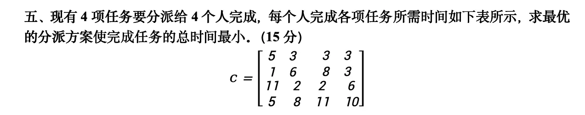

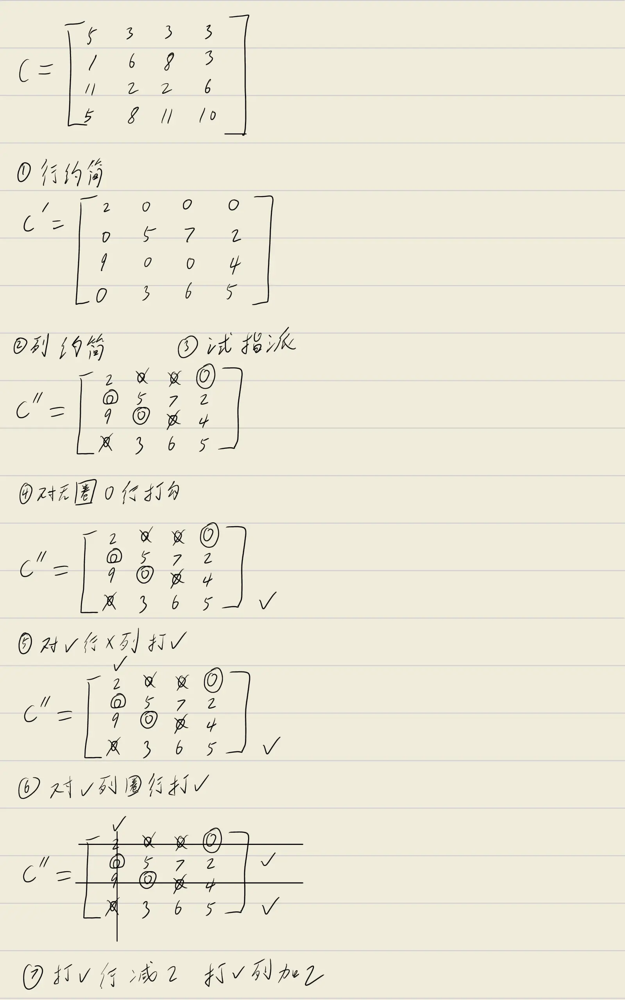

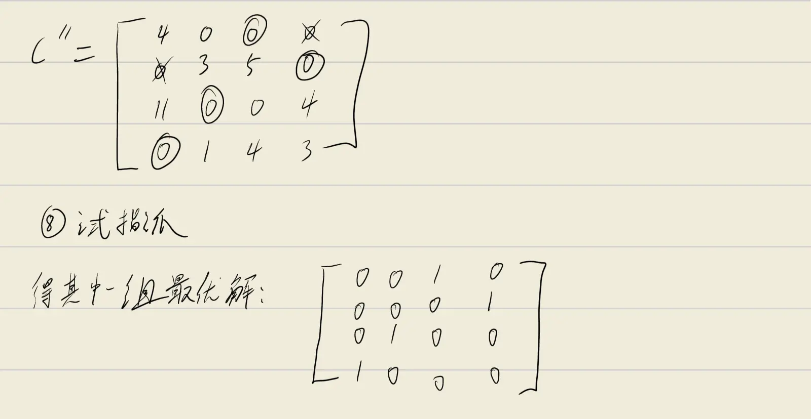

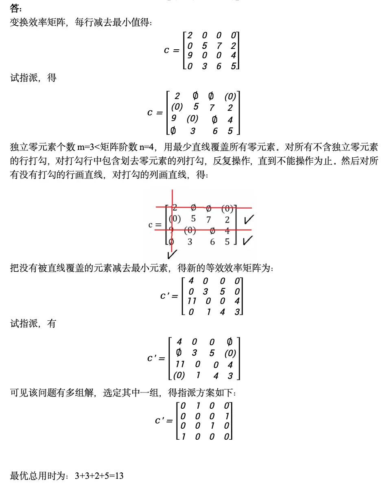

**题目：** 现有 $4$ 项任务要分派给 $4$ 个人完成，每个人完成各项任务所需时间如下表所示，求最优的分派方案使完成任务的总时间最小。（$15$ 分）

$$
C = \begin{bmatrix}
5 & 3 & 3 & 3 \\
1 & 6 & 8 & 3 \\
11 & 2 & 2 & 6 \\
5 & 8 & 11 & 10
\end{bmatrix}
$$

**解答（匈牙利算法）：**

**第一步：行约简**

每行减去该行的最小元素，使每行至少出现一个 $0$：

<table style="border-collapse: collapse; margin: 10px auto; text-align: center; font-size: 0.95em;">
  <thead>
    <tr>
      <th style="border: 1px solid #555; padding: 6px;"></th>
      <th style="border: 1px solid #555; padding: 6px;">$B_1$</th>
      <th style="border: 1px solid #555; padding: 6px;">$B_2$</th>
      <th style="border: 1px solid #555; padding: 6px;">$B_3$</th>
      <th style="border: 1px solid #555; padding: 6px;">$B_4$</th>
      <th style="border: 1px solid #555; padding: 6px;">行最小</th>
    </tr>
  </thead>
  <tbody>
    <tr>
      <td style="border: 1px solid #555; padding: 6px;">$A_1$</td>
      <td style="border: 1px solid #555; padding: 6px;">$5$</td>
      <td style="border: 1px solid #555; padding: 6px;">$3$</td>
      <td style="border: 1px solid #555; padding: 6px;">$3$</td>
      <td style="border: 1px solid #555; padding: 6px;">$3$</td>
      <td style="border: 1px solid #555; padding: 6px; background: #f0f0f0;">$3$</td>
    </tr>
    <tr>
      <td style="border: 1px solid #555; padding: 6px;">$A_2$</td>
      <td style="border: 1px solid #555; padding: 6px;">$1$</td>
      <td style="border: 1px solid #555; padding: 6px;">$6$</td>
      <td style="border: 1px solid #555; padding: 6px;">$8$</td>
      <td style="border: 1px solid #555; padding: 6px;">$3$</td>
      <td style="border: 1px solid #555; padding: 6px; background: #f0f0f0;">$1$</td>
    </tr>
    <tr>
      <td style="border: 1px solid #555; padding: 6px;">$A_3$</td>
      <td style="border: 1px solid #555; padding: 6px;">$11$</td>
      <td style="border: 1px solid #555; padding: 6px;">$2$</td>
      <td style="border: 1px solid #555; padding: 6px;">$2$</td>
      <td style="border: 1px solid #555; padding: 6px;">$6$</td>
      <td style="border: 1px solid #555; padding: 6px; background: #f0f0f0;">$2$</td>
    </tr>
    <tr>
      <td style="border: 1px solid #555; padding: 6px;">$A_4$</td>
      <td style="border: 1px solid #555; padding: 6px;">$5$</td>
      <td style="border: 1px solid #555; padding: 6px;">$8$</td>
      <td style="border: 1px solid #555; padding: 6px;">$11$</td>
      <td style="border: 1px solid #555; padding: 6px;">$10$</td>
      <td style="border: 1px solid #555; padding: 6px; background: #f0f0f0;">$5$</td>
    </tr>
  </tbody>
</table>

行约简后效率矩阵 $C'$：

<table style="border-collapse: collapse; margin: 10px auto; text-align: center; font-size: 0.95em;">
  <thead>
    <tr>
      <th style="border: 1px solid #555; padding: 6px;"></th>
      <th style="border: 1px solid #555; padding: 6px;">$B_1$</th>
      <th style="border: 1px solid #555; padding: 6px;">$B_2$</th>
      <th style="border: 1px solid #555; padding: 6px;">$B_3$</th>
      <th style="border: 1px solid #555; padding: 6px;">$B_4$</th>
    </tr>
  </thead>
  <tbody>
    <tr>
      <td style="border: 1px solid #555; padding: 6px;">$A_1$</td>
      <td class="assign-cell">$2$</td>
      <td class="assign-cell">$0$</td>
      <td class="assign-cell">$0$</td>
      <td class="assign-cell">$0$</td>
    </tr>
    <tr>
      <td style="border: 1px solid #555; padding: 6px;">$A_2$</td>
      <td class="assign-cell">$0$</td>
      <td class="assign-cell">$5$</td>
      <td class="assign-cell">$7$</td>
      <td class="assign-cell">$2$</td>
    </tr>
    <tr>
      <td style="border: 1px solid #555; padding: 6px;">$A_3$</td>
      <td class="assign-cell">$9$</td>
      <td class="assign-cell">$0$</td>
      <td class="assign-cell">$0$</td>
      <td class="assign-cell">$4$</td>
    </tr>
    <tr>
      <td style="border: 1px solid #555; padding: 6px;">$A_4$</td>
      <td class="assign-cell">$0$</td>
      <td class="assign-cell">$3$</td>
      <td class="assign-cell">$6$</td>
      <td class="assign-cell">$5$</td>
    </tr>
  </tbody>
</table>

> 高亮单元格为约简后出现的 $0$ 元素。

**第二步：列约简**

检查各列最小值：列 $1$ 最小 $0$、列 $2$ 最小 $0$、列 $3$ 最小 $0$、列 $4$ 最小 $0$。每列已有 $0$，无需再减，$C'' = C'$。

**第三步：试指派**

在 $0$ 元素上进行试指派，每行每列最多圈一个 $0$（圈的零为独立零）。先找只有一个 $0$ 的行或列优先圈：

<table style="border-collapse: collapse; margin: 10px auto; text-align: center; font-size: 0.95em;">
  <thead>
    <tr>
      <th style="border: 1px solid #555; padding: 6px;"></th>
      <th style="border: 1px solid #555; padding: 6px;">$B_1$</th>
      <th style="border: 1px solid #555; padding: 6px;">$B_2$</th>
      <th style="border: 1px solid #555; padding: 6px;">$B_3$</th>
      <th style="border: 1px solid #555; padding: 6px;">$B_4$</th>
    </tr>
  </thead>
  <tbody>
    <tr>
      <td style="border: 1px solid #555; padding: 6px;">$A_1$</td>
      <td class="assign-cell">$2$</td>
      <td class="assign-cell">$0$</td>
      <td class="assign-cell">$0$</td>
      <td class="assign-cell">$0$</td>
    </tr>
    <tr>
      <td style="border: 1px solid #555; padding: 6px;">$A_2$</td>
      <td class="assign-cell">$0$</td>
      <td class="assign-cell">$5$</td>
      <td class="assign-cell">$7$</td>
      <td class="assign-cell">$2$</td>
    </tr>
    <tr>
      <td style="border: 1px solid #555; padding: 6px;">$A_3$</td>
      <td class="assign-cell">$9$</td>
      <td class="assign-cell">$0$</td>
      <td class="assign-cell">$0$</td>
      <td class="assign-cell">$4$</td>
    </tr>
    <tr>
      <td style="border: 1px solid #555; padding: 6px;">$A_4$</td>
      <td class="assign-cell">$0$</td>
      <td class="assign-cell">$3$</td>
      <td class="assign-cell">$6$</td>
      <td class="assign-cell">$5$</td>
    </tr>
  </tbody>
</table>

> 橙色圆圈 $0$ 为圈的独立零；删除线 $0$ 为被划去的非独立零。

指派过程：
- $A_1$ 行只有 $(1,4)$ 一个 $0$ 可选，圈 $(1,4)$，划去同列其他 $0$；
- $A_2$ 行剩余 $(2,1)$，圈 $(2,1)$，划去同列其他 $0$；
- $A_3$ 行剩余 $(3,2)$，圈 $(3,2)$，划去同行其他 $0$；
- $A_4$ 行已无 $0$ 可圈。

独立零个数 $m = 3 < n = 4$，未达最优，需继续调整。

**第四步：画盖零线**

用最少直线覆盖所有 $0$ 元素，步骤如下：

1. **对无圈 $0$ 的行打勾**：第 $4$ 行有 $0$ 但未圈，打勾；
2. **对勾行中包含 $0$ 的列打勾**：第 $4$ 行的 $0$ 在列 $1$，列 $1$ 打勾；
3. **对勾列中有圈的行打勾**：列 $1$ 的圈在 $(2,1)$，第 $2$ 行打勾；
4. **对勾行中包含 $0$ 的列打勾**：第 $2$ 行的 $0$ 在列 $1$（已打勾），停止。

**画线规则**：未打勾的行画横线，打勾的列画竖线。

<table class="assign-table">
  <thead>
    <tr>
      <th style="border: 1px solid #555;"></th>
      <th style="border: 1px solid #555;" class="cover-v">$B_1$</th>
      <th style="border: 1px solid #555;">$B_2$</th>
      <th style="border: 1px solid #555;">$B_3$</th>
      <th style="border: 1px solid #555;">$B_4$</th>
    </tr>
  </thead>
  <tbody>
    <tr class="cover-h">
      <td style="border: 1px solid #555;">$A_1$</td>
      <td class="assign-cell cover-v">$2$</td>
      <td class="assign-cell">$0$</td>
      <td class="assign-cell">$0$</td>
      <td class="assign-cell">$0$</td>
    </tr>
    <tr>
      <td style="border: 1px solid #555;">$A_2$</td>
      <td class="assign-cell cover-v">$0$</td>
      <td class="assign-cell">$5$</td>
      <td class="assign-cell">$7$</td>
      <td class="assign-cell">$2$</td>
    </tr>
    <tr class="cover-h">
      <td style="border: 1px solid #555;">$A_3$</td>
      <td class="assign-cell cover-v">$9$</td>
      <td class="assign-cell">$0$</td>
      <td class="assign-cell">$0$</td>
      <td class="assign-cell">$4$</td>
    </tr>
    <tr>
      <td style="border: 1px solid #555;">$A_4$</td>
      <td class="assign-cell cover-v">$0$</td>
      <td class="assign-cell">$3$</td>
      <td class="assign-cell">$6$</td>
      <td class="assign-cell">$5$</td>
    </tr>
  </tbody>
</table>

> 红色粗线：第 $1$、$3$ 行横线，列 $1$ 竖线。打勾行：$A_2$、$A_4$；打勾列：$B_1$。

**第五步：矩阵调整**

在所有**未被直线覆盖**的元素中找出最小值 $\theta = 2$：
- 未覆盖元素（$A_2,A_4$ 行与 $B_2,B_3,B_4$ 列交叉）：$5,7,2,3,6,5$，最小值 $\theta = 2$；
- **未覆盖元素减 $\theta$**：$5\!-\!2=3$，$7\!-\!2=5$，$2\!-\!2=0$，$3\!-\!2=1$，$6\!-\!2=4$，$5\!-\!2=3$；
- **线交叉处加 $\theta$**（$A_1,A_3$ 行与 $B_1$ 列交叉）：$2\!+\!2=4$，$9\!+\!2=11$；
- **单线覆盖处不变**。

得到新的等效效率矩阵：

<table style="border-collapse: collapse; margin: 10px auto; text-align: center; font-size: 0.95em;">
  <thead>
    <tr>
      <th style="border: 1px solid #555; padding: 6px;"></th>
      <th style="border: 1px solid #555; padding: 6px;">$B_1$</th>
      <th style="border: 1px solid #555; padding: 6px;">$B_2$</th>
      <th style="border: 1px solid #555; padding: 6px;">$B_3$</th>
      <th style="border: 1px solid #555; padding: 6px;">$B_4$</th>
    </tr>
  </thead>
  <tbody>
    <tr>
      <td style="border: 1px solid #555; padding: 6px;">$A_1$</td>
      <td class="assign-cell">$4$</td>
      <td class="assign-cell">$0$</td>
      <td class="assign-cell">$0$</td>
      <td class="assign-cell">$0$</td>
    </tr>
    <tr>
      <td style="border: 1px solid #555; padding: 6px;">$A_2$</td>
      <td class="assign-cell">$0$</td>
      <td class="assign-cell">$3$</td>
      <td class="assign-cell">$5$</td>
      <td class="assign-cell">$0$</td>
    </tr>
    <tr>
      <td style="border: 1px solid #555; padding: 6px;">$A_3$</td>
      <td class="assign-cell">$11$</td>
      <td class="assign-cell">$0$</td>
      <td class="assign-cell">$0$</td>
      <td class="assign-cell">$4$</td>
    </tr>
    <tr>
      <td style="border: 1px solid #555; padding: 6px;">$A_4$</td>
      <td class="assign-cell">$0$</td>
      <td class="assign-cell">$1$</td>
      <td class="assign-cell">$4$</td>
      <td class="assign-cell">$3$</td>
    </tr>
  </tbody>
</table>

> 高亮为调整后的 $0$ 元素位置。注意 $(2,4)$ 由 $2$ 变为 $0$，$(4,1)$ 保持 $0$。

**第六步：再次试指派**

在新矩阵上重新进行试指派：

<table style="border-collapse: collapse; margin: 10px auto; text-align: center; font-size: 0.95em;">
  <thead>
    <tr>
      <th style="border: 1px solid #555; padding: 6px;"></th>
      <th style="border: 1px solid #555; padding: 6px;">$B_1$</th>
      <th style="border: 1px solid #555; padding: 6px;">$B_2$</th>
      <th style="border: 1px solid #555; padding: 6px;">$B_3$</th>
      <th style="border: 1px solid #555; padding: 6px;">$B_4$</th>
    </tr>
  </thead>
  <tbody>
    <tr>
      <td style="border: 1px solid #555; padding: 6px;">$A_1$</td>
      <td class="assign-cell">$4$</td>
      <td class="assign-cell">$0$</td>
      <td class="assign-cell">$0$</td>
      <td class="assign-cell">$0$</td>
    </tr>
    <tr>
      <td style="border: 1px solid #555; padding: 6px;">$A_2$</td>
      <td class="assign-cell">$0$</td>
      <td class="assign-cell">$3$</td>
      <td class="assign-cell">$5$</td>
      <td class="assign-cell">$0$</td>
    </tr>
    <tr>
      <td style="border: 1px solid #555; padding: 6px;">$A_3$</td>
      <td class="assign-cell">$11$</td>
      <td class="assign-cell">$0$</td>
      <td class="assign-cell">$0$</td>
      <td class="assign-cell">$4$</td>
    </tr>
    <tr>
      <td style="border: 1px solid #555; padding: 6px;">$A_4$</td>
      <td class="assign-cell">$0$</td>
      <td class="assign-cell">$1$</td>
      <td class="assign-cell">$4$</td>
      <td class="assign-cell">$3$</td>
    </tr>
  </tbody>
</table>

指派过程：
- $A_1$ 行：圈 $(1,3)$，划去同列 $(3,3)$；
- $A_2$ 行：圈 $(2,4)$，划去同列（无其他 $0$）；
- $A_3$ 行：剩余 $(3,2)$，圈 $(3,2)$；
- $A_4$ 行：剩余 $(4,1)$，圈 $(4,1)$。

独立零个数 $m = 4 = n$，得到最优指派方案。

**最优指派方案**

由圈的零对应回原矩阵位置，得到最优指派：

$$
X^* = \begin{bmatrix}
0 & 0 & 1 & 0 \\
0 & 0 & 0 & 1 \\
0 & 1 & 0 & 0 \\
1 & 0 & 0 & 0
\end{bmatrix}
$$

即：
- $A_1$ 指派给 $B_3$（任务 $3$），用时 $c_{13} = 3$；
- $A_2$ 指派给 $B_4$（任务 $4$），用时 $c_{24} = 3$；
- $A_3$ 指派给 $B_2$（任务 $2$），用时 $c_{32} = 2$；
- $A_4$ 指派给 $B_1$（任务 $1$），用时 $c_{41} = 5$。

最优总用时：

$$
Z^* = c_{13} + c_{24} + c_{32} + c_{41} = 3 + 3 + 2 + 5 = 13
$$

> 注：本题存在多组最优解（等效效率矩阵中有多组独立零的不同取法），上述为其中一组。

**评分标准：**
- 正确进行行约简得 $3$ 分；
- 正确进行试指派与画盖零线得 $5$ 分；
- 正确调整矩阵并再次试指派得 $4$ 分；
- 得出正确最优方案与总时间得 $3$ 分。