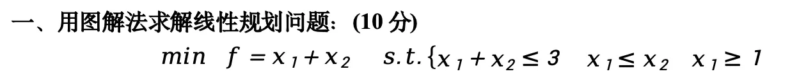
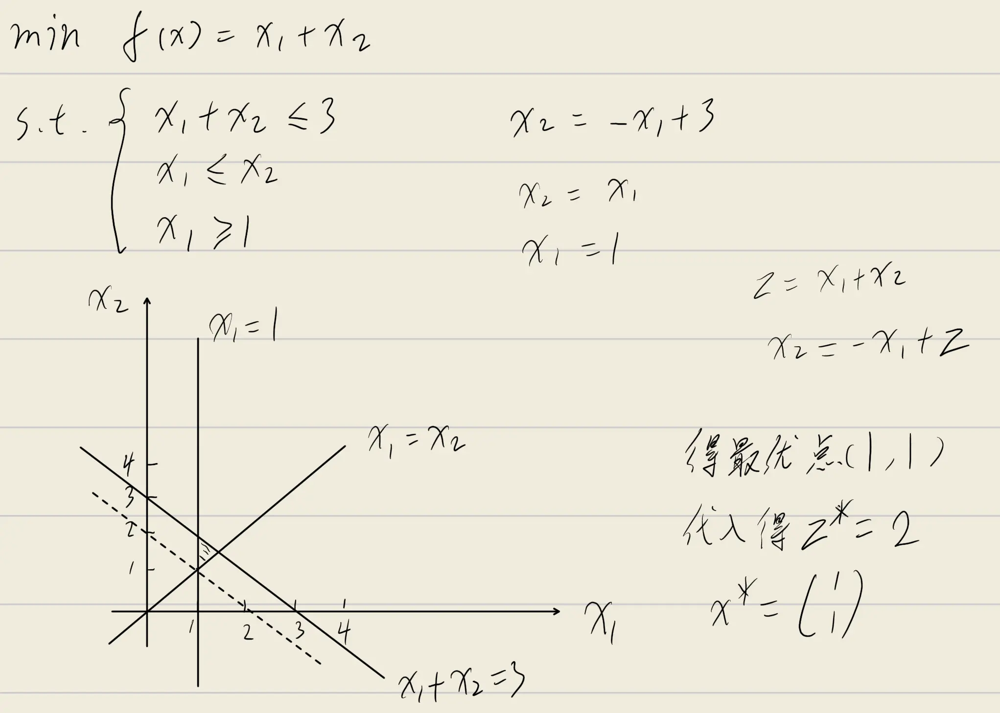
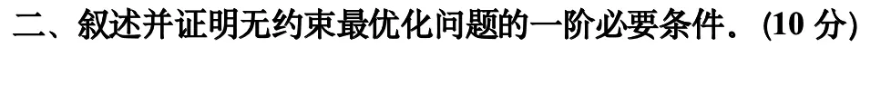
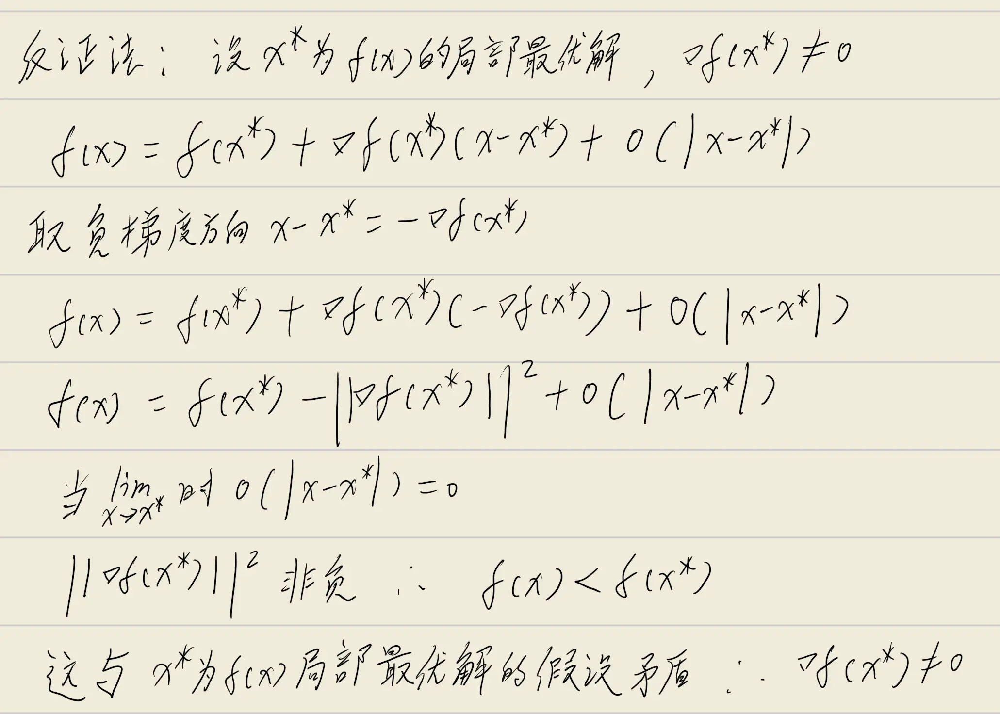

## 复习课大纲

1. 线性优化 LP 建模
2. 二维的图解法 LP
3. 单纯形表 LP（大M法）闭合、位势 $(u,v)$
4. 运输问题（建模，初始值，检验数，负的检验数用闭回路调整）
5. 指派问题（匈牙利算法）
6. 相关概念、定理（凸集、凸函数、性质、定理）
7. 无约束（最速下降法、牛顿法）
8. 最优性定理（有、无约束，一阶、二阶、KKT条件）
9. 罚函数法、障碍函数的构造
10. 遗传算法

## 22～23最优化理论真题

### 一、用图解法求解线性规划问题

**题目：** 用图解法求解线性规划问题（$10$ 分）

$$
\min \quad f = x_1 + x_2 \quad s.t. \begin{cases} x_1 + x_2 \leq 3 \\ x_1 \leq x_2 \\ x_1 \geq 1 \end{cases}
$$

**第一步：将约束条件转化为等式直线方程**

将各不等式约束取等号，得到三条约束直线：

- $x_1 + x_2 = 3$，该直线过点 $(0, 3)$ 和 $(3, 0)$，可行域位于直线下方；
- $x_1 = x_2$，该直线为过原点的 $45^\circ$ 直线，可行域位于直线上方（即 $x_2 \geq x_1$）；
- $x_1 = 1$，该直线为垂直于 $x_1$ 轴的直线，可行域位于直线右侧（即 $x_1 \geq 1$）。

**第二步：求各约束直线的交点（可行域顶点）**

联立各约束直线方程，求可行域的顶点坐标：

- $x_1 = 1$ 与 $x_1 = x_2$ 联立：$x_1 = 1$，代入得 $x_2 = 1$，得交点 $A(1, 1)$；
- $x_1 = 1$ 与 $x_1 + x_2 = 3$ 联立：$1 + x_2 = 3$，解得 $x_2 = 2$，得交点 $B(1, 2)$；
- $x_1 = x_2$ 与 $x_1 + x_2 = 3$ 联立：$2x_1 = 3$，解得 $x_1 = \dfrac{3}{2}$，$x_2 = \dfrac{3}{2}$，得交点 $C\left(\dfrac{3}{2}, \dfrac{3}{2}\right)$。

三条直线围成的三角形区域 $ABC$ 即为可行域。

**第三步：绘制图形并分析目标函数**

**第四步：分析目标函数等值线**

目标函数 $f = x_1 + x_2$ 的等值线方程为 $x_1 + x_2 = c$（$c$ 为常数），即 $x_2 = -x_1 + c$。这是一族斜率为 $-1$ 的平行直线。最小化 $f$ 等价于使等值线沿目标函数梯度方向 $(1, 1)$ 的反方向移动，即让常数 $c$ 不断减小。

**第五步：确定最优解与最优值**

将可行域的三个顶点分别代入目标函数计算：

- 在点 $A(1, 1)$ 处：$f = 1 + 1 = 2$；
- 在点 $B(1, 2)$ 处：$f = 1 + 2 = 3$；
- 在点 $C\left(\dfrac{3}{2}, \dfrac{3}{2}\right)$ 处：$f = \dfrac{3}{2} + \dfrac{3}{2} = 3$。

当等值线 $x_1 + x_2 = 2$ 移动到点 $A(1, 1)$ 时，$c$ 取到最小值 $2$。若继续沿反方向移动，等值线将完全离开可行域。因此，最优解在顶点 $A$ 处取得。

**结论：**

最优解为 $(x_1^*, x_2^*) = (1, 1)$，最优值为 $f^* = 2$。

**评分标准对应：**

- 正确画出 $3$ 条约束直线各 $1$ 分；
- 正确画出可行域 $2$ 分；
- 正确求出约束直线的交点 $2$ 分；
- 正确求出最优值和最优解 $3$ 分。

### 二、叙述并证明无约束最优化问题的一阶必要条件

**无约束最优化问题**的一般形式为：

$$
\min_{x \in \mathbb{R}^n} f(x)
$$

其中 $f: \mathbb{R}^n \to \mathbb{R}$ 为连续可微的目标函数。所谓"无约束"，是指决策变量 $x$ 在整个 $n$ 维欧氏空间 $\mathbb{R}^n$ 中自由取值，不受到任何等式或不等式约束的限制。

**一阶必要条件**（定理3）

设 $f(x)$ 在 $x^*$ 的某个邻域内有**连续的偏导数**（即 $f$ 在 $x^*$ 附近连续可微），若 $x^*$ 是 $f(x)$ 的局部最优解，则

$$
\nabla f(x^*) = 0
$$

也就是说：**若 $x^*$ 是局部最优解，则它在该点处的梯度必须为零向量。**

满足 $\nabla f(x^*) = 0$ 的点称为**驻点**（Stationary Point）。驻点可能为局部极小点、局部极大点或鞍点，因此梯度为零只是极值点的必要条件，而非充分条件。

**证明：**（反证法）

设 $x^*$ 为 $f(x)$ 的局部最优解，假设 $\nabla f(x^*) \neq 0$。

由一阶泰勒展开，对 $x^*$ 附近的任意点 $x$ 有：

$$
f(x) = f(x^*) + \nabla f(x^*)^T (x - x^*) + o(\|x - x^*\|)
$$

取 $x = x^* - t\nabla f(x^*)$（$t > 0$），代入得：

$$
\begin{aligned}
f(x) - f(x^*) &= \nabla f(x^*)^T \bigl(-t\nabla f(x^*)\bigr) + o(t) \\
&= -t\|\nabla f(x^*)\|^2 + o(t)
\end{aligned}
$$

由于 $\nabla f(x^*) \neq 0$，有 $\|\nabla f(x^*)\|^2 > 0$。当 $t > 0$ 充分小时，一阶负项占主导，故：

$$
f(x) - f(x^*) < 0 \quad\Longrightarrow\quad f(x) < f(x^*)
$$

这与 $x^*$ 为局部最优解矛盾。因此假设错误，必有 $\nabla f(x^*) = 0$。

**几何解释：** 梯度指向函数值增长最快的方向，若梯度不为零，则沿负梯度方向可使函数值下降，故该点不可能为局部极小点。

**二阶必要条件**（定理4）

设 $f: \mathbb{R}^n \to \mathbb{R}$ 在 $x^*$ 处有二阶连续偏导数，若 $x^*$ 是 $f$ 的局部极小点，则

$$
\nabla f(x^*) = 0 \quad \text{且} \quad \nabla^2 f(x^*) \succeq 0 \; (\text{半正定})
$$

其中 $\nabla^2 f(x^*)$ 为 $f$ 在 $x^*$ 处的**Hesse矩阵**（二阶偏导数矩阵）。该条件说明：局部极小点不仅梯度为零，而且函数在该点的二阶曲率必须"向上开口"（半正定）。

**二阶充分条件**（定理5）

设 $f: \mathbb{R}^n \to \mathbb{R}$ 在 $x^*$ 的某邻域内有连续的二阶偏导数，若

$$
\nabla f(x^*) = 0 \quad \text{且} \quad \nabla^2 f(x^*) \succ 0 \; (\text{正定})
$$

则 $x^*$ 是 $f$ 在该邻域内的**严格局部极小点**。

三者关系总结如下：

| 条件类型 | 前提 | 结论 |
| --- | --- | --- |
| 一阶必要 | $f$ 在 $x^*$ 可微 | $x^*$ 为局部极小点 $\Rightarrow \nabla f(x^*) = 0$ |
| 二阶必要 | $f$ 在 $x^*$ 二阶连续可微 | $x^*$ 为局部极小点 $\Rightarrow \nabla f(x^*) = 0, \nabla^2 f(x^*) \succeq 0$ |
| 二阶充分 | $f$ 在 $x^*$ 邻域二阶连续可微 | $\nabla f(x^*) = 0, \nabla^2 f(x^*) \succ 0$ $\Rightarrow x^*$ 为严格局部极小点 |
