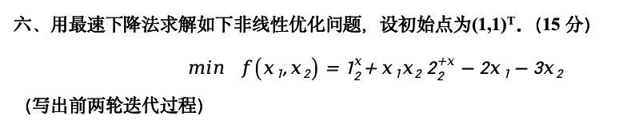
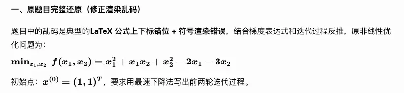
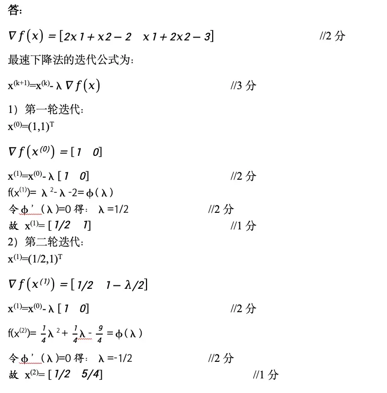
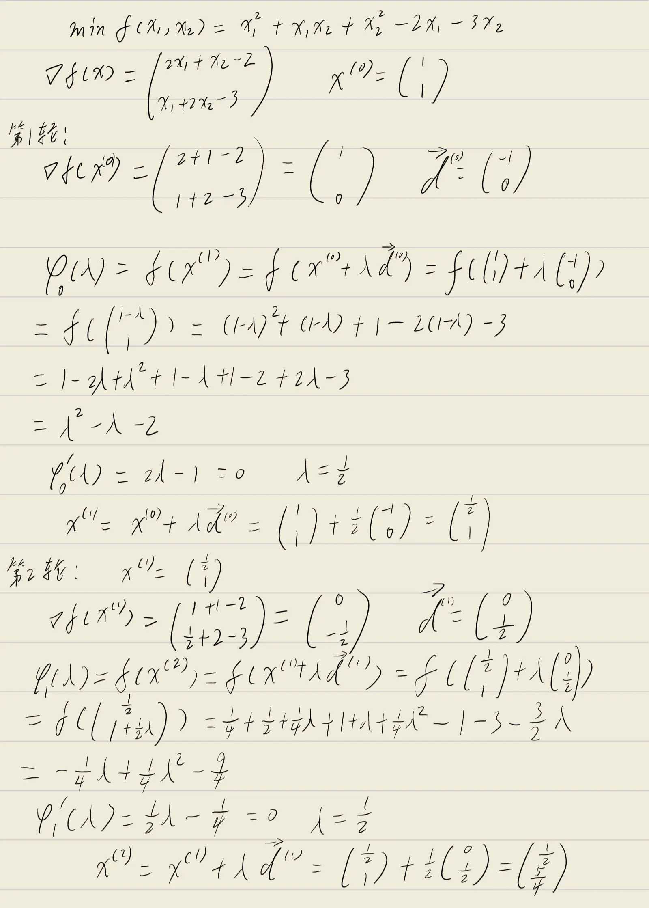
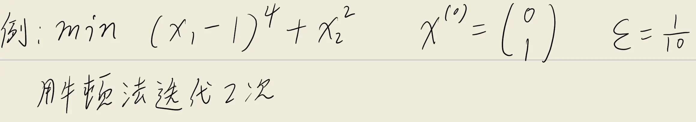
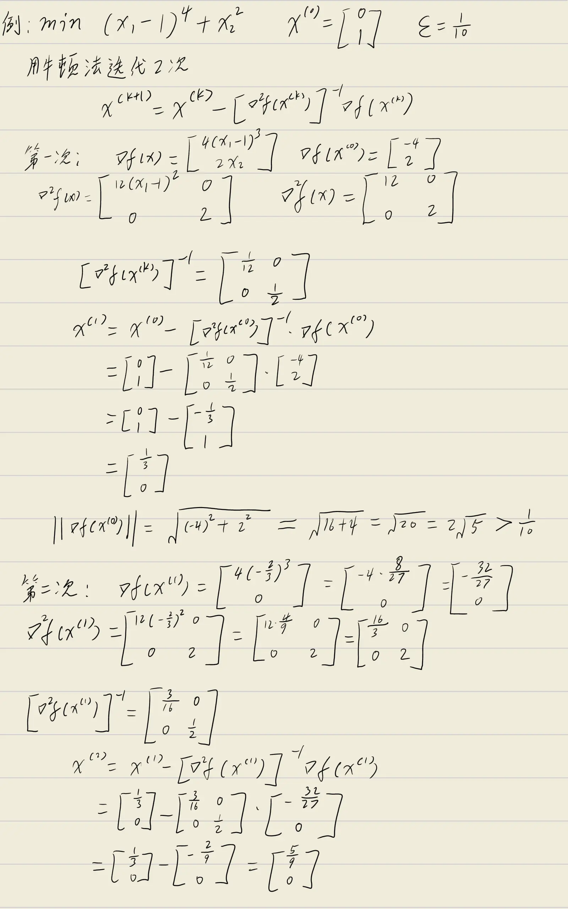
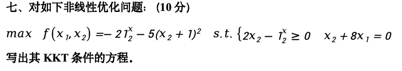
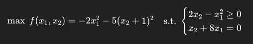
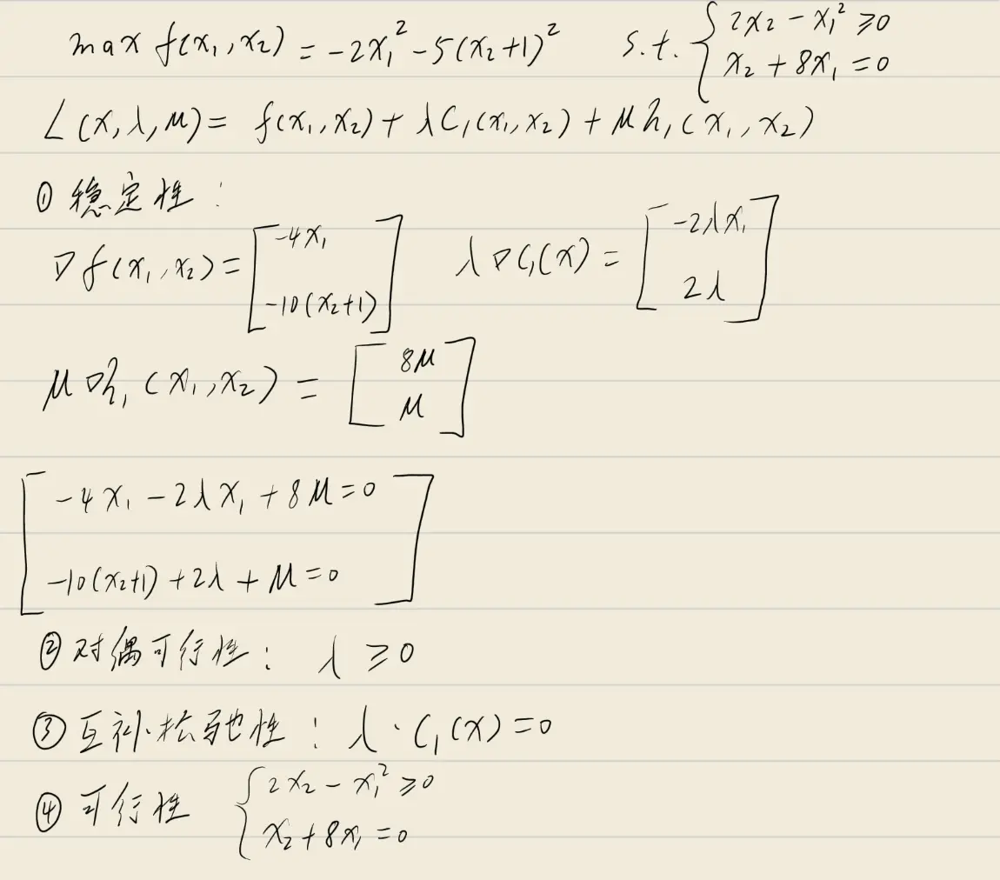
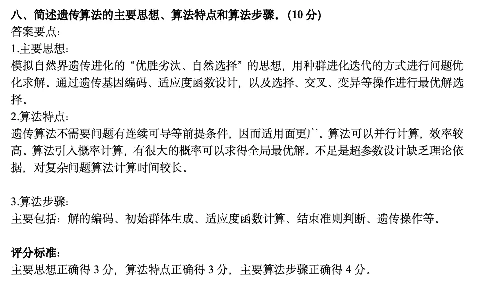

## 复习课大纲

1. 线性优化 LP 建模
2. 二维的图解法 LP
3. 单纯形表 LP（大M法）闭合、位势 $(u,v)$
4. 运输问题（建模，初始值，检验数，负的检验数用闭回路调整）
5. 指派问题（匈牙利算法）
6. 相关概念、定理（凸集、凸函数、性质、定理）
7. 无约束（最速下降法、牛顿法）
8. 最优性定理（有、无约束，一阶、二阶、KKT条件）
9. 罚函数法、障碍函数的构造
10. 遗传算法

## 22～23最优化理论真题

### 一、用图解法求解线性规划问题

**题目：** 用图解法求解线性规划问题（$10$ 分）

$$
\min \quad f = x_1 + x_2 \quad s.t. \begin{cases} x_1 + x_2 \leq 3 \\ x_1 \leq x_2 \\ x_1 \geq 1 \end{cases}
$$

**第一步：将约束条件转化为等式直线方程**

将各不等式约束取等号，得到三条约束直线：

- $x_1 + x_2 = 3$，该直线过点 $(0, 3)$ 和 $(3, 0)$，可行域位于直线下方；
- $x_1 = x_2$，该直线为过原点的 $45^\circ$ 直线，可行域位于直线上方（即 $x_2 \geq x_1$）；
- $x_1 = 1$，该直线为垂直于 $x_1$ 轴的直线，可行域位于直线右侧（即 $x_1 \geq 1$）。

**第二步：求各约束直线的交点（可行域顶点）**

联立各约束直线方程，求可行域的顶点坐标：

- $x_1 = 1$ 与 $x_1 = x_2$ 联立：$x_1 = 1$，代入得 $x_2 = 1$，得交点 $A(1, 1)$；
- $x_1 = 1$ 与 $x_1 + x_2 = 3$ 联立：$1 + x_2 = 3$，解得 $x_2 = 2$，得交点 $B(1, 2)$；
- $x_1 = x_2$ 与 $x_1 + x_2 = 3$ 联立：$2x_1 = 3$，解得 $x_1 = \dfrac{3}{2}$，$x_2 = \dfrac{3}{2}$，得交点 $C\left(\dfrac{3}{2}, \dfrac{3}{2}\right)$。

三条直线围成的三角形区域 $ABC$ 即为可行域。

**第三步：绘制图形并分析目标函数**

**第四步：分析目标函数等值线**

目标函数 $f = x_1 + x_2$ 的等值线方程为 $x_1 + x_2 = c$（$c$ 为常数），即 $x_2 = -x_1 + c$。这是一族斜率为 $-1$ 的平行直线。最小化 $f$ 等价于使等值线沿目标函数梯度方向 $(1, 1)$ 的反方向移动，即让常数 $c$ 不断减小。

**第五步：确定最优解与最优值**

将可行域的三个顶点分别代入目标函数计算：

- 在点 $A(1, 1)$ 处：$f = 1 + 1 = 2$；
- 在点 $B(1, 2)$ 处：$f = 1 + 2 = 3$；
- 在点 $C\left(\dfrac{3}{2}, \dfrac{3}{2}\right)$ 处：$f = \dfrac{3}{2} + \dfrac{3}{2} = 3$。

当等值线 $x_1 + x_2 = 2$ 移动到点 $A(1, 1)$ 时，$c$ 取到最小值 $2$。若继续沿反方向移动，等值线将完全离开可行域。因此，最优解在顶点 $A$ 处取得。

**结论：**

最优解为 $(x_1^*, x_2^*) = (1, 1)$，最优值为 $f^* = 2$。

**评分标准对应：**

- 正确画出 $3$ 条约束直线各 $1$ 分；
- 正确画出可行域 $2$ 分；
- 正确求出约束直线的交点 $2$ 分；
- 正确求出最优值和最优解 $3$ 分。

### 二、叙述并证明无约束最优化问题的一阶必要条件

**无约束最优化问题**的一般形式为：

$$
\min_{x \in \mathbb{R}^n} f(x)
$$

其中 $f: \mathbb{R}^n \to \mathbb{R}$ 为连续可微的目标函数。所谓"无约束"，是指决策变量 $x$ 在整个 $n$ 维欧氏空间 $\mathbb{R}^n$ 中自由取值，不受到任何等式或不等式约束的限制。

**一阶必要条件**（定理3）

设 $f(x)$ 在 $x^*$ 的某个邻域内有**连续的偏导数**（即 $f$ 在 $x^*$ 附近连续可微），若 $x^*$ 是 $f(x)$ 的局部最优解，则

$$
\nabla f(x^*) = 0
$$

也就是说：**若 $x^*$ 是局部最优解，则它在该点处的梯度必须为零向量。**

满足 $\nabla f(x^*) = 0$ 的点称为**驻点**（Stationary Point）。驻点可能为局部极小点、局部极大点或鞍点，因此梯度为零只是极值点的必要条件，而非充分条件。

**证明：**（反证法）

设 $x^*$ 为 $f(x)$ 的局部最优解，假设 $\nabla f(x^*) \neq 0$。

由一阶泰勒展开，对 $x^*$ 附近的任意点 $x$ 有：

$$
f(x) = f(x^*) + \nabla f(x^*)^T (x - x^*) + o(\|x - x^*\|)
$$

取 $x = x^* - t\nabla f(x^*)$（$t > 0$），代入得：

$$
\begin{aligned}
f(x) - f(x^*) &= \nabla f(x^*)^T \bigl(-t\nabla f(x^*)\bigr) + o(t) \\
&= -t\|\nabla f(x^*)\|^2 + o(t)
\end{aligned}
$$

由于 $\nabla f(x^*) \neq 0$，有 $\|\nabla f(x^*)\|^2 > 0$。当 $t > 0$ 充分小时，一阶负项占主导，故：

$$
f(x) - f(x^*) < 0 \quad\Longrightarrow\quad f(x) < f(x^*)
$$

这与 $x^*$ 为局部最优解矛盾。因此假设错误，必有 $\nabla f(x^*) = 0$。

**几何解释：** 梯度指向函数值增长最快的方向，若梯度不为零，则沿负梯度方向可使函数值下降，故该点不可能为局部极小点。

**二阶必要条件**（定理4）

设 $f: \mathbb{R}^n \to \mathbb{R}$ 在 $x^*$ 处有二阶连续偏导数，若 $x^*$ 是 $f$ 的局部极小点，则

$$
\nabla f(x^*) = 0 \quad \text{且} \quad \nabla^2 f(x^*) \succeq 0 \; (\text{半正定})
$$

其中 $\nabla^2 f(x^*)$ 为 $f$ 在 $x^*$ 处的**Hesse矩阵**（二阶偏导数矩阵）。该条件说明：局部极小点不仅梯度为零，而且函数在该点的二阶曲率必须"向上开口"（半正定）。

**二阶充分条件**（定理5）

设 $f: \mathbb{R}^n \to \mathbb{R}$ 在 $x^*$ 的某邻域内有连续的二阶偏导数，若

$$
\nabla f(x^*) = 0 \quad \text{且} \quad \nabla^2 f(x^*) \succ 0 \; (\text{正定})
$$

则 $x^*$ 是 $f$ 在该邻域内的**严格局部极小点**。

三者关系总结如下：

| 条件类型 | 前提 | 结论 |
| --- | --- | --- |
| 一阶必要 | $f$ 在 $x^*$ 可微 | $x^*$ 为局部极小点 $\Rightarrow \nabla f(x^*) = 0$ |
| 二阶必要 | $f$ 在 $x^*$ 二阶连续可微 | $x^*$ 为局部极小点 $\Rightarrow \nabla f(x^*) = 0, \nabla^2 f(x^*) \succeq 0$ |
| 二阶充分 | $f$ 在 $x^*$ 邻域二阶连续可微 | $\nabla f(x^*) = 0, \nabla^2 f(x^*) \succ 0$ $\Rightarrow x^*$ 为严格局部极小点 |

### 最优性定理

这一部分主要对复习课大纲中“最优性定理”进行集中整理。前面第二题已经证明了无约束优化的一阶必要条件，这里按照笔记中的定理编号，把无约束优化的一阶必要条件、二阶必要条件、二阶充分条件、凸优化极值定理以及约束优化中的 KKT 定理统一写出来。

需要注意的是，这些定理的逻辑关系是：

- **必要条件**：如果 $x^*$ 是局部最优点，则它必须满足这些条件；
- **充分条件**：如果 $x^*$ 满足这些条件，则可以推出它是局部最优点；
- **凸优化极值定理**：在凸函数条件下，驻点不仅是局部极小点，而且是全局极小点；
- **KKT 条件**：是约束优化问题的一阶最优性条件，后面会结合具体题目展开计算。

#### 定理3：无约束优化的一阶必要条件

考虑无约束优化问题：

$$
\min_{x \in \mathbb{R}^n} f(x)
$$

设 $f: \mathbb{R}^n \to \mathbb{R}$ 在 $x^*$ 处可微。若 $x^*$ 是 $f(x)$ 的局部极小点，则：

$$
\nabla f(x^*) = 0
$$

也就是说，无约束优化问题的局部极小点一定是驻点。

这里的 $\nabla f(x^*) = 0$ 表示 $f$ 在 $x^*$ 处关于所有变量的一阶偏导数都为 $0$，即：

$$
\nabla f(x^*) =
\begin{bmatrix}
\dfrac{\partial f}{\partial x_1}(x^*) \\
\dfrac{\partial f}{\partial x_2}(x^*) \\
\vdots \\
\dfrac{\partial f}{\partial x_n}(x^*)
\end{bmatrix}
=
\begin{bmatrix}
0 \\
0 \\
\vdots \\
0
\end{bmatrix}
$$

**证明：**（反证法）

设 $x^*$ 是 $f(x)$ 的局部极小点，假设：

$$
\nabla f(x^*) \neq 0
$$

由于 $f$ 在 $x^*$ 处可微，对 $x^*$ 附近的点 $x$ 有一阶 Taylor 展开：

$$
f(x) = f(x^*) + \nabla f(x^*)^T(x - x^*) + o(\|x - x^*\|)
$$

取负梯度方向上的点：

$$
x = x^* - t\nabla f(x^*), \quad t > 0
$$

则：

$$
x - x^* = -t\nabla f(x^*)
$$

代入一阶 Taylor 展开，得：

$$
\begin{aligned}
f(x) - f(x^*)
&= \nabla f(x^*)^T\bigl(-t\nabla f(x^*)\bigr) + o(t) \\
&= -t\|\nabla f(x^*)\|^2 + o(t)
\end{aligned}
$$

因为 $\nabla f(x^*) \neq 0$，所以 $\|\nabla f(x^*)\|^2 > 0$。当 $t > 0$ 充分小时，一阶负项 $-t\|\nabla f(x^*)\|^2$ 起主导作用，因此：

$$
f(x) - f(x^*) < 0
$$

即：

$$
f(x) < f(x^*)
$$

这说明在 $x^*$ 附近存在一个点 $x$，使得函数值比 $f(x^*)$ 更小，与 $x^*$ 是局部极小点矛盾。因此假设不成立，必有：

$$
\nabla f(x^*) = 0
$$

**说明：** 一阶必要条件只能说明局部极小点必须是驻点，但驻点不一定是局部极小点，也可能是局部极大点或鞍点。

#### 定理4：无约束优化的二阶必要条件

考虑无约束优化问题：

$$
\min_{x \in \mathbb{R}^n} f(x)
$$

设 $f: \mathbb{R}^n \to \mathbb{R}$ 在 $x^*$ 处有二阶连续偏导数。若 $x^*$ 是 $f(x)$ 的局部极小点，则：

$$
\nabla f(x^*) = 0
$$

且：

$$
\nabla^2 f(x^*) \succeq 0
$$

即 $\nabla^2 f(x^*)$ 为半正定矩阵，也就是对任意方向 $d \in \mathbb{R}^n$，都有：

$$
d^T\nabla^2 f(x^*)d \geq 0
$$

其中 $\nabla^2 f(x^*)$ 是 $f$ 在 $x^*$ 处的 Hesse 矩阵：

$$
\nabla^2 f(x^*) =
\begin{bmatrix}
\dfrac{\partial^2 f}{\partial x_1^2}(x^*) & \cdots & \dfrac{\partial^2 f}{\partial x_1\partial x_n}(x^*) \\
\vdots & \ddots & \vdots \\
\dfrac{\partial^2 f}{\partial x_n\partial x_1}(x^*) & \cdots & \dfrac{\partial^2 f}{\partial x_n^2}(x^*)
\end{bmatrix}
$$

**证明：**

由于 $x^*$ 是局部极小点，由定理3可知：

$$
\nabla f(x^*) = 0
$$

下面证明 $\nabla^2 f(x^*)$ 半正定。

任取一个方向 $d \in \mathbb{R}^n$，考虑从 $x^*$ 出发沿方向 $d$ 移动得到的点：

$$
x(t) = x^* + td
$$

其中 $t$ 是充分小的实数。由于 $x^*$ 是局部极小点，所以当 $t$ 充分小时，应有：

$$
f(x^* + td) \geq f(x^*)
$$

对 $f(x^* + td)$ 在 $x^*$ 处作二阶 Taylor 展开：

$$
f(x^* + td)
= f(x^*) + t\nabla f(x^*)^Td + \dfrac{1}{2}t^2d^T\nabla^2 f(x^*)d + o(t^2)
$$

由于 $\nabla f(x^*) = 0$，上式化为：

$$
f(x^* + td) - f(x^*)
= \dfrac{1}{2}t^2d^T\nabla^2 f(x^*)d + o(t^2)
$$

如果存在某个方向 $d$，使得：

$$
d^T\nabla^2 f(x^*)d < 0
$$

那么当 $t$ 充分小时，二阶负项起主导作用，就会有：

$$
f(x^* + td) - f(x^*) < 0
$$

即：

$$
f(x^* + td) < f(x^*)
$$

这与 $x^*$ 是局部极小点矛盾。因此对任意方向 $d$，都必须有：

$$
d^T\nabla^2 f(x^*)d \geq 0
$$

所以：

$$
\nabla^2 f(x^*) \succeq 0
$$

即 Hesse 矩阵半正定。

**说明：** 二阶必要条件仍然只是必要条件。若 $\nabla^2 f(x^*)$ 只是半正定，则不能保证 $x^*$ 一定是局部极小点，因为半正定矩阵可能在某些方向上二阶项为 $0$，此时需要继续考察更高阶项。

#### 定理5：无约束优化的二阶充分条件

考虑无约束优化问题：

$$
\min_{x \in \mathbb{R}^n} f(x)
$$

设 $f: \mathbb{R}^n \to \mathbb{R}$ 在 $x^*$ 的某个邻域内有连续的二阶偏导数。若：

$$
\nabla f(x^*) = 0
$$

且：

$$
\nabla^2 f(x^*) \succ 0
$$

即 $\nabla^2 f(x^*)$ 为正定矩阵，则 $x^*$ 是 $f(x)$ 的严格局部极小点。

正定的含义是：对任意非零方向 $d \neq 0$，都有：

$$
d^T\nabla^2 f(x^*)d > 0
$$

**证明：**

对 $x^*$ 附近的任意点 $x$，记：

$$
d = x - x^*
$$

当 $x$ 足够接近 $x^*$ 时，$d$ 足够小。对 $f(x)$ 在 $x^*$ 处作二阶 Taylor 展开：

$$
f(x) = f(x^*) + \nabla f(x^*)^Td + \dfrac{1}{2}d^T\nabla^2 f(x^*)d + o(\|d\|^2)
$$

由于 $\nabla f(x^*) = 0$，所以：

$$
f(x) - f(x^*)
= \dfrac{1}{2}d^T\nabla^2 f(x^*)d + o(\|d\|^2)
$$

又因为 $\nabla^2 f(x^*) \succ 0$，所以存在常数 $\alpha > 0$，使得当 $d \neq 0$ 时：

$$
d^T\nabla^2 f(x^*)d \geq \alpha\|d\|^2
$$

因此：

$$
f(x) - f(x^*)
\geq \dfrac{1}{2}\alpha\|d\|^2 + o(\|d\|^2)
$$

当 $x$ 充分接近 $x^*$ 且 $x \neq x^*$ 时，高阶无穷小项 $o(\|d\|^2)$ 不会改变主项为正的性质，于是：

$$
f(x) - f(x^*) > 0
$$

即：

$$
f(x) > f(x^*)
$$

所以 $x^*$ 是 $f(x)$ 的严格局部极小点。

**说明：** 二阶充分条件中的正定比二阶必要条件中的半正定更强。半正定只能说明“不一定能找到下降方向”，而正定可以保证 $x^*$ 附近所有非零方向上函数值都会升高。

#### 定理6：凸优化极值定理

设 $f: \mathbb{R}^n \to \mathbb{R}$ 为凸函数，并且 $f$ 在 $x^*$ 处可微。若：

$$
\nabla f(x^*) = 0
$$

则 $x^*$ 是 $f(x)$ 的全局极小点。

如果 $f$ 是严格凸函数，则该全局极小点还是唯一的。

**证明：**

由于 $f$ 是可微凸函数，对任意 $x \in \mathbb{R}^n$，凸函数的一阶性质给出：

$$
f(x) \geq f(x^*) + \nabla f(x^*)^T(x - x^*)
$$

又因为：

$$
\nabla f(x^*) = 0
$$

所以：

$$
f(x) \geq f(x^*)
$$

这对任意 $x \in \mathbb{R}^n$ 都成立，因此 $x^*$ 不是普通的局部极小点，而是全局极小点。

若 $f$ 是严格凸函数，并且存在两个不同的全局极小点 $x_1^*$ 与 $x_2^*$，则对任意 $0 < \theta < 1$，严格凸性给出：

$$
f\bigl(\theta x_1^* + (1 - \theta)x_2^*\bigr)
< \theta f(x_1^*) + (1 - \theta)f(x_2^*)
$$

由于 $x_1^*$ 与 $x_2^*$ 都是全局极小点，右端等于最小函数值，于是得到一个比全局最小值还小的函数值，矛盾。因此严格凸函数的全局极小点唯一。

**说明：** 对一般非凸函数而言，$\nabla f(x^*) = 0$ 只能说明 $x^*$ 是驻点；但对凸函数而言，驻点就一定是全局极小点。这也是凸优化问题比一般非线性优化问题更容易处理的重要原因。

#### 定理7：KKT 定理

考虑一般约束优化问题：

$$
\begin{aligned}
\min \quad & f(x) \\
\text{s.t.} \quad & c_i(x) \leq 0, \quad i = 1,2,\ldots,m \\
& h_j(x) = 0, \quad j = 1,2,\ldots,p
\end{aligned}
$$

其中 $c_i(x)$ 表示不等式约束函数，$h_j(x)$ 表示等式约束函数。

构造拉格朗日函数：

$$
L(x,\lambda,\mu)
= f(x) + \sum_{i=1}^{m}\lambda_i c_i(x) + \sum_{j=1}^{p}\mu_j h_j(x)
$$

其中：

- $\lambda_i$ 是不等式约束 $c_i(x) \leq 0$ 对应的拉格朗日乘子；
- $\mu_j$ 是等式约束 $h_j(x) = 0$ 对应的拉格朗日乘子；
- 对于最小化问题中的 $c_i(x) \leq 0$ 形式，有 $\lambda_i \geq 0$；
- 等式约束乘子 $\mu_j$ 不限制正负。

若 $x^*$ 是该约束优化问题的局部极小点，并且在 $x^*$ 处满足适当的约束规格条件，则存在乘子 $\lambda_i^*$ 和 $\mu_j^*$，使得以下 KKT 条件成立。

**第一，稳定性条件（驻点条件）：**

$$
\nabla f(x^*)
+ \sum_{i=1}^{m}\lambda_i^*\nabla c_i(x^*)
+ \sum_{j=1}^{p}\mu_j^*\nabla h_j(x^*)
= 0
$$

也就是：

$$
\nabla_x L(x^*,\lambda^*,\mu^*) = 0
$$

**第二，可行性条件：**

$$
c_i(x^*) \leq 0, \quad i = 1,2,\ldots,m
$$

$$
h_j(x^*) = 0, \quad j = 1,2,\ldots,p
$$

即最优解本身必须满足原问题的所有约束。

**第三，对偶可行性条件：**

$$
\lambda_i^* \geq 0, \quad i = 1,2,\ldots,m
$$

等式约束乘子 $\mu_j^*$ 不要求非负。

**第四，互补松弛性条件：**

$$
\lambda_i^*c_i(x^*) = 0, \quad i = 1,2,\ldots,m
$$

该条件表示：

- 若第 $i$ 个不等式约束不起作用，即 $c_i(x^*) < 0$，则 $\lambda_i^* = 0$；
- 若 $\lambda_i^* > 0$，则对应约束必须取等号，即 $c_i(x^*) = 0$。

**证明思路：**

KKT 定理可以看作无约束一阶必要条件在约束优化中的推广。无约束问题中，若 $\nabla f(x^*) \neq 0$，则可以沿负梯度方向找到下降点；而在约束问题中，不是所有方向都允许走，只能沿满足约束的可行方向移动。

记在 $x^*$ 处起作用的不等式约束集合为：

$$
I(x^*) = \{i \mid c_i(x^*) = 0\}
$$

若 $d$ 是 $x^*$ 处的可行方向，则一阶近似下应满足：

$$
\nabla c_i(x^*)^Td \leq 0, \quad i \in I(x^*)
$$

以及：

$$
\nabla h_j(x^*)^Td = 0, \quad j = 1,2,\ldots,p
$$

由于 $x^*$ 是局部极小点，所以不存在可行下降方向。也就是说，不存在方向 $d$ 同时满足约束的一阶可行性，并且使得：

$$
\nabla f(x^*)^Td < 0
$$

否则沿 $x^* + td$ 移动，当 $t > 0$ 充分小时，由一阶 Taylor 展开可得：

$$
f(x^* + td) = f(x^*) + t\nabla f(x^*)^Td + o(t)
$$

若 $\nabla f(x^*)^Td < 0$，则会得到 $f(x^* + td) < f(x^*)$，这与 $x^*$ 是局部极小点矛盾。

因此，在所有可行方向上，目标函数都不能一阶下降。由 Farkas 引理或超平面分离定理可知，目标函数梯度必须能够由起作用约束的梯度线性表示，即存在乘子 $\lambda_i^*$ 和 $\mu_j^*$，使得：

$$
\nabla f(x^*)
+ \sum_{i=1}^{m}\lambda_i^*\nabla c_i(x^*)
+ \sum_{j=1}^{p}\mu_j^*\nabla h_j(x^*)
= 0
$$

其中不等式约束对应的乘子满足 $\lambda_i^* \geq 0$。对于不起作用的不等式约束，有 $c_i(x^*) < 0$，它在 $x^*$ 附近不是限制可行方向的边界，因此取：

$$
\lambda_i^* = 0
$$

于是自然得到互补松弛性条件：

$$
\lambda_i^*c_i(x^*) = 0
$$

再加上原问题本身的可行性条件和乘子非负条件，就得到完整的 KKT 条件。

**说明：** 这里采用的是最小化问题 $c_i(x) \leq 0$ 的标准形式。如果题目写成最大化问题，或者不等式约束写成 $c_i(x) \geq 0$，拉格朗日函数中乘子的符号约定会相应改变。实际做题时只要前后一致即可，后面的 KKT 例题会按照题目给出的最大化形式单独处理。

**最优性定理总结：**

| 定理 | 类型 | 主要结论 |
| --- | --- | --- |
| 定理3 | 无约束一阶必要条件 | 局部极小点 $\Rightarrow \nabla f(x^*) = 0$ |
| 定理4 | 无约束二阶必要条件 | 局部极小点 $\Rightarrow \nabla f(x^*) = 0, \nabla^2 f(x^*) \succeq 0$ |
| 定理5 | 无约束二阶充分条件 | $\nabla f(x^*) = 0, \nabla^2 f(x^*) \succ 0 \Rightarrow x^*$ 为严格局部极小点 |
| 定理6 | 凸优化极值定理 | 凸函数中 $\nabla f(x^*) = 0 \Rightarrow x^*$ 为全局极小点 |
| 定理7 | KKT 定理 | 约束优化局部最优点在约束规格条件下满足稳定性、可行性、对偶可行性和互补松弛性 |

### 三、单纯形表法

**题目：** 某工厂拟生产甲、乙、丙三种商品，每种商品消耗的资源与利润如下表：

| | 甲 | 乙 | 丙 | 资源限量 |
| --- | --- | --- | --- | --- |
| 工时（小时/件） | 6 | 3 | 5 | 45 |
| 材料（公斤/件） | 3 | 4 | 5 | 30 |
| 利润（元/件） | 3 | 1 | 4 | |

(1) 建立可以获得最大利润的各种商品生产数量的线性模型；（5 分）
(2) 用单纯形表法求解该模型，给出该问题的最优解。（10 分）

**解答：**

**(1) 建立线性规划模型**

设甲、乙、丙三种产品分别生产 $x_1, x_2, x_3$ 件，则线性规划模型为：

$$
\begin{aligned}
\max \quad & z = 3x_1 + x_2 + 4x_3 \\
\text{s.t.} \quad & \begin{cases}
6x_1 + 3x_2 + 5x_3 \leq 45 \\
3x_1 + 4x_2 + 5x_3 \leq 30 \\
x_1, x_2, x_3 \geq 0
\end{cases}
\end{aligned}
$$

**(2) 单纯形表法求解**

引入松弛变量 $x_4, x_5$，将模型化为标准型：

$$
\begin{aligned}
\max \quad & z = 3x_1 + x_2 + 4x_3 + 0x_4 + 0x_5 \\
\text{s.t.} \quad & \begin{cases}
6x_1 + 3x_2 + 5x_3 + x_4 = 45 \\
3x_1 + 4x_2 + 5x_3 + x_5 = 30 \\
x_1, x_2, x_3, x_4, x_5 \geq 0
\end{cases}
\end{aligned}
$$

**初始单纯形表**

<table style="border-collapse: collapse; margin: 10px auto; text-align: center; font-size: 0.95em;">
  <thead>
    <tr>
      <th colspan="3" style="border: 1px solid #555;"></th>
      <th style="border: 1px solid #555;">$3$</th>
      <th style="border: 1px solid #555;">$1$</th>
      <th style="border: 1px solid #555;">$4$</th>
      <th style="border: 1px solid #555;">$0$</th>
      <th style="border: 1px solid #555;">$0$</th>
      <th rowspan="2" style="border: 1px solid #555;">$\theta$</th>
    </tr>
    <tr>
      <th style="border: 1px solid #555;">$C_B$</th>
      <th style="border: 1px solid #555;">$X_B$</th>
      <th style="border: 1px solid #555;">$b$</th>
      <th style="border: 1px solid #555;">$x_1$</th>
      <th style="border: 1px solid #555;">$x_2$</th>
      <th style="border: 1px solid #555;">$x_3$</th>
      <th style="border: 1px solid #555;">$x_4$</th>
      <th style="border: 1px solid #555;">$x_5$</th>
    </tr>
  </thead>
  <tbody>
    <tr>
      <td style="border: 1px solid #555;">$0$</td>
      <td style="border: 1px solid #555;">$x_4$</td>
      <td style="border: 1px solid #555;">$45$</td>
      <td style="border: 1px solid #555;">$6$</td>
      <td style="border: 1px solid #555;">$3$</td>
      <td style="border: 1px solid #555;">$5$</td>
      <td style="border: 1px solid #555;">$1$</td>
      <td style="border: 1px solid #555;">$0$</td>
      <td style="border: 1px solid #555;">$9$</td>
    </tr>
    <tr>
      <td style="border: 1px solid #555;">$0$</td>
      <td style="border: 1px solid #555;">$x_5$</td>
      <td style="border: 1px solid #555;">$30$</td>
      <td style="border: 1px solid #555;">$3$</td>
      <td style="border: 1px solid #555;">$4$</td>
      <td style="border: 1px solid #555; background: #e67e22; color: #fff; font-weight: bold;">$5$</td>
      <td style="border: 1px solid #555;">$0$</td>
      <td style="border: 1px solid #555;">$1$</td>
      <td style="border: 1px solid #555;">$6$</td>
    </tr>
    <tr style="border-top: 2px solid #555;">
      <td colspan="2" style="border: 1px solid #555;">$c_j - z_j$</td>
      <td style="border: 1px solid #555;">$0$</td>
      <td style="border: 1px solid #555;">$3$</td>
      <td style="border: 1px solid #555;">$1$</td>
      <td style="border: 1px solid #555;">$4$</td>
      <td style="border: 1px solid #555;">$0$</td>
      <td style="border: 1px solid #555;">$0$</td>
      <td style="border: 1px solid #555;"></td>
    </tr>
  </tbody>
</table>

检验数 $c_j - z_j$ 中，$x_3$ 的检验数最大（$4 > 0$），故 $x_3$ **进基**。  
计算 $\theta$：$\theta_1 = 45/5 = 9$，$\theta_2 = 30/5 = 6$，最小值为 $6$，故 $x_5$ **出基**，主元 $a_{23} = 5$（表中高亮）。

**第一步迭代**

以 $a_{23} = 5$ 为主元进行行变换：新 $x_3$ 行 $=$ 原 $x_5$ 行 $\div 5$；新 $x_4$ 行 $=$ 原 $x_4$ 行 $- 5 \times$ 新 $x_3$ 行。

<table style="border-collapse: collapse; margin: 10px auto; text-align: center; font-size: 0.95em;">
  <thead>
    <tr>
      <th colspan="3" style="border: 1px solid #555;"></th>
      <th style="border: 1px solid #555;">$3$</th>
      <th style="border: 1px solid #555;">$1$</th>
      <th style="border: 1px solid #555;">$4$</th>
      <th style="border: 1px solid #555;">$0$</th>
      <th style="border: 1px solid #555;">$0$</th>
      <th rowspan="2" style="border: 1px solid #555;">$\theta$</th>
    </tr>
    <tr>
      <th style="border: 1px solid #555;">$C_B$</th>
      <th style="border: 1px solid #555;">$X_B$</th>
      <th style="border: 1px solid #555;">$b$</th>
      <th style="border: 1px solid #555;">$x_1$</th>
      <th style="border: 1px solid #555;">$x_2$</th>
      <th style="border: 1px solid #555;">$x_3$</th>
      <th style="border: 1px solid #555;">$x_4$</th>
      <th style="border: 1px solid #555;">$x_5$</th>
    </tr>
  </thead>
  <tbody>
    <tr>
      <td style="border: 1px solid #555;">$0$</td>
      <td style="border: 1px solid #555;">$x_4$</td>
      <td style="border: 1px solid #555;">$15$</td>
      <td style="border: 1px solid #555; background: #e67e22; color: #fff; font-weight: bold;">$3$</td>
      <td style="border: 1px solid #555;">$-1$</td>
      <td style="border: 1px solid #555;">$0$</td>
      <td style="border: 1px solid #555;">$1$</td>
      <td style="border: 1px solid #555;">$-1$</td>
      <td style="border: 1px solid #555;">$5$</td>
    </tr>
    <tr>
      <td style="border: 1px solid #555;">$4$</td>
      <td style="border: 1px solid #555;">$x_3$</td>
      <td style="border: 1px solid #555;">$6$</td>
      <td style="border: 1px solid #555;">$\dfrac{3}{5}$</td>
      <td style="border: 1px solid #555;">$\dfrac{4}{5}$</td>
      <td style="border: 1px solid #555;">$1$</td>
      <td style="border: 1px solid #555;">$0$</td>
      <td style="border: 1px solid #555;">$\dfrac{1}{5}$</td>
      <td style="border: 1px solid #555;">$10$</td>
    </tr>
    <tr style="border-top: 2px solid #555;">
      <td colspan="2" style="border: 1px solid #555;">$c_j - z_j$</td>
      <td style="border: 1px solid #555;">$-24$</td>
      <td style="border: 1px solid #555;">$\dfrac{3}{5}$</td>
      <td style="border: 1px solid #555;">$-\dfrac{11}{5}$</td>
      <td style="border: 1px solid #555;">$0$</td>
      <td style="border: 1px solid #555;">$0$</td>
      <td style="border: 1px solid #555;">$-\dfrac{4}{5}$</td>
      <td style="border: 1px solid #555;"></td>
    </tr>
  </tbody>
</table>

检验数中 $x_1$ 的检验数为 $\dfrac{3}{5} > 0$，故 $x_1$ **进基**。  
计算 $\theta$：$\theta_1 = 15/3 = 5$，$\theta_2 = 6 \div \dfrac{3}{5} = 10$，最小值为 $5$，故 $x_4$ **出基**，主元 $a_{11} = 3$（表中高亮）。

**第二步迭代**

以 $a_{11} = 3$ 为主元进行行变换：新 $x_1$ 行 $=$ 原 $x_4$ 行 $\div 3$；新 $x_3$ 行 $=$ 原 $x_3$ 行 $- \dfrac{3}{5} \times$ 新 $x_1$ 行。

<table style="border-collapse: collapse; margin: 10px auto; text-align: center; font-size: 0.95em;">
  <thead>
    <tr>
      <th colspan="3" style="border: 1px solid #555;"></th>
      <th style="border: 1px solid #555;">$3$</th>
      <th style="border: 1px solid #555;">$1$</th>
      <th style="border: 1px solid #555;">$4$</th>
      <th style="border: 1px solid #555;">$0$</th>
      <th style="border: 1px solid #555;">$0$</th>
      <th rowspan="2" style="border: 1px solid #555;">$\theta$</th>
    </tr>
    <tr>
      <th style="border: 1px solid #555;">$C_B$</th>
      <th style="border: 1px solid #555;">$X_B$</th>
      <th style="border: 1px solid #555;">$b$</th>
      <th style="border: 1px solid #555;">$x_1$</th>
      <th style="border: 1px solid #555;">$x_2$</th>
      <th style="border: 1px solid #555;">$x_3$</th>
      <th style="border: 1px solid #555;">$x_4$</th>
      <th style="border: 1px solid #555;">$x_5$</th>
    </tr>
  </thead>
  <tbody>
    <tr>
      <td style="border: 1px solid #555;">$3$</td>
      <td style="border: 1px solid #555;">$x_1$</td>
      <td style="border: 1px solid #555;">$5$</td>
      <td style="border: 1px solid #555;">$1$</td>
      <td style="border: 1px solid #555;">$-\dfrac{1}{3}$</td>
      <td style="border: 1px solid #555;">$0$</td>
      <td style="border: 1px solid #555;">$\dfrac{1}{3}$</td>
      <td style="border: 1px solid #555;">$-\dfrac{1}{3}$</td>
      <td style="border: 1px solid #555;"></td>
    </tr>
    <tr>
      <td style="border: 1px solid #555;">$4$</td>
      <td style="border: 1px solid #555;">$x_3$</td>
      <td style="border: 1px solid #555;">$3$</td>
      <td style="border: 1px solid #555;">$0$</td>
      <td style="border: 1px solid #555;">$1$</td>
      <td style="border: 1px solid #555;">$1$</td>
      <td style="border: 1px solid #555;">$-\dfrac{1}{5}$</td>
      <td style="border: 1px solid #555;">$\dfrac{2}{5}$</td>
      <td style="border: 1px solid #555;"></td>
    </tr>
    <tr style="border-top: 2px solid #555;">
      <td colspan="2" style="border: 1px solid #555;">$c_j - z_j$</td>
      <td style="border: 1px solid #555;">$-27$</td>
      <td style="border: 1px solid #555;">$0$</td>
      <td style="border: 1px solid #555;">$-2$</td>
      <td style="border: 1px solid #555;">$0$</td>
      <td style="border: 1px solid #555;">$-\dfrac{1}{5}$</td>
      <td style="border: 1px solid #555;">$-\dfrac{3}{5}$</td>
      <td style="border: 1px solid #555;"></td>
    </tr>
  </tbody>
</table>

此时所有检验数 $c_j - z_j \leq 0$，已达到最优，迭代终止。

**最优解：**

$$
x^* = (5, 0, 3, 0, 0)^T, \quad z^* = 27
$$

即生产甲产品 5 件、丙产品 3 件，乙产品不生产，可获得最大利润 27 元。

---

**评分标准：**
- (1) 变量设置正确 1 分，目标函数正确 1 分，约束条件正确各 1 分；
- (2) 标准型正确 2 分，单纯形表格式正确 2 分，每步迭代都正确 3 分。





### 四、运输问题

**题目：** 某公司有 $3$ 个工厂生产一种商品，销售地点分布于 $4$ 个城市，产地和销地之间的运价表如下，求使调运运价最小的运输方案。（$15$ 分）

**（1）建立运输模型**

设 $x_{ij}$ 表示从产地 $A_i$ 运往销地 $B_j$ 的运量（$i = 1,2,3$；$j = 1,2,3,4$），则运输问题的线性规划模型为：

$$
\begin{aligned}
\min \quad & Z = \sum_{i=1}^{3} \sum_{j=1}^{4} c_{ij} x_{ij} = 2x_{11} + 7x_{12} + 5x_{13} + 6x_{14} + 4x_{21} + 5x_{22} + 10x_{23} + 7x_{24} + x_{31} + 9x_{32} + 7x_{33} + 9x_{34} \\
\text{s.t.} \quad & \begin{cases}
x_{11} + x_{12} + x_{13} + x_{14} = 8 \\
x_{21} + x_{22} + x_{23} + x_{24} = 9 \\
x_{31} + x_{32} + x_{33} + x_{34} = 7 \\
x_{11} + x_{21} + x_{31} = 8 \\
x_{12} + x_{22} + x_{32} = 6 \\
x_{13} + x_{23} + x_{33} = 5 \\
x_{14} + x_{24} + x_{34} = 5 \\
x_{ij} \geq 0 \quad (i = 1,2,3;\; j = 1,2,3,4)
\end{cases}
\end{aligned}
$$

其中总产量 $8 + 9 + 7 = 24$，总销量 $8 + 6 + 5 + 5 = 24$，产销平衡。

**（2）求初始运输方案**

**方法一：最小元素法**

每次在未划去的运价表中选取运价最小的格子优先分配，直至所有产销均满足。

<table style="border-collapse: collapse; margin: 10px auto; text-align: center; font-size: 0.95em;">
  <thead>
    <tr>
      <th style="border: 1px solid #555; padding: 6px;">产地\销地</th>
      <th style="border: 1px solid #555; padding: 6px;">$B_1$</th>
      <th style="border: 1px solid #555; padding: 6px;">$B_2$</th>
      <th style="border: 1px solid #555; padding: 6px;">$B_3$</th>
      <th style="border: 1px solid #555; padding: 6px;">$B_4$</th>
      <th style="border: 1px solid #555; padding: 6px;">产量</th>
    </tr>
  </thead>
  <tbody>
    <tr>
      <td style="border: 1px solid #555; padding: 6px;">$A_1$</td>
      <td class="transport-cell">$1$$2$</td>
      <td class="transport-cell">$7$</td>
      <td class="transport-cell">$5$$5$</td>
      <td class="transport-cell">$2$$6$</td>
      <td style="border: 1px solid #555; padding: 6px;">$8$</td>
    </tr>
    <tr>
      <td style="border: 1px solid #555; padding: 6px;">$A_2$</td>
      <td class="transport-cell">$4$</td>
      <td class="transport-cell">$6$$5$</td>
      <td class="transport-cell">$10$</td>
      <td class="transport-cell">$3$$7$</td>
      <td style="border: 1px solid #555; padding: 6px;">$9$</td>
    </tr>
    <tr>
      <td style="border: 1px solid #555; padding: 6px;">$A_3$</td>
      <td class="transport-cell" style="background: #e67e22;">$7$$1$</td>
      <td class="transport-cell">$9$</td>
      <td class="transport-cell">$7$</td>
      <td class="transport-cell">$9$</td>
      <td style="border: 1px solid #555; padding: 6px;">$7$</td>
    </tr>
    <tr>
      <td style="border: 1px solid #555; padding: 6px;">销量</td>
      <td style="border: 1px solid #555; padding: 6px;">$8$</td>
      <td style="border: 1px solid #555; padding: 6px;">$6$</td>
      <td style="border: 1px solid #555; padding: 6px;">$5$</td>
      <td style="border: 1px solid #555; padding: 6px;">$5$</td>
      <td style="border: 1px solid #555; padding: 6px;">$24$</td>
    </tr>
  </tbody>
</table>

上表即为最小元素法得到的初始调运方案（高亮格 $c_{31} = 1$ 为首次分配的最小运价）。分配过程如下：

1. 最小运价 $c_{31} = 1$（$A_3 \to B_1$），分配 $\min(7, 8) = 7$，$A_3$ 产量耗尽，$B_1$ 剩余销量 $1$；
2. 剩余最小 $c_{11} = 2$（$A_1 \to B_1$），分配 $\min(8, 1) = 1$，$B_1$ 销量满足，$A_1$ 剩余产量 $7$；
3. 剩余最小 $c_{13} = 5$（$A_1 \to B_3$），分配 $\min(7, 5) = 5$，$B_3$ 销量满足，$A_1$ 剩余产量 $2$；
4. 剩余最小 $c_{14} = 6$（$A_1 \to B_4$），分配 $\min(2, 5) = 2$，$A_1$ 产量耗尽，$B_4$ 剩余销量 $3$；
5. 剩余最小 $c_{24} = 7$（$A_2 \to B_4$），分配 $\min(9, 3) = 3$，$B_4$ 销量满足，$A_2$ 剩余产量 $6$；
6. 最后 $c_{22} = 5$（$A_2 \to B_2$），分配 $\min(6, 6) = 6$，产销全部满足。

初始方案成本：

$$
Z = 1 \times 2 + 5 \times 5 + 2 \times 6 + 6 \times 5 + 3 \times 7 + 7 \times 1 = 2 + 25 + 12 + 30 + 21 + 7 = 97
$$

**方法二：伏格尔法**

伏格尔法通过计算各行、各列的"差额"（次小运价与最小运价之差），优先在差额最大的行或列中选取最小运价进行分配。下表给出了伏格尔法迭代过程中的差额变化与最终方案（右上角橙色数字为调运量，高亮为每次选中的最小运价格）：

<table style="border-collapse: collapse; margin: 10px auto; text-align: center; font-size: 0.95em;">
  <thead>
    <tr>
      <th style="border: 1px solid #555; padding: 6px;">产地\销地</th>
      <th style="border: 1px solid #555; padding: 6px;">$B_1$</th>
      <th style="border: 1px solid #555; padding: 6px;">$B_2$</th>
      <th style="border: 1px solid #555; padding: 6px;">$B_3$</th>
      <th style="border: 1px solid #555; padding: 6px;">$B_4$</th>
      <th style="border: 1px solid #555; padding: 6px;">产量</th>
      <th style="border: 1px solid #555; padding: 6px;">行差额</th>
    </tr>
  </thead>
  <tbody>
    <tr>
      <td style="border: 1px solid #555; padding: 6px;">$A_1$</td>
      <td class="transport-cell">$1$$2$</td>
      <td class="transport-cell">$7$</td>
      <td class="transport-cell">$5$$5$</td>
      <td class="transport-cell">$2$$6$</td>
      <td style="border: 1px solid #555; padding: 6px;">$8$</td>
      <td style="border: 1px solid #555; padding: 6px;">$3 \to 1$</td>
    </tr>
    <tr>
      <td style="border: 1px solid #555; padding: 6px;">$A_2$</td>
      <td class="transport-cell">$4$</td>
      <td class="transport-cell">$6$$5$</td>
      <td class="transport-cell">$10$</td>
      <td class="transport-cell">$3$$7$</td>
      <td style="border: 1px solid #555; padding: 6px;">$9$</td>
      <td style="border: 1px solid #555; padding: 6px;">$1 \to 3$</td>
    </tr>
    <tr>
      <td style="border: 1px solid #555; padding: 6px;">$A_3$</td>
      <td class="transport-cell" style="background: #e67e22;">$7$$1$</td>
      <td class="transport-cell">$9$</td>
      <td class="transport-cell">$7$</td>
      <td class="transport-cell">$9$</td>
      <td style="border: 1px solid #555; padding: 6px;">$7$</td>
      <td style="border: 1px solid #555; padding: 6px;">$6$</td>
    </tr>
    <tr>
      <td style="border: 1px solid #555; padding: 6px;">销量</td>
      <td style="border: 1px solid #555; padding: 6px;">$8$</td>
      <td style="border: 1px solid #555; padding: 6px;">$6$</td>
      <td style="border: 1px solid #555; padding: 6px;">$5$</td>
      <td style="border: 1px solid #555; padding: 6px;">$5$</td>
      <td style="border: 1px solid #555; padding: 6px;"></td>
      <td style="border: 1px solid #555; padding: 6px;"></td>
    </tr>
    <tr>
      <td style="border: 1px solid #555; padding: 6px;">列差额</td>
      <td style="border: 1px solid #555; padding: 6px;">$1 \to 2$</td>
      <td style="border: 1px solid #555; padding: 6px;">$2$</td>
      <td style="border: 1px solid #555; padding: 6px;">$2 \to 5$</td>
      <td style="border: 1px solid #555; padding: 6px;">$1$</td>
      <td style="border: 1px solid #555; padding: 6px;"></td>
      <td style="border: 1px solid #555; padding: 6px;"></td>
    </tr>
  </tbody>
</table>

> 差额演变说明：第一次行差额为 $(3, 1, 6)$，列差额为 $(1, 2, 2, 1)$，最大差额 $6$ 对应 $A_3$ 行，选最小运价 $c_{31} = 1$ 分配 $7$；随后重新计算差额，依次完成全部分配。本题中最小元素法与伏格尔法恰好得到完全相同的初始方案（成本同样为 $Z = 97$）。

**（3）检验数计算——位势法**

对最小元素法得到的初始方案，用位势法计算各非基变量的检验数。设基变量满足 $c_{ij} = u_i + v_j$，令 $u_1 = 0$，依次求解：

- 由 $c_{11} = 2$：$u_1 + v_1 = 0 + v_1 = 2 \;\Rightarrow\; v_1 = 2$
- 由 $c_{13} = 5$：$u_1 + v_3 = 0 + v_3 = 5 \;\Rightarrow\; v_3 = 5$
- 由 $c_{14} = 6$：$u_1 + v_4 = 0 + v_4 = 6 \;\Rightarrow\; v_4 = 6$
- 由 $c_{31} = 1$：$u_3 + v_1 = u_3 + 2 = 1 \;\Rightarrow\; u_3 = -1$
- 由 $c_{24} = 7$：$u_2 + v_4 = u_2 + 6 = 7 \;\Rightarrow\; u_2 = 1$
- 由 $c_{22} = 5$：$u_2 + v_2 = 1 + v_2 = 5 \;\Rightarrow\; v_2 = 4$

得位势：$u = (0, 1, -1)$，$v = (2, 4, 5, 6)$。

非基变量检验数 $\sigma_{ij} = c_{ij} - (u_i + v_j)$ 计算如下：

<table style="border-collapse: collapse; margin: 10px auto; text-align: center; font-size: 0.95em;">
  <thead>
    <tr>
      <th style="border: 1px solid #555; padding: 6px;">产地\销地</th>
      <th style="border: 1px solid #555; padding: 6px;">$B_1$ $(v_1=2)$</th>
      <th style="border: 1px solid #555; padding: 6px;">$B_2$ $(v_2=4)$</th>
      <th style="border: 1px solid #555; padding: 6px;">$B_3$ $(v_3=5)$</th>
      <th style="border: 1px solid #555; padding: 6px;">$B_4$ $(v_4=6)$</th>
      <th style="border: 1px solid #555; padding: 6px;">产量</th>
      <th style="border: 1px solid #555; padding: 6px;">$u_i$</th>
    </tr>
  </thead>
  <tbody>
    <tr>
      <td style="border: 1px solid #555; padding: 6px;">$A_1$</td>
      <td class="transport-cell">$1$$2$</td>
      <td class="transport-cell">$3$$7$</td>
      <td class="transport-cell">$5$$5$</td>
      <td class="transport-cell">$2$$6$</td>
      <td style="border: 1px solid #555; padding: 6px;">$8$</td>
      <td style="border: 1px solid #555; padding: 6px;">$0$</td>
    </tr>
    <tr>
      <td style="border: 1px solid #555; padding: 6px;">$A_2$</td>
      <td class="transport-cell">$1$$4$</td>
      <td class="transport-cell">$6$$5$</td>
      <td class="transport-cell">$4$$10$</td>
      <td class="transport-cell">$3$$7$</td>
      <td style="border: 1px solid #555; padding: 6px;">$9$</td>
      <td style="border: 1px solid #555; padding: 6px;">$1$</td>
    </tr>
    <tr>
      <td style="border: 1px solid #555; padding: 6px;">$A_3$</td>
      <td class="transport-cell">$7$$1$</td>
      <td class="transport-cell">$6$$9$</td>
      <td class="transport-cell">$3$$7$</td>
      <td class="transport-cell">$4$$9$</td>
      <td style="border: 1px solid #555; padding: 6px;">$7$</td>
      <td style="border: 1px solid #555; padding: 6px;">$-1$</td>
    </tr>
    <tr>
      <td style="border: 1px solid #555; padding: 6px;">销量</td>
      <td style="border: 1px solid #555; padding: 6px;">$8$</td>
      <td style="border: 1px solid #555; padding: 6px;">$6$</td>
      <td style="border: 1px solid #555; padding: 6px;">$5$</td>
      <td style="border: 1px solid #555; padding: 6px;">$5$</td>
      <td style="border: 1px solid #555; padding: 6px;"></td>
      <td style="border: 1px solid #555; padding: 6px;"></td>
    </tr>
    <tr>
      <td style="border: 1px solid #555; padding: 6px;">$v_j$</td>
      <td style="border: 1px solid #555; padding: 6px;">$2$</td>
      <td style="border: 1px solid #555; padding: 6px;">$4$</td>
      <td style="border: 1px solid #555; padding: 6px;">$5$</td>
      <td style="border: 1px solid #555; padding: 6px;">$6$</td>
      <td style="border: 1px solid #555; padding: 6px;"></td>
      <td style="border: 1px solid #555; padding: 6px;"></td>
    </tr>
  </tbody>
</table>

> 表格说明：右上角橙色数字为基变量的调运量；左上角橙色底白字数字为非基变量的检验数 $\sigma_{ij}$。

各检验数具体计算：

$$
\begin{aligned}
\sigma_{12} &= c_{12} - (u_1 + v_2) = 7 - (0 + 4) = 3 \\
\sigma_{21} &= c_{21} - (u_2 + v_1) = 4 - (1 + 2) = 1 \\
\sigma_{23} &= c_{23} - (u_2 + v_3) = 10 - (1 + 5) = 4 \\
\sigma_{32} &= c_{32} - (u_3 + v_2) = 9 - (-1 + 4) = 6 \\
\sigma_{33} &= c_{33} - (u_3 + v_3) = 7 - (-1 + 5) = 3 \\
\sigma_{34} &= c_{34} - (u_3 + v_4) = 9 - (-1 + 6) = 4
\end{aligned}
$$

所有非基变量检验数均满足 $\sigma_{ij} > 0$，故该初始方案已是最优方案，无需进行闭回路调整。

**最优调运方案与最小运价**

最优运输方案为：

$$
\begin{cases}
x_{11}^* = 1, \; x_{13}^* = 5, \; x_{14}^* = 2 \\
x_{22}^* = 6, \; x_{24}^* = 3 \\
x_{31}^* = 7
\end{cases}
$$

其余 $x_{ij}^* = 0$。即：$A_1$ 向 $B_1$ 运送 $1$、向 $B_3$ 运送 $5$、向 $B_4$ 运送 $2$；$A_2$ 向 $B_2$ 运送 $6$、向 $B_4$ 运送 $3$；$A_3$ 向 $B_1$ 运送 $7$。

最小总运价：

$$
Z^* = 1 \times 2 + 5 \times 5 + 2 \times 6 + 6 \times 5 + 3 \times 7 + 7 \times 1 = 97
$$

**评分标准：**
- 正确求出初始运输方案得 $5$ 分；
- 正确求出各检验数得 $6$ 分；
- 说明检验数为正、得出最优方案得 $4$ 分。

---

由于这道题涵盖面有点小并没有包含闭回路的调整过程，所以这里再补充一道作业题来进行相关讲解。

#### 运输问题作业题补充

**题目：** 某百货公司去外地采购 $A,B,C,D$ 四种规格的服装，数量如下：$A$ 为 $1500$ 套，$B$ 为 $2000$ 套，$C$ 为 $3000$ 套，$D$ 为 $3500$ 套。有三个城市可供应上述规格服装，各城市供应数量如下：$\text{I}$ 为 $2500$ 套，$\text{II}$ 为 $2500$ 套，$\text{III}$ 为 $5000$ 套。由于这些城市的服装质量、运价和销售情况不同，预计售出后的利润（元/套）如表所示。请帮助该公司确定一个预期赢利最大的采购方案。

**利润表**（单位：元/套）：

<table style="border-collapse: collapse; margin: 10px auto; text-align: center; font-size: 0.95em;">
  <thead>
    <tr>
      <th style="border: 1px solid #555; padding: 6px;">城市\规格</th>
      <th style="border: 1px solid #555; padding: 6px;">$A$</th>
      <th style="border: 1px solid #555; padding: 6px;">$B$</th>
      <th style="border: 1px solid #555; padding: 6px;">$C$</th>
      <th style="border: 1px solid #555; padding: 6px;">$D$</th>
      <th style="border: 1px solid #555; padding: 6px;">供应量</th>
    </tr>
  </thead>
  <tbody>
    <tr>
      <td style="border: 1px solid #555; padding: 6px;">$\text{I}$</td>
      <td style="border: 1px solid #555; padding: 6px;">$10$</td>
      <td style="border: 1px solid #555; padding: 6px;">$5$</td>
      <td style="border: 1px solid #555; padding: 6px;">$6$</td>
      <td style="border: 1px solid #555; padding: 6px;">$7$</td>
      <td style="border: 1px solid #555; padding: 6px;">$2500$</td>
    </tr>
    <tr>
      <td style="border: 1px solid #555; padding: 6px;">$\text{II}$</td>
      <td style="border: 1px solid #555; padding: 6px;">$8$</td>
      <td style="border: 1px solid #555; padding: 6px;">$2$</td>
      <td style="border: 1px solid #555; padding: 6px;">$7$</td>
      <td style="border: 1px solid #555; padding: 6px;">$6$</td>
      <td style="border: 1px solid #555; padding: 6px;">$2500$</td>
    </tr>
    <tr>
      <td style="border: 1px solid #555; padding: 6px;">$\text{III}$</td>
      <td style="border: 1px solid #555; padding: 6px;">$9$</td>
      <td style="border: 1px solid #555; padding: 6px;">$3$</td>
      <td style="border: 1px solid #555; padding: 6px;">$4$</td>
      <td style="border: 1px solid #555; padding: 6px;">$8$</td>
      <td style="border: 1px solid #555; padding: 6px;">$5000$</td>
    </tr>
    <tr>
      <td style="border: 1px solid #555; padding: 6px;">需求量</td>
      <td style="border: 1px solid #555; padding: 6px;">$1500$</td>
      <td style="border: 1px solid #555; padding: 6px;">$2000$</td>
      <td style="border: 1px solid #555; padding: 6px;">$3000$</td>
      <td style="border: 1px solid #555; padding: 6px;">$3500$</td>
      <td style="border: 1px solid #555; padding: 6px;">$10000$</td>
    </tr>
  </tbody>
</table>

**（1）问题分析与模型转化**

总需求量 $1500 + 2000 + 3000 + 3500 = 10000$，总供应量 $2500 + 2500 + 5000 = 10000$，产销平衡。

本题目标是**最大化利润**，需先转化为**最小成本问题**。取最大利润 $M = 10$，令转化后的成本 $c'_{ij} = M - c_{ij} = 10 - c_{ij}$，则：

$$
\max Z = \sum c_{ij} x_{ij} \quad \Longleftrightarrow \quad \min Z' = \sum c'_{ij} x_{ij}
$$

且 $\max Z = 10 \times 10000 - \min Z' = 100000 - \min Z'$。

**转化后的成本表** $c'_{ij}$：

<table style="border-collapse: collapse; margin: 10px auto; text-align: center; font-size: 0.95em;">
  <thead>
    <tr>
      <th style="border: 1px solid #555; padding: 6px;">城市\规格</th>
      <th style="border: 1px solid #555; padding: 6px;">$A$</th>
      <th style="border: 1px solid #555; padding: 6px;">$B$</th>
      <th style="border: 1px solid #555; padding: 6px;">$C$</th>
      <th style="border: 1px solid #555; padding: 6px;">$D$</th>
      <th style="border: 1px solid #555; padding: 6px;">供应量</th>
    </tr>
  </thead>
  <tbody>
    <tr>
      <td style="border: 1px solid #555; padding: 6px;">$\text{I}$</td>
      <td style="border: 1px solid #555; padding: 6px; background: #e67e22; color: #fff; font-weight: bold;">$0$</td>
      <td style="border: 1px solid #555; padding: 6px;">$5$</td>
      <td style="border: 1px solid #555; padding: 6px;">$4$</td>
      <td style="border: 1px solid #555; padding: 6px;">$3$</td>
      <td style="border: 1px solid #555; padding: 6px;">$2500$</td>
    </tr>
    <tr>
      <td style="border: 1px solid #555; padding: 6px;">$\text{II}$</td>
      <td style="border: 1px solid #555; padding: 6px;">$2$</td>
      <td style="border: 1px solid #555; padding: 6px;">$8$</td>
      <td style="border: 1px solid #555; padding: 6px;">$3$</td>
      <td style="border: 1px solid #555; padding: 6px;">$4$</td>
      <td style="border: 1px solid #555; padding: 6px;">$2500$</td>
    </tr>
    <tr>
      <td style="border: 1px solid #555; padding: 6px;">$\text{III}$</td>
      <td style="border: 1px solid #555; padding: 6px;">$1$</td>
      <td style="border: 1px solid #555; padding: 6px;">$7$</td>
      <td style="border: 1px solid #555; padding: 6px;">$6$</td>
      <td style="border: 1px solid #555; padding: 6px;">$2$</td>
      <td style="border: 1px solid #555; padding: 6px;">$5000$</td>
    </tr>
    <tr>
      <td style="border: 1px solid #555; padding: 6px;">需求量</td>
      <td style="border: 1px solid #555; padding: 6px;">$1500$</td>
      <td style="border: 1px solid #555; padding: 6px;">$2000$</td>
      <td style="border: 1px solid #555; padding: 6px;">$3000$</td>
      <td style="border: 1px solid #555; padding: 6px;">$3500$</td>
      <td style="border: 1px solid #555; padding: 6px;">$10000$</td>
    </tr>
  </tbody>
</table>

> 高亮格 $c'_{11} = 0$ 为全表最小运价。

**（2）最小元素法求初始方案**

每次在剩余表格中选取 $c'_{ij}$ 最小的格子优先分配：

1. 最小 $c'_{11} = 0$（$\text{I} \to A$），分配 $\min(2500, 1500) = 1500$，$A$ 满足，$\text{I}$ 剩余 $1000$；
2. 剩余最小 $c'_{34} = 2$（$\text{III} \to D$），分配 $\min(5000, 3500) = 3500$，$D$ 满足，$\text{III}$ 剩余 $1500$；
3. 剩余最小 $c'_{23} = 3$（$\text{II} \to C$），分配 $\min(2500, 3000) = 2500$，$\text{II}$ 耗尽，$C$ 剩余 $500$；
4. 剩余最小 $c'_{13} = 4$（$\text{I} \to C$），分配 $\min(1000, 500) = 500$，$C$ 满足，$\text{I}$ 剩余 $500$；
5. 剩余最小 $c'_{12} = 5$（$\text{I} \to B$），分配 $\min(500, 2000) = 500$，$\text{I}$ 耗尽，$B$ 剩余 $1500$；
6. 最后 $c'_{32} = 7$（$\text{III} \to B$），分配 $\min(1500, 1500) = 1500$，产销全部满足。

**初始调运方案**（右上角橙色数字为调运量，主体为转化成本 $c'_{ij}$）：

<table style="border-collapse: collapse; margin: 10px auto; text-align: center; font-size: 0.95em;">
  <thead>
    <tr>
      <th style="border: 1px solid #555; padding: 6px;">城市\规格</th>
      <th style="border: 1px solid #555; padding: 6px;">$A$</th>
      <th style="border: 1px solid #555; padding: 6px;">$B$</th>
      <th style="border: 1px solid #555; padding: 6px;">$C$</th>
      <th style="border: 1px solid #555; padding: 6px;">$D$</th>
      <th style="border: 1px solid #555; padding: 6px;">供应量</th>
    </tr>
  </thead>
  <tbody>
    <tr>
      <td style="border: 1px solid #555; padding: 6px;">$\text{I}$</td>
      <td class="transport-cell">$1500$$0$</td>
      <td class="transport-cell">$500$$5$</td>
      <td class="transport-cell">$500$$4$</td>
      <td class="transport-cell">$3$</td>
      <td style="border: 1px solid #555; padding: 6px;">$2500$</td>
    </tr>
    <tr>
      <td style="border: 1px solid #555; padding: 6px;">$\text{II}$</td>
      <td class="transport-cell">$2$</td>
      <td class="transport-cell">$8$</td>
      <td class="transport-cell">$2500$$3$</td>
      <td class="transport-cell">$4$</td>
      <td style="border: 1px solid #555; padding: 6px;">$2500$</td>
    </tr>
    <tr>
      <td style="border: 1px solid #555; padding: 6px;">$\text{III}$</td>
      <td class="transport-cell">$1$</td>
      <td class="transport-cell">$1500$$7$</td>
      <td class="transport-cell">$6$</td>
      <td class="transport-cell">$3500$$2$</td>
      <td style="border: 1px solid #555; padding: 6px;">$5000$</td>
    </tr>
    <tr>
      <td style="border: 1px solid #555; padding: 6px;">需求量</td>
      <td style="border: 1px solid #555; padding: 6px;">$1500$</td>
      <td style="border: 1px solid #555; padding: 6px;">$2000$</td>
      <td style="border: 1px solid #555; padding: 6px;">$3000$</td>
      <td style="border: 1px solid #555; padding: 6px;">$3500$</td>
      <td style="border: 1px solid #555; padding: 6px;"></td>
    </tr>
  </tbody>
</table>

初始方案对应的预期利润：

$$
Z = 1500 \times 10 + 500 \times 5 + 500 \times 6 + 2500 \times 7 + 1500 \times 3 + 3500 \times 8 = 70500 \text{（元）}
$$

**（3）位势法检验**

对基变量令 $c'_{ij} = u_i + v_j$，设 $u_1 = 0$，依次求解：

- 由 $c'_{11} = 0$：$v_1 = 0$
- 由 $c'_{12} = 5$：$v_2 = 5$
- 由 $c'_{13} = 4$：$v_3 = 4$
- 由 $c'_{23} = 3$：$u_2 + 4 = 3 \;\Rightarrow\; u_2 = -1$
- 由 $c'_{32} = 7$：$u_3 + 5 = 7 \;\Rightarrow\; u_3 = 2$
- 由 $c'_{34} = 2$：$2 + v_4 = 2 \;\Rightarrow\; v_4 = 0$

得位势：$u = (0, -1, 2)$，$v = (0, 5, 4, 0)$。

非基变量检验数 $\sigma'_{ij} = c'_{ij} - (u_i + v_j)$ 如下表（左上角橙色底白字为检验数，右上角橙色调运量为基变量）：

<table style="border-collapse: collapse; margin: 10px auto; text-align: center; font-size: 0.95em;">
  <thead>
    <tr>
      <th style="border: 1px solid #555; padding: 6px;">城市\规格</th>
      <th style="border: 1px solid #555; padding: 6px;">$A$ $(v_1=0)$</th>
      <th style="border: 1px solid #555; padding: 6px;">$B$ $(v_2=5)$</th>
      <th style="border: 1px solid #555; padding: 6px;">$C$ $(v_3=4)$</th>
      <th style="border: 1px solid #555; padding: 6px;">$D$ $(v_4=0)$</th>
      <th style="border: 1px solid #555; padding: 6px;">$u_i$</th>
    </tr>
  </thead>
  <tbody>
    <tr>
      <td style="border: 1px solid #555; padding: 6px;">$\text{I}$</td>
      <td class="transport-cell">$1500$$0$</td>
      <td class="transport-cell">$500$$5$</td>
      <td class="transport-cell">$500$$4$</td>
      <td class="transport-cell">$3$$3$</td>
      <td style="border: 1px solid #555; padding: 6px;">$0$</td>
    </tr>
    <tr>
      <td style="border: 1px solid #555; padding: 6px;">$\text{II}$</td>
      <td class="transport-cell">$3$$2$</td>
      <td class="transport-cell">$4$$8$</td>
      <td class="transport-cell">$2500$$3$</td>
      <td class="transport-cell">$5$$4$</td>
      <td style="border: 1px solid #555; padding: 6px;">$-1$</td>
    </tr>
    <tr>
      <td style="border: 1px solid #555; padding: 6px;">$\text{III}$</td>
      <td class="transport-cell">$-1$$1$</td>
      <td class="transport-cell">$1500$$7$</td>
      <td class="transport-cell">$0$$6$</td>
      <td class="transport-cell">$3500$$2$</td>
      <td style="border: 1px solid #555; padding: 6px;">$2$</td>
    </tr>
    <tr>
      <td style="border: 1px solid #555; padding: 6px;">$v_j$</td>
      <td style="border: 1px solid #555; padding: 6px;">$0$</td>
      <td style="border: 1px solid #555; padding: 6px;">$5$</td>
      <td style="border: 1px solid #555; padding: 6px;">$4$</td>
      <td style="border: 1px solid #555; padding: 6px;">$0$</td>
      <td style="border: 1px solid #555; padding: 6px;"></td>
    </tr>
  </tbody>
</table>

> 表格说明：红色底白字 $\sigma'_{31} = -1 < 0$ 为负检验数，需调整；橙色底白字为其余非基变量检验数。

由于存在负检验数 $\sigma'_{31} = -1$，当前方案**不是最优**，需要进行闭回路调整。

**（4）闭回路法调整**

以 $x_{31}$（$\text{III} \to A$）为进基变量，构造闭回路：

$$
x_{31} \to x_{32} \to x_{12} \to x_{11} \to x_{31}
$$

对应格子为 $(\text{III},A) \to (\text{III},B) \to (\text{I},B) \to (\text{I},A) \to (\text{III},A)$。

调整量 $\theta = \min(x_{32}, x_{11}) = \min(1500, 1500) = 1500$。

奇数格加 $\theta$，偶数格减 $\theta$：

- $x_{31} = 0 + 1500 = 1500$（进基）
- $x_{32} = 1500 - 1500 = 0$（出基）
- $x_{12} = 500 + 1500 = 2000$
- $x_{11} = 1500 - 1500 = 0$

**调整后方案：**

<table style="border-collapse: collapse; margin: 10px auto; text-align: center; font-size: 0.95em;">
  <thead>
    <tr>
      <th style="border: 1px solid #555; padding: 6px;">城市\规格</th>
      <th style="border: 1px solid #555; padding: 6px;">$A$</th>
      <th style="border: 1px solid #555; padding: 6px;">$B$</th>
      <th style="border: 1px solid #555; padding: 6px;">$C$</th>
      <th style="border: 1px solid #555; padding: 6px;">$D$</th>
      <th style="border: 1px solid #555; padding: 6px;">供应量</th>
    </tr>
  </thead>
  <tbody>
    <tr>
      <td style="border: 1px solid #555; padding: 6px;">$\text{I}$</td>
      <td class="transport-cell">$0$</td>
      <td class="transport-cell">$2000$$5$</td>
      <td class="transport-cell">$500$$4$</td>
      <td class="transport-cell">$3$</td>
      <td style="border: 1px solid #555; padding: 6px;">$2500$</td>
    </tr>
    <tr>
      <td style="border: 1px solid #555; padding: 6px;">$\text{II}$</td>
      <td class="transport-cell">$2$</td>
      <td class="transport-cell">$8$</td>
      <td class="transport-cell">$2500$$3$</td>
      <td class="transport-cell">$4$</td>
      <td style="border: 1px solid #555; padding: 6px;">$2500$</td>
    </tr>
    <tr>
      <td style="border: 1px solid #555; padding: 6px;">$\text{III}$</td>
      <td class="transport-cell" style="background: #e67e22;">$1500$$1$</td>
      <td class="transport-cell">$7$</td>
      <td class="transport-cell">$6$</td>
      <td class="transport-cell">$3500$$2$</td>
      <td style="border: 1px solid #555; padding: 6px;">$5000$</td>
    </tr>
    <tr>
      <td style="border: 1px solid #555; padding: 6px;">需求量</td>
      <td style="border: 1px solid #555; padding: 6px;">$1500$</td>
      <td style="border: 1px solid #555; padding: 6px;">$2000$</td>
      <td style="border: 1px solid #555; padding: 6px;">$3000$</td>
      <td style="border: 1px solid #555; padding: 6px;">$3500$</td>
      <td style="border: 1px solid #555; padding: 6px;"></td>
    </tr>
  </tbody>
</table>

> 高亮格 $x_{31} = 1500$ 为新进基变量。

**（5）再次位势法检验**

对调整后方案的基变量重新计算位势，设 $u_1 = 0$：

- 由 $c'_{12} = 5$：$v_2 = 5$
- 由 $c'_{13} = 4$：$v_3 = 4$
- 由 $c'_{23} = 3$：$u_2 = -1$
- 由 $c'_{31} = 1$：$u_3 + v_1 = 1$
- 由 $c'_{34} = 2$：$u_3 + v_4 = 2$

令 $v_1 = 0$，则 $u_3 = 1$，$v_4 = 1$。得 $u = (0, -1, 1)$，$v = (0, 5, 4, 1)$。

<table style="border-collapse: collapse; margin: 10px auto; text-align: center; font-size: 0.95em;">
  <thead>
    <tr>
      <th style="border: 1px solid #555; padding: 6px;">城市\规格</th>
      <th style="border: 1px solid #555; padding: 6px;">$A$ $(v_1=0)$</th>
      <th style="border: 1px solid #555; padding: 6px;">$B$ $(v_2=5)$</th>
      <th style="border: 1px solid #555; padding: 6px;">$C$ $(v_3=4)$</th>
      <th style="border: 1px solid #555; padding: 6px;">$D$ $(v_4=1)$</th>
      <th style="border: 1px solid #555; padding: 6px;">$u_i$</th>
    </tr>
  </thead>
  <tbody>
    <tr>
      <td style="border: 1px solid #555; padding: 6px;">$\text{I}$</td>
      <td class="transport-cell">$0$$0$</td>
      <td class="transport-cell">$2000$$5$</td>
      <td class="transport-cell">$500$$4$</td>
      <td class="transport-cell">$2$$3$</td>
      <td style="border: 1px solid #555; padding: 6px;">$0$</td>
    </tr>
    <tr>
      <td style="border: 1px solid #555; padding: 6px;">$\text{II}$</td>
      <td class="transport-cell">$3$$2$</td>
      <td class="transport-cell">$4$$8$</td>
      <td class="transport-cell">$2500$$3$</td>
      <td class="transport-cell">$4$$4$</td>
      <td style="border: 1px solid #555; padding: 6px;">$-1$</td>
    </tr>
    <tr>
      <td style="border: 1px solid #555; padding: 6px;">$\text{III}$</td>
      <td class="transport-cell">$1500$$1$</td>
      <td class="transport-cell">$1$$7$</td>
      <td class="transport-cell">$1$$6$</td>
      <td class="transport-cell">$3500$$2$</td>
      <td style="border: 1px solid #555; padding: 6px;">$1$</td>
    </tr>
    <tr>
      <td style="border: 1px solid #555; padding: 6px;">$v_j$</td>
      <td style="border: 1px solid #555; padding: 6px;">$0$</td>
      <td style="border: 1px solid #555; padding: 6px;">$5$</td>
      <td style="border: 1px solid #555; padding: 6px;">$4$</td>
      <td style="border: 1px solid #555; padding: 6px;">$1$</td>
      <td style="border: 1px solid #555; padding: 6px;"></td>
    </tr>
  </tbody>
</table>

所有非基变量检验数均满足 $\sigma'_{ij} \geq 0$，且注意到 $\sigma'_{33} = 1 > 0$（在另一组位势设定下可为 $0$，说明存在**多组最优解**的可能），当前方案已是最优。

**（6）还原为最大利润问题**

最优采购方案（用原始利润计算）为：

$$
\begin{cases}
x_{12}^* = 2000 & (\text{I} \to B, \text{ 利润 } 5) \\
x_{13}^* = 500 & (\text{I} \to C, \text{ 利润 } 6) \\
x_{23}^* = 2500 & (\text{II} \to C, \text{ 利润 } 7) \\
x_{31}^* = 1500 & (\text{III} \to A, \text{ 利润 } 9) \\
x_{34}^* = 3500 & (\text{III} \to D, \text{ 利润 } 8)
\end{cases}
$$

其余 $x_{ij}^* = 0$。

最大预期赢利：

$$
\begin{aligned}
Z^* &= 2000 \times 5 + 500 \times 6 + 2500 \times 7 + 1500 \times 9 + 3500 \times 8 \\
    &= 10000 + 3000 + 17500 + 13500 + 28000 \\
    &= 72000 \text{（元）}
\end{aligned}
$$

用矩阵形式表示最优调运方案：

$$
X^* = \begin{bmatrix}
0 & 2000 & 500 & 0 \\
0 & 0 & 2500 & 0 \\
1500 & 0 & 0 & 3500
\end{bmatrix}
$$ 

### 五、指派问题

**题目：** 现有 $4$ 项任务要分派给 $4$ 个人完成，每个人完成各项任务所需时间如下表所示，求最优的分派方案使完成任务的总时间最小。（$15$ 分）

$$
C = \begin{bmatrix}
5 & 3 & 3 & 3 \\
1 & 6 & 8 & 3 \\
11 & 2 & 2 & 6 \\
5 & 8 & 11 & 10
\end{bmatrix}
$$

**解答（匈牙利算法）：**

**第一步：行约简**

每行减去该行的最小元素，使每行至少出现一个 $0$：

<table class="assign-table">
  <thead>
    <tr>
      <th style="border: 1px solid #555;"></th>
      <th style="border: 1px solid #555;">$B_1$</th>
      <th style="border: 1px solid #555;">$B_2$</th>
      <th style="border: 1px solid #555;">$B_3$</th>
      <th style="border: 1px solid #555;">$B_4$</th>
      <th style="border: 1px solid #555; background: #e67e22; color: #fff;">行最小</th>
    </tr>
  </thead>
  <tbody>
    <tr>
      <td style="border: 1px solid #555;">$A_1$</td>
      <td class="assign-cell">$5$</td>
      <td class="assign-cell">$3$</td>
      <td class="assign-cell">$3$</td>
      <td class="assign-cell">$3$</td>
      <td class="assign-cell" style="background: #e67e22; color: #fff;">$3$</td>
    </tr>
    <tr>
      <td style="border: 1px solid #555;">$A_2$</td>
      <td class="assign-cell">$1$</td>
      <td class="assign-cell">$6$</td>
      <td class="assign-cell">$8$</td>
      <td class="assign-cell">$3$</td>
      <td class="assign-cell" style="background: #e67e22; color: #fff;">$1$</td>
    </tr>
    <tr>
      <td style="border: 1px solid #555;">$A_3$</td>
      <td class="assign-cell">$11$</td>
      <td class="assign-cell">$2$</td>
      <td class="assign-cell">$2$</td>
      <td class="assign-cell">$6$</td>
      <td class="assign-cell" style="background: #e67e22; color: #fff;">$2$</td>
    </tr>
    <tr>
      <td style="border: 1px solid #555;">$A_4$</td>
      <td class="assign-cell">$5$</td>
      <td class="assign-cell">$8$</td>
      <td class="assign-cell">$11$</td>
      <td class="assign-cell">$10$</td>
      <td class="assign-cell" style="background: #e67e22; color: #fff;">$5$</td>
    </tr>
  </tbody>
</table>

行约简后效率矩阵 $C'$：

<table class="assign-table">
  <thead>
    <tr>
      <th style="border: 1px solid #555;"></th>
      <th style="border: 1px solid #555;">$B_1$</th>
      <th style="border: 1px solid #555;">$B_2$</th>
      <th style="border: 1px solid #555;">$B_3$</th>
      <th style="border: 1px solid #555;">$B_4$</th>
    </tr>
  </thead>
  <tbody>
    <tr>
      <td style="border: 1px solid #555;">$A_1$</td>
      <td class="assign-cell">$2$</td>
      <td class="assign-cell">$0$</td>
      <td class="assign-cell">$0$</td>
      <td class="assign-cell">$0$</td>
    </tr>
    <tr>
      <td style="border: 1px solid #555;">$A_2$</td>
      <td class="assign-cell">$0$</td>
      <td class="assign-cell">$5$</td>
      <td class="assign-cell">$7$</td>
      <td class="assign-cell">$2$</td>
    </tr>
    <tr>
      <td style="border: 1px solid #555;">$A_3$</td>
      <td class="assign-cell">$9$</td>
      <td class="assign-cell">$0$</td>
      <td class="assign-cell">$0$</td>
      <td class="assign-cell">$4$</td>
    </tr>
    <tr>
      <td style="border: 1px solid #555;">$A_4$</td>
      <td class="assign-cell">$0$</td>
      <td class="assign-cell">$3$</td>
      <td class="assign-cell">$6$</td>
      <td class="assign-cell">$5$</td>
    </tr>
  </tbody>
</table>

> 高亮单元格为约简后出现的 $0$ 元素。

**第二步：列约简**

检查各列最小值：列 $1$ 最小 $0$、列 $2$ 最小 $0$、列 $3$ 最小 $0$、列 $4$ 最小 $0$。每列已有 $0$，无需再减，$C'' = C'$。

**第三步：试指派**

在 $0$ 元素上进行试指派，每行每列最多圈一个 $0$（圈的零为独立零）。先找只有一个 $0$ 的行或列优先圈：

<table class="assign-table">
  <thead>
    <tr>
      <th style="border: 1px solid #555;"></th>
      <th style="border: 1px solid #555;">$B_1$</th>
      <th style="border: 1px solid #555;">$B_2$</th>
      <th style="border: 1px solid #555;">$B_3$</th>
      <th style="border: 1px solid #555;">$B_4$</th>
    </tr>
  </thead>
  <tbody>
    <tr>
      <td style="border: 1px solid #555;">$A_1$</td>
      <td class="assign-cell">$2$</td>
      <td class="assign-cell">$0$</td>
      <td class="assign-cell">$0$</td>
      <td class="assign-cell">$0$</td>
    </tr>
    <tr>
      <td style="border: 1px solid #555;">$A_2$</td>
      <td class="assign-cell">$0$</td>
      <td class="assign-cell">$5$</td>
      <td class="assign-cell">$7$</td>
      <td class="assign-cell">$2$</td>
    </tr>
    <tr>
      <td style="border: 1px solid #555;">$A_3$</td>
      <td class="assign-cell">$9$</td>
      <td class="assign-cell">$0$</td>
      <td class="assign-cell">$0$</td>
      <td class="assign-cell">$4$</td>
    </tr>
    <tr>
      <td style="border: 1px solid #555;">$A_4$</td>
      <td class="assign-cell">$0$</td>
      <td class="assign-cell">$3$</td>
      <td class="assign-cell">$6$</td>
      <td class="assign-cell">$5$</td>
    </tr>
  </tbody>
</table>

> 橙色圆圈 $0$ 为圈的独立零；删除线 $0$ 为被划去的非独立零。

指派过程：
- $A_1$ 行只有 $(1,4)$ 一个 $0$ 可选，圈 $(1,4)$，划去同列其他 $0$；
- $A_2$ 行剩余 $(2,1)$，圈 $(2,1)$，划去同列其他 $0$；
- $A_3$ 行剩余 $(3,2)$，圈 $(3,2)$，划去同行其他 $0$；
- $A_4$ 行已无 $0$ 可圈。

独立零个数 $m = 3 < n = 4$，未达最优，需继续调整。

**第四步：画盖零线**

用最少直线覆盖所有 $0$ 元素，步骤如下：

1. **对无圈 $0$ 的行打勾**：第 $4$ 行有 $0$ 但未圈，打勾；
2. **对勾行中包含 $0$ 的列打勾**：第 $4$ 行的 $0$ 在列 $1$，列 $1$ 打勾；
3. **对勾列中有圈的行打勾**：列 $1$ 的圈在 $(2,1)$，第 $2$ 行打勾；
4. **对勾行中包含 $0$ 的列打勾**：第 $2$ 行的 $0$ 在列 $1$（已打勾），停止。

**画线规则**：未打勾的行画横线，打勾的列画竖线。

<table class="assign-table">
  <thead>
    <tr>
      <th style="border: 1px solid #555;"></th>
      <th style="border: 1px solid #555;" class="cover-v">$B_1$</th>
      <th style="border: 1px solid #555;">$B_2$</th>
      <th style="border: 1px solid #555;">$B_3$</th>
      <th style="border: 1px solid #555;">$B_4$</th>
    </tr>
  </thead>
  <tbody>
    <tr class="cover-h">
      <td style="border: 1px solid #555;">$A_1$</td>
      <td class="assign-cell cover-v">$2$</td>
      <td class="assign-cell">$0$</td>
      <td class="assign-cell">$0$</td>
      <td class="assign-cell">$0$</td>
    </tr>
    <tr>
      <td style="border: 1px solid #555;">$A_2$</td>
      <td class="assign-cell cover-v">$0$</td>
      <td class="assign-cell">$5$</td>
      <td class="assign-cell">$7$</td>
      <td class="assign-cell">$2$</td>
    </tr>
    <tr class="cover-h">
      <td style="border: 1px solid #555;">$A_3$</td>
      <td class="assign-cell cover-v">$9$</td>
      <td class="assign-cell">$0$</td>
      <td class="assign-cell">$0$</td>
      <td class="assign-cell">$4$</td>
    </tr>
    <tr>
      <td style="border: 1px solid #555;">$A_4$</td>
      <td class="assign-cell cover-v">$0$</td>
      <td class="assign-cell">$3$</td>
      <td class="assign-cell">$6$</td>
      <td class="assign-cell">$5$</td>
    </tr>
  </tbody>
</table>

> 红色粗线：第 $1$、$3$ 行横线，列 $1$ 竖线。打勾行：$A_2$、$A_4$；打勾列：$B_1$。

**第五步：矩阵调整**

在所有**未被直线覆盖**的元素中找出最小值 $\theta = 2$：
- 未覆盖元素（$A_2,A_4$ 行与 $B_2,B_3,B_4$ 列交叉）：$5,7,2,3,6,5$，最小值 $\theta = 2$；
- **未覆盖元素减 $\theta$**：$5\!-\!2=3$，$7\!-\!2=5$，$2\!-\!2=0$，$3\!-\!2=1$，$6\!-\!2=4$，$5\!-\!2=3$；
- **线交叉处加 $\theta$**（$A_1,A_3$ 行与 $B_1$ 列交叉）：$2\!+\!2=4$，$9\!+\!2=11$；
- **单线覆盖处不变**。

得到新的等效效率矩阵：

<table class="assign-table">
  <thead>
    <tr>
      <th style="border: 1px solid #555;"></th>
      <th style="border: 1px solid #555;">$B_1$</th>
      <th style="border: 1px solid #555;">$B_2$</th>
      <th style="border: 1px solid #555;">$B_3$</th>
      <th style="border: 1px solid #555;">$B_4$</th>
    </tr>
  </thead>
  <tbody>
    <tr>
      <td style="border: 1px solid #555;">$A_1$</td>
      <td class="assign-cell">$4$</td>
      <td class="assign-cell">$0$</td>
      <td class="assign-cell">$0$</td>
      <td class="assign-cell">$0$</td>
    </tr>
    <tr>
      <td style="border: 1px solid #555;">$A_2$</td>
      <td class="assign-cell">$0$</td>
      <td class="assign-cell">$3$</td>
      <td class="assign-cell">$5$</td>
      <td class="assign-cell">$0$</td>
    </tr>
    <tr>
      <td style="border: 1px solid #555;">$A_3$</td>
      <td class="assign-cell">$11$</td>
      <td class="assign-cell">$0$</td>
      <td class="assign-cell">$0$</td>
      <td class="assign-cell">$4$</td>
    </tr>
    <tr>
      <td style="border: 1px solid #555;">$A_4$</td>
      <td class="assign-cell">$0$</td>
      <td class="assign-cell">$1$</td>
      <td class="assign-cell">$4$</td>
      <td class="assign-cell">$3$</td>
    </tr>
  </tbody>
</table>

> 高亮为调整后的 $0$ 元素位置。注意 $(2,4)$ 由 $2$ 变为 $0$，$(4,1)$ 保持 $0$。

**第六步：再次试指派**

在新矩阵上重新进行试指派：

<table class="assign-table">
  <thead>
    <tr>
      <th style="border: 1px solid #555;"></th>
      <th style="border: 1px solid #555;">$B_1$</th>
      <th style="border: 1px solid #555;">$B_2$</th>
      <th style="border: 1px solid #555;">$B_3$</th>
      <th style="border: 1px solid #555;">$B_4$</th>
    </tr>
  </thead>
  <tbody>
    <tr>
      <td style="border: 1px solid #555;">$A_1$</td>
      <td class="assign-cell">$4$</td>
      <td class="assign-cell">$0$</td>
      <td class="assign-cell">$0$</td>
      <td class="assign-cell">$0$</td>
    </tr>
    <tr>
      <td style="border: 1px solid #555;">$A_2$</td>
      <td class="assign-cell">$0$</td>
      <td class="assign-cell">$3$</td>
      <td class="assign-cell">$5$</td>
      <td class="assign-cell">$0$</td>
    </tr>
    <tr>
      <td style="border: 1px solid #555;">$A_3$</td>
      <td class="assign-cell">$11$</td>
      <td class="assign-cell">$0$</td>
      <td class="assign-cell">$0$</td>
      <td class="assign-cell">$4$</td>
    </tr>
    <tr>
      <td style="border: 1px solid #555;">$A_4$</td>
      <td class="assign-cell">$0$</td>
      <td class="assign-cell">$1$</td>
      <td class="assign-cell">$4$</td>
      <td class="assign-cell">$3$</td>
    </tr>
  </tbody>
</table>

指派过程：
- $A_1$ 行：圈 $(1,3)$，划去同列 $(3,3)$；
- $A_2$ 行：圈 $(2,4)$，划去同列（无其他 $0$）；
- $A_3$ 行：剩余 $(3,2)$，圈 $(3,2)$；
- $A_4$ 行：剩余 $(4,1)$，圈 $(4,1)$。

独立零个数 $m = 4 = n$，得到最优指派方案。

**最优指派方案**

由圈的零对应回原矩阵位置，得到最优指派：

$$
X^* = \begin{bmatrix}
0 & 0 & 1 & 0 \\
0 & 0 & 0 & 1 \\
0 & 1 & 0 & 0 \\
1 & 0 & 0 & 0
\end{bmatrix}
$$

即：
- $A_1$ 指派给 $B_3$（任务 $3$），用时 $c_{13} = 3$；
- $A_2$ 指派给 $B_4$（任务 $4$），用时 $c_{24} = 3$；
- $A_3$ 指派给 $B_2$（任务 $2$），用时 $c_{32} = 2$；
- $A_4$ 指派给 $B_1$（任务 $1$），用时 $c_{41} = 5$。

最优总用时：

$$
Z^* = c_{13} + c_{24} + c_{32} + c_{41} = 3 + 3 + 2 + 5 = 13
$$

> 注：本题存在多组最优解（等效效率矩阵中有多组独立零的不同取法），上述为其中一组。

**评分标准：**
- 正确进行行约简得 $3$ 分；
- 正确进行试指派与画盖零线得 $5$ 分；
- 正确调整矩阵并再次试指派得 $4$ 分；
- 得出正确最优方案与总时间得 $3$ 分。

### 六、用最速下降法求解非线性优化问题

**题目：** 用最速下降法求解如下非线性优化问题，设初始点为 $(1,1)^T$，写出前两轮迭代过程。（$15$ 分）

题目截图中的公式存在下标、上标渲染错位问题。结合梯度表达式和迭代过程，原非线性优化问题应还原为：

$$
\min_{x_1,x_2} \quad f(x_1,x_2) = x_1^2 + x_1x_2 + x_2^2 - 2x_1 - 3x_2
$$

初始点为：

$$
x^{(0)} = \begin{bmatrix} 1 \\ 1 \end{bmatrix}
$$

**解答：**

目标函数的梯度为：

$$
\nabla f(x) =
\begin{bmatrix}
\dfrac{\partial f}{\partial x_1} \\
\dfrac{\partial f}{\partial x_2}
\end{bmatrix}
=
\begin{bmatrix}
2x_1 + x_2 - 2 \\
x_1 + 2x_2 - 3
\end{bmatrix}
$$

最速下降法每一轮都取当前点处的**负梯度方向**作为搜索方向，即：

$$
d^{(k)} = -\nabla f\left(x^{(k)}\right)
$$

迭代格式为：

$$
x^{(k+1)} = x^{(k)} + \lambda_k d^{(k)}
$$

其中步长 $\lambda_k$ 由一维精确搜索确定：

$$
\lambda_k = \arg\min_{\lambda \geq 0} f\left(x^{(k)} + \lambda d^{(k)}\right)
$$

> 手写过程检查：目标函数还原、梯度公式、初始点以及第一轮负梯度方向均正确。需要注意的是，第二轮不能继续沿第一轮方向走，而要在新的点 $x^{(1)}$ 处重新计算负梯度方向。

**第一轮迭代：**

在初始点 $x^{(0)} = (1,1)^T$ 处，有：

$$
\nabla f\left(x^{(0)}\right)
=
\begin{bmatrix}
2 \times 1 + 1 - 2 \\
1 + 2 \times 1 - 3
\end{bmatrix}
=
\begin{bmatrix}
1 \\
0
\end{bmatrix}
$$

所以第一轮搜索方向为：

$$
d^{(0)} = -\nabla f\left(x^{(0)}\right)
= -\begin{bmatrix} 1 \\ 0 \end{bmatrix}
= \begin{bmatrix} -1 \\ 0 \end{bmatrix}
$$

沿该方向作一维搜索：

$$
x(\lambda) = x^{(0)} + \lambda d^{(0)}
= \begin{bmatrix} 1 \\ 1 \end{bmatrix}
+ \lambda \begin{bmatrix} -1 \\ 0 \end{bmatrix}
= \begin{bmatrix} 1 - \lambda \\ 1 \end{bmatrix}
$$

令：

$$
\phi_0(\lambda) = f(1 - \lambda, 1)
$$

代入目标函数得：

$$
\begin{aligned}
\phi_0(\lambda)
&= (1 - \lambda)^2 + (1 - \lambda) \times 1 + 1^2 - 2(1 - \lambda) - 3 \\
&= 1 - 2\lambda + \lambda^2 + 1 - \lambda + 1 - 2 + 2\lambda - 3 \\
&= \lambda^2 - \lambda - 2
\end{aligned}
$$

对 $\phi_0(\lambda)$ 求导：

$$
\phi_0'(\lambda) = 2\lambda - 1
$$

令 $\phi_0'(\lambda) = 0$，得：

$$
2\lambda - 1 = 0 \quad \Longrightarrow \quad \lambda_0 = \dfrac{1}{2}
$$

因此第一轮迭代点为：

$$
\begin{aligned}
x^{(1)}
&= x^{(0)} + \lambda_0 d^{(0)} \\
&= \begin{bmatrix} 1 \\ 1 \end{bmatrix}
+ \dfrac{1}{2}\begin{bmatrix} -1 \\ 0 \end{bmatrix} \\
&= \begin{bmatrix} \dfrac{1}{2} \\ 1 \end{bmatrix}
\end{aligned}
$$

**第二轮迭代：**

在新的点 $x^{(1)} = \left(\dfrac{1}{2},1\right)^T$ 处重新计算梯度：

$$
\nabla f\left(x^{(1)}\right)
=
\begin{bmatrix}
2 \times \dfrac{1}{2} + 1 - 2 \\
\dfrac{1}{2} + 2 \times 1 - 3
\end{bmatrix}
=
\begin{bmatrix}
0 \\
-\dfrac{1}{2}
\end{bmatrix}
$$

所以第二轮搜索方向为：

$$
d^{(1)} = -\nabla f\left(x^{(1)}\right)
= -\begin{bmatrix} 0 \\ -\dfrac{1}{2} \end{bmatrix}
= \begin{bmatrix} 0 \\ \dfrac{1}{2} \end{bmatrix}
$$

沿该方向作一维搜索：

$$
x(\lambda) = x^{(1)} + \lambda d^{(1)}
= \begin{bmatrix} \dfrac{1}{2} \\ 1 \end{bmatrix}
+ \lambda \begin{bmatrix} 0 \\ \dfrac{1}{2} \end{bmatrix}
= \begin{bmatrix} \dfrac{1}{2} \\ 1 + \dfrac{\lambda}{2} \end{bmatrix}
$$

令：

$$
\phi_1(\lambda) = f\left(\dfrac{1}{2}, 1 + \dfrac{\lambda}{2}\right)
$$

代入目标函数得：

$$
\begin{aligned}
\phi_1(\lambda)
&= \left(\dfrac{1}{2}\right)^2
+ \dfrac{1}{2}\left(1 + \dfrac{\lambda}{2}\right)
+ \left(1 + \dfrac{\lambda}{2}\right)^2
- 2 \times \dfrac{1}{2}
- 3\left(1 + \dfrac{\lambda}{2}\right) \\
&= \dfrac{1}{4} + \dfrac{1}{2} + \dfrac{\lambda}{4}
+ 1 + \lambda + \dfrac{\lambda^2}{4}
- 1 - 3 - \dfrac{3\lambda}{2} \\
&= \dfrac{\lambda^2}{4} - \dfrac{\lambda}{4} - \dfrac{9}{4}
\end{aligned}
$$

对 $\phi_1(\lambda)$ 求导：

$$
\phi_1'(\lambda) = \dfrac{\lambda}{2} - \dfrac{1}{4}
$$

令 $\phi_1'(\lambda) = 0$，得：

$$
\dfrac{\lambda}{2} - \dfrac{1}{4} = 0
\quad \Longrightarrow \quad
\lambda_1 = \dfrac{1}{2}
$$

因此第二轮迭代点为：

$$
\begin{aligned}
x^{(2)}
&= x^{(1)} + \lambda_1 d^{(1)} \\
&= \begin{bmatrix} \dfrac{1}{2} \\ 1 \end{bmatrix}
+ \dfrac{1}{2}\begin{bmatrix} 0 \\ \dfrac{1}{2} \end{bmatrix} \\
&= \begin{bmatrix} \dfrac{1}{2} \\ \dfrac{5}{4} \end{bmatrix}
\end{aligned}
$$

**前两轮迭代结果汇总：**

| 轮数 | 当前点 | 梯度 | 搜索方向 | 最优步长 | 下一点 |
| --- | --- | --- | --- | --- | --- |
| 第 $1$ 轮 | $x^{(0)} = (1,1)^T$ | $\nabla f(x^{(0)}) = (1,0)^T$ | $d^{(0)} = (-1,0)^T$ | $\lambda_0 = \dfrac{1}{2}$ | $x^{(1)} = \left(\dfrac{1}{2},1\right)^T$ |
| 第 $2$ 轮 | $x^{(1)} = \left(\dfrac{1}{2},1\right)^T$ | $\nabla f(x^{(1)}) = \left(0,-\dfrac{1}{2}\right)^T$ | $d^{(1)} = \left(0,\dfrac{1}{2}\right)^T$ | $\lambda_1 = \dfrac{1}{2}$ | $x^{(2)} = \left(\dfrac{1}{2},\dfrac{5}{4}\right)^T$ |

目标函数值也在下降：

$$
f\left(x^{(0)}\right) = -2, \quad
f\left(x^{(1)}\right) = -\dfrac{9}{4}, \quad
f\left(x^{(2)}\right) = -\dfrac{37}{16}
$$

**结论：**

最速下降法从初始点 $x^{(0)} = (1,1)^T$ 出发，前两轮迭代得到：

$$
x^{(1)} = \begin{bmatrix} \dfrac{1}{2} \\ 1 \end{bmatrix},
\qquad
x^{(2)} = \begin{bmatrix} \dfrac{1}{2} \\ \dfrac{5}{4} \end{bmatrix}
$$

**评分标准：**

- 正确还原目标函数并写出梯度得 $2$ 分；
- 正确写出最速下降法迭代格式得 $3$ 分；
- 第一轮方向、步长与迭代点计算正确得 $5$ 分；
- 第二轮重新计算梯度方向、步长与迭代点正确得 $5$ 分。

### 牛顿法（补充）

这套卷子中并不包含牛顿法相关的题目，但是老师在考点的梳理中明确提到了牛顿法是会考的，所以这里也从笔记中找一道牛顿法的题进行说明讲解，以便于复习。

**题目：** 用牛顿法求解如下无约束优化问题，初始点为 $x^{(0)} = (0,1)^T$，精度要求为 $\varepsilon = \dfrac{1}{10}$，迭代 $2$ 次。

$$
\min \quad f(x_1,x_2) = (x_1 - 1)^4 + x_2^2
$$

**解答：**

牛顿法的基本思想是：在当前点 $x^{(k)}$ 处，用目标函数的二阶 Taylor 展开构造一个二次近似模型，然后求该二次模型的极小点作为下一次迭代点。

对无约束极小化问题，牛顿法迭代公式为：

$$
x^{(k+1)} = x^{(k)} - \left[\nabla^2 f\left(x^{(k)}\right)\right]^{-1}\nabla f\left(x^{(k)}\right)
$$

其中：

- $\nabla f(x)$ 为一阶梯度向量；
- $\nabla^2 f(x)$ 为二阶梯度矩阵，也称为 Hesse 矩阵；
- $-\left[\nabla^2 f\left(x^{(k)}\right)\right]^{-1}\nabla f\left(x^{(k)}\right)$ 为牛顿方向。

**第一步：求一阶梯度向量**

目标函数为：

$$
f(x_1,x_2) = (x_1 - 1)^4 + x_2^2
$$

分别对 $x_1$ 和 $x_2$ 求偏导。

对 $x_1$ 求偏导：

$$
\dfrac{\partial f}{\partial x_1}
= \dfrac{\partial}{\partial x_1}(x_1 - 1)^4
+ \dfrac{\partial}{\partial x_1}x_2^2
= 4(x_1 - 1)^3
$$

对 $x_2$ 求偏导：

$$
\dfrac{\partial f}{\partial x_2}
= \dfrac{\partial}{\partial x_2}(x_1 - 1)^4
+ \dfrac{\partial}{\partial x_2}x_2^2
= 2x_2
$$

因此一阶梯度向量为：

$$
\nabla f(x)
=
\begin{bmatrix}
\dfrac{\partial f}{\partial x_1} \\
\dfrac{\partial f}{\partial x_2}
\end{bmatrix}
=
\begin{bmatrix}
4(x_1 - 1)^3 \\
2x_2
\end{bmatrix}
$$

**第二步：求二阶梯度矩阵**

二阶梯度矩阵由各二阶偏导数组成：

$$
\nabla^2 f(x)
=
\begin{bmatrix}
\dfrac{\partial^2 f}{\partial x_1^2} & \dfrac{\partial^2 f}{\partial x_1\partial x_2} \\
\dfrac{\partial^2 f}{\partial x_2\partial x_1} & \dfrac{\partial^2 f}{\partial x_2^2}
\end{bmatrix}
$$

逐项求二阶偏导：

$$
\dfrac{\partial^2 f}{\partial x_1^2}
= \dfrac{\partial}{\partial x_1}\left[4(x_1 - 1)^3\right]
= 12(x_1 - 1)^2
$$

$$
\dfrac{\partial^2 f}{\partial x_2^2}
= \dfrac{\partial}{\partial x_2}(2x_2)
= 2
$$

由于 $4(x_1 - 1)^3$ 与 $x_2$ 无关，$2x_2$ 与 $x_1$ 无关，所以交叉偏导为：

$$
\dfrac{\partial^2 f}{\partial x_1\partial x_2}
=
\dfrac{\partial^2 f}{\partial x_2\partial x_1}
= 0
$$

因此 Hesse 矩阵为：

$$
\nabla^2 f(x)
=
\begin{bmatrix}
12(x_1 - 1)^2 & 0 \\
0 & 2
\end{bmatrix}
$$

**第三步：第一次迭代**

初始点为：

$$
x^{(0)} = \begin{bmatrix} 0 \\ 1 \end{bmatrix}
$$

先计算初始点处的梯度：

$$
\nabla f\left(x^{(0)}\right)
=
\begin{bmatrix}
4(0 - 1)^3 \\
2 \times 1
\end{bmatrix}
=
\begin{bmatrix}
-4 \\
2
\end{bmatrix}
$$

再计算初始点处的 Hesse 矩阵：

$$
\nabla^2 f\left(x^{(0)}\right)
=
\begin{bmatrix}
12(0 - 1)^2 & 0 \\
0 & 2
\end{bmatrix}
=
\begin{bmatrix}
12 & 0 \\
0 & 2
\end{bmatrix}
$$

其逆矩阵为：

$$
\left[\nabla^2 f\left(x^{(0)}\right)\right]^{-1}
=
\begin{bmatrix}
\dfrac{1}{12} & 0 \\
0 & \dfrac{1}{2}
\end{bmatrix}
$$

代入牛顿法迭代公式：

$$
\begin{aligned}
x^{(1)}
&= x^{(0)} - \left[\nabla^2 f\left(x^{(0)}\right)\right]^{-1}\nabla f\left(x^{(0)}\right) \\
&= \begin{bmatrix} 0 \\ 1 \end{bmatrix}
- \begin{bmatrix}
\dfrac{1}{12} & 0 \\
0 & \dfrac{1}{2}
\end{bmatrix}
\begin{bmatrix}
-4 \\
2
\end{bmatrix} \\
&= \begin{bmatrix} 0 \\ 1 \end{bmatrix}
- \begin{bmatrix}
-\dfrac{1}{3} \\
1
\end{bmatrix} \\
&= \begin{bmatrix}
\dfrac{1}{3} \\
0
\end{bmatrix}
\end{aligned}
$$

所以第一次迭代得到：

$$
x^{(1)} = \begin{bmatrix} \dfrac{1}{3} \\ 0 \end{bmatrix}
$$

此时梯度范数为：

$$
\left\|\nabla f\left(x^{(0)}\right)\right\|
= \sqrt{(-4)^2 + 2^2}
= 2\sqrt{5}
> \dfrac{1}{10}
$$

因此初始点尚未满足精度要求，需要继续迭代。

**第四步：第二次迭代**

在 $x^{(1)} = \left(\dfrac{1}{3},0\right)^T$ 处重新计算梯度：

$$
\nabla f\left(x^{(1)}\right)
=
\begin{bmatrix}
4\left(\dfrac{1}{3} - 1\right)^3 \\
2 \times 0
\end{bmatrix}
=
\begin{bmatrix}
4\left(-\dfrac{2}{3}\right)^3 \\
0
\end{bmatrix}
=
\begin{bmatrix}
-\dfrac{32}{27} \\
0
\end{bmatrix}
$$

计算该点处的 Hesse 矩阵：

$$
\nabla^2 f\left(x^{(1)}\right)
=
\begin{bmatrix}
12\left(\dfrac{1}{3} - 1\right)^2 & 0 \\
0 & 2
\end{bmatrix}
=
\begin{bmatrix}
12 \times \dfrac{4}{9} & 0 \\
0 & 2
\end{bmatrix}
=
\begin{bmatrix}
\dfrac{16}{3} & 0 \\
0 & 2
\end{bmatrix}
$$

其逆矩阵为：

$$
\left[\nabla^2 f\left(x^{(1)}\right)\right]^{-1}
=
\begin{bmatrix}
\dfrac{3}{16} & 0 \\
0 & \dfrac{1}{2}
\end{bmatrix}
$$

代入牛顿法迭代公式：

$$
\begin{aligned}
x^{(2)}
&= x^{(1)} - \left[\nabla^2 f\left(x^{(1)}\right)\right]^{-1}\nabla f\left(x^{(1)}\right) \\
&= \begin{bmatrix} \dfrac{1}{3} \\ 0 \end{bmatrix}
- \begin{bmatrix}
\dfrac{3}{16} & 0 \\
0 & \dfrac{1}{2}
\end{bmatrix}
\begin{bmatrix}
-\dfrac{32}{27} \\
0
\end{bmatrix} \\
&= \begin{bmatrix} \dfrac{1}{3} \\ 0 \end{bmatrix}
- \begin{bmatrix}
-\dfrac{2}{9} \\
0
\end{bmatrix} \\
&= \begin{bmatrix}
\dfrac{5}{9} \\
0
\end{bmatrix}
\end{aligned}
$$

所以第二次迭代得到：

$$
x^{(2)} = \begin{bmatrix} \dfrac{5}{9} \\ 0 \end{bmatrix}
$$

**两次迭代结果汇总：**

| 迭代次数 | 当前点 | 梯度 | Hesse 矩阵 | 下一点 |
| --- | --- | --- | --- | --- |
| 第 $1$ 次 | $x^{(0)} = (0,1)^T$ | $\nabla f(x^{(0)}) = (-4,2)^T$ | $\nabla^2 f(x^{(0)}) = \begin{bmatrix} 12 & 0 \\ 0 & 2 \end{bmatrix}$ | $x^{(1)} = \left(\dfrac{1}{3},0\right)^T$ |
| 第 $2$ 次 | $x^{(1)} = \left(\dfrac{1}{3},0\right)^T$ | $\nabla f(x^{(1)}) = \left(-\dfrac{32}{27},0\right)^T$ | $\nabla^2 f(x^{(1)}) = \begin{bmatrix} \dfrac{16}{3} & 0 \\ 0 & 2 \end{bmatrix}$ | $x^{(2)} = \left(\dfrac{5}{9},0\right)^T$ |

目标函数值也在下降：

$$
\begin{aligned}
f\left(x^{(0)}\right) &= (0 - 1)^4 + 1^2 = 2 \\
f\left(x^{(1)}\right) &= \left(\dfrac{1}{3} - 1\right)^4 + 0^2 = \left(-\dfrac{2}{3}\right)^4 = \dfrac{16}{81} \\
f\left(x^{(2)}\right) &= \left(\dfrac{5}{9} - 1\right)^4 + 0^2 = \left(-\dfrac{4}{9}\right)^4 = \dfrac{256}{6561}
\end{aligned}
$$

**结论：**

用牛顿法从初始点 $x^{(0)} = (0,1)^T$ 出发，迭代两次后得到：

$$
x^{(1)} = \begin{bmatrix} \dfrac{1}{3} \\ 0 \end{bmatrix},
\qquad
x^{(2)} = \begin{bmatrix} \dfrac{5}{9} \\ 0 \end{bmatrix}
$$

若题目只要求写出第一次迭代，则答案为 $x^{(1)} = \left(\dfrac{1}{3},0\right)^T$；若按截图要求迭代 $2$ 次，则最终写到 $x^{(2)} = \left(\dfrac{5}{9},0\right)^T$。

**评分标准：**

- 正确写出一阶梯度向量得 $3$ 分；
- 正确写出二阶梯度矩阵得 $3$ 分；
- 正确写出牛顿法迭代公式得 $2$ 分；
- 第一次迭代点 $x^{(1)}$ 计算正确得 $4$ 分；
- 第二次迭代点 $x^{(2)}$ 计算正确得 $3$ 分。

### 七、非线性优化KKT条件

这道题的渲染有问题，我还原了一下，原题如下所示：

**题目：** 对如下非线性优化问题，写出其 KKT 条件的方程。（$10$ 分）

$$
\begin{aligned}
\max \quad & f(x_1,x_2) = -2x_1^2 - 5(x_2 + 1)^2 \\
\text{s.t.} \quad & \begin{cases}
2x_2 - x_1^2 \geq 0 \\
x_2 + 8x_1 = 0
\end{cases}
\end{aligned}
$$

**解答：**

本题是一个带有一个不等式约束和一个等式约束的非线性规划问题。题目只要求写出 KKT 条件，因此重点是正确写出：

1. 可行性；
2. 对偶可行性；
3. 稳定性（也称驻点条件或平稳性条件）；
4. 互补松弛性。

为方便推导，先构造拉格朗日函数，再按官方解答中的四类条件进行整理。

由于原问题是**最大化问题**，且不等式约束已经写成 $c_i(x) \geq 0$ 的形式，因此可以直接采用如下约定：

$$
L(x,\lambda,\mu) = f(x) + \lambda c_1(x) + \mu h_1(x), \quad \lambda \geq 0
$$

其中 $c_1(x)$ 表示不等式约束函数，$h_1(x)$ 表示等式约束函数；$\lambda$ 是不等式约束对应的拉格朗日乘子，$\mu$ 是等式约束对应的拉格朗日乘子。

> 如果把问题转化为最小化问题，或者把不等式统一写成 $c_i(x) \leq 0$，乘子的符号会相应改变；但只要前后一致，写出的 KKT 条件是等价的。

**第一步：写出目标函数与约束函数**

目标函数为：

$$
f(x_1,x_2) = -2x_1^2 - 5(x_2 + 1)^2
$$

不等式约束函数记为：

$$
c_1(x_1,x_2) = 2x_2 - x_1^2 \geq 0
$$

等式约束函数记为：

$$
h_1(x_1,x_2) = x_2 + 8x_1 = 0
$$

因此本题只需要引入两个乘子：

- $\lambda$：对应不等式约束 $c_1(x_1,x_2) = 2x_2 - x_1^2 \geq 0$；
- $\mu$：对应等式约束 $h_1(x_1,x_2) = x_2 + 8x_1 = 0$。

其中 $\lambda \geq 0$，而 $\mu$ 是等式约束乘子，不限制正负。

**第二步：构造拉格朗日函数**

按照最大化问题中 $c_1(x) \geq 0$ 的约定，拉格朗日函数写为：

$$
\begin{aligned}
L(x_1,x_2,\lambda,\mu)
&= f(x_1,x_2) + \lambda c_1(x_1,x_2) + \mu h_1(x_1,x_2) \\
&= -2x_1^2 - 5(x_2 + 1)^2 + \lambda(2x_2 - x_1^2) + \mu(x_2 + 8x_1)
\end{aligned}
$$

**第三步：写出稳定性条件**

KKT 条件中的稳定性条件要求拉格朗日函数对决策变量 $x_1,x_2$ 的一阶偏导数为 $0$。

先对 $x_1$ 求偏导：

$$
\begin{aligned}
\dfrac{\partial L}{\partial x_1}
&= \dfrac{\partial}{\partial x_1}\left[-2x_1^2 - 5(x_2 + 1)^2 + \lambda(2x_2 - x_1^2) + \mu(x_2 + 8x_1)\right] \\
&= -4x_1 - 2\lambda x_1 + 8\mu
\end{aligned}
$$

令 $\dfrac{\partial L}{\partial x_1} = 0$，得到：

$$
-4x_1 - 2\lambda x_1 + 8\mu = 0
$$

再对 $x_2$ 求偏导：

$$
\begin{aligned}
\dfrac{\partial L}{\partial x_2}
&= \dfrac{\partial}{\partial x_2}\left[-2x_1^2 - 5(x_2 + 1)^2 + \lambda(2x_2 - x_1^2) + \mu(x_2 + 8x_1)\right] \\
&= -10(x_2 + 1) + 2\lambda + \mu
\end{aligned}
$$

令 $\dfrac{\partial L}{\partial x_2} = 0$，得到：

$$
-10(x_2 + 1) + 2\lambda + \mu = 0
$$

因此稳定性条件为：

$$
\nabla_x L(x_1,x_2,\lambda,\mu) = 0
$$

即：

$$
\begin{cases}
-4x_1 - 2\lambda x_1 + 8\mu = 0 \\
-10(x_2 + 1) + 2\lambda + \mu = 0
\end{cases}
$$

**第四步：写出可行性条件**

可行性就是原问题中的约束条件必须满足：

$$
\begin{cases}
2x_2 - x_1^2 \geq 0 \\
x_2 + 8x_1 = 0
\end{cases}
$$

其中第一条是不等式约束，第二条是等式约束。

**第五步：写出对偶可行性条件**

由于本题采用的是最大化问题 $c_i(x) \geq 0$ 的形式，不等式约束乘子应满足：

$$
\lambda \geq 0
$$

等式约束乘子 $\mu$ 不要求非负，因此不需要写 $\mu \geq 0$。

**第六步：写出互补松弛性条件**

对于不等式约束 $c_1(x_1,x_2) = 2x_2 - x_1^2 \geq 0$，互补松弛性条件为：

$$
\lambda c_1(x_1,x_2) = 0
$$

代入 $c_1(x_1,x_2)$，得到：

$$
\lambda(2x_2 - x_1^2) = 0
$$

它的含义是：

- 若不等式约束不起作用，即 $2x_2 - x_1^2 > 0$，则必须有 $\lambda = 0$；
- 若 $\lambda > 0$，则不等式约束必须取等号，即 $2x_2 - x_1^2 = 0$。

**官方解答核对：**

官方解答中可行性、对偶可行性和互补松弛性写法是正确的，稳定性的梯度形式也基本正确；按本文采用的记号，应写成 $\nabla f(x) + \lambda\nabla c_1(x) + \mu\nabla h_1(x) = 0$，等式约束项前也应取梯度。

在把稳定性条件展开成两个标量方程时，官方第二个方程存在笔误：

1. 目标函数中 $-5(x_2+1)^2$ 对 $x_2$ 求导后应为 $-10(x_2+1)$，不能漏掉常数项 $-10$；
2. 约束项 $\lambda(2x_2-x_1^2)$ 对 $x_2$ 求导后应为 $2\lambda$，如果写成 $2\lambda x_2$ 也是错误的。

正确展开应为：

$$
-10(x_2 + 1) + 2\lambda + \mu = 0
$$

也就是：

$$
-10x_2 - 10 + 2\lambda + \mu = 0
$$

而不是只写成 $-10x_2 + 2\lambda + \mu = 0$。因此下面汇总时采用修正后的完整 KKT 条件。

**KKT 条件汇总**

综上，该问题的 KKT 条件为存在乘子 $\lambda,\mu$，使得：

$$
\begin{cases}
-4x_1 - 2\lambda x_1 + 8\mu = 0 \\
-10(x_2 + 1) + 2\lambda + \mu = 0 \\
2x_2 - x_1^2 \geq 0 \\
x_2 + 8x_1 = 0 \\
\lambda \geq 0 \\
\lambda(2x_2 - x_1^2) = 0
\end{cases}
$$

也可以写成梯度形式：

$$
\begin{cases}
\nabla f(x) + \lambda \nabla c_1(x) + \mu \nabla h_1(x) = 0 \\
c_1(x) \geq 0, \quad h_1(x) = 0 \\
\lambda \geq 0 \\
\lambda c_1(x) = 0
\end{cases}
$$

其中：

$$
\nabla f(x)
=
\begin{bmatrix}
-4x_1 \\
-10(x_2 + 1)
\end{bmatrix},
\quad
\nabla c_1(x)
=
\begin{bmatrix}
-2x_1 \\
2
\end{bmatrix},
\quad
\nabla h_1(x)
=
\begin{bmatrix}
8 \\
1
\end{bmatrix}
$$

**评分标准：**

- 正确还原目标函数与约束条件得 $2$ 分；
- 正确写出可行性条件得 $2$ 分；
- 正确写出对偶可行性条件得 $2$ 分；
- 正确写出稳定性条件得 $3$ 分；
- 正确写出互补松弛性条件得 $3$ 分。

### 八、遗传算法

**题目：** 简述遗传算法的主要思想、算法特点和算法步骤。（$10$ 分）

**解答：**

遗传算法（Genetic Algorithm，GA）是一类模拟自然界生物进化过程的随机搜索与优化算法。它借鉴了达尔文进化论中的“适者生存、优胜劣汰”思想，把问题的一个候选解看成一个“个体”，把多个候选解组成的集合看成一个“种群”，通过选择、交叉、变异等操作不断产生新的种群，使种群整体逐步向更优解方向进化。

这道题通常不是要求写复杂公式，而是考查对遗传算法整体思想的理解。答题时可以从三个方面展开：主要思想、算法特点、主要步骤。

**一、主要思想**

遗传算法的核心思想是：用群体搜索代替单点搜索，用适应度评价解的优劣，并通过模拟生物遗传和进化机制，使优良个体更容易被保留下来，从而逐代逼近最优解或满意解。

具体来说，遗传算法首先将优化问题中的解进行编码，例如可以把一个解编码成二进制串、实数串或其他形式的“染色体”。每一个染色体代表一个可能的解，多个染色体组成初始种群。然后根据目标函数构造适应度函数，用适应度来衡量每个个体的优劣。适应度越高，说明该个体对应的解越好，在后续进化中被保留和繁殖的概率越大。

在每一代进化中，算法会根据适应度进行选择操作，保留较优个体；再通过交叉操作交换两个个体的部分信息，产生新的个体；还会通过变异操作对个体的某些基因进行随机改变，以增加种群多样性，避免算法过早陷入局部最优。经过多代迭代后，种群中较优个体不断积累，最终得到近似最优解。

可以将遗传算法理解为一种“群体并行试错”的优化方法：它不是沿着某一个确定方向一步一步求导下降，而是同时维护一批候选解，通过不断筛选、组合和扰动，让整体解群逐渐变好。

**二、算法特点**

遗传算法具有以下几个主要特点。

1. **不依赖梯度信息**

   遗传算法不要求目标函数连续、可导，也不需要计算梯度或 Hessian 矩阵。因此它适合处理一些传统优化方法不容易处理的问题，例如目标函数复杂、不可导、不连续、多峰值或解析表达式不明确的问题。

2. **群体搜索能力强**

   遗传算法每次不是只考察一个点，而是同时考察一个种群中的多个候选解。这样可以在搜索空间中从多个位置同时探索，相比单点搜索方法更不容易被某一个局部区域限制。

3. **具有一定全局搜索能力**

   由于选择、交叉和变异共同作用，遗传算法既能保留优秀解，又能不断产生新解。交叉可以重组已有优秀个体的信息，变异可以引入新的搜索方向，因此算法具有跳出局部最优、寻找全局较优解的能力。

4. **适用范围广**

   遗传算法对问题形式要求较低，既可以用于连续优化，也可以用于离散优化、组合优化、参数寻优、路径规划、调度问题等。因此它属于比较通用的智能优化算法。

5. **计算量可能较大**

   遗传算法通常需要维护一个种群，并在每一代中对多个个体计算适应度。如果种群规模很大、迭代次数很多，或者适应度函数本身计算复杂，那么算法的计算时间会比较长。

6. **结果具有随机性**

   遗传算法中的初始种群、选择、交叉和变异通常都带有随机性，因此每次运行得到的结果可能不完全相同。实际使用时常常需要设置合适的种群规模、交叉概率、变异概率和最大迭代次数。

**三、主要算法步骤**

遗传算法的一般步骤如下。

**第一步：编码**

将优化问题的可行解表示成算法可以处理的染色体形式。常见编码方式包括二进制编码、实数编码、整数编码和排列编码等。编码方式的选择要和具体问题相适应，例如连续变量优化常用实数编码，组合排序问题常用排列编码。

**第二步：产生初始种群**

随机生成一定数量的个体，组成初始种群。种群规模不能太小，否则搜索范围有限，容易陷入局部最优；但也不能过大，否则每一代计算适应度的成本会增加。

**第三步：计算适应度**

根据目标函数构造适应度函数，并计算种群中每个个体的适应度。适应度用于衡量个体质量，是后续选择操作的依据。对于最大化问题，可以直接把目标函数值或其变形作为适应度；对于最小化问题，通常需要将目标函数转化为“越小目标值对应越大适应度”的形式。

**第四步：选择操作**

根据适应度从当前种群中选择个体进入下一代或参与繁殖。适应度高的个体被选中的概率较大，适应度低的个体被淘汰的概率较大。常见选择方法包括轮盘赌选择、锦标赛选择和精英保留策略等。选择操作体现了“优胜劣汰”的思想。

**第五步：交叉操作**

从被选中的个体中选取父代个体，按照一定交叉概率交换部分基因，产生新的子代个体。交叉操作可以把不同优秀个体中的有用信息重新组合，从而产生可能更优的新解。常见方式包括单点交叉、多点交叉和均匀交叉。

**第六步：变异操作**

按照一定变异概率随机改变个体中的某些基因。变异的作用是增加种群多样性，防止所有个体过早变得相似，从而减少陷入局部最优的风险。变异概率通常不能过大，否则算法会变得接近随机搜索；也不能过小，否则种群多样性不足。

**第七步：判断终止条件**

判断算法是否满足终止条件。如果满足，则输出当前最优个体作为近似最优解；如果不满足，则令新种群成为当前种群，继续进行适应度计算、选择、交叉和变异操作。

常见终止条件包括：

- 达到最大迭代代数；
- 最优适应度在若干代内变化很小；
- 找到了满足精度要求的解；
- 达到预设运行时间。

**四、答题总结**

考试作答时可以概括为：

遗传算法是一种模拟自然选择和遗传机制的全局随机搜索算法。它将问题的解编码为染色体，随机生成初始种群，通过适应度函数评价个体优劣，并反复执行选择、交叉、变异等遗传操作，使优良个体得到保留和组合，从而逐步逼近最优解。其特点是不依赖梯度信息、适用范围广、具有群体搜索和全局搜索能力，但计算量较大，结果具有一定随机性。主要步骤包括编码、初始化种群、计算适应度、选择、交叉、变异、终止判断和输出最优解。

**评分标准：**

- 主要思想表述正确得 $3$ 分；
- 算法特点说明正确得 $3$ 分；
- 主要算法步骤完整得 $4$ 分。

## 凸相关概念补充

这一部分主要补充笔记中“非线性优化”相关的基础概念，尤其是凸集、凸函数、凸规划以及判断凸性时常用的几个定理。前面真题里已经考到了最优性条件、最速下降法、牛顿法和 KKT 条件；这些内容背后的一个重要基础就是“凸”。如果目标函数和可行域具有凸性，那么局部最优往往可以推出全局最优，问题会比一般非线性优化问题简单很多。

### 一、非线性优化问题的基本概念

一般的非线性规划问题可以写成：

$$
\begin{aligned}
\min \quad & f(x) \\
\text{s.t.} \quad & c_i(x) \leq 0, \quad i = 1,2,\ldots,m \\
& h_j(x) = 0, \quad j = 1,2,\ldots,p
\end{aligned}
$$

其中：

- $x \in \mathbb{R}^n$ 是决策变量；
- $f(x)$ 是目标函数；
- $c_i(x) \leq 0$ 是不等式约束；
- $h_j(x) = 0$ 是等式约束。

如果 $f(x)$、$c_i(x)$ 或 $h_j(x)$ 中至少有一个是非线性函数，那么该问题通常称为**非线性优化问题**。与线性规划相比，非线性优化可能出现多个局部极小点，也可能出现鞍点，因此最优性条件的判断会更复杂。

### 二、范数与常见范数

在优化理论中，范数常用来度量向量的“长度”或“大小”。设 $x \in \mathbb{R}^n$，若函数 $\|x\|$ 满足以下三条性质，则称它为一个范数。

**第一，正定性：**

$$
\|x\| \geq 0, \quad \|x\| = 0 \Longleftrightarrow x = 0
$$

**第二，齐次性：**

$$
\|tx\| = |t|\|x\|, \quad \forall t \in \mathbb{R}
$$

**第三，三角不等式：**

$$
\|x + y\| \leq \|x\| + \|y\|, \quad \forall x,y \in \mathbb{R}^n
$$

常见范数有以下几种。

**1. $1$-范数**

$$
\|x\|_1 = \sum_{i=1}^{n}|x_i|
$$

在二维情形下，$\|x\|_1 = |x_1| + |x_2|$，其单位球 $\|x\|_1 \leq 1$ 是一个菱形。

**2. $2$-范数**

$$
\|x\|_2 = \sqrt{\sum_{i=1}^{n}x_i^2}
$$

这是最常见的欧氏距离。在二维情形下，$\|x\|_2 \leq 1$ 是一个圆盘。

**3. $\infty$-范数**

$$
\|x\|_{\infty} = \max_{1 \leq i \leq n}|x_i|
$$

在二维情形下，$\|x\|_{\infty} \leq 1$ 是一个正方形。

**范数单位球可视化**

下面用图形展示二维空间中三种常见范数单位球的形状。这里的“单位球”指满足 $\|x\| \leq 1$ 的点集。

从图中可以看到，同样是“长度不超过 $1$”的点集，不同范数给出的几何形状不同。这个图也能帮助理解后面凸集的概念：菱形、圆盘、正方形都是凸集，因为任取其中两点，它们之间的线段仍然在集合内部。

### 三、内积、夹角与方向导数

在 $\mathbb{R}^n$ 中，两个向量 $x,y$ 的内积定义为：

$$
\langle x,y \rangle = x^Ty = \sum_{i=1}^{n}x_iy_i
$$

如果 $x,y$ 都不是零向量，则二者夹角 $\theta$ 满足：

$$
\cos\theta = \dfrac{\langle x,y \rangle}{\|x\|_2\|y\|_2}
$$

也就是说：

$$
\langle x,y \rangle = \|x\|_2\|y\|_2\cos\theta
$$

内积可以理解为“一个向量在另一个向量方向上的投影程度”。当 $\langle x,y \rangle > 0$ 时，两个向量夹角为锐角；当 $\langle x,y \rangle = 0$ 时，两个向量正交；当 $\langle x,y \rangle < 0$ 时，两个向量夹角为钝角。

对于可微函数 $f(x)$，沿方向 $d$ 的方向导数为：

$$
\dfrac{\partial f}{\partial d}(x) = \nabla f(x)^Td
$$

如果 $d$ 是单位方向，则 $\nabla f(x)^Td$ 表示函数在点 $x$ 沿方向 $d$ 的瞬时变化率。根据内积公式：

$$
\nabla f(x)^Td = \|\nabla f(x)\|_2\|d\|_2\cos\theta
$$

当 $d$ 与 $\nabla f(x)$ 同方向时，方向导数最大；当 $d$ 与 $-\nabla f(x)$ 同方向时，方向导数最小。因此：

- $\nabla f(x)$ 是函数值增长最快的方向；
- $-\nabla f(x)$ 是函数值下降最快的方向；
- 这就是最速下降法选择负梯度方向的原因。

### 四、凸集

设 $S \subseteq \mathbb{R}^n$。若对任意 $x_1,x_2 \in S$ 和任意 $\lambda \in [0,1]$，都有：

$$
\lambda x_1 + (1 - \lambda)x_2 \in S
$$

则称 $S$ 为**凸集**。

这个定义的几何含义是：集合中任意两点连成的线段仍然完全落在集合内部。也就是说，一个集合如果“不凹进去”，通常就是凸的；如果两点之间的线段有一部分跑到集合外面，则不是凸集。

**凸集与非凸集可视化**

下面用一个圆盘表示凸集，用一个月牙形区域表示非凸集。圆盘中任意两点连线都在圆盘内；而月牙形区域中可以找到两点，使得它们之间的线段穿过集合外部。

**常见凸集：**

1. 空间 $\mathbb{R}^n$ 本身是凸集；
2. 直线、线段、射线是凸集；
3. 半空间 $\{x \mid a^Tx \leq b\}$ 是凸集；
4. 超平面 $\{x \mid a^Tx = b\}$ 是凸集；
5. 圆盘、球、椭球是凸集；
6. 多面体，例如线性规划中的可行域，是凸集。

**凸集的交集仍是凸集。**

若 $S_1,S_2,\ldots,S_k$ 都是凸集，则：

$$
S = \bigcap_{i=1}^{k}S_i
$$

仍然是凸集。

这个性质在线性规划中非常重要，因为线性规划的每一个线性约束都对应一个半空间，而半空间是凸集；多个线性约束共同作用就是多个半空间的交集，所以线性规划的可行域一定是凸集。

### 五、凸锥

如果集合 $K \subseteq \mathbb{R}^n$ 满足：对任意 $x \in K$ 和任意 $\lambda \geq 0$，都有：

$$
\lambda x \in K
$$

则称 $K$ 为**锥**。

如果 $K$ 既是锥，又是凸集，则称 $K$ 为**凸锥**。等价地说，若对任意 $x_1,x_2 \in K$ 和任意 $\lambda_1,\lambda_2 \geq 0$，都有：

$$
\lambda_1x_1 + \lambda_2x_2 \in K
$$

则 $K$ 是凸锥。

常见例子包括：

- 非负正交象限 $\mathbb{R}_+^n = \{x \mid x_i \geq 0, i = 1,2,\ldots,n\}$；
- 由若干向量非负线性组合生成的集合：

$$
K = \{\lambda_1a_1 + \lambda_2a_2 + \cdots + \lambda_ma_m \mid \lambda_i \geq 0\}
$$

在 KKT 条件和约束优化的几何解释中，经常会出现由约束梯度张成的锥。可以把它理解为“由若干方向向外撑开的区域”。

### 六、凸函数

设 $S \subseteq \mathbb{R}^n$ 是凸集，函数 $f:S \to \mathbb{R}$。若对任意 $x,y \in S$ 和任意 $\lambda \in [0,1]$，都有：

$$
f\bigl(\lambda x + (1 - \lambda)y\bigr)
\leq \lambda f(x) + (1 - \lambda)f(y)
$$

则称 $f$ 是 $S$ 上的**凸函数**。

这个定义的几何含义是：函数图像上任意两点连成的弦，应该位于函数图像的上方。换句话说，凸函数的图像形状通常是“向上弯”的。

如果对任意 $x \neq y$ 和任意 $\lambda \in (0,1)$，都有严格不等式：

$$
f\bigl(\lambda x + (1 - \lambda)y\bigr)
< \lambda f(x) + (1 - \lambda)f(y)
$$

则称 $f$ 是**严格凸函数**。

**一维凸函数可视化**

下面用 $f(x)=x^2$ 作为例子。取两个点 $x_1=-1.5$ 与 $x_2=1.2$，函数图像上两点之间的弦位于曲线之上，因此对弦上任意点，都有：

$$
f\bigl(\lambda x_1 + (1 - \lambda)x_2\bigr)
\leq \lambda f(x_1) + (1 - \lambda)f(x_2)
$$

从图像上看，蓝色曲线是 $f(x)=x^2$，红色虚线是两点之间的弦。绿色竖线表示在同一个横坐标处，函数图像上的点低于弦上的点，这正是凸函数定义的几何含义。

### 七、凸函数的一阶判别法

设 $f:S \to \mathbb{R}$ 是定义在凸集 $S$ 上的可微函数。则 $f$ 为凸函数，当且仅当对任意 $x,y \in S$，都有：

$$
f(y) \geq f(x) + \nabla f(x)^T(y - x)
$$

这个不等式的几何意义是：凸函数图像始终位于任意一点的切线或切平面上方。

在一维情况下，它写成：

$$
f(y) \geq f(x) + f'(x)(y - x)
$$

也就是说，对于凸函数而言，在任意一点作切线，整条曲线都不会跑到切线下面。

这个结论在最优性定理中非常关键。如果某点 $x^*$ 满足：

$$
\nabla f(x^*) = 0
$$

那么由凸函数一阶判别法可得：

$$
f(y) \geq f(x^*) + \nabla f(x^*)^T(y - x^*) = f(x^*)
$$

因此 $x^*$ 就是全局极小点。

### 八、凸函数的二阶判别法

设 $f:S \to \mathbb{R}$ 是定义在凸集 $S$ 上的二阶连续可微函数。若对任意 $x \in S$，都有：

$$
\nabla^2 f(x) \succeq 0
$$

则 $f$ 是凸函数。

如果对任意 $x \in S$，都有：

$$
\nabla^2 f(x) \succ 0
$$

则 $f$ 是严格凸函数。

在一维情形下，二阶判别法可以简化为：

$$
f''(x) \geq 0 \quad \Longrightarrow \quad f(x) \text{ 为凸函数}
$$

$$
f''(x) > 0 \quad \Longrightarrow \quad f(x) \text{ 为严格凸函数}
$$

对于二元函数 $f(x_1,x_2)$，Hesse 矩阵为：

$$
\nabla^2 f(x) =
\begin{bmatrix}
\dfrac{\partial^2 f}{\partial x_1^2} & \dfrac{\partial^2 f}{\partial x_1\partial x_2} \\
\dfrac{\partial^2 f}{\partial x_2\partial x_1} & \dfrac{\partial^2 f}{\partial x_2^2}
\end{bmatrix}
$$

判断它是否半正定，就可以判断函数是否为凸函数。

常见矩阵正定性判断如下：

| Hesse 矩阵情况 | 函数形态 | 最优化含义 |
| --- | --- | --- |
| $\nabla^2 f(x) \succ 0$ | 严格凸 | 局部极小点通常唯一，驻点为严格局部极小点 |
| $\nabla^2 f(x) \succeq 0$ | 凸 | 任意局部极小点都是全局极小点 |
| $\nabla^2 f(x) \prec 0$ | 严格凹 | 对最小化不利，对最大化有利 |
| $\nabla^2 f(x)$ 不定 | 非凸 | 可能出现鞍点或多个局部极值 |

### 九、凸规划

如果优化问题满足：

1. 目标函数 $f(x)$ 是凸函数；
2. 不等式约束函数 $c_i(x)$ 是凸函数，并写成 $c_i(x) \leq 0$；
3. 等式约束函数 $h_j(x)$ 是仿射函数，即 $h_j(x) = a_j^Tx - b_j$；

则该问题称为**凸规划问题**。

标准形式为：

$$
\begin{aligned}
\min \quad & f(x) \\
\text{s.t.} \quad & c_i(x) \leq 0, \quad i = 1,2,\ldots,m \\
& h_j(x) = 0, \quad j = 1,2,\ldots,p
\end{aligned}
$$

其中 $f(x)$ 与 $c_i(x)$ 都是凸函数，$h_j(x)$ 是仿射函数。

凸规划最重要的性质是：

> 凸规划问题的任意局部极小点都是全局极小点。

原因是：凸目标函数不会出现“局部低谷但不是全局低谷”的情况，而凸约束形成的可行域也是凸集。在线性规划中，目标函数是线性的，可行域是多个半空间的交集，因此线性规划是凸规划的一个特殊情形。

### 十、凹函数与最大化问题

如果 $f(x)$ 是凸函数，则 $-f(x)$ 称为凹函数。凹函数的图像通常是“向下弯”的。

对于最大化问题：

$$
\max f(x)
$$

如果 $f(x)$ 是凹函数，并且可行域是凸集，那么这个问题同样具有良好的性质：任意局部极大点都是全局极大点。

这与最小化凸函数是对应的，因为：

$$
\max f(x) \quad \Longleftrightarrow \quad \min -f(x)
$$

若 $f(x)$ 是凹函数，则 $-f(x)$ 是凸函数，所以最大化凹函数可以转化为最小化凸函数。

### 十一、常见考试表述总结

考试中关于凸性的概念题，可以按照下面的方式组织答案。

**1. 凸集定义**

设 $S \subseteq \mathbb{R}^n$，若任意 $x_1,x_2 \in S$ 和任意 $\lambda \in [0,1]$，都有 $\lambda x_1 + (1 - \lambda)x_2 \in S$，则 $S$ 为凸集。

**2. 凸函数定义**

设 $S$ 是凸集，若任意 $x,y \in S$ 和任意 $\lambda \in [0,1]$，都有：

$$
f\bigl(\lambda x + (1 - \lambda)y\bigr)
\leq \lambda f(x) + (1 - \lambda)f(y)
$$

则 $f$ 为凸函数。

**3. 可微凸函数的一阶判别**

$$
f(y) \geq f(x) + \nabla f(x)^T(y - x), \quad \forall x,y \in S
$$

**4. 二阶连续可微凸函数的二阶判别**

$$
\nabla^2 f(x) \succeq 0, \quad \forall x \in S
$$

**5. 凸优化最重要结论**

对于凸优化问题，局部最优解就是全局最优解；如果目标函数严格凸，则全局最优解至多只有一个。

**6. 与 KKT 条件的关系**

在一般非线性优化中，KKT 条件通常只是局部最优的必要条件；但在凸优化中，在适当约束规格条件下，KKT 条件往往也是全局最优的充分条件。

## 罚函数法与障碍函数法

这一部分对应复习课大纲的第 9 点。前面已经讲了无约束优化的最优性条件（梯度为零、Hesse 矩阵判定）以及约束优化的 KKT 条件。KKT 条件给出了最优解"应该长什么样"的判定准则，但很多时候直接求解 KKT 方程组并不容易，罚函数法和障碍函数法提供了另一条思路：**把带约束的优化问题转化为一系列无约束优化子问题**，然后用前面的最速下降法、牛顿法等无约束方法来解。

### 一、核心比喻："院子里找最低点"

想象你在一个四面有围墙的院子里，目标是找到院子里地势最低的地方。但你现在**不知道院子的精确边界在哪**，或者直接走进去很困难。

- **罚函数法**的策略是：你从院子外面开始走，但是制定了一条"铁律"——只要踏出院子边界一步（违反约束），就交一笔巨额罚款。罚款的金额会一轮一轮地往上翻。你很快就会发现，老老实实待在院子里面才能"活下去"，于是你的行走轨迹就从院外渐渐收拢到院内，最终停在院内最低洼的地方。
- **障碍函数法**的策略刚好相反：你一开始就在院子里面，但院子围墙的内侧种满了越来越密集的荆棘。你越靠近围墙，就被扎得越疼。所以你只能在院子中间安全区域走动。随着荆棘慢慢变稀（障碍因子逐渐减小），你可以试探地靠近围墙——如果最低点恰好贴着墙根，你就能逐渐逼近它。

这个比喻把两种方法的核心差异说清楚了：**罚函数从外面逼近，障碍函数从里面逼近**。

### 二、罚函数法（外部罚函数法）

#### 2.1 方法构造

考虑一般约束优化问题：

$$
\min f(x) \quad \text{s.t.} \quad g_i(x) \leq 0 \;(i = 1,\ldots,m), \quad h_j(x) = 0 \;(j = 1,\ldots,p)
$$

罚函数法的做法是：**在原目标函数上叠加一个罚项，使得违反约束时函数值被"罚"得很高**，从而迫使无约束优化的解自动趋向可行域。

构造增广目标函数（罚函数）：

$$
P(x, \sigma) = f(x) + \sigma \cdot \left( \sum_{i=1}^{m}\bigl[\max(0, g_i(x))\bigr]^2 + \sum_{j=1}^{p}h_j(x)^2 \right)
$$

其中 $\sigma > 0$ 称为**罚因子**。罚项的设计逻辑非常直观：

- 若 $g_i(x) \leq 0$（不等式约束满足），则 $\max(0, g_i(x)) = 0$，不产生罚项；
- 若 $g_i(x) > 0$（违规！），则 $[\max(0, g_i(x))]^2 > 0$，产生正罚项；
- $h_j(x)^2$ 同理：等式约束只有在 $h_j(x) = 0$ 时罚项为零。

**比喻补充**：$\max(0, g_i(x))$ 就像"超速检测器"——你只有超速了（$g_i(x) > 0$）才会被记录，罚款金额按超速的平方计算；而 $\sigma$ 就是罚单的倍率，每轮都在上涨。

#### 2.2 算法流程

1. 选定初始罚因子 $\sigma_1 > 0$（如 $\sigma_1 = 1$），放大系数 $c > 1$（常取 $c = 5 \sim 10$），精度 $\varepsilon > 0$，初始点 $x^{(0)}$（任意），置 $k = 1$；
2. 以 $x^{(k-1)}$ 为初始点，求解无约束子问题 $\displaystyle \min_x P(x, \sigma_k)$，得解 $x^{(k)}$；
3. 检查罚项是否已充分小：若 $\sigma_k \cdot \bigl( \sum \max(0, g_i)^2 + \sum h_j^2 \bigr) < \varepsilon$，则停止，$x^{(k)}$ 为近似最优解；
4. 否则，增大罚因子 $\sigma_{k+1} = c \cdot \sigma_k$，$k \leftarrow k+1$，返回步骤 2。

**关键结论**：随着 $\sigma_k \to +\infty$，罚函数子问题的解序列 $x^{(k)}$ 会收敛到原约束问题的真正最优解。

#### 2.3 一维实例：从外面向里面逼近

用最简单的例子感受罚函数法的行为：

$$
\min f(x) = x^2 \quad \text{s.t.} \quad x \geq 1
$$

真正最优解是 $x^* = 1$，最优值 $f^* = 1$。构造罚函数：

$$
P(x, \sigma) = x^2 + \sigma \cdot [\max(0, 1 - x)]^2
$$

分析：当 $x < 1$ 时，罚项 $\sigma(1 - x)^2$ 起作用。令 $\dfrac{dP}{dx} = 0$：

$$
2x - 2\sigma(1 - x) = 0 \quad\Longrightarrow\quad x = \frac{\sigma}{1 + \sigma}
$$

可见：$\sigma = 1 \to x = 0.5$；$\sigma = 5 \to x \approx 0.833$；$\sigma = 20 \to x \approx 0.952$；$\sigma \to \infty \to x \to 1$。罚因子越大，子问题的最优解越靠近真正的边界 $x=1$，且**始终从可行域外部（左侧）逼近**。

图中三根弧线分别对应 $\sigma = 1, 5, 20$。可以看到罚因子越大，罚函数 $P(x,\sigma)$ 在 $x < 1$ 一侧被"抬起"得越高，迫使极小点向右移动，越来越接近 $x=1$。

### 三、障碍函数法（内点法）

#### 3.1 方法构造

障碍函数法与罚函数法思路相反：**要求初始点必须严格在可行域内部**，并在目标函数上叠加障碍项，使迭代点无法穿越可行域边界。

对于只有不等式约束的问题：

$$
\min f(x) \quad \text{s.t.} \quad g_i(x) \leq 0 \;(i = 1,\ldots,m)
$$

构造障碍函数：

$$
B(x, \mu) = f(x) + \mu \cdot \sum_{i=1}^{m}\phi\bigl(g_i(x)\bigr)
$$

其中 $\mu > 0$ 为**障碍因子**，$\phi(\cdot)$ 为障碍函数。两种最常用的障碍函数：

**（1）对数障碍函数**$\;$（最常用）

$$
\phi_{\log}(t) = -\ln(-t), \quad t < 0
$$

$$
B(x, \mu) = f(x) - \mu \sum_{i=1}^{m}\ln\bigl(-g_i(x)\bigr)
$$

**（2）倒数障碍函数**

$$
\phi_{\text{inv}}(t) = -\frac{1}{t}, \quad t < 0
$$

$$
B(x, \mu) = f(x) + \mu \sum_{i=1}^{m}\frac{1}{-g_i(x)}
$$

两种障碍函数的共同特征：当 $g_i(x) \to 0^-$（约束趋于"紧"时），$\phi(g_i(x)) \to +\infty$，相当于在边界上竖起一道**无穷高的墙**，迭代点根本无法穿越。

**比喻补充**：$\ln(-g_i(x))$ 的行为可以类比"越靠近悬崖，恐惧指数以对数形式飙升"——靠近约束边界就像靠近悬崖边缘，障碍函数就是那个让人本能后退的恐惧强度。而 $\mu$ 控制对恐惧的敏感度：$\mu$ 大时非常敏感（离边界老远就害怕了），$\mu$ 小时越来越大胆（可以靠近边界）。

#### 3.2 算法流程

1. 选定初始障碍因子 $\mu_1 > 0$（如 $\mu_1 = 1$），缩小系数 $c > 1$，精度 $\varepsilon > 0$，初始点 $x^{(0)}$ 严格满足 $g_i(x^{(0)}) < 0$，置 $k = 1$；
2. 以 $x^{(k-1)}$ 为初始点，求解无约束子问题 $\displaystyle \min_x B(x, \mu_k)$，得解 $x^{(k)}$；
3. 检查障碍项是否已充分小：若 $\mu_k \cdot \sum \phi(g_i(x^{(k)})) < \varepsilon$，则停止；
4. 否则，减小障碍因子 $\mu_{k+1} = \dfrac{\mu_k}{c}$，$k \leftarrow k+1$，返回步骤 2。

**关键结论**：随着 $\mu_k \to 0^+$，障碍函数子问题的解序列 $x^{(k)}$ 收敛到原约束问题的真正最优解。

#### 3.3 一维实例：从里面向边界逼近

仍然用刚才的问题：

$$
\min f(x) = x^2 \quad \text{s.t.} \quad x \geq 1
$$

先改写为标准形式 $g(x) = 1 - x \leq 0$。取对数障碍函数：

$$
B(x, \mu) = x^2 - \mu \ln(x - 1), \quad x > 1
$$

由一阶条件 $\dfrac{dB}{dx} = 0$：

$$
2x - \frac{\mu}{x - 1} = 0 \quad\Longrightarrow\quad 2x^2 - 2x - \mu = 0 \quad\Longrightarrow\quad x = \frac{1 + \sqrt{1 + 2\mu}}{2}（取 x > 1 的根）
$$

数值结果：$\mu = 1 \to x \approx 1.366$；$\mu = 0.3 \to x \approx 1.133$；$\mu = 0.05 \to x \approx 1.024$；$\mu \to 0^+ \to x \to 1^+$。

图中三根弧线分别对应 $\mu = 1, 0.3, 0.05$。注意每条曲线在 $x \to 1^+$ 时都"翘"向无穷大——这就是障碍函数防止越界的效果。随着 $\mu$ 减小，"墙"变矮了，极小点可以从右侧不断逼近 $x=1$。

### 四、两种方法的对比总结

| 对比维度 | 罚函数法（外部罚函数） | 障碍函数法（内点法） |
| --- | --- | --- |
| 核心比喻 | 在可行域外面犯错就交罚款，罚金越来越高 | 院墙内侧长满荆棘，荆棘逐渐变稀 |
| 初始点要求 | 任意点（可行域内外皆可） | **必须严格在可行域内部** |
| 逼近方向 | 从可行域**外部**向边界逼近 | 从可行域**内部**向边界逼近 |
| 适用约束 | 等式约束 + 不等式约束均可 | **只适用于不等式约束** |
| 控制参数变化方向 | $\sigma_k \to +\infty$（越来越大） | $\mu_k \to 0^+$（越来越小） |
| 子问题形式 | $\displaystyle \min_x P(x,\sigma_k)$ | $\displaystyle \min_x B(x,\mu_k)$ |
| 罚/障碍函数典型形式 | $\sigma [\max(0,g_i)]^2 + \sigma h_j^2$ | $-\mu \ln(-g_i)$ 或 $\mu \cdot \frac{1}{-g_i}$ |

**关键公式速记**：

$$
\begin{aligned}
\text{罚函数：}&\quad P(x,\sigma) = f(x) + \sigma \sum_{i=1}^{m}\bigl[\max(0, g_i(x))\bigr]^2 + \sigma \sum_{j=1}^{p}h_j(x)^2 \\[8pt]
\text{对数障碍：}&\quad B(x,\mu) = f(x) - \mu \sum_{i=1}^{m}\ln\bigl(-g_i(x)\bigr)
\end{aligned}
$$

两种方法本质上都是**用无约束优化的工具去近似求解约束优化问题**。在考试中，重点掌握三个维度：

1. **核心比喻理解**——能用一句话说清每种方法在做什么；
2. **公式构造**——能正确写出罚函数和障碍函数的形式；
3. **参数变化方向与区别**——$\sigma$ 是增大还是减小？罚函数法的初始点是否必须在可行域内？障碍函数法能处理等式约束吗？
