## 重要PPT截图

### 耦合与内聚

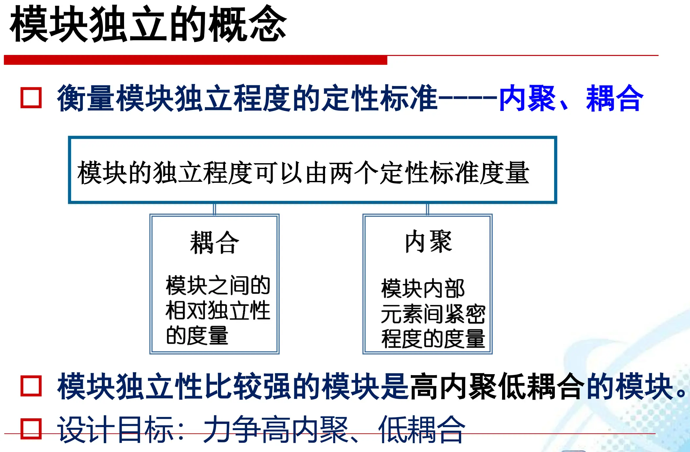

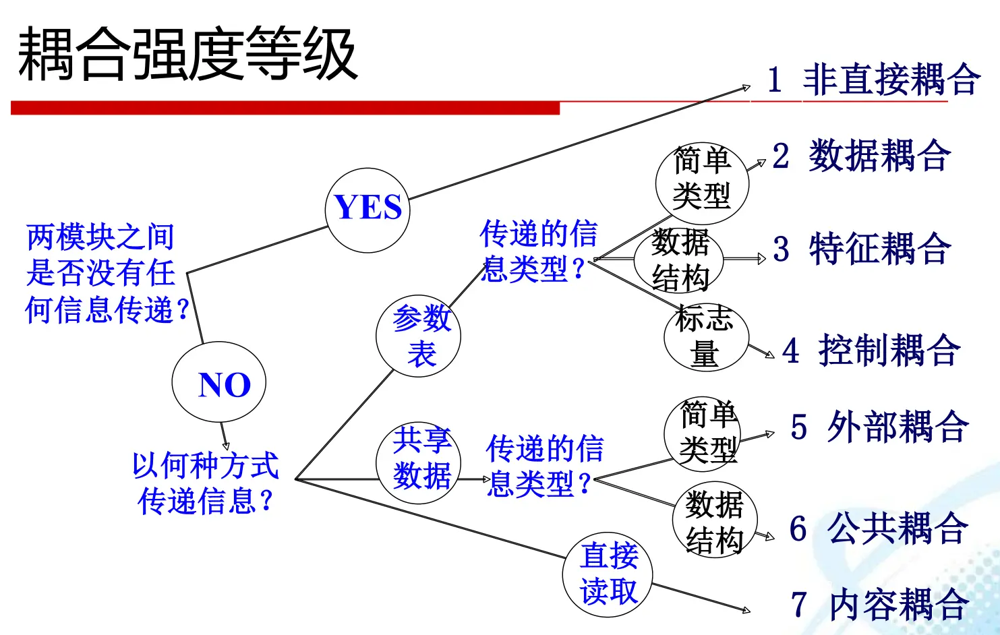

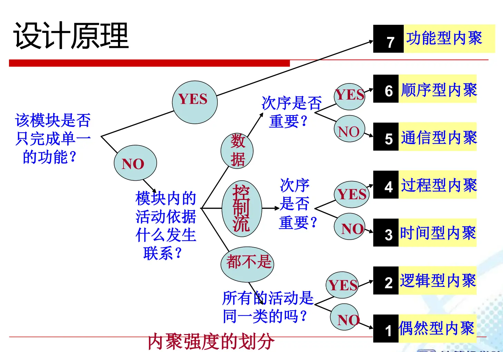

### 软件维护

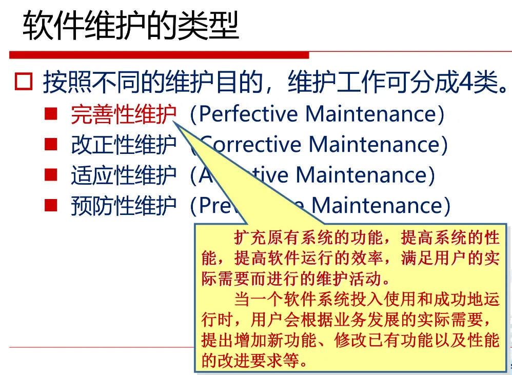

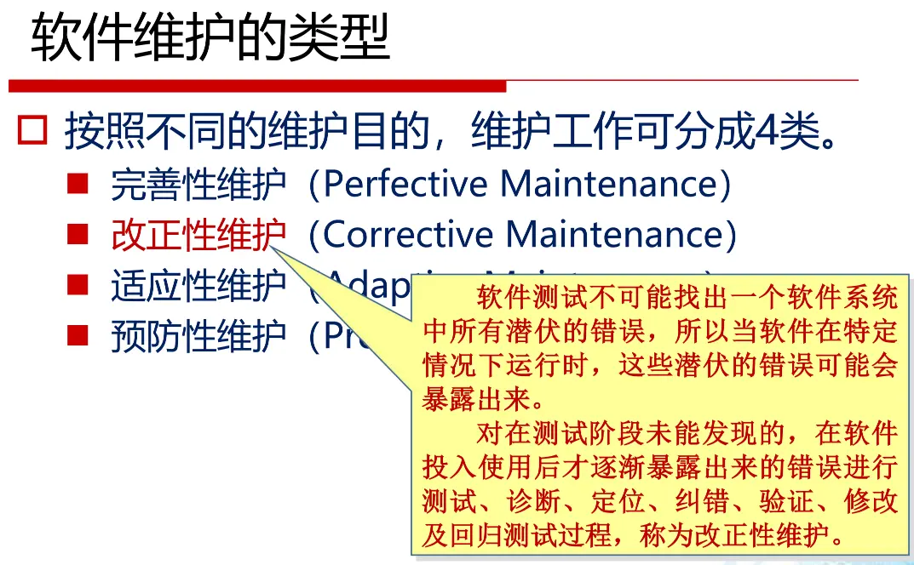

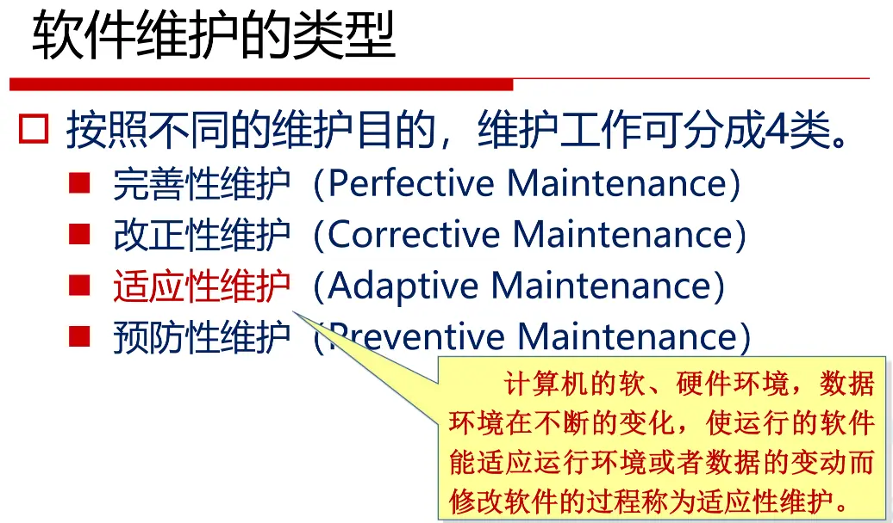

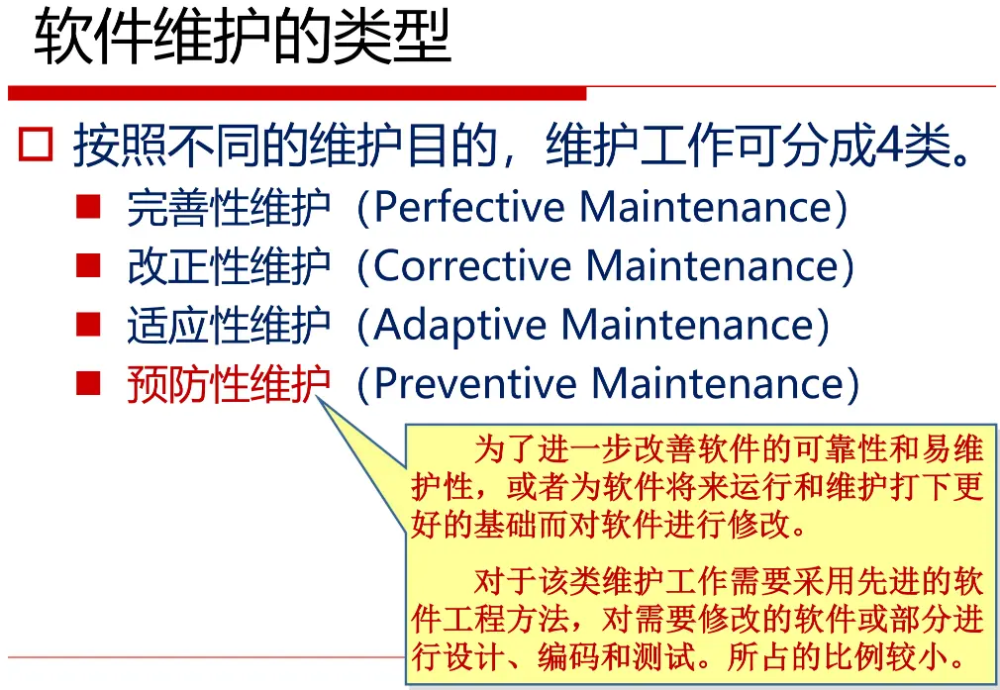

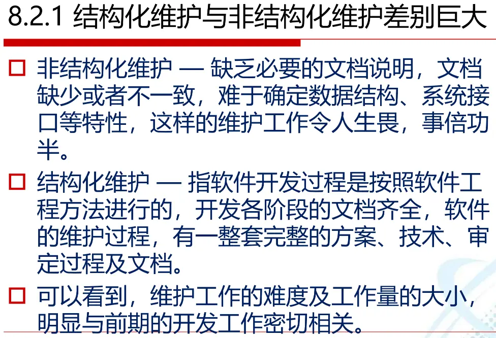

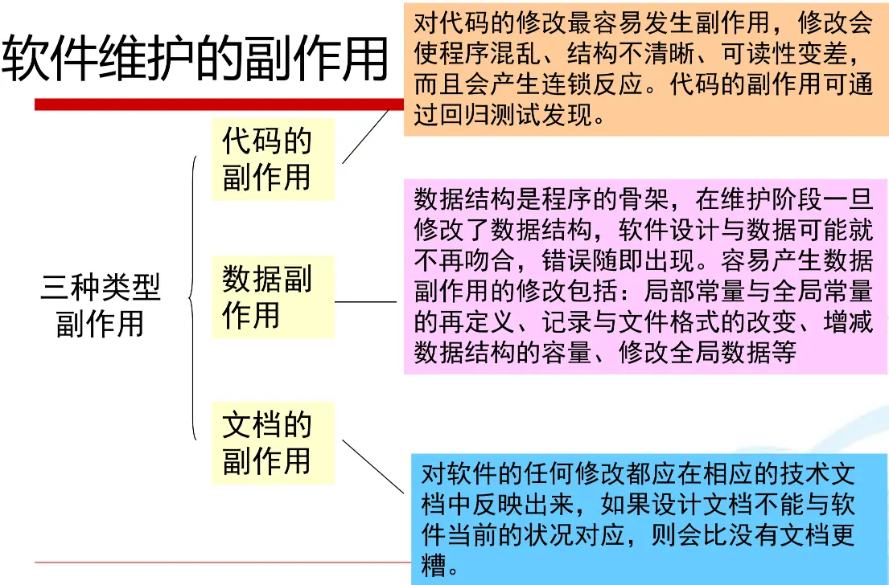

## 重点作业题

### COCOMO模型

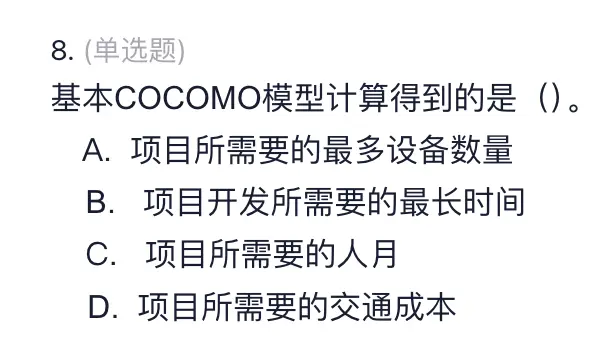

答案：C。基本 COCOMO 模型计算得到的是“项目所需要的人月”，也就是软件开发工作量（Effort, PM）。

COCOMO（Constructive Cost Model，构造性成本模型）是一种用于估算软件项目工作量、开发时间和人员需求的经验模型。它的核心思想是：先根据软件规模估算开发所需工作量，再由工作量进一步推算开发周期和平均人员数。

基本 COCOMO 模型主要根据代码规模 KLOC（千行代码）和项目类型来估算工作量，常见形式为：

$$
E = a \times (KLOC)^b
$$

其中，$E$ 表示开发工作量，单位是人月；$KLOC$ 表示千行代码；$a$ 和 $b$ 是由项目类型决定的经验系数。

COCOMO 中常见的项目类型有三类：

- 组织型：项目规模较小，开发人员经验丰富，需求比较稳定。
- 半独立型：项目规模和复杂度中等，团队经验和约束条件也处于中等水平。
- 嵌入型：项目复杂度高，受硬件、实时性、安全性等强约束影响较大。

基本 COCOMO 模型先求出的是工作量，即“需要多少人月”。例如 10 人月可以理解为 1 个人做 10 个月，或者 5 个人做 2 个月，但实际项目中还要考虑沟通、管理和任务划分，所以不能简单认为增加人数就一定能等比例缩短时间。

本题中，A 选项“最多设备数量”和 D 选项“交通成本”都不是 COCOMO 的估算对象；B 选项“最长时间”也不准确，因为开发时间通常是在估算出人月之后再进一步推导出来的。因此，基本 COCOMO 模型计算得到的是项目所需要的人月，选 C。

### CMM等级

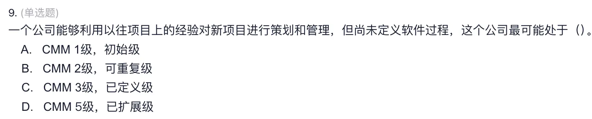

答案：B。该公司最可能处于 CMM 2 级，即可重复级。

CMM（Capability Maturity Model，能力成熟度模型）用于评价软件组织的软件过程成熟度。它关注的不是某一个程序写得好不好，而是整个组织在软件开发、项目管理、质量控制等方面是否形成了稳定、可管理、可改进的过程。

CMM 通常分为五个等级：

- 1 级，初始级：软件过程混乱，项目成功主要依赖个人能力和临时发挥，缺乏稳定的管理方法。
- 2 级，可重复级：组织能够借鉴以往类似项目的经验，对新项目进行基本的计划、跟踪和管理，因此在相似项目中可以重复以前的成功经验。
- 3 级，已定义级：组织已经建立并文档化了标准的软件过程，各项目按照统一的软件过程进行开发和管理。
- 4 级，已管理级：能够使用定量数据度量和控制软件过程，例如用统计方法管理质量和进度。
- 5 级，优化级：能够持续改进软件过程，通过缺陷预防、技术创新和过程优化不断提高开发能力。

题干中的关键信息是“能够利用以往项目上的经验对新项目进行策划和管理”，这说明公司已经具备一定的项目管理能力，不是完全依赖个人发挥的初始级；但题干又说“尚未定义软件过程”，说明它还没有形成组织级、标准化、文档化的软件过程，因此没有达到 CMM 3 级。符合这一特征的是 CMM 2 级可重复级，所以选 B。

### 估算单位

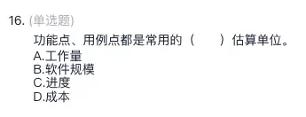

答案：B。功能点、用例点都是常用的软件规模估算单位。

功能点（Function Point, FP）和用例点（Use Case Point, UCP）都是用来描述软件“有多大”的规模度量方法。它们关注的是软件需要实现多少功能、系统边界内外有多少交互、业务复杂度有多高，而不是直接计算需要多少人、花多少钱或做多久。

功能点通常根据输入、输出、查询、内部逻辑文件、外部接口文件等功能数量来估算软件规模；用例点则主要根据用例数量、参与者复杂度、技术因素和环境因素来估算软件规模。二者都常用于项目早期，因为此时可能还没有代码行数，但已经能够根据需求或用例初步判断软件规模。

常见估算对象与单位如下：

| 估算对象 | 常用单位 | 含义 |
| --- | --- | --- |
| 软件规模估算 | 功能点 FP、用例点 UCP、代码行 KLOC | 衡量软件系统的大小或功能数量 |
| 工作量估算 | 人月 PM、人日、人时 | 衡量完成项目需要投入多少人力 |
| 进度估算 | 月、周、天 | 衡量项目开发需要持续多长时间 |
| 成本估算 | 元、万元、美元等货币单位 | 衡量项目需要投入多少经费 |

本题中，功能点和用例点都不是工作量单位，因为工作量通常用人月、人日表示；也不是进度单位，进度通常用时间表示；更不是成本单位，成本通常用金额表示。因此功能点、用例点属于软件规模估算单位，选 B。

### 动态多变量模型与静态单变量模型

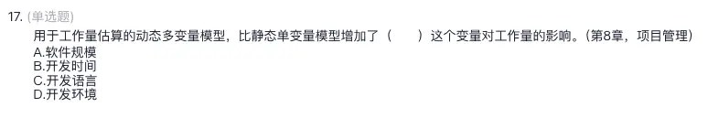

答案：B。动态多变量模型比静态单变量模型增加了“开发时间”这个变量对工作量的影响。

静态单变量模型和动态多变量模型都可以用于软件项目工作量估算，但二者考虑的因素不同：

- 静态单变量模型：
  - 主要根据一个变量估算工作量，最常见的是软件规模。
  - 典型形式可以理解为：软件规模越大，所需工作量越大。
  - 它没有重点考虑开发时间对工作量的影响。

- 动态多变量模型：
  - 不只考虑软件规模，还考虑多个因素对工作量的影响。
  - 其中一个重要变量是开发时间。
  - 开发时间会影响工作量，因为项目周期过短时，需要更多人员并行开发，沟通、协调和管理成本也会上升；项目周期较合理时，工作量安排会更加平稳。

各选项分析如下：

- A 软件规模：软件规模本来就是工作量估算中最基本、最常见的因素，静态单变量模型通常已经考虑它，所以不是“增加”的变量。
- B 开发时间：动态多变量模型会考虑开发时间对工作量的影响，这是相对于静态单变量模型新增的重要因素，所以正确。
- C 开发语言：开发语言可能影响开发效率，但不是本题强调的动态多变量模型相对静态单变量模型增加的核心变量。
- D 开发环境：开发环境也可能影响效率，但不是该模型区别中的关键变量。

因此，本题应选 B。

### Brooks定律

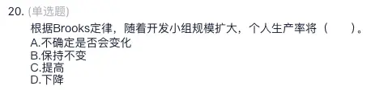

答案：D。根据 Brooks 定律，随着开发小组规模扩大，个人生产率将下降。

Brooks 定律常见表述是：“向已经延期的软件项目中增加人手，只会使项目更加延期。”它强调的是软件开发不是简单的人力叠加问题，团队人数增加以后，沟通、协调、培训和管理成本都会上升，因此每个人的平均生产率可能下降。

可以从以下几个方面理解：

- 沟通成本增加：
  - 团队人数越多，成员之间需要沟通和协调的关系越多。
  - 沟通关系数量大致会随人数平方级增长，而不是线性增长。
  - 因此，更多时间会被用于会议、同步、接口协调，而不是直接开发。

- 新成员需要培训：
  - 新加入的开发人员需要熟悉需求、设计、代码结构和开发规范。
  - 原有成员需要花时间指导新人，这会占用原本的开发时间。
  - 短期内增加人手不一定能提高产出，甚至会降低整体效率。

- 任务不可完全并行：
  - 软件开发中有些任务存在先后依赖，不能简单拆给更多人同时完成。
  - 如果任务之间接口复杂，人数增加还可能带来更多集成问题。

各选项分析如下：

- A 不确定是否会变化：Brooks 定律明确指出团队规模扩大可能导致个人生产率下降，因此不选。
- B 保持不变：忽略了沟通和管理成本增加的影响，因此不选。
- C 提高：这只适合可以高度并行、沟通成本很低的工作，不符合 Brooks 定律对软件项目的判断。
- D 下降：团队规模扩大后，协调成本和培训成本上升，个人平均生产率下降，正确。

因此，本题应选 D。