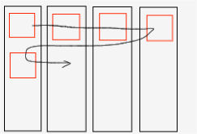
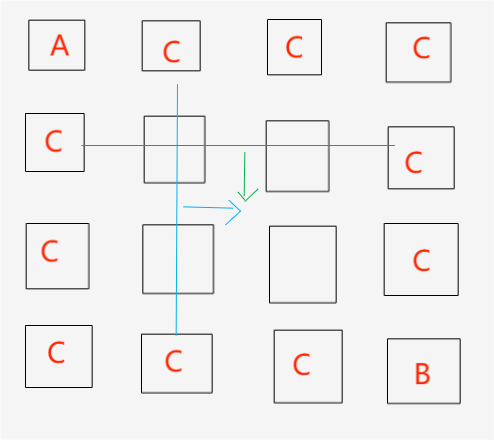

Hello，这篇文章来简单的讲解一下如何用Web实现一个简单的连连看小游戏。

## 前言

我姥姥姥爷平常就喜欢打一些小游戏，像是祖玛、跳棋、小猪都恶狼、毛毛球……一些小游戏，然后我姥姥有一次提出了想玩连连看，于是我就去找了网上这个最经典的一个版本，也是姥姥之前玩过的一个版本。


这个宝可梦连连看属于是对我进行了一波回忆杀了，但它缺陷也是比较明显的。
首先就是它的**窗口不能放大**，我也不知道是我下的这个版本的问题还是什么，总之在尝试多种方式后效果都不好，界面太小。
其次就是它的图片**又小又艳**还都是**像素风**，这别说对我快80岁的姥姥来说，我自己看久了都难受，这肯定不行。
最后就是它有着较为紧张的**时间限制**，我姥姥平常一边看电视一边随手打游戏的习惯与这个时间限制有很大的冲突，这也不行。

随后我就想着去看看其他版本的连连看，却发现要不是垃圾流氓软件，要么是要充值氪金的骗钱网游。

不过有我**程序员**这个身份的加持，我灵光乍现去GitHub找开源小游戏试试。
倒也确实找到了个还不错的[连连看](https://github.com/zhanyuzhang/link-game)
但色彩和时间限制的问题依旧没有解决。

翻来翻去我还是决定去自己写一个，客制化总归是体验最好的。

## 思路

### 游戏界面

连连看这个游戏的主题就是一个矩阵，然后每个格子有不同的标识，用一个**二维数组**来进行存储游戏数据即可，用什么来表示不同的标识不重要，纯色、图形、图片什么都可以。
但我的目标用户是我姥姥，所以我先用不同的纯色搭建了一个矩阵demo给我姥姥试一试，很显然还是太艳了眼睛看着不舒服。
我就开始寻找合适的图片。
找啊找找啊找…………啊！找到了
最后决定采用我姥姥玩过的另一款游戏的图片，也就是毛毛球，我姥姥很爱玩，同时也没说过眼睛看着难受。（我怎么才想到啊啊啊啊啊）


然后将8个颜色的毛球图片抠出来，用1-8来代表不同颜色的毛球。为了方便管理，我将图片的名称也进行了统一的修改。


### 游戏逻辑

最基础的逻辑函数应当包括以下几个：

1. 初始化游戏界面
2. 随机生成游戏数据
3. 处理点击事件
4. 检查是否可以消除
5. 检查是都胜利
6. 重新开始游戏

当然在具体编码时还需要继续细化函数功能适当增删函数。

### 快捷修改

为了更便捷的修改游戏参数，注入矩阵大小，图片大小、种类、间隔等，我们要设置好常量，便于修改。

1. `const ROWS = 10; // 行数`
2. `const COLS = 27; // 列数`
3. `const IMGS_COUNT = 8; // 图片数量`
4. `const BLOCK_SIZE = 60; // 方块大小`

## 编码

### 搭建UI框架

首先我们需要先用HTML搭建一个简单的框架标明重新开始按钮以及游戏界面。

```html
  <button id="restart">新游戏</button>
  <div id="message"></div>
  <div id="game-container"></div>
```

然后我们需要用CSS来美化一下游戏界面，让它看起来更加美观。

```css
    <style>
        /* 声明全局CSS变量 */
        :root {
            --block-size: 60px;
            --gap: 10px;
            --colors-count: 5;
        }

        body {
            display: flex;
            flex-direction: column;
            align-items: center;
            background: #828282;
        }

        #game-container {
            display: grid;
            gap: var(--gap);
            padding: 10px;
            background: #000000;
            border-radius: 5px;
            box-shadow: 0 0 10px rgba(0,0,0,0.1);
            margin: 20px;
        }

        .block {
            width: var(--block-size);
            height: var(--block-size);
            cursor: pointer;
            transition: transform 0.1s;
            background-size: cover; /* 新增：确保图片充满方块 */
            background-position: center;
            background-repeat: no-repeat;
        }

        .block.selected {
            transform: scale(0.8);
            box-shadow: 0 0 20px rgb(255, 255, 255);
        }

        #restart {
            padding: 15px 30px;
            font-size: 18px;
            background: #4CAF50;
            color: white;
            border: none;
            border-radius: 5px;
            cursor: pointer;
            margin: 10px;
        }

        #message {
            font-size: 24px;
            color: #4CAF50;
            height: 30px;
            margin: 10px;
        }
    </style>
```

在CSS中我们使用`:root`伪类来声明全局CSS变量，方便我们在其他地方使用。
[:root伪类](https://developer.mozilla.org/zh-CN/docs/Web/CSS/:root)详情可以参考文档

在这其中三个ID选择器都有着明确的指向，`#game-container`指向游戏界面，`#restart`指向重新开始按钮，`#message`指向游戏信息。
而两个类选择器则是指向将在接下来的JS里动态生成的方块。而每个方块被选中时就会有特殊标识，所以我们需要提前写好一个被选中时的样式，`.block.selected`。

### 编写游戏逻辑

#### 变量定义

首先我们需要定义好常量和全局变量。

```js
    // 常量配置
    const ROWS = 10; // 行数
    const COLS = 27; // 列数
    const IMGS_COUNT = 8; // 图片数量
    const BLOCK_SIZE = 60; // 方块大小
    // 全局变量
    let gameData = []; // 游戏数据，二维数组, 0-8
    let selectedBlocks = []; // 已选择的方块,对象数组，包含行列值
    let isProcessing = false;// 这里的isProcessing变量用于防止用户在处理匹配过程中再次点击方块
```

`isProcessing`是一个很重要的标志变量，虽然在这个项目中只是一些很简单的小体量计算，可能体现不太出来，毕竟以现在的电脑性能来说，这个项目的加载过程人类还是难以感知的。
但这是一个很重要的思想，如果在大型的项目或是复杂的计算中，这个变量就显得尤为重要了，用户连续的点击操作可能会导致程序崩溃，多线程可能陷入死锁。
而`isProcessing`变量阻塞了用户的操作，直到处理完匹配过程才允许用户再次点击。

#### 初始化游戏界面

首先我们需要用JS来初始化游戏界面，首先是生成游戏数据，然后是绘制游戏界面。

##### 生成游戏数据

首先对于生成游戏数据我们涉及的常量和全局变量主要有以下几个：

1. `ROWS`：行数
2. `COLS`：列数
3. `IMGS_COUNT`：图片数量
4. `gameData`：游戏数据，二维数组, 0-8

我们需要用一个**二维数组**来存储游戏数据，每个元素代表一个方块，每个方块有一个值，这个值代表方块的图片。

直接生成随机二维数组很显然是不行的，因为我们需要保证每个方块的图片数量是**偶数**，否则就会出现**无法消除**的情况。
所以我选择先计算出方块格数，然后选生成一个一维数组长度是**总格数的一半**，然后再复制一份，最后合起来打乱顺序映射到二维数组即可。

```js
    // 开始新游戏，生成游戏数据
    function generateMatrix() {
        const totalBlocks = ROWS * COLS;
        // 改为8种图片的配对
        const picPairs = Array.from(
            { length: totalBlocks / 2 },
            (_, i) => (i % IMGS_COUNT) + 1 // 生成1-8的编号，1234567812345678……
        ).flatMap(pic => [pic, pic]);// 这里的flatMap方法用于将数组中的每个元素映射为一个新的数组，然后将所有新数组中的元素合并为一个新数组
        // 确保配对数量为偶数
        
        const shuffled = [...picPairs].sort(() => Math.random() - 0.5);// ...用于对数组进行浅拷贝得到新数组防止原数据被修改
        gameData = Array.from({ length: ROWS }, (_, i) => 
            shuffled.slice(i * COLS, (i + 1) * COLS)// 这里的slice方法用于截取数组中的一部分，这里的(i + 1) * COLS用于计算数组的结束位置
            // 将一维数组转换为二维数组
        );
    }
```

我们来看一看这段代码的具体实现过程
首先我们先计算出了矩阵的方格总数`totalBlocks`。
随后我调用了JS的内置函数`Array.from`来生成一个长度为`totalBlocks / 2`的数组。
该函数的第二个参数为 **箭头函数** ，该函数的第一个参数为 **当前元素** ，这里没有用到就用了占位符，第二个参数为 **当前索引** 。
用当前索引对当前图片数取余就可以获得 **[0, IMGS_COUNT-1]** 的随机数，然后加1就可以获得 **[1, IMGS_COUNT]**的随机数。

然后我们使用了JS的内置函数`flatMap`来将数组中的 **每个元素** 映射为一个 **新的数组** ，然后将所有新数组中的元素**合并**为一个新数组。
将新生成的数组定义为`[pic, pic]`就代表将当前元素复制一份。这样就能保证每个元素的数量是偶数。

在获得了原始数据后就需要对其进行打乱，这里我使用了JS的内置函数`sort`来对数组进行排序。
`sort`函数排序的依据是返回值与零的比较，正负以及相等三种情况，而随机数函数生成的是`[0,1)`区间的小数，减去0.5就可以得到`[-0.5, 0.5)`区间的小数。
所以我们可以用这个随机数来对数组进行排序，这样就可以保证数组的顺序是**随机**的。

最后我们再次使用了JS的内置函数`Array.from`来将一维数组转换为二维数组。
二维数组的本质就是n个一维数组组成的数组。所以可以利用`slice`内置函数来截取一行长度的一维数组，然后将其作为二维数组的一个元素。
`slice`函数的第一个参数为 **起始位置** ，第二个参数为 **结束位置** 。
这里的`(i + 1) * COLS`就是计算数组的结束位置，因为数组的索引是从0开始的，所以我们需要将`i`加1。

##### 绘制游戏界面

在获取了原始数组之后就需要将数据和图片一一对应进行映射。

```js
    // 绘制游戏面板
    function drawBoard() {
        const container = document.getElementById('game-container');
        container.style.gridTemplateColumns = `repeat(${COLS}, ${BLOCK_SIZE}px)`;
        
        container.innerHTML = '';
        gameData.forEach((row, i) => {
            row.forEach((picNum, j) => { // 变量名color改为picNum
                const block = document.createElement('div');
                block.className = 'block';
                // 修改为背景图片路径（假设图片在相同目录）
                block.style.backgroundImage = `url(imgs/${picNum}.jpg)`; 
                block.dataset.row = i;// 这里的dataset属性用于获取元素的数据集，这里的row属性用于获取元素的行号
                block.dataset.col = j;// 这里的col属性用于获取元素的列号
                block.addEventListener('click', handleBlockClick);
                container.appendChild(block); // 这里的appendChild方法用于将元素添加到指定的父元素中
            });
        });
    }
```

首先我现在预留好的游戏界面中利用`repeat(${COLS}, ${BLOCK_SIZE}px)`初始化了`grid`网格式布局的列数。
`repeat`是一个CSS函数，用于重复指定的列轨道模式。
`${COLS}`这是一个JavaScript模板字符串的占位符，它会被`COLS`常量的值替换，表示**网格的列数**。
`${BLOCK_SIZE}px`同样是一个占位符，会被`BLOCK_SIZE`常量的值替换，表示每个网格**单元格的宽度**，单位是**像素**。
随后清除了游戏界面中的所有元素以便添加单元格。



就像上面的示意图一样，先分出列，再像列中依次添加单元格。

添加单元格的操作就只是简单的遍历二位数组，将游戏数据包装进一个`div`元素中，然后添加到游戏界面中。并添加点击事件监听器`click`，处理函数为`handleBlockClick`。

#### 处理点击事件

对于点击事件的处理主要分为以下几点：

1. 判断是否正在处理匹配过程中，如果是则直接返回
2. 获取点击的对象的行列信息
3. 判断点击的方块是否为已消除方块
4. 将方块设置为已选择列表，并添加类名`selected`
5. 判断是否有两个方块被选中，如果是则检查是否可以消除
6. 如果可以消除，则消除方块，并更新游戏数据
7. 如果不能消除，则取消方块的选中状态

```js
    // 处理方块点击
    function handleBlockClick(e) {
        if (isProcessing) return;// 这里的isProcessing变量用于防止用户在处理匹配过程中再次点击方块
        
        const block = e.target;// 这里的target属性用于获取事件的目标元素
        const row = parseInt(block.dataset.row);
        const col = parseInt(block.dataset.col);
        
        if (block.style.backgroundImage === 'none') return; // 这里的backgroundImage属性用于获取元素的背景图片路径
        
        block.classList.add('selected');
        selectedBlocks.push({ row, col, element: block });

        if (selectedBlocks.length === 2) {//当选择了两个方块时
            checkMatch();// 检查是否匹配
            selectedBlocks.forEach(b => b.element.classList.remove('selected'));// 这里的classList属性用于获取元素的类名列表
            selectedBlocks = [];//清空数组
        }
    }
```

#### 检查是否可以消除

针对于是否可以消除主要判断的是两点，一个是两个方块的编号是否相同，另一个是两个方块之间的路径是否可以连接。
第一点的检查很简单，直接获取坐标，在`gameData`中获取对应的值，然后判断是否相同即可。
而第二点的话我得分类讨论。

```js
    // 检查匹配
    function checkMatch() {
        // [a,b]是数组解构赋值，a和b分别是数组中的两个元素
        const [a, b] = selectedBlocks;
        // 排除图片不同的情况
        if (gameData[a.row][a.col] !== gameData[b.row][b.col]) return;
        // 检查是否存在合法路径
        if (checkPath(a, b)) {
            removeBlocks(a, b);
            checkWin();
        }
    }
```

##### 直线链接

对于直线链接比较简单，只有横竖两种情况。

首先我们先判断两个方块是否在**同一行同一列**，来判断是否为直线链接。
然后再遍历两者中间的格子是否都是**已消除**的方块。

```js
    // 直线检测
    function checkStraightLine(a, b) {
        // 水平直线
        if (a.row === b.row) {
            const minCol = Math.min(a.col, b.col);
            const maxCol = Math.max(a.col, b.col);
            // 检查路径上是否有其他未消除方块阻隔
            for (let col = minCol + 1; col < maxCol; col++) {
                if (gameData[a.row][col] !== 0) return false;
            }
            return true;
        }
    
        // 垂直直线
        if (a.col === b.col) {
            const minRow = Math.min(a.row, b.row);
            const maxRow = Math.max(a.row, b.row);
            for (let row = minRow + 1; row < maxRow; row++) {
                if (gameData[row][a.col] !== 0) return false;
            }
            return true;
        }
    
        return false;
    }
```

##### 单折线链接

针对于折线来说我们主要是要寻找可能的**拐点**。

对于单折线，可能的拐点有两个，一种是与**A同行**与**B同列**，另一种是与**A同列**与**B同行**。
分别判断拐点本身以及对应的两条路径上是否否是已消除的方块。

```js
    // 单折线检测
    function checkOneCorner(a, b) {
        // 潜在拐点1：(a.row, b.col)
        const corner1 = { row: a.row, col: b.col };
        // 排除拐点本身是未消除方块的情况
        if (gameData[corner1.row][corner1.col] === 0) {
            // 检查路径上是否有其他未消除方块阻隔
            if (checkStraightLine(a, corner1) && checkStraightLine(corner1, b)) {
                return true;
            }
        }
    
        // 潜在拐点2：(b.row, a.col)
        const corner2 = { row: b.row, col: a.col };
        if (gameData[corner2.row][corner2.col] === 0) {
            if (checkStraightLine(a, corner2) && checkStraightLine(corner2, b)) {
                return true;
            }
        }
    
        return false;
    }
```

##### 双折线链接

对于双折线来说，可能的拐点可太多了，我就不一一列举了，但要找这其中的规律。

两个拐点一定是**同行**或**同列**，且两个拐点一定分别与AB**同列**或**同行**。
所以我们就可以一行一行或一列一列的扫描寻找是否有符合条件的两个拐点，寻找过程可一参考如下示意图：



```js
    // 双折线检测
    function checkTwoCorners(a, b) {
        // 水平扩展检测
        // 沿水平方向逐列向右扫描
        for (let col = 0; col < COLS; col++) {
            const corner1 = { row: a.row, col };
            const corner2 = { row: b.row, col };
            // 寻找两个同列拐点，本身为空，且不与ab或重合，且路径上无其他方块
            if (col !== a.col && gameData[a.row][col] === 0 && 
                gameData[b.row][col]===0 &&
                checkStraightLine(a, corner1) &&
                checkStraightLine(corner1,corner2) &&
                checkStraightLine(corner2, b)
            ) {
                return true;
            }
        }
        
        // 如果水平扩展没有找到，再进行垂直扩展
        // 垂直扩展检测
        // 沿垂直方向逐行向下扫描
        for (let row = 0; row < ROWS; row++) {
            const corner1 = { row, col: a.col };
            const corner2 = { row, col: b.col };
            // 寻找两个同行拐点，本身为空，且不与a或b重合，且路径上无其他方块
            if (row !== a.row && gameData[row][acol] === 0 && 
                gameData[row][b.col] === 0 &&
                checkStraightLine(a, corner1) &&
                checkStraightLine(corner1,corner2) &&
                checkStraightLine(corner2, b)
            ) {
                return true;
            }
        }
    
        return false;
    }
```

#### 消除方块

消除方块的话就很简单了，直接将两个方块的编号置为0即可。

```js
// 移除方块
function removeBlocks(...blocks) {
    isProcessing = true;
    blocks.forEach(b => {
        gameData[b.row][b.col] = 0;
        b.element.style.backgroundImage = 'none'; // 改为移除图片
    });
    setTimeout(() => {
        isProcessing = false;
    }, 200);
}
```

#### 检查是否胜利

检查胜利的话就需要遍历整个游戏数据，判断是否还有方块没有被消除。

```js
// 检查胜利条件
function checkWin() {
    if (gameData.flat().every(cell => cell === 0)) {
        showMessage('挑战成功！');
        setTimeout(initGame, 1500);
    }
}
// 显示提示信息
function showMessage(text) {
    const msg = document.getElementById('message');
    msg.textContent = text;
    setTimeout(() => msg.textContent = '', 1500);
}
```

这里用到了`flat`方法，`flat`方法用于将数组中的所有子数组连接起来，生成一个新的数组。
`every`方法用于检测数组中的所有元素是否都符合指定的条件。
这里的条件就是判断数组中的所有元素是否都等于0。
如果都等于0，则返回true，否则返回false。

#### 重新开始游戏

重新开始游戏的话就只需要调用`initGame`函数即可。

```js
document.getElementById('restart').addEventListener('click', initGame);
// 初始化游戏
function initGame() {
    generateMatrix();
    drawBoard();
}
```

#### 启动游戏

在整个js文件的最后我们直接调用`initGame`函数来启动游戏。

## 总结

OK！写完啦，姥姥很喜欢！这就够啦！

下次再见，拜拜~~:)
