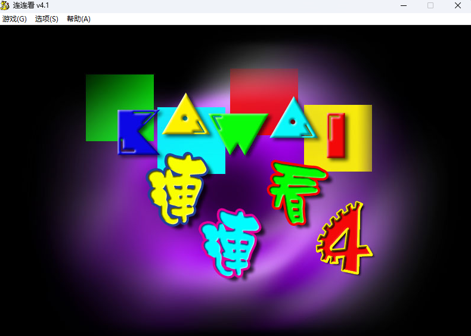
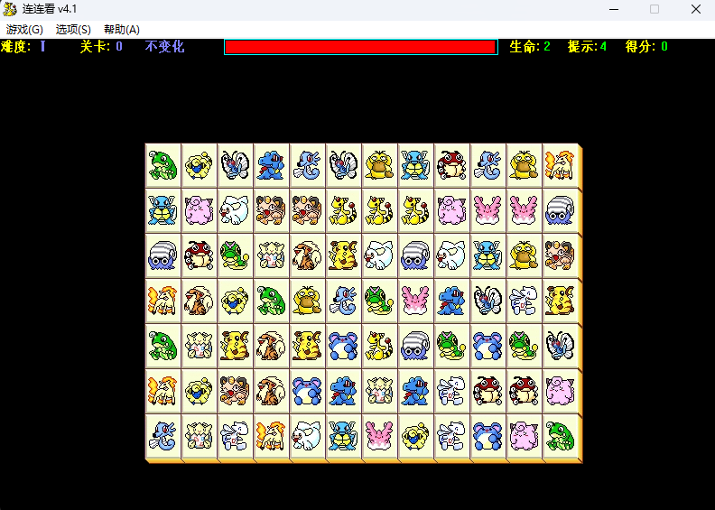

Hello，这篇文章来简单的讲解一下如何用Web实现一个简单的连连看小游戏。

## 前言

我姥姥姥爷平常就喜欢打一些小游戏，像是祖玛、跳棋、小猪都恶狼、毛毛球……一些小游戏，然后我姥姥有一次提出了想玩连连看，于是我就去找了网上这个最经典的一个版本，也是姥姥之前玩过的一个版本。

这个宝可梦连连看属于是对我进行了一波回忆杀了，但它缺陷也是比较明显的。
首先就是它的**窗口不能放大**，我也不知道是我下的这个版本的问题还是什么，总之在尝试多种方式后效果都不好，界面太小。
其次就是它的图片**又小又艳**还都是**像素风**，这别说对我快80岁的姥姥来说，我自己看久了都难受，这肯定不行。
最后就是它有着较为紧张的**时间限制**，我姥姥平常一边看电视一边随手打游戏的习惯与这个时间限制有很大的冲突，这也不行。

随后我就想着去看看其他版本的连连看，却发现要不是垃圾流氓软件，要么是要充值氪金的骗钱网游。

不过有我**程序员**这个身份的加持，我灵光乍现去GitHub找开源小游戏试试。
