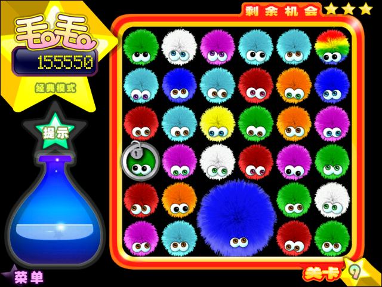
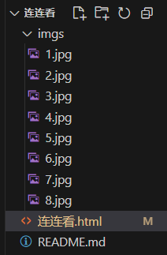

Hello，这篇文章来简单的讲解一下如何用Web实现一个简单的连连看小游戏。

## 前言

我姥姥姥爷平常就喜欢打一些小游戏，像是祖玛、跳棋、小猪都恶狼、毛毛球……一些小游戏，然后我姥姥有一次提出了想玩连连看，于是我就去找了网上这个最经典的一个版本，也是姥姥之前玩过的一个版本。

这个宝可梦连连看属于是对我进行了一波回忆杀了，但它缺陷也是比较明显的。
首先就是它的**窗口不能放大**，我也不知道是我下的这个版本的问题还是什么，总之在尝试多种方式后效果都不好，界面太小。
其次就是它的图片**又小又艳**还都是**像素风**，这别说对我快80岁的姥姥来说，我自己看久了都难受，这肯定不行。
最后就是它有着较为紧张的**时间限制**，我姥姥平常一边看电视一边随手打游戏的习惯与这个时间限制有很大的冲突，这也不行。

随后我就想着去看看其他版本的连连看，却发现要不是垃圾流氓软件，要么是要充值氪金的骗钱网游。

不过有我**程序员**这个身份的加持，我灵光乍现去GitHub找开源小游戏试试。
倒也确实找到了个还不错的[连连看](https://github.com/zhanyuzhang/link-game)
但色彩和时间限制的问题依旧没有解决。

翻来翻去我还是决定去自己写一个，客制化总归是体验最好的。

## 思路

### 游戏界面

连连看这个游戏的主题就是一个矩阵，然后每个格子有不同的标识，用一个**二维数组**来进行存储游戏数据即可，用什么来表示不同的标识不重要，纯色、图形、图片什么都可以。
但我的目标用户是我姥姥，所以我先用不同的纯色搭建了一个矩阵demo给我姥姥试一试，很显然还是太艳了眼睛看着不舒服。
我就开始寻找合适的图片。
找啊找找啊找…………啊！找到了
最后决定采用我姥姥玩过的另一款游戏的图片，也就是毛毛球，我姥姥很爱玩，同时也没说过眼睛看着难受。（我怎么才想到啊啊啊啊啊）

然后将8个颜色的毛球图片抠出来，用1-8来代表不同颜色的毛球。为了方便管理，我将图片的名称也进行了统一的修改。

### 游戏逻辑

最基础的逻辑函数应当包括以下几个：

1. 初始化游戏界面
2. 随机生成游戏数据
3. 处理点击事件
4. 检查是否可以消除
5. 检查是都胜利
6. 重新开始游戏

当然在具体编码时还需要继续细化函数功能适当增删函数。

### 快捷修改

为了更便捷的修改游戏参数，注入矩阵大小，图片大小、种类、间隔等，我们要设置好常量，便于修改。
