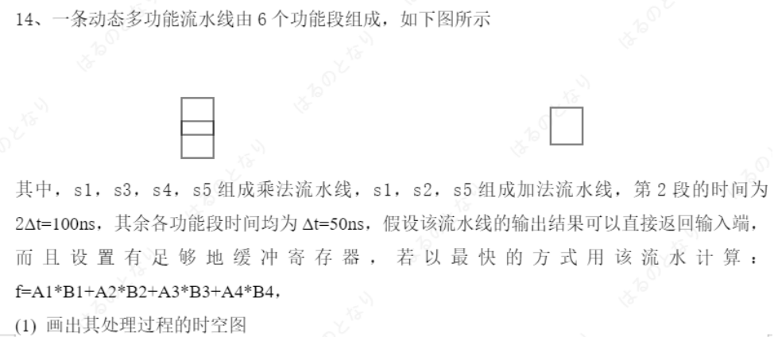
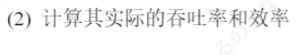

## 22-23真题解析

### 选择

#### RISC与CISC的区别

**答案：C**

- **选项A错误**：RISC指令条数少只是表面特征，并非速度快的根本原因。实际上，完成相同功能，RISC通常需要更多条指令（因为单条指令功能简单）。
- **选项B错误**：RISC的目标程序通常更长，而非更短。因为复杂操作需要多条简单指令组合实现，这是RISC将硬件复杂性转移给编译器的体现。
- **选项C正确**：根据计算机性能公式：**程序执行时间 = 指令数 × CPI（每条指令平均时钟周期数） × 时钟周期时间**。RISC的核心优势在于**CPI极低**（绝大多数指令单周期执行），虽然指令数可能比CISC多，但CPI的大幅降低带来了整体执行速度的提升。
- **选项D错误**："只允许load和store指令访存"是RISC的重要设计特点（加载-存储架构），但它是**导致CPI较低的原因之一**，而非RISC速度更快的直接、根本原因。

#### 计算机系统结构创新与摩尔定律

**答案：D**

- **选项A错误**：器件更新换代（摩尔定律）是过去几十年计算机性能提升的主要动力，但目前晶体管尺寸已接近物理极限，摩尔定律显著放缓，单纯依靠工艺进步带来的性能提升越来越有限。
- **选项B错误**：软件发展可以优化程序执行效率，但它是在硬件基础上的改进，无法从根本上突破硬件架构的性能瓶颈。
- **选项C错误**：操作系统更新主要提升系统的兼容性、安全性和资源管理效率，对整体计算性能的提升幅度有限，不是核心推动力。
- **选项D正确**：在摩尔定律失效的背景下，**计算机系统结构的创新**已成为未来性能提升的主要途径，包括多核架构、异构计算、专用加速器（GPU/TPU/NPU）、RISC架构、3D堆叠、存算一体等技术，这些都属于系统结构层面的突破。

#### 并行性的三大基本技术途径

**答案：D**

提高计算机系统并行性的**三大基本技术途径**是：

- **A. 时间重叠**：让多个任务在时间上重叠执行，典型代表是**流水线技术**，属于时间维度的并行。
- **B. 资源共享**：多个任务分时共享同一套硬件资源，典型代表是**多道程序、分时系统**，通过软件调度实现宏观上的并行。
- **C. 资源重复**：通过重复设置硬件资源来实现并行，典型代表是**多核CPU、多处理器系统、阵列处理机**，属于空间维度的并行。

**D. 专用硬件加速**：这是一种性能优化手段（如GPU、TPU、NPU等），通过定制硬件加速特定任务，但它**不属于提高并行性的基本技术途径**，而是并行技术在特定领域的应用实现。

#### 兼容原则

**答案：C**

系列机软件兼容性的核心原则如下：

- **向后兼容（必须做到）**：新机型能够运行旧机型上的所有软件。这是系列机最基本的要求，目的是保护用户已有的软件投资，确保用户升级硬件后原有业务不受影响。
- **向前兼容（一般不要求）**：旧机型能够运行新机型上的软件。这通常无法实现，因为新软件会利用新硬件的新增指令和特性，旧硬件不具备这些能力。
- **向上兼容（力争做到）**：同系列低档机型的软件能够在高档机型上正常运行。这是系列机设计的重要目标，方便用户从低档机平滑升级到高档机，获得更好的性能。
- **向下兼容（一般不要求）**：高档机型的软件能够在低档机型上运行。这通常无法实现，因为高档机软件可能依赖只有高档机才具备的硬件资源和性能。

因此，系列机软件应做到**向后兼容（硬性要求），力争向上兼容（优化目标）**。

#### Flynn计算机分类方法与多处理机

**答案：D**

弗林（Flynn）分类法是根据计算机系统中**指令流**和**数据流**的并行性程度进行分类，多处理机的归属如下：

| 类别 | 名称 | 描述 | 典型代表/地位 |
|------|------|------|--------------|
| **SISD** | 单指令流单数据流 | 传统的单核串行计算机，同一时刻只能执行一条指令、处理一个数据。 | 早期串行计算机 |
| **SIMD** | 单指令流多数据流 | 同一时刻执行同一条指令，但同时处理多个不同的数据。 | GPU、向量处理器、阵列处理机 |
| **MISD** | 多指令流单数据流 | 多条不同的指令同时处理同一个数据，这种结构在实际中几乎没有应用，仅存在于理论研究。 | 仅理论研究 |
| **MIMD** | 多指令流多数据流 | 多个处理器同时执行不同的指令流，处理不同的数据流。**多处理机系统（包括多核CPU、多处理器服务器、计算机集群）都属于这一类别**。 | 目前主流的并行计算机结构 |

### 判断

#### 性能判断标准

**答案：正确（√）**

对于特定程序，**执行时间**是衡量计算机系统性能最直接、最可靠的标准。它直接反映了计算机完成该任务的实际快慢，符合"完成相同工作，时间越短性能越高"的基本性能定义。

主频、MIPS、CPI等都是间接性能指标，存在明显局限性：

- 主频高不代表实际执行速度快（不同架构的指令效率不同）
- MIPS无法比较不同指令集架构的性能
- CPI需要结合指令数和时钟周期才能计算实际性能

| 指标 | 英文全称 | 含义 | 说明 |
|------|----------|------|------|
| **CPI** | Cycles Per Instruction | 每条指令平均时钟周期数 | RISC的核心优势在于CPI极低，绝大多数指令单周期执行 |
| **程序执行时间** | Program Execution Time | 完成程序所需的实际时间 | 衡量性能最直接、最可靠的标准 |
| **主频** | Clock Frequency | CPU的时钟频率 | 高主频不代表实际执行速度快（不同架构指令效率不同） |
| **MIPS** | Million Instructions Per Second | 每秒执行百万条指令数 | 无法比较不同指令集架构的性能 |
| **时钟周期时间** | Clock Cycle Time | 一个时钟周期的时间长度 | 与主频互为倒数，用于性能公式计算 |

##### 性能计算公式

$$
T_{exec} = N_{instr} \times CPI \times T_{clk}
$$

其中各符号含义如下：

- **T_exec**：程序执行时间（Execution Time）
- **N_instr**：指令数（Instruction Count）
- **CPI**：每条指令平均时钟周期数（Cycles Per Instruction）
- **T_clk**：时钟周期时间（Clock Cycle Time）

#### 软件硬件接口

**答案：错误（×）**

计算机系统中，**软件和硬件的真正接口是指令集架构（ISA）**，而非操作系统：

- **指令集架构（ISA）**：定义了硬件能够识别和执行的指令集合、寄存器、寻址方式等，是硬件设计的依据，也是所有软件（包括操作系统）最终编译执行的基础。
- **操作系统**：是运行在ISA之上的系统软件，它是**用户与计算机硬件之间的接口**，为上层应用程序提供了进程管理、内存管理、文件系统等高级抽象服务，但它本身也是软件的一部分。

#### 主存 - 辅存 与 主存 - cache

**答案：正确（√）**

计算机存储系统采用层次化设计，不同层次解决不同的问题：

- **"主存-辅存"层次（虚拟存储系统）**：辅存（硬盘、SSD等）具有容量大、价格低的特点，但访问速度远慢于主存。该层次通过虚拟存储技术，将主存和辅存统一编址，为用户提供一个容量接近辅存、速度接近主存的虚拟地址空间，**核心目的是弥补主存容量的不足**。
- **"Cache-主存"层次（高速缓冲存储系统）**：Cache（高速缓存）速度接近CPU，但容量小、价格高。该层次利用程序的局部性原理，将CPU近期可能频繁访问的数据和指令从主存复制到Cache中，**核心目的是弥补主存速度（性能）的不足**，解决CPU与主存之间的速度不匹配问题。

#### 摩尔定律内容

**答案：错误（×）**


摩尔定律的**原始且核心表述**是：**集成电路上可容纳的，约每隔18-24个月便会增加一倍**，同时芯片的也将提升一倍或降低一半。


题目中的说法是对摩尔定律的常见误解：

- 时钟频率的提升只是早期晶体管数量增加带来的结果之一，并非摩尔定律本身的内容
- 大约从2005年开始，由于功耗和散热的物理限制，单芯片的时钟频率提升已经基本停滞
- 现代处理器主要通过增加核心数量、改进架构和采用异构计算来提升性能，而非单纯提高时钟频率

#### 集群

**答案：错误（×）**

计算机集群的定义是**一组通过网络连接的计算机，在集群软件的统一管理和调度下协同工作，对外表现为一个单一的系统**。

仅仅将N台服务器通过网络物理连接起来，**并不能构成集群**。真正的集群还必须具备以下核心要素：

- 集群管理软件：负责节点发现、状态监控和资源管理
- 任务调度系统：能够将任务分配到不同的服务器节点上执行
- 协同工作机制：节点之间可以通信、数据共享和负载均衡
- 高可用机制：当部分节点故障时，任务可以自动转移到其他节点

没有这些软件层面的支持，这些服务器只是相互独立的个体，无法协同完成任务，也就不能称为集群系统。

**常见集群实例**：

- **Redis 哨兵（Sentinel）模式**：多个 Redis 节点组成集群，哨兵进程监控主从节点状态，当主节点故障时自动完成故障转移，保证服务的高可用性。
- **Nginx 负载均衡**：Nginx 作为反向代理，将客户端请求分发到后端多台服务器，实现流量分摊和故障自动剔除，对外表现为单一入口。
- **Kubernetes 容器集群**：通过 Master 节点统一管理多个 Worker 节点，自动调度容器、实现服务发现和弹性伸缩。
- **Hadoop 分布式集群**：HDFS 将数据分散存储在多个 DataNode 上，YARN 统一调度计算任务到各节点执行，实现大规模数据的分布式处理。

### 计算题

#### CPI、MIPS 与执行时间计算

**题目：** 假定用一台 **200 MHz** 处理器执行标准测试程序，该程序含有整数运算、数据传送、浮点运算和控制传送等指令，各类指令的数量和所需时钟周期数如下：

| 指令类型 | 指令数 | 时钟周期数 |
| :------: | :----: | :--------: |
| 整数运算 |  5500  |     1      |
| 数据传送 |  4000  |     2      |
| 浮点运算 |  1200  |     3      |
| 控制传送 |  1000  |     2      |

**请计算：**

1. CPU 执行该程序的 **CPI**
2. CPU 执行该程序的 **MIPS**
3. 该程序的 **CPU 执行时间**（单位：微秒）

**解答：**

在动手计算之前，先理清三个指标的含义和它们之间的关系：

**什么是 MIPS？**

MIPS 是 **Million Instructions Per Second** 的缩写，意为"**每秒执行百万条指令数**"，是衡量 CPU 运算速度的一个经典性能指标。

它的核心思想很简单：同样运行一秒钟，能执行更多指令的 CPU 当然更快。计算公式为：

$$
\text{MIPS} = \frac{\text{指令数}}{\text{执行时间} \times 10^6}
$$

也可以直接用主频和 CPI 推导：

$$
\text{MIPS} = \frac{\text{主频}}{\text{CPI} \times 10^6}
$$

> **为什么除以 10⁶？** 因为 1 MHz = 10⁶ Hz，除以 10⁶ 就把结果换算成了"百万条"的单位。例如主频 200 MHz，如果 CPI = 1，那理想情况下每秒能执行 200 × 10⁶ 条指令，即 **200 MIPS**。

**但要注意**：MIPS 是一个"不太靠谱"的性能指标。不同指令集架构（ISA）的指令复杂度差异很大——一条 x86 的复杂指令可能顶得上好几条 RISC 的简单指令。所以 **MIPS 只适合在同架构、同指令集的 CPU 之间比较**，跨架构比较会失真。这也是为什么现代评测更倾向用 SPEC 等真实程序基准测试，而不是单纯看 MIPS。

三个指标的关系脉络：

- **CPI** → 反映"每条指令要吃掉多少个时钟周期"（由程序指令 mix 和 CPU 微架构决定）
- **主频** → 反映"每秒钟有多少个时钟周期"（由 CPU 制造工艺决定）
- **MIPS** → 由前两者共同决定：主频越高、CPI 越低，MIPS 就越高
- **执行时间** → 最终的实际耗时，是衡量性能最直观、最可靠的指标

---

首先，计算总指令数和总时钟周期数：

$$
\text{总指令数} = 5500 + 4000 + 1200 + 1000 = 11700
$$

$$
\text{总时钟周期数} = 5500 \times 1 + 4000 \times 2 + 1200 \times 3 + 1000 \times 2 = 19100
$$

##### (1) CPI（每条指令平均时钟周期数）

$$
\text{CPI} = \frac{\text{总时钟周期数}}{\text{总指令数}} = \frac{19100}{11700} = \frac{191}{117} \approx 1.63
$$

##### (2) MIPS（每秒执行百万条指令数）

$$
\text{MIPS} = \frac{\text{主频}}{\text{CPI} \times 10^6} = \frac{200 \times 10^6}{1.6325 \times 10^6} = \frac{200}{1.6325} \approx 122.51
$$

##### (3) CPU 执行时间

$$
T = \frac{\text{总时钟周期数}}{\text{主频}} = \frac{19100}{200 \times 10^6} = 9.55 \times 10^{-5} \text{ s} = 95.5 \text{ μs}
$$

**答案：**

- (1) **CPI ≈ 1.63**
- (2) **MIPS ≈ 122.51**
- (3) **执行时间 = 95.5 μs**

#### 阿姆达尔定律（Amdahl's Law）

**题目：** 某计算机系统有三个部件可以改进，这三个部件的加速比为：

| 部件 | 加速比 $S_i$ |
| :--: | :----------: |
| 部件 1 | 20 |
| 部件 2 | 25 |
| 部件 3 | 5 |

**(1)** 根据 Amdahl 定律，请写出系统加速比的公式；

**(2)** 如果部件 1、部件 2 和部件 3 的可改进比例为 20%、15% 和 25%，求整个系统的加速比。

**解答：**

(1) 多部件改进的系统加速比公式

阿姆达尔定律的标准形式只考虑**一个可改进部件**。当系统中有多个部件同时被改进时，需要对公式进行推广。核心思路与单部件相同：将改进后的执行时间拆成两部分——**不可改进的串行时间** 和 **各改进部件优化后的时间**。

设有 $n$ 个可改进部件，推广后的系统加速比公式为：

$$
S_{\text{system}} = \frac{1}{\left(1 - \sum_{i=1}^{n} F_i\right) + \sum_{i=1}^{n} \frac{F_i}{S_i}}
$$

**各符号含义：**

| 符号 | 含义 | 说明 |
| :--- | :--- | :--- |
| $S_{\text{system}}$ | 系统整体加速比 | 改进后总执行时间与改进前的比值 |
| $F_i$ | 第 $i$ 个部件的可改进比例 | 该部件原始执行时间占系统总执行时间的比例（$0 \leq F_i \leq 1$） |
| $S_i$ | 第 $i$ 个部件的加速比 | 该部件单独改进后的性能提升倍数（$S_i \geq 1$） |
| $\sum F_i$ | 所有可改进部分的总比例 | 各部件可改进比例之和，必须 $\leq 1$ |
| $1 - \sum F_i$ | 不可改进的串行部分比例 | 无法被优化的那部分代码，它是加速比的"天花板" |

对于本题三个部件的情况，公式展开为：

$$
S_{\text{system}} = \frac{1}{(1 - F_1 - F_2 - F_3) + \frac{F_1}{S_1} + \frac{F_2}{S_2} + \frac{F_3}{S_3}}
$$

(2) 代入已知条件计算

**步骤一**：整理已知条件

| 部件 | 可改进比例 $F_i$ | 加速比 $S_i$ | 改进后贡献 $\frac{F_i}{S_i}$ |
| :--: | :--------------: | :----------: | :-------------------------: |
| 部件 1 | $20\% = 0.2$ | 20 | $\frac{0.2}{20} = 0.01$ |
| 部件 2 | $15\% = 0.15$ | 25 | $\frac{0.15}{25} = 0.006$ |
| 部件 3 | $25\% = 0.25$ | 5 | $\frac{0.25}{5} = 0.05$ |

**步骤二**：计算不可改进部分

$$
\sum_{i=1}^{3} F_i = 0.2 + 0.15 + 0.25 = 0.6
$$

$$
1 - \sum F_i = 1 - 0.6 = 0.4 \quad (\text{即 40\% 的串行部分})
$$

**步骤三**：计算改进后的总贡献

$$
\sum_{i=1}^{3} \frac{F_i}{S_i} = 0.01 + 0.006 + 0.05 = 0.066
$$

**步骤四**：计算系统加速比

$$
S_{\text{system}} = \frac{1}{0.4 + 0.066} = \frac{1}{0.466} \approx 2.146
$$

**答案：**

- **(1)** 系统加速比公式：$S_{\text{system}} = \frac{1}{(1 - \sum F_i) + \sum \frac{F_i}{S_i}}$
- **(2)** 整个系统的加速比约为 **$2.15$**（或精确值为 $\frac{500}{233} \approx 2.15$）

> **为什么结果这么"低"？** 三个部件的加速比分别是 20、25、5，看起来都很夸张，但别忘了它们的可改进比例加起来只有 60%，剩下 40% 的串行代码完全无法优化。即使你把并行部分优化到无穷快，那 40% 的串行部分也会死死拖住后腿——这就是阿姆达尔定律的残酷真相。换句话说，**优化串行部分的比例比单纯提升并行部分的性能更重要**。

#### 流水线吞吐、效率计算





**题目：** 设有一条 **4 段流水线**，各段执行时间依次为：

$$
\Delta t,\ \Delta t,\ 2\Delta t,\ 3\Delta t
$$

**(1)** 求连续输入 4 条指令和连续输入 40 条指令时，该流水线的实际吞吐率和效率。

**(2)** 将瓶颈段分别细分为 2 和 3 个独立段，各子段执行时间均为 $\Delta t$，分别计算改进后的流水线连续输入 4 条指令和连续输入 40 条指令时的实际吞吐率和效率。

**(3)** 比较 (1) 和 (2) 的结果，给出结论。

**解答：**

这道题建议直接使用 PPT 中的符号体系来做，这样复习时能和课件、参考答案对应起来。

| 符号 | 含义 | 本题说明 |
| :--- | :--- | :--- |
| $K$ | 流水线段数 | 原始流水线 $K = 4$，细分后 $K' = 7$ |
| $n$ | 连续输入的指令条数 | 本题分别取 $n = 4$ 和 $n = 40$ |
| $T_k$ | 完成 $n$ 条指令所需的流水线总时间 | 用来计算实际吞吐率 |
| $T_0$ | $n$ 条指令在各流水段上的实际工作总时间 | 用来计算效率 |
| $TP$ | 实际吞吐率 | 单位时间完成的指令条数 |
| $E$ | 流水线效率 | 流水线各段资源的平均利用率 |

PPT 中实际吞吐率的公式是：

$$
TP = \frac{n}{T_k}
$$

流水线效率的公式是：

$$
E = \frac{T_0}{K \times T_k}
$$

其中，$T_0$ 不是第一条指令的时间，而是 $n$ 条指令实际占用流水线各功能段的总工作量：

$$
T_0 = n \sum_{i=1}^{K} \Delta t_i
$$

对于各段时间不完全相等的流水线，$T_k$ 要按“第一条指令通过全部流水段的时间 + 后续指令的输出间隔”来算：

$$
T_k = \sum_{i=1}^{K} \Delta t_i + (n - 1)\Delta t_{\max}
$$

其中 $\Delta t_{\max}$ 是最慢流水段的执行时间，也就是流水线稳定后的输出间隔。


PPT 截图第 (1) 问的计算思路是对的，但最后的部分数值存在笔误。比如按照它前面写出的总时间表达式，4 条指令应得到 $T_k = 16\Delta t$，效率应为 $\frac{7}{16}$，不是 $\frac{7}{13}$。下面保留 PPT 的符号写法，但采用算式自洽的结果。


##### (1) 原始 4 段流水线

原始流水线各段执行时间为：

| 流水段 | 执行时间 |
| :----: | :------: |
| 第 1 段 | $\Delta t$ |
| 第 2 段 | $\Delta t$ |
| 第 3 段 | $2\Delta t$ |
| 第 4 段 | $3\Delta t$ |

所以有：

$$
K = 4
$$

$$
\sum_{i=1}^{K} \Delta t_i = \Delta t + \Delta t + 2\Delta t + 3\Delta t = 7\Delta t
$$

$$
\Delta t_{\max} = 3\Delta t
$$

###### 原始流水线：连续输入 4 条指令

先计算完成 4 条指令所需的总时间 $T_k$：

$$
T_k = \Delta t + \Delta t + 2\Delta t + 3\Delta t + (4 - 1) \times 3\Delta t
$$

$$
T_k = 7\Delta t + 9\Delta t = 16\Delta t
$$

实际吞吐率为：

$$
TP = \frac{n}{T_k} = \frac{4}{16\Delta t} = \frac{1}{4\Delta t}
$$

接着计算效率。4 条指令的实际工作总量为：

$$
T_0 = 4 \times (\Delta t + \Delta t + 2\Delta t + 3\Delta t) = 28\Delta t
$$

流水线在总时间 $T_k$ 内一共有 $K \times T_k$ 的可用资源，因此：

$$
E = \frac{T_0}{K \times T_k}
= \frac{28\Delta t}{4 \times 16\Delta t}
= \frac{7}{16}
= 43.75\%
$$

所以原始流水线连续输入 4 条指令时：

- 实际吞吐率：$\frac{1}{4\Delta t}$
- 效率：$43.75\%$

###### 原始流水线：连续输入 40 条指令

先计算完成 40 条指令所需的总时间 $T_k$：

$$
T_k = \Delta t + \Delta t + 2\Delta t + 3\Delta t + (40 - 1) \times 3\Delta t
$$

$$
T_k = 7\Delta t + 117\Delta t = 124\Delta t
$$

实际吞吐率为：

$$
TP = \frac{n}{T_k} = \frac{40}{124\Delta t} = \frac{10}{31\Delta t}
$$

40 条指令的实际工作总量为：

$$
T_0 = 40 \times (\Delta t + \Delta t + 2\Delta t + 3\Delta t) = 280\Delta t
$$

效率为：

$$
E = \frac{T_0}{K \times T_k}
= \frac{280\Delta t}{4 \times 124\Delta t}
= \frac{35}{62}
\approx 56.45\%
$$

所以原始流水线连续输入 40 条指令时：

- 实际吞吐率：$\frac{10}{31\Delta t}$
- 效率：$56.45\%$

##### (2) 细分瓶颈段后的流水线

原流水线中，第 3 段为 $2\Delta t$，第 4 段为 $3\Delta t$。题目要求把它们分别细分为 2 个和 3 个独立子段，且每个子段时间都为 $\Delta t$。

因此，细分后的流水线段数为：

$$
K' = 1 + 1 + 2 + 3 = 7
$$

细分后每一段的执行时间都是 $\Delta t$，所以：

$$
\sum_{i=1}^{K'} \Delta t_i = 7\Delta t
$$

$$
\Delta t'_{\max} = \Delta t
$$

###### 细分后流水线：连续输入 4 条指令

完成 4 条指令所需的总时间为：

$$
T'_k = 7\Delta t + (4 - 1) \times \Delta t = 10\Delta t
$$

实际吞吐率为：

$$
TP' = \frac{4}{10\Delta t} = \frac{2}{5\Delta t}
$$

4 条指令的实际工作总量仍为：

$$
T'_0 = 4 \times 7\Delta t = 28\Delta t
$$

效率为：

$$
E' = \frac{T'_0}{K' \times T'_k}
= \frac{28\Delta t}{7 \times 10\Delta t}
= \frac{2}{5}
= 40\%
$$

所以细分后连续输入 4 条指令时：

- 实际吞吐率：$\frac{2}{5\Delta t}$
- 效率：$40\%$

###### 细分后流水线：连续输入 40 条指令

完成 40 条指令所需的总时间为：

$$
T'_k = 7\Delta t + (40 - 1) \times \Delta t = 46\Delta t
$$

实际吞吐率为：

$$
TP' = \frac{40}{46\Delta t} = \frac{20}{23\Delta t}
$$

40 条指令的实际工作总量仍为：

$$
T'_0 = 40 \times 7\Delta t = 280\Delta t
$$

效率为：

$$
E' = \frac{T'_0}{K' \times T'_k}
= \frac{280\Delta t}{7 \times 46\Delta t}
= \frac{20}{23}
\approx 86.96\%
$$

所以细分后连续输入 40 条指令时：

- 实际吞吐率：$\frac{20}{23\Delta t}$
- 效率：$86.96\%$

##### (3) 结果比较与结论

| 指令条数 | 流水线 | $T_k$ | $TP$ | $E$ |
| :------: | :----: | :---: | :--: | :--: |
| 4 | 原始流水线 | $16\Delta t$ | $\frac{1}{4\Delta t}$ | $43.75\%$ |
| 4 | 细分后流水线 | $10\Delta t$ | $\frac{2}{5\Delta t}$ | $40\%$ |
| 40 | 原始流水线 | $124\Delta t$ | $\frac{10}{31\Delta t}$ | $56.45\%$ |
| 40 | 细分后流水线 | $46\Delta t$ | $\frac{20}{23\Delta t}$ | $86.96\%$ |

吞吐率提升倍数为：

$$
\text{连续 4 条指令：}\quad \frac{\frac{2}{5\Delta t}}{\frac{1}{4\Delta t}} = \frac{8}{5} = 1.6
$$

$$
\text{连续 40 条指令：}\quad \frac{\frac{20}{23\Delta t}}{\frac{10}{31\Delta t}} = \frac{62}{23} \approx 2.70
$$

效率变化为：

$$
\text{连续 4 条指令：}\quad 43.75\% \rightarrow 40\%
$$

$$
\text{连续 40 条指令：}\quad 56.45\% \rightarrow 86.96\%
$$

**结论：**

- 原始流水线的最慢段是 $3\Delta t$，所以稳定输出间隔为 $3\Delta t$。
- 细分瓶颈段后，稳定输出间隔从 $3\Delta t$ 降为 $\Delta t$，因此实际吞吐率明显提高。
- 当指令条数较少时，细分后流水线段数从 4 段增加到 7 段，装入和排空开销占比较大，所以效率没有提高，反而从 $43.75\%$ 降到 $40\%$。
- 当指令条数较多时，装入和排空开销被摊薄，流水线更接近稳定工作状态，吞吐率和效率都会明显提高。
- 因此，细分瓶颈段可以提高流水线吞吐率；但只有当连续输入的指令条数足够多时，流水线效率才会明显提高。

#### 流水线时空图绘制

