## 22-23真题解析

### 选择

#### RISC与CISC的区别

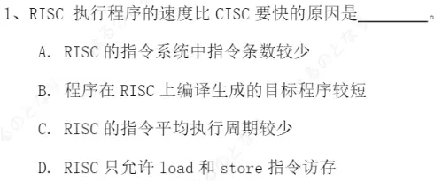

**答案：C**

- **选项A错误**：RISC指令条数少只是表面特征，并非速度快的根本原因。实际上，完成相同功能，RISC通常需要更多条指令（因为单条指令功能简单）。
- **选项B错误**：RISC的目标程序通常更长，而非更短。因为复杂操作需要多条简单指令组合实现，这是RISC将硬件复杂性转移给编译器的体现。
- **选项C正确**：根据计算机性能公式：**程序执行时间 = 指令数 × CPI（每条指令平均时钟周期数） × 时钟周期时间**。RISC的核心优势在于**CPI极低**（绝大多数指令单周期执行），虽然指令数可能比CISC多，但CPI的大幅降低带来了整体执行速度的提升。
- **选项D错误**："只允许load和store指令访存"是RISC的重要设计特点（加载-存储架构），但它是**导致CPI较低的原因之一**，而非RISC速度更快的直接、根本原因。

#### 计算机系统结构创新与摩尔定律


**答案：D**

- **选项A错误**：器件更新换代（摩尔定律）是过去几十年计算机性能提升的主要动力，但目前晶体管尺寸已接近物理极限，摩尔定律显著放缓，单纯依靠工艺进步带来的性能提升越来越有限。
- **选项B错误**：软件发展可以优化程序执行效率，但它是在硬件基础上的改进，无法从根本上突破硬件架构的性能瓶颈。
- **选项C错误**：操作系统更新主要提升系统的兼容性、安全性和资源管理效率，对整体计算性能的提升幅度有限，不是核心推动力。
- **选项D正确**：在摩尔定律失效的背景下，**计算机系统结构的创新**已成为未来性能提升的主要途径，包括多核架构、异构计算、专用加速器（GPU/TPU/NPU）、RISC架构、3D堆叠、存算一体等技术，这些都属于系统结构层面的突破。

#### 并行性的三大基本技术途径


**答案：D**

提高计算机系统并行性的**三大基本技术途径**是：

- **A. 时间重叠**：让多个任务在时间上重叠执行，典型代表是**流水线技术**，属于时间维度的并行。
- **B. 资源共享**：多个任务分时共享同一套硬件资源，典型代表是**多道程序、分时系统**，通过软件调度实现宏观上的并行。
- **C. 资源重复**：通过重复设置硬件资源来实现并行，典型代表是**多核CPU、多处理器系统、阵列处理机**，属于空间维度的并行。

**D. 专用硬件加速**：这是一种性能优化手段（如GPU、TPU、NPU等），通过定制硬件加速特定任务，但它**不属于提高并行性的基本技术途径**，而是并行技术在特定领域的应用实现。

#### 兼容原则


**答案：C**

系列机软件兼容性的核心原则如下：

- **向后兼容（必须做到）**：新机型能够运行旧机型上的所有软件。这是系列机最基本的要求，目的是保护用户已有的软件投资，确保用户升级硬件后原有业务不受影响。
- **向前兼容（一般不要求）**：旧机型能够运行新机型上的软件。这通常无法实现，因为新软件会利用新硬件的新增指令和特性，旧硬件不具备这些能力。
- **向上兼容（力争做到）**：同系列低档机型的软件能够在高档机型上正常运行。这是系列机设计的重要目标，方便用户从低档机平滑升级到高档机，获得更好的性能。
- **向下兼容（一般不要求）**：高档机型的软件能够在低档机型上运行。这通常无法实现，因为高档机软件可能依赖只有高档机才具备的硬件资源和性能。

因此，系列机软件应做到**向后兼容（硬性要求），力争向上兼容（优化目标）**。

#### Flynn计算机分类方法与多处理机

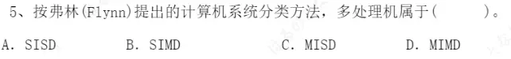



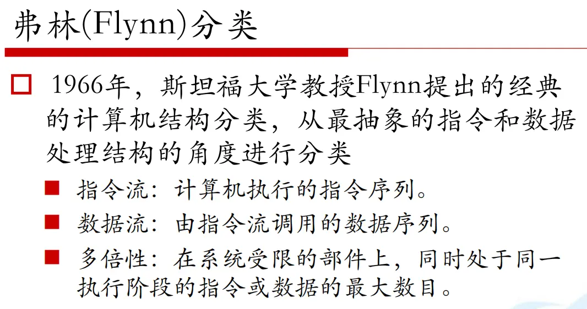

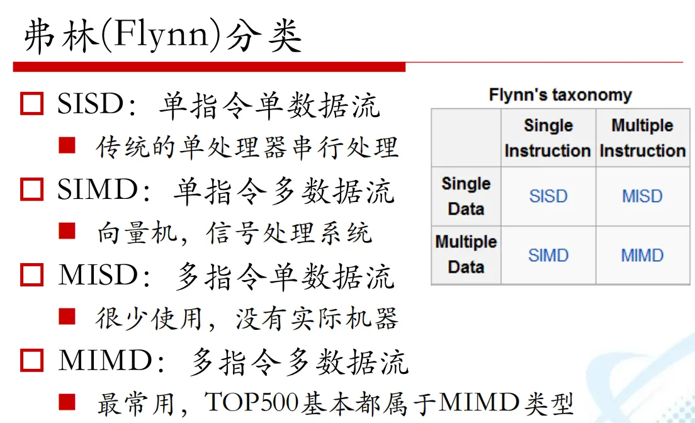

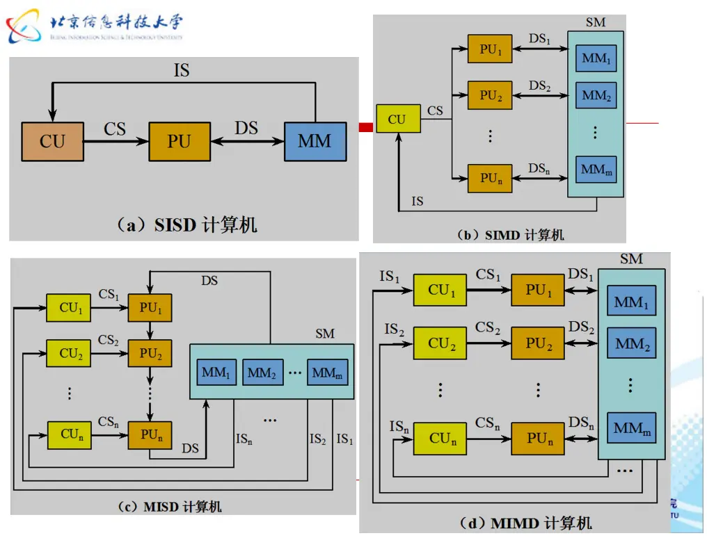




**答案：D**

弗林（Flynn）分类法是根据计算机系统中**指令流**和**数据流**的并行性程度进行分类，多处理机的归属如下：

| 类别 | 名称 | 描述 | 典型代表/地位 |
|------|------|------|--------------|
| **SISD** | 单指令流单数据流 | 传统的单核串行计算机，同一时刻只能执行一条指令、处理一个数据。 | 早期串行计算机 |
| **SIMD** | 单指令流多数据流 | 同一时刻执行同一条指令，但同时处理多个不同的数据。 | GPU、向量处理器、阵列处理机 |
| **MISD** | 多指令流单数据流 | 多条不同的指令同时处理同一个数据，这种结构在实际中几乎没有应用，仅存在于理论研究。 | 仅理论研究 |
| **MIMD** | 多指令流多数据流 | 多个处理器同时执行不同的指令流，处理不同的数据流。**多处理机系统（包括多核CPU、多处理器服务器、计算机集群）都属于这一类别**。 | 目前主流的并行计算机结构 |

---




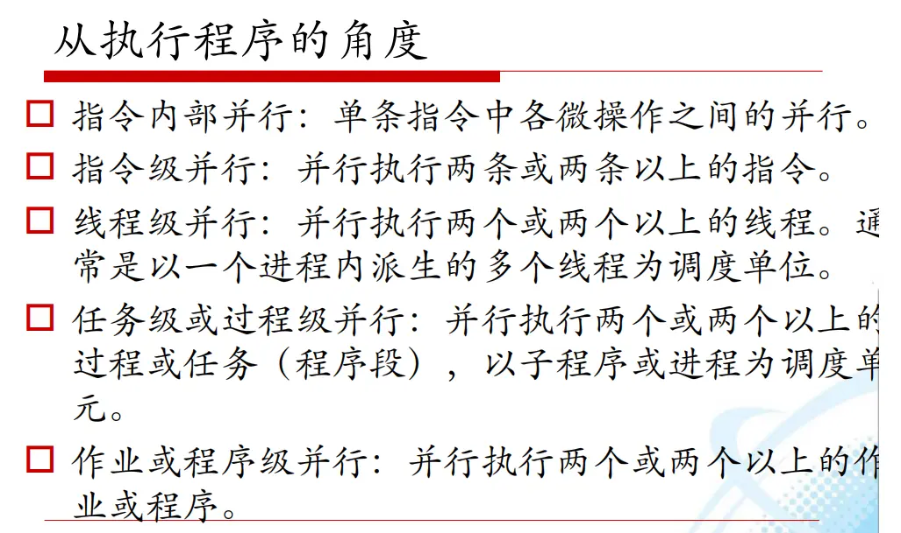

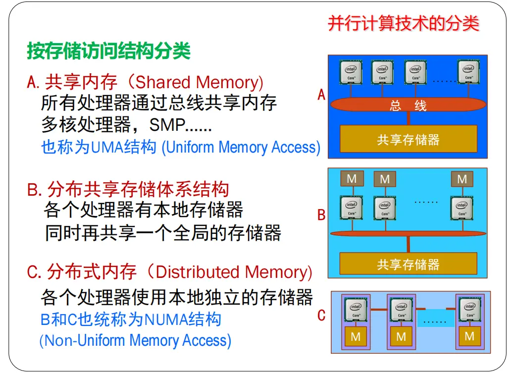

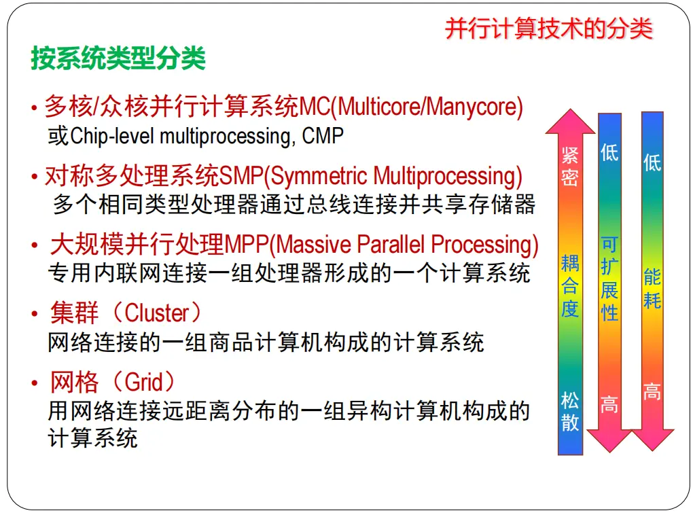


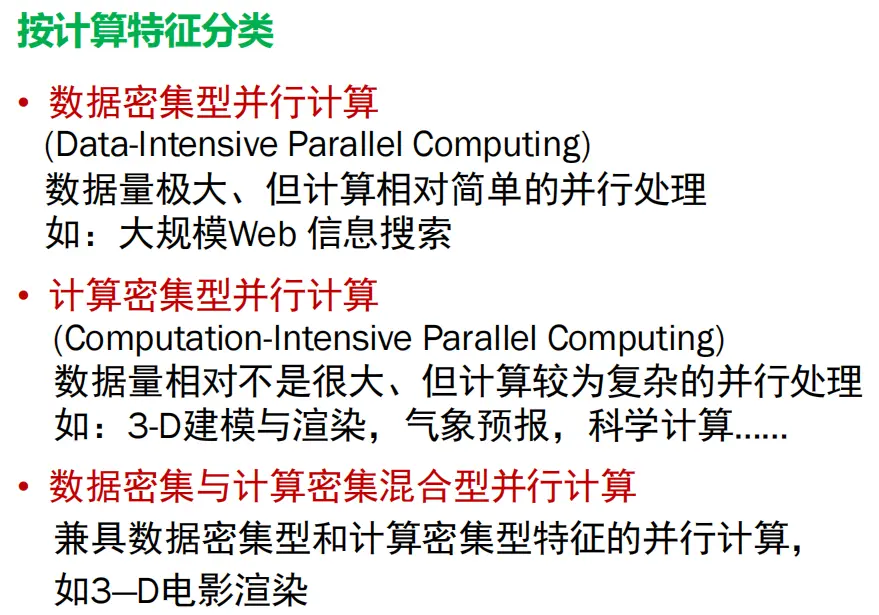




### 判断

#### 性能判断标准


**答案：正确（√）**

对于特定程序，**执行时间**是衡量计算机系统性能最直接、最可靠的标准。它直接反映了计算机完成该任务的实际快慢，符合"完成相同工作，时间越短性能越高"的基本性能定义。

主频、MIPS、CPI等都是间接性能指标，存在明显局限性：

- 主频高不代表实际执行速度快（不同架构的指令效率不同）
- MIPS无法比较不同指令集架构的性能
- CPI需要结合指令数和时钟周期才能计算实际性能

| 指标 | 英文全称 | 含义 | 说明 |
|------|----------|------|------|
| **CPI** | Cycles Per Instruction | 每条指令平均时钟周期数 | RISC的核心优势在于CPI极低，绝大多数指令单周期执行 |
| **程序执行时间** | Program Execution Time | 完成程序所需的实际时间 | 衡量性能最直接、最可靠的标准 |
| **主频** | Clock Frequency | CPU的时钟频率 | 高主频不代表实际执行速度快（不同架构指令效率不同） |
| **MIPS** | Million Instructions Per Second | 每秒执行百万条指令数 | 无法比较不同指令集架构的性能 |
| **时钟周期时间** | Clock Cycle Time | 一个时钟周期的时间长度 | 与主频互为倒数，用于性能公式计算 |


##### 性能计算公式

$$
T_{exec} = N_{instr} \times CPI \times T_{clk}
$$

其中各符号含义如下：

- **T_exec**：程序执行时间（Execution Time）
- **N_instr**：指令数（Instruction Count）
- **CPI**：每条指令平均时钟周期数（Cycles Per Instruction）
- **T_clk**：时钟周期时间（Clock Cycle Time）

#### 软件硬件接口


**答案：错误（×）**

计算机系统中，**软件和硬件的真正接口是指令集架构（ISA）**，而非操作系统：

- **指令集架构（ISA）**：定义了硬件能够识别和执行的指令集合、寄存器、寻址方式等，是硬件设计的依据，也是所有软件（包括操作系统）最终编译执行的基础。
- **操作系统**：是运行在ISA之上的系统软件，它是**用户与计算机硬件之间的接口**，为上层应用程序提供了进程管理、内存管理、文件系统等高级抽象服务，但它本身也是软件的一部分。

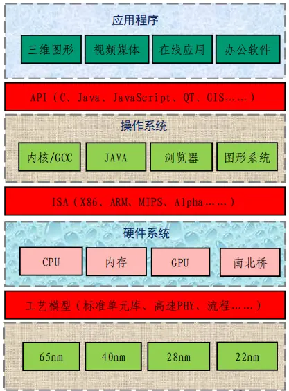

#### 主存 - 辅存 与 主存 - cache


**答案：正确（√）**

计算机存储系统采用层次化设计，不同层次解决不同的问题：

- **"主存-辅存"层次（虚拟存储系统）**：辅存（硬盘、SSD等）具有容量大、价格低的特点，但访问速度远慢于主存。该层次通过虚拟存储技术，将主存和辅存统一编址，为用户提供一个容量接近辅存、速度接近主存的虚拟地址空间，**核心目的是弥补主存容量的不足**。
- **"Cache-主存"层次（高速缓冲存储系统）**：Cache（高速缓存）速度接近CPU，但容量小、价格高。该层次利用程序的局部性原理，将CPU近期可能频繁访问的数据和指令从主存复制到Cache中，**核心目的是弥补主存速度（性能）的不足**，解决CPU与主存之间的速度不匹配问题。

#### 摩尔定律内容

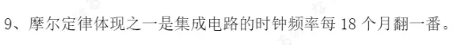

**答案：错误（×）**


摩尔定律的**原始且核心表述**是：**集成电路上可容纳的，约每隔18-24个月便会增加一倍**，同时芯片的也将提升一倍或降低一半。


题目中的说法是对摩尔定律的常见误解：

- 时钟频率的提升只是早期晶体管数量增加带来的结果之一，并非摩尔定律本身的内容
- 大约从2005年开始，由于功耗和散热的物理限制，单芯片的时钟频率提升已经基本停滞
- 现代处理器主要通过增加核心数量、改进架构和采用异构计算来提升性能，而非单纯提高时钟频率

#### 集群


**答案：错误（×）**

计算机集群的定义是**一组通过网络连接的计算机，在集群软件的统一管理和调度下协同工作，对外表现为一个单一的系统**。

仅仅将N台服务器通过网络物理连接起来，**并不能构成集群**。真正的集群还必须具备以下核心要素：

- 集群管理软件：负责节点发现、状态监控和资源管理
- 任务调度系统：能够将任务分配到不同的服务器节点上执行
- 协同工作机制：节点之间可以通信、数据共享和负载均衡
- 高可用机制：当部分节点故障时，任务可以自动转移到其他节点

没有这些软件层面的支持，这些服务器只是相互独立的个体，无法协同完成任务，也就不能称为集群系统。

**常见集群实例**：

- **Redis 哨兵（Sentinel）模式**：多个 Redis 节点组成集群，哨兵进程监控主从节点状态，当主节点故障时自动完成故障转移，保证服务的高可用性。
- **Nginx 负载均衡**：Nginx 作为反向代理，将客户端请求分发到后端多台服务器，实现流量分摊和故障自动剔除，对外表现为单一入口。
- **Kubernetes 容器集群**：通过 Master 节点统一管理多个 Worker 节点，自动调度容器、实现服务发现和弹性伸缩。
- **Hadoop 分布式集群**：HDFS 将数据分散存储在多个 DataNode 上，YARN 统一调度计算任务到各节点执行，实现大规模数据的分布式处理。

### 计算题

#### CPI、MIPS 与执行时间计算

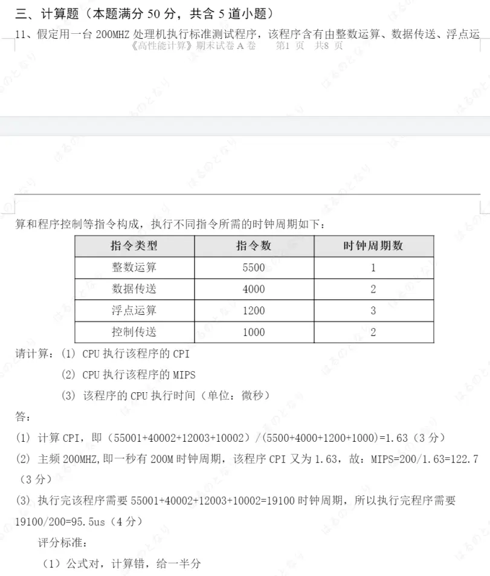

**题目：** 假定用一台 **200 MHz** 处理器执行标准测试程序，该程序含有整数运算、数据传送、浮点运算和控制传送等指令，各类指令的数量和所需时钟周期数如下：

| 指令类型 | 指令数 | 时钟周期数 |
| :------: | :----: | :--------: |
| 整数运算 |  5500  |     1      |
| 数据传送 |  4000  |     2      |
| 浮点运算 |  1200  |     3      |
| 控制传送 |  1000  |     2      |

**请计算：**

1. CPU 执行该程序的 **CPI**
2. CPU 执行该程序的 **MIPS**
3. 该程序的 **CPU 执行时间**（单位：微秒）

**解答：**

在动手计算之前，先理清三个指标的含义和它们之间的关系：

**什么是 MIPS？**

MIPS 是 **Million Instructions Per Second** 的缩写，意为"**每秒执行百万条指令数**"，是衡量 CPU 运算速度的一个经典性能指标。

它的核心思想很简单：同样运行一秒钟，能执行更多指令的 CPU 当然更快。计算公式为：

$$
\text{MIPS} = \frac{\text{指令数}}{\text{执行时间} \times 10^6}
$$

也可以直接用主频和 CPI 推导：

$$
\text{MIPS} = \frac{\text{主频}}{\text{CPI} \times 10^6}
$$

> **为什么除以 10⁶？** 因为 1 MHz = 10⁶ Hz，除以 10⁶ 就把结果换算成了"百万条"的单位。例如主频 200 MHz，如果 CPI = 1，那理想情况下每秒能执行 200 × 10⁶ 条指令，即 **200 MIPS**。

**但要注意**：MIPS 是一个"不太靠谱"的性能指标。不同指令集架构（ISA）的指令复杂度差异很大——一条 x86 的复杂指令可能顶得上好几条 RISC 的简单指令。所以 **MIPS 只适合在同架构、同指令集的 CPU 之间比较**，跨架构比较会失真。这也是为什么现代评测更倾向用 SPEC 等真实程序基准测试，而不是单纯看 MIPS。

三个指标的关系脉络：

- **CPI** → 反映"每条指令要吃掉多少个时钟周期"（由程序指令 mix 和 CPU 微架构决定）
- **主频** → 反映"每秒钟有多少个时钟周期"（由 CPU 制造工艺决定）
- **MIPS** → 由前两者共同决定：主频越高、CPI 越低，MIPS 就越高
- **执行时间** → 最终的实际耗时，是衡量性能最直观、最可靠的指标

---

首先，计算总指令数和总时钟周期数：

$$
\text{总指令数} = 5500 + 4000 + 1200 + 1000 = 11700
$$

$$
\text{总时钟周期数} = 5500 \times 1 + 4000 \times 2 + 1200 \times 3 + 1000 \times 2 = 19100
$$

##### (1) CPI（每条指令平均时钟周期数）

$$
\text{CPI} = \frac{\text{总时钟周期数}}{\text{总指令数}} = \frac{19100}{11700} = \frac{191}{117} \approx 1.63
$$

##### (2) MIPS（每秒执行百万条指令数）

$$
\text{MIPS} = \frac{\text{主频}}{\text{CPI} \times 10^6} = \frac{200 \times 10^6}{1.6325 \times 10^6} = \frac{200}{1.6325} \approx 122.51
$$

##### (3) CPU 执行时间

$$
T = \frac{\text{总时钟周期数}}{\text{主频}} = \frac{19100}{200 \times 10^6} = 9.55 \times 10^{-5} \text{ s} = 95.5 \text{ μs}
$$

**答案：**

- (1) **CPI ≈ 1.63**
- (2) **MIPS ≈ 122.51**
- (3) **执行时间 = 95.5 μs**

#### 阿姆达尔定律（Amdahl's Law）

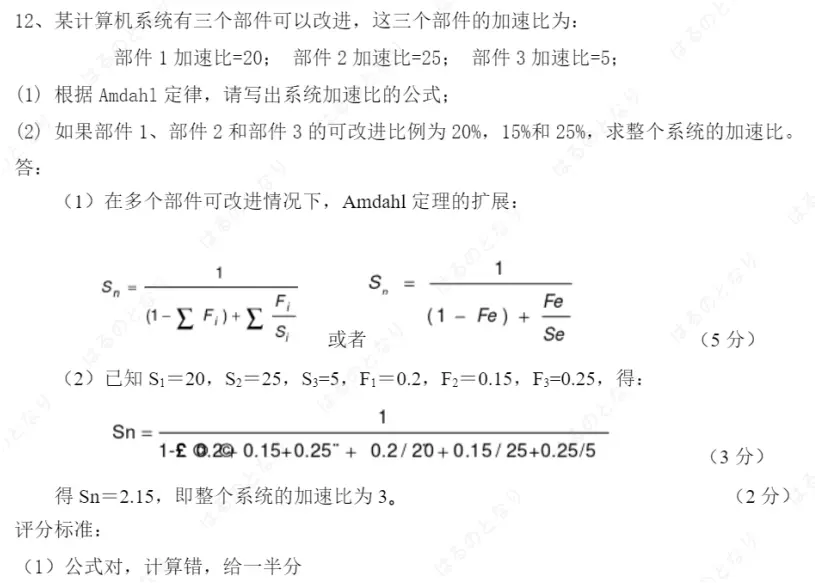



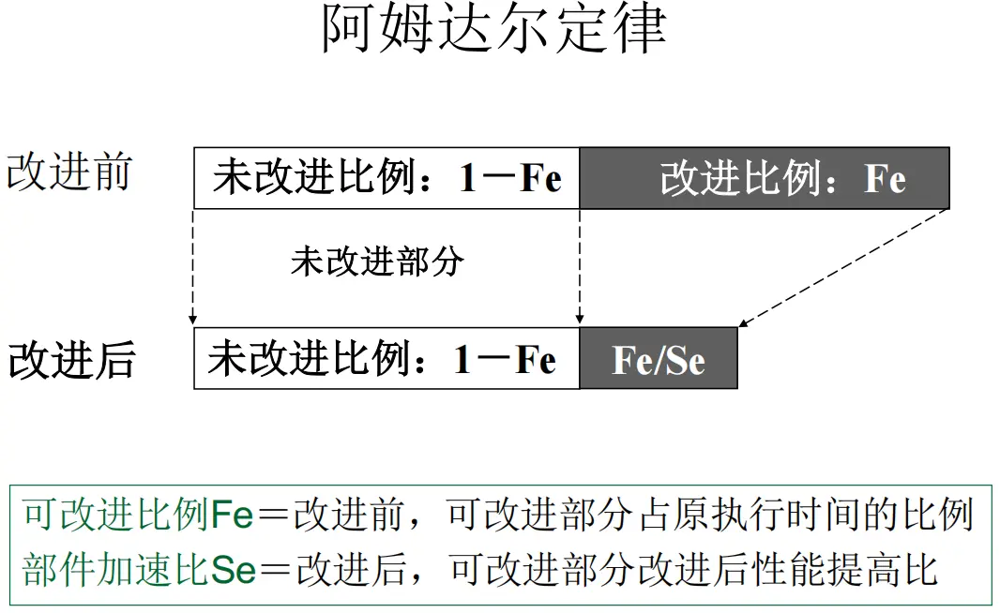

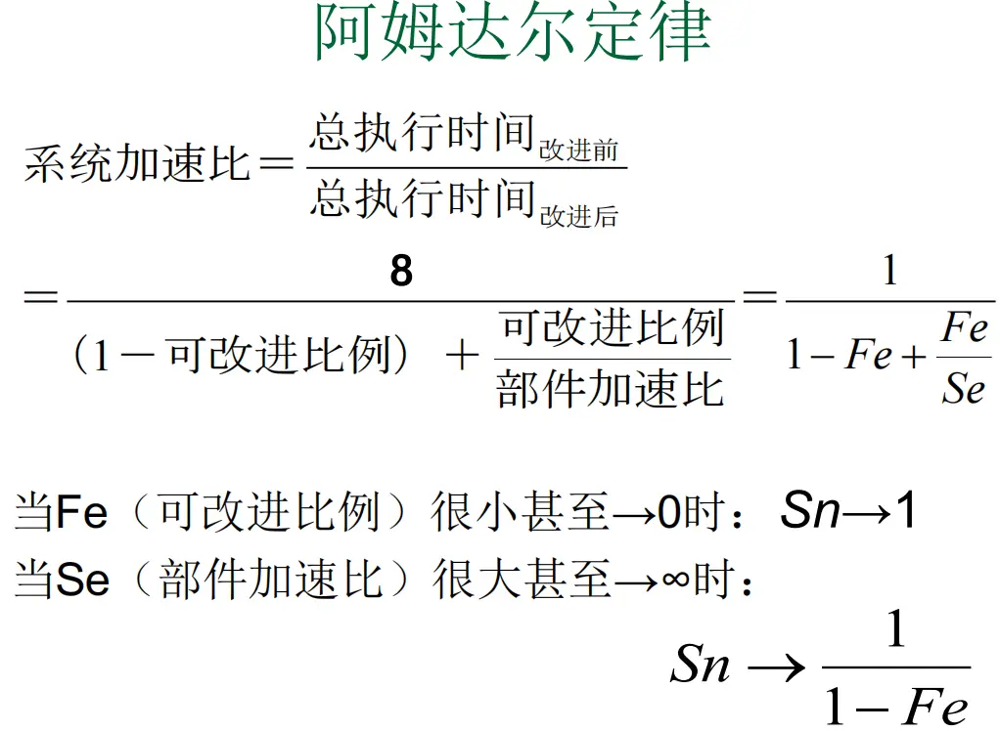

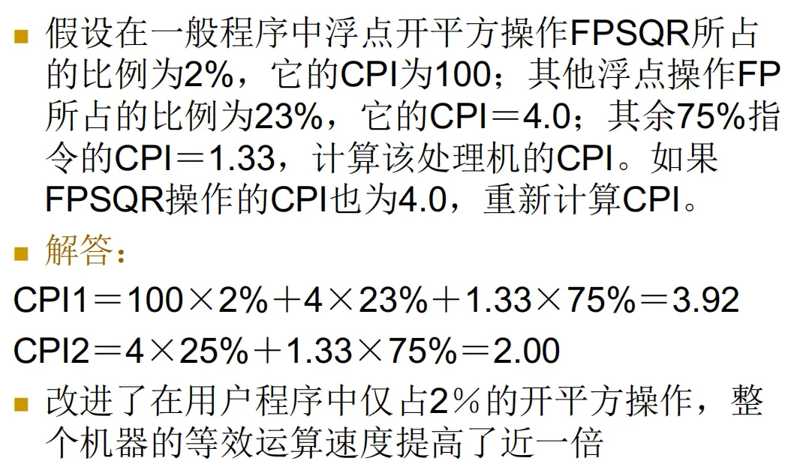

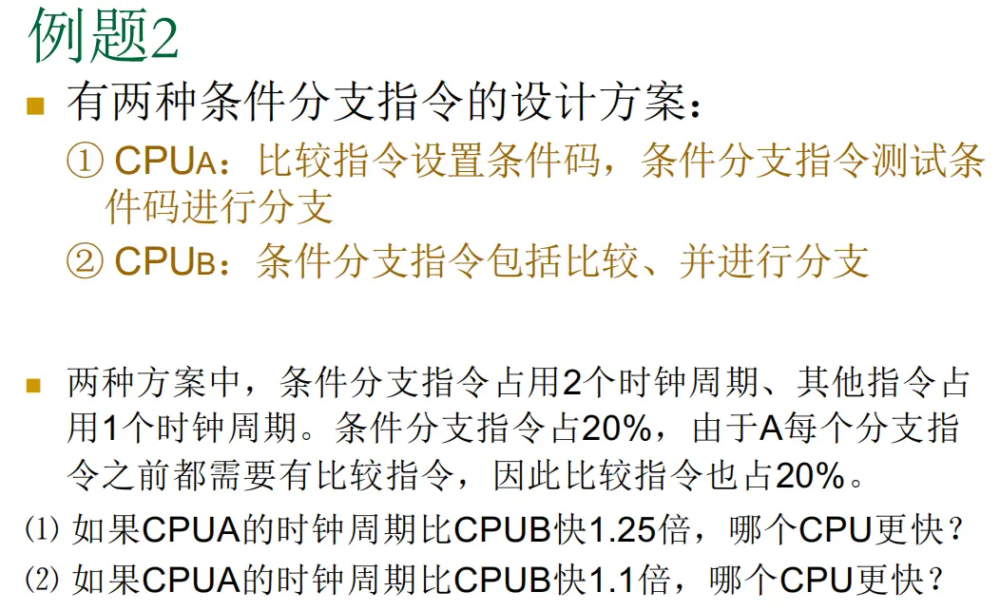

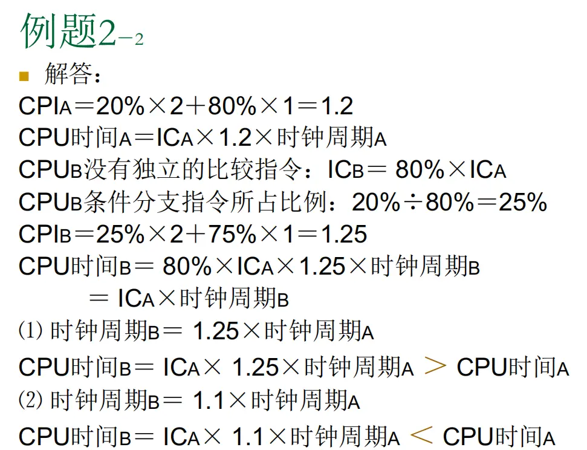

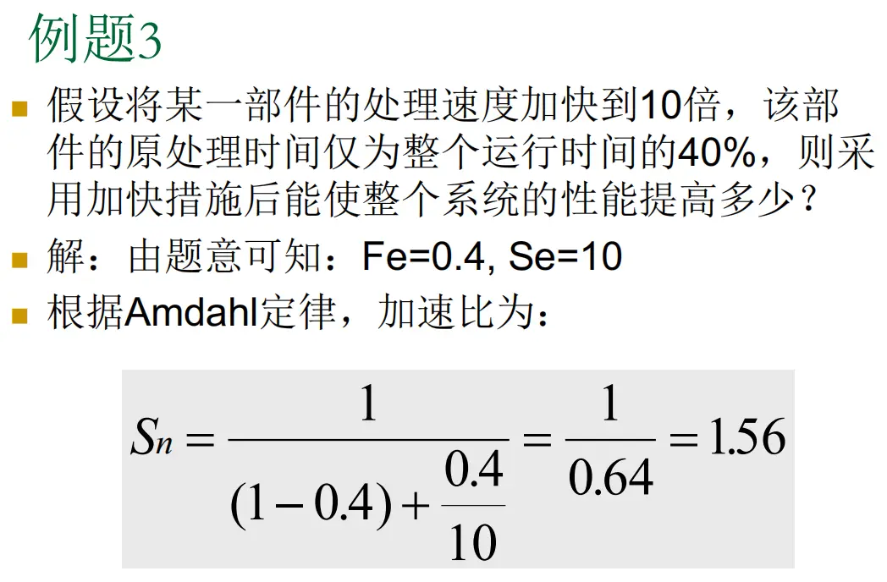

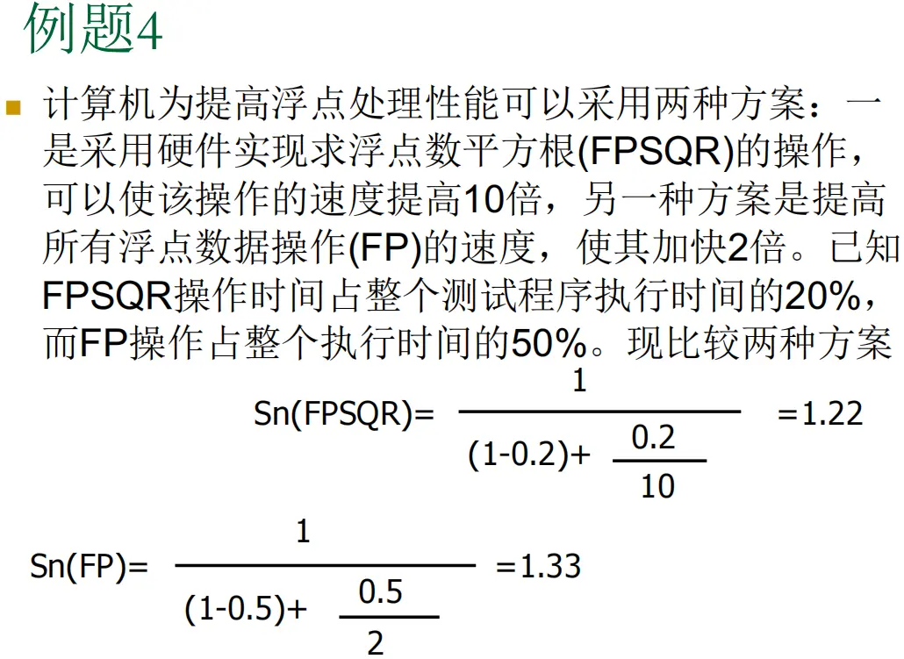

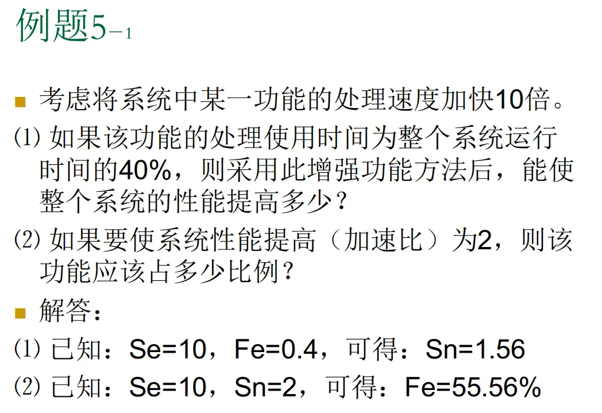

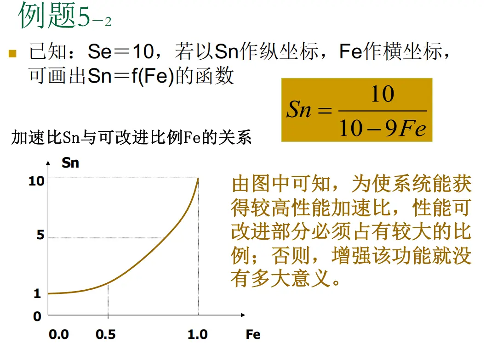

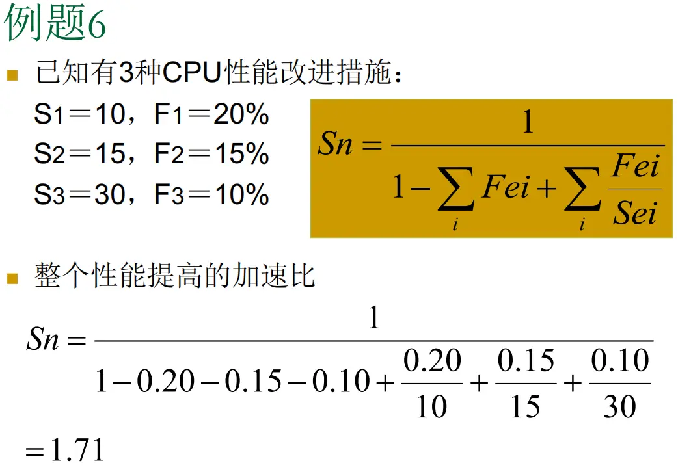



**题目：** 某计算机系统有三个部件可以改进，这三个部件的加速比为：

| 部件 | 加速比 $S_i$ |
| :--: | :----------: |
| 部件 1 | 20 |
| 部件 2 | 25 |
| 部件 3 | 5 |

**(1)** 根据 Amdahl 定律，请写出系统加速比的公式；

**(2)** 如果部件 1、部件 2 和部件 3 的可改进比例为 20%、15% 和 25%，求整个系统的加速比。

**解答：**

(1) 多部件改进的系统加速比公式

阿姆达尔定律的标准形式只考虑**一个可改进部件**。当系统中有多个部件同时被改进时，需要对公式进行推广。核心思路与单部件相同：将改进后的执行时间拆成两部分——**不可改进的串行时间** 和 **各改进部件优化后的时间**。

设有 $n$ 个可改进部件，推广后的系统加速比公式为：

$$
S_{\text{system}} = \frac{1}{\left(1 - \sum_{i=1}^{n} F_i\right) + \sum_{i=1}^{n} \frac{F_i}{S_i}}
$$

**各符号含义：**

| 符号 | 含义 | 说明 |
| :--- | :--- | :--- |
| $S_{\text{system}}$ | 系统整体加速比 | 改进后总执行时间与改进前的比值 |
| $F_i$ | 第 $i$ 个部件的可改进比例 | 该部件原始执行时间占系统总执行时间的比例（$0 \leq F_i \leq 1$） |
| $S_i$ | 第 $i$ 个部件的加速比 | 该部件单独改进后的性能提升倍数（$S_i \geq 1$） |
| $\sum F_i$ | 所有可改进部分的总比例 | 各部件可改进比例之和，必须 $\leq 1$ |
| $1 - \sum F_i$ | 不可改进的串行部分比例 | 无法被优化的那部分代码，它是加速比的"天花板" |

对于本题三个部件的情况，公式展开为：

$$
S_{\text{system}} = \frac{1}{(1 - F_1 - F_2 - F_3) + \frac{F_1}{S_1} + \frac{F_2}{S_2} + \frac{F_3}{S_3}}
$$

(2) 代入已知条件计算

**步骤一**：整理已知条件

| 部件 | 可改进比例 $F_i$ | 加速比 $S_i$ | 改进后贡献 $\frac{F_i}{S_i}$ |
| :--: | :--------------: | :----------: | :-------------------------: |
| 部件 1 | $20\% = 0.2$ | 20 | $\frac{0.2}{20} = 0.01$ |
| 部件 2 | $15\% = 0.15$ | 25 | $\frac{0.15}{25} = 0.006$ |
| 部件 3 | $25\% = 0.25$ | 5 | $\frac{0.25}{5} = 0.05$ |

**步骤二**：计算不可改进部分

$$
\sum_{i=1}^{3} F_i = 0.2 + 0.15 + 0.25 = 0.6
$$

$$
1 - \sum F_i = 1 - 0.6 = 0.4 \quad (\text{即 40\% 的串行部分})
$$

**步骤三**：计算改进后的总贡献

$$
\sum_{i=1}^{3} \frac{F_i}{S_i} = 0.01 + 0.006 + 0.05 = 0.066
$$

**步骤四**：计算系统加速比

$$
S_{\text{system}} = \frac{1}{0.4 + 0.066} = \frac{1}{0.466} \approx 2.146
$$

**答案：**

- **(1)** 系统加速比公式：$S_{\text{system}} = \frac{1}{(1 - \sum F_i) + \sum \frac{F_i}{S_i}}$
- **(2)** 整个系统的加速比约为 **$2.15$**（或精确值为 $\frac{500}{233} \approx 2.15$）

> **为什么结果这么"低"？** 三个部件的加速比分别是 20、25、5，看起来都很夸张，但别忘了它们的可改进比例加起来只有 60%，剩下 40% 的串行代码完全无法优化。即使你把并行部分优化到无穷快，那 40% 的串行部分也会死死拖住后腿——这就是阿姆达尔定律的残酷真相。换句话说，**优化串行部分的比例比单纯提升并行部分的性能更重要**。

---

#### 补充：单部件加速的阿姆达尔定律例题详解

PPT 中还有两道关于**单部件改进**的经典例题（例题 5-1 和 5-2），下面给出比 PPT 更详细的推导和解读。


**例题 5-1：** 考虑将系统中某一功能的处理速度加快 $10$ 倍。

**(1)** 如果该功能的处理使用时间为整个系统运行时间的 $40\%$，则采用此增强功能方法后，能使整个系统的性能提高多少？

**(2)** 如果要使系统性能提高（加速比）为 $2$，则该功能应该占多少比例？

---

**符号约定（与 PPT 一致）：**

| 符号 | 含义 |
| :--- | :--- |
| $S_e$ | 被增强功能部分的**局部加速比**（Enhancement Speedup） |
| $F_e$ | 被增强功能部分在原始系统中占的**时间比例**（Fraction Enhanced） |
| $S_n$ | 整个系统的**全局加速比**（Speedup of the whole system） |

---

**核心公式推导：**

阿姆达尔定律最朴素的思想是：把系统总执行时间拆成**可改进部分**和**不可改进部分**。

设原始系统总执行时间为 $T_0$，则：
- 可改进部分耗时：$F_e \times T_0$
- 不可改进部分耗时：$(1 - F_e) \times T_0$

改进后，可改进部分的速度提升为原来的 $S_e$ 倍，因此改进后的耗时变为：

$$
T_n = (1 - F_e) \times T_0 + \frac{F_e \times T_0}{S_e}
$$

系统加速比定义为"原始时间 / 改进后时间"：

$$
S_n = \frac{T_0}{T_n} = \frac{1}{(1 - F_e) + \dfrac{F_e}{S_e}}
$$

**这个公式就是单部件阿姆达尔定律的标准形式。**

---

**(1) 已知 $S_e = 10$，$F_e = 0.4$，求 $S_n$**

直接代入公式：

$$
S_n = \frac{1}{(1 - 0.4) + \dfrac{0.4}{10}} = \frac{1}{0.6 + 0.04} = \frac{1}{0.64} = 1.5625
$$

PPT 中给出的结果是 $1.56$，这是四舍五入保留两位小数后的值。

**直观理解**：你把系统 $40\%$ 的时间加速了 $10$ 倍，但这 $40\%$ 的时间改进后只占原来的 $4\%$。新的总时间构成为：$60\%$（未变）$+ 4\%$（已改进）$= 64\%$，所以整体只快了约 $1.56$ 倍。也就是说，**局部 10 倍的优化，换到全局只有 1.56 倍**，这就是阿姆达尔定律的"天花板效应"。

---

**(2) 已知 $S_e = 10$，$S_n = 2$，求 $F_e$**

这道题是**反向求解**，需要从加速比公式中解出 $F_e$。

从标准形式出发：

$$
2 = \frac{1}{(1 - F_e) + \dfrac{F_e}{10}}
$$

先化简分母：

$$
(1 - F_e) + \frac{F_e}{10} = 1 - F_e + 0.1F_e = 1 - 0.9F_e
$$

于是：

$$
2 = \frac{1}{1 - 0.9F_e}
$$

两边取倒数：

$$
1 - 0.9F_e = \frac{1}{2} = 0.5
$$

移项：

$$
0.9F_e = 0.5 \quad \Rightarrow \quad F_e = \frac{0.5}{0.9} = \frac{5}{9}
$$

化为百分数：

$$
F_e = \frac{5}{9} \approx 0.5556 = 55.56\%
$$

PPT 给出的结果正是 $55.56\%$。

**直观理解**：如果你想让整个系统快 $2$ 倍，那么改进后的总执行时间必须是原来的 $50\%$。由于不可改进部分始终占 $(1 - F_e)$，这部分不能缩短，因此它不能超过 $50\%$。换句话说：

$$
1 - F_e < 0.5 \quad \Rightarrow \quad F_e > 0.5
$$

这说明可改进部分**至少要超过一半**。再结合局部加速比只有 $10$ 倍，最终精确计算出需要 $55.56\%$。

> **一个有趣的极端**：如果 $S_e \to \infty$（该功能被优化到瞬间完成），公式退化为 $S_n = \dfrac{1}{1 - F_e}$。此时要使 $S_n = 2$，只需 $F_e = 50\%$。也就是说，**即使你把该功能优化到无穷快，如果它原来只占 $40\%$，全局加速比也永远到不了 2**。这就是阿姆达尔定律给并行优化泼的冷水。

---

**例题 5-2：$S_n$ 与 $F_e$ 的函数关系**

PPT 中给出了 $S_e = 10$ 时，$S_n$ 关于 $F_e$ 的函数图像。下面推导这个函数的显式表达式。

从单部件阿姆达尔定律：

$$
S_n = \frac{1}{(1 - F_e) + \dfrac{F_e}{10}}
$$

通分整理分母：

$$
(1 - F_e) + \frac{F_e}{10} = \frac{10(1 - F_e) + F_e}{10} = \frac{10 - 10F_e + F_e}{10} = \frac{10 - 9F_e}{10}
$$

因此：

$$
S_n = \frac{1}{\dfrac{10 - 9F_e}{10}} = \frac{10}{10 - 9F_e}
$$

这就是 PPT 中高亮框里的公式。

下面是用 Plotly 绘制的交互式函数图像，你可以用鼠标悬停查看任意点的数值，或框选放大感兴趣的区域：

<div id="amdahl-plot" style="width:100%;height:450px;margin:20px 0;"></div>

<script src="https://cdn.plot.ly/plotly-2.27.0.min.js"></script>
<script>
(function() {
  var fe = [];
  var sn = [];

  // 生成 Fe 从 0 到 0.999 的数据（避免 Fe=1 时除零）
  for (var i = 0; i <= 0.999; i += 0.002) {
    fe.push(parseFloat(i.toFixed(3)));
    sn.push(10 / (10 - 9 * i));
  }

  // 主曲线：Sn = 10 / (10 - 9Fe)
  var trace1 = {
    x: fe,
    y: sn,
    type: 'scatter',
    mode: 'lines',
    name: 'Sn = 10 / (10 - 9Fe)',
    line: { color: '#2ecc71', width: 3 },
    hovertemplate: 'Fe: %{x:.3f}<br>Sn: %{y:.3f}<extra></extra>'
  };

  // 关键点标注
  var keyPoints = {
    x: [0, 0.5, 5/9, 0.8, 0.9],
    y: [1, 10/5.5, 2, 10/(10-7.2), 10/(10-8.1)],
    type: 'scatter',
    mode: 'markers+text',
    name: '关键点',
    marker: { size: 10, color: '#e74c3c' },
    text: ['Fe=0, Sn=1', 'Fe=0.5, Sn≈1.82', 'Fe=5/9, Sn=2', 'Fe=0.8, Sn=5', 'Fe=0.9, Sn≈9.09'],
    textposition: 'top center',
    textfont: { size: 12 },
    hoverinfo: 'skip'
  };

  // Sn = 2 参考线
  var lineSn2 = {
    x: [0, 1],
    y: [2, 2],
    type: 'scatter',
    mode: 'lines',
    name: 'Sn = 2',
    line: { color: '#3498db', width: 1.5, dash: 'dash' },
    hoverinfo: 'skip'
  };

  // Sn = 10 上限参考线
  var lineSn10 = {
    x: [0, 1],
    y: [10, 10],
    type: 'scatter',
    mode: 'lines',
    name: 'Sn = 10（上限）',
    line: { color: '#9b59b6', width: 1.5, dash: 'dash' },
    hoverinfo: 'skip'
  };

  var layout = {
    title: {
      text: '阿姆达尔定律：全局加速比 Sn 与可改进比例 Fe 的关系（Se = 10）',
      font: { size: 16 }
    },
    xaxis: {
      title: '可改进比例 Fe',
      range: [-0.02, 1.02],
      zeroline: true,
      gridcolor: '#eee'
    },
    yaxis: {
      title: '全局加速比 Sn',
      range: [0, 11],
      zeroline: true,
      gridcolor: '#eee'
    },
    legend: { x: 0.02, y: 0.98, bgcolor: 'rgba(255,255,255,0.8)' },
    margin: { l: 60, r: 30, b: 50, t: 50 },
    plot_bgcolor: '#fafafa',
    paper_bgcolor: '#fff'
  };

  Plotly.newPlot('amdahl-plot', [trace1, keyPoints, lineSn2, lineSn10], layout, {responsive: true});
})();
</script>

**图像解读：**

| $F_e$ | $S_n$ 计算 | 含义 |
| :--- | :--- | :--- |
| $0$ | $\dfrac{10}{10} = 1$ | 没有可改进部分，加速比为 $1$（无提升） |
| $0.5$ | $\dfrac{10}{10 - 4.5} = \dfrac{10}{5.5} \approx 1.82$ | 可改进部分占一半，加速比不到 $2$ |
| $0.556$ | $\dfrac{10}{10 - 5} = 2$ | 达到加速比 $2$ 的临界点（对应 5-1 第 (2) 问） |
| $1.0$ | $\dfrac{10}{10 - 9} = 10$ | 全部可改进，加速比等于局部加速比 $S_e$ |

从图像（PPT 中的曲线）可以看出：

1. **曲线呈上凸形状**：在 $F_e$ 较小时，$S_n$ 增长非常缓慢；只有当 $F_e$ 接近 $1$ 时，$S_n$ 才会快速逼近 $S_e = 10$。
2. **$F_e = 0.5$ 时，$S_n \approx 1.82$**：即使你把系统一半的时间加速了 $10$ 倍，整体也只快了不到 $2$ 倍。
3. **边际收益递减**：每增加一点 $F_e$，带来的 $S_n$ 提升越来越明显（曲线下凸转上凸的加速段），但在低 $F_e$ 区域，投入产出的性价比极低。

**工程启示：**

PPT 的总结非常精准——"为使系统能获得较高性能加速比，性能可改进部分必须占有较大的比例；否则，增强该功能就没有多大意义。"

在实际系统优化中，这意味着：
- **不要优化只占运行时间 5% 的热点**：即使你把这部分加速了 100 倍，全局加速比也只有约 $1.05$。
- **先 profiling，后优化**：用性能分析工具找出真正的时间瓶颈（占比最大的部分），优先优化它。
- **并行化前的必修课**：如果你要把代码并行化，必须先估算可并行部分的比例。如果串行部分占 $30\%$，那么无论用多少核，加速比都过不了 $3.33$。

---

**通用公式速查**

对于任意局部加速比 $S_e$，单部件阿姆达尔定律的变形公式如下：

| 已知条件 | 求解目标 | 公式 |
| :--- | :--- | :--- |
| $S_e$、$F_e$ | $S_n$ | $S_n = \dfrac{1}{(1-F_e) + F_e/S_e}$ |
| $S_e$、$S_n$ | $F_e$ | $F_e = \dfrac{1 - 1/S_n}{1 - 1/S_e}$ |
| $F_e$、$S_n$ | $S_e$ | $S_e = \dfrac{F_e}{1/S_n - (1-F_e)}$ |

> 尤其建议记住**反解 $F_e$ 的公式**：$F_e = \dfrac{1 - 1/S_n}{1 - 1/S_e}$，这在考试中经常用来快速验证"要达到某加速比，至少需要改进多大比例"。

#### 流水线吞吐、效率计算

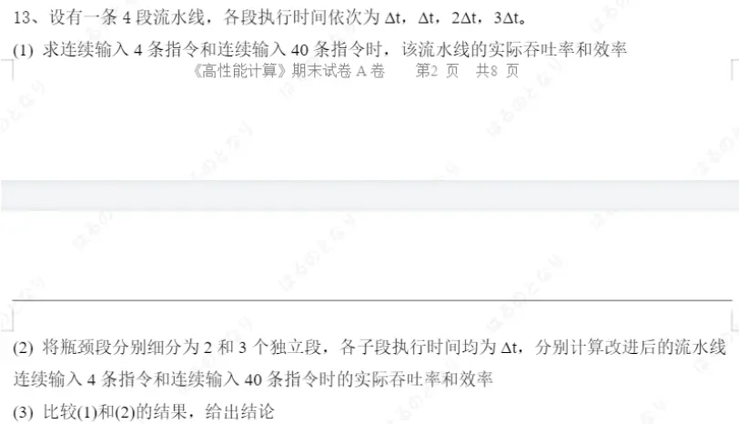

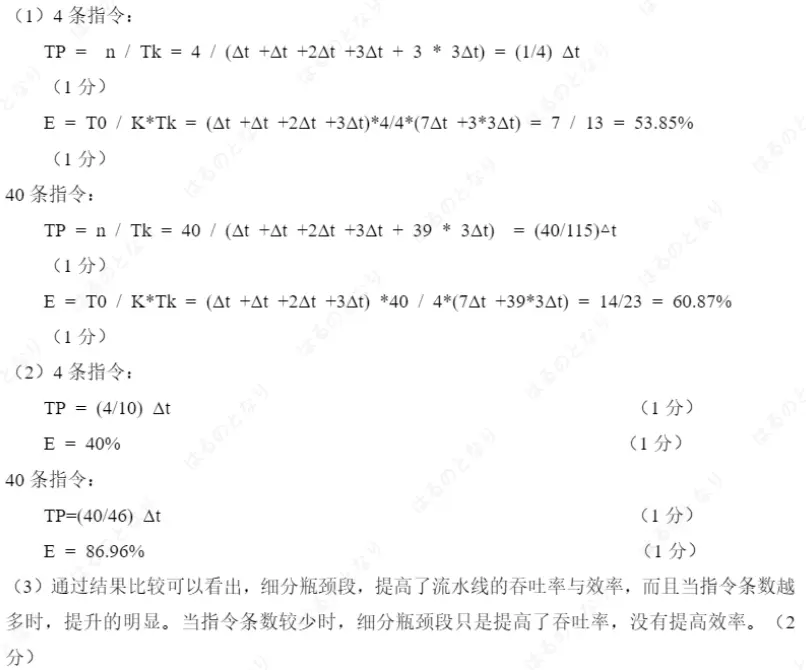

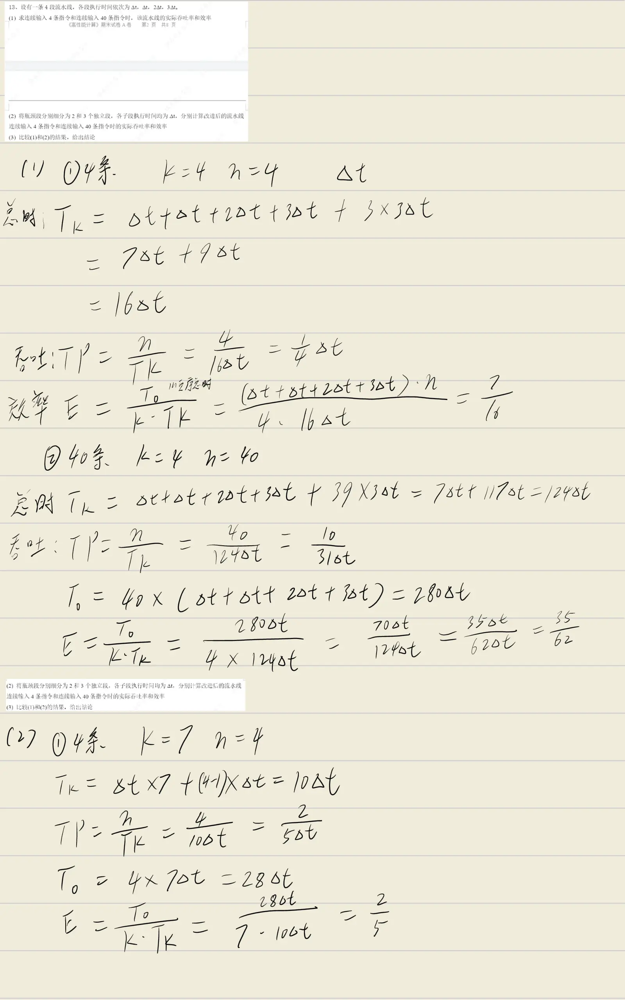

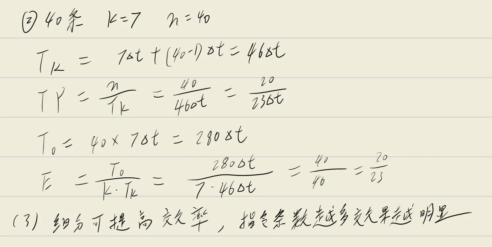



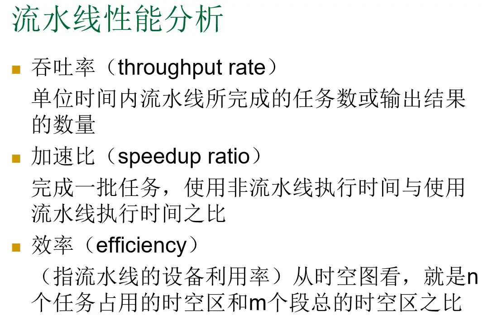

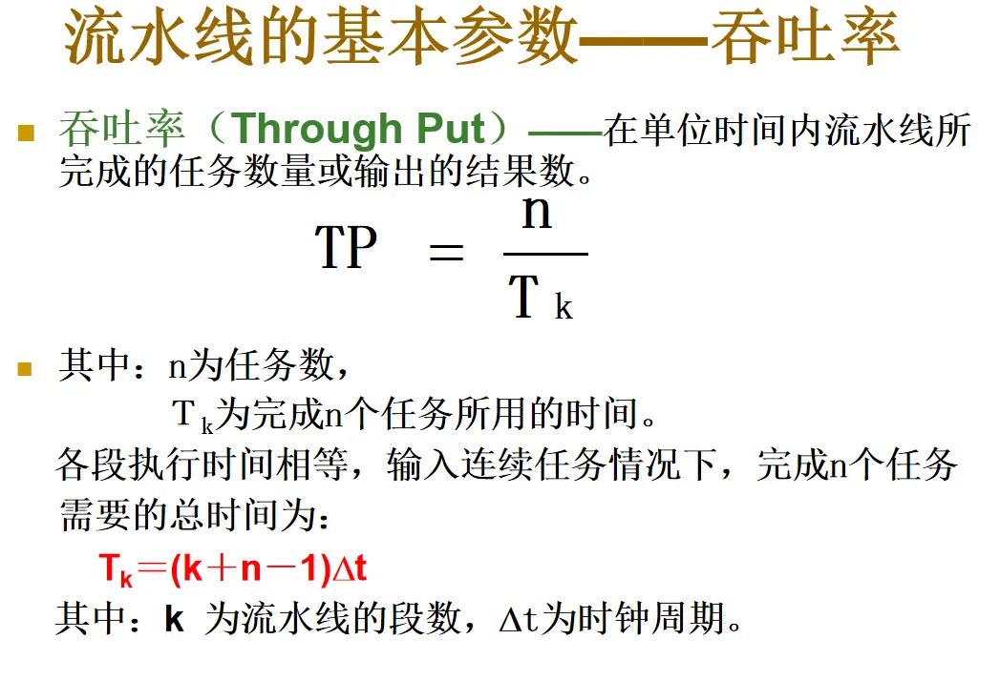

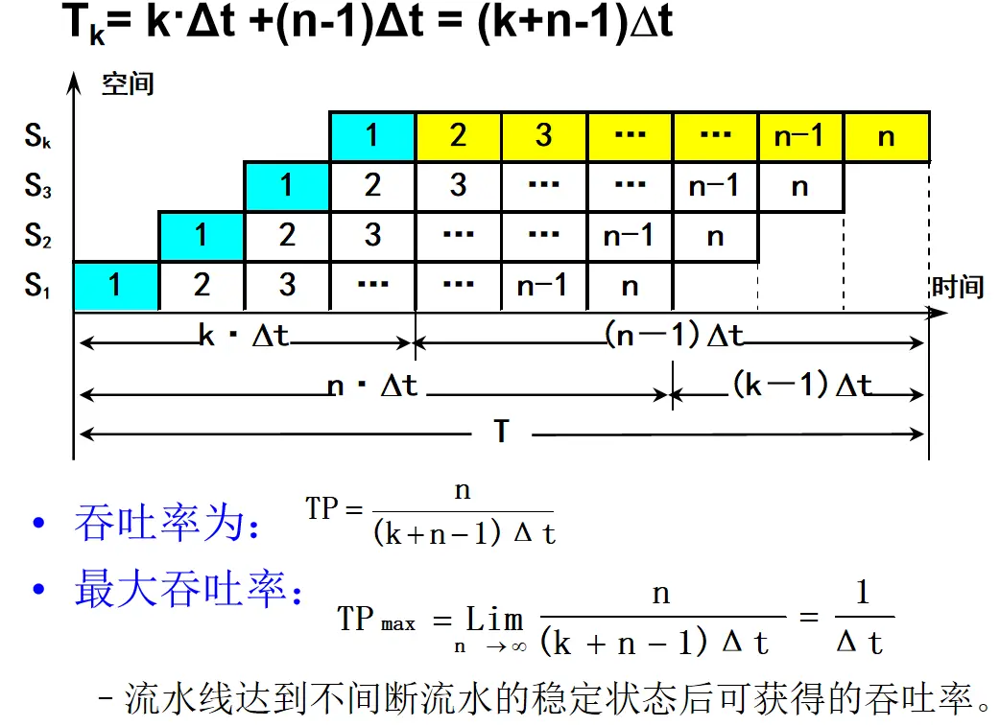

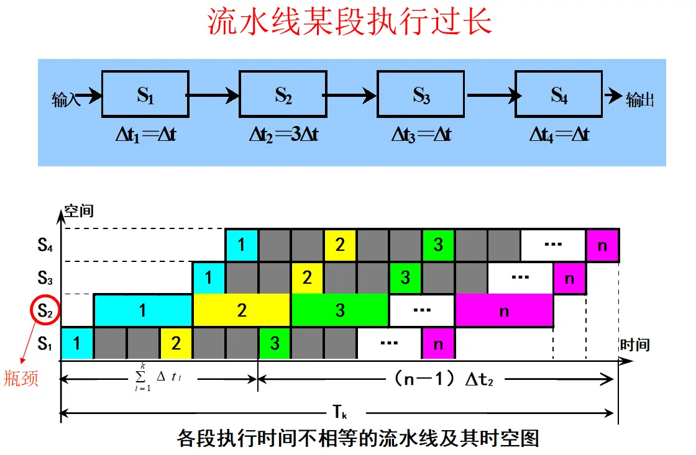

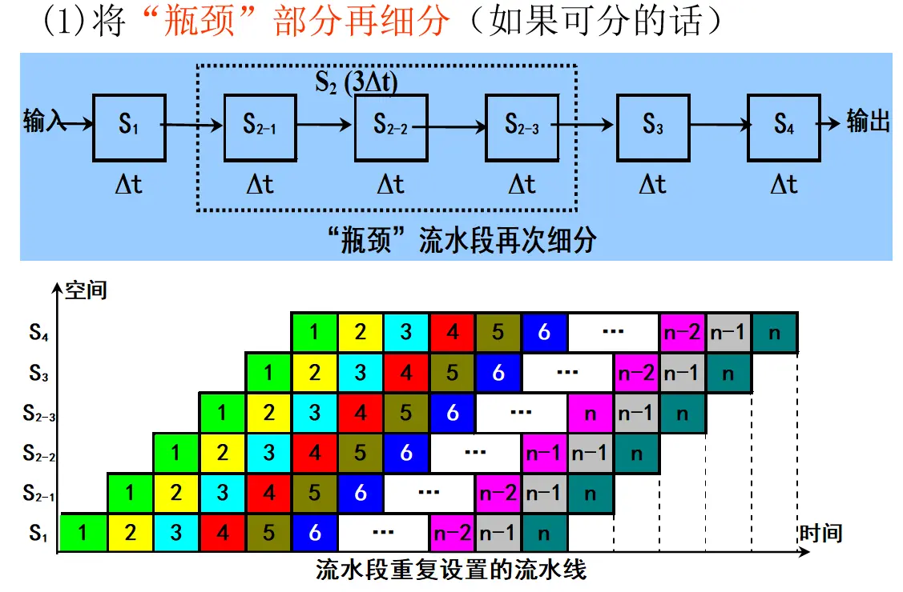

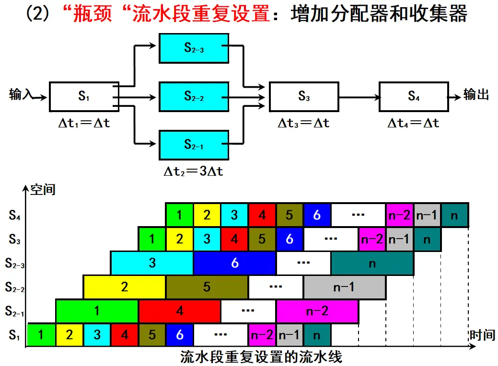

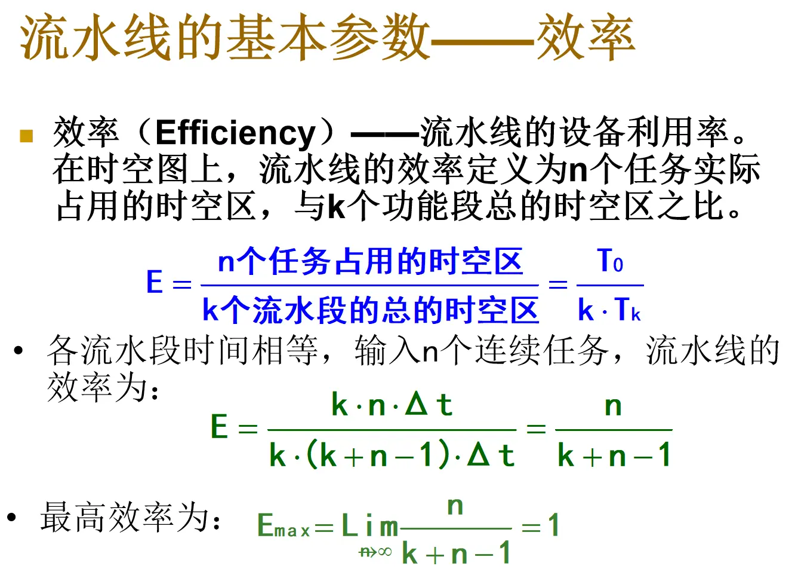

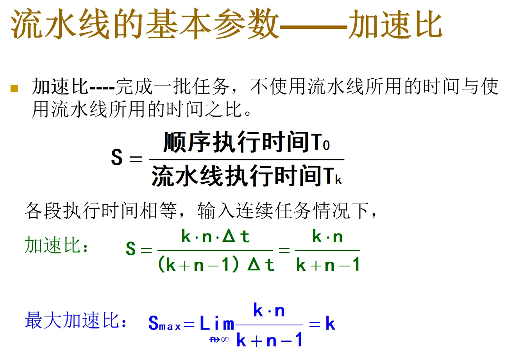



**题目：** 设有一条 **4 段流水线**，各段执行时间依次为：

$$
\Delta t,\ \Delta t,\ 2\Delta t,\ 3\Delta t
$$

**(1)** 求连续输入 4 条指令和连续输入 40 条指令时，该流水线的实际吞吐率和效率。

**(2)** 将瓶颈段分别细分为 2 和 3 个独立段，各子段执行时间均为 $\Delta t$，分别计算改进后的流水线连续输入 4 条指令和连续输入 40 条指令时的实际吞吐率和效率。

**(3)** 比较 (1) 和 (2) 的结果，给出结论。

**解答：**

这道题建议直接使用 PPT 中的符号体系来做，这样复习时能和课件、参考答案对应起来。

| 符号 | 含义 | 本题说明 |
| :--- | :--- | :--- |
| $K$ | 流水线段数 | 原始流水线 $K = 4$，细分后 $K' = 7$ |
| $n$ | 连续输入的指令条数 | 本题分别取 $n = 4$ 和 $n = 40$ |
| $T_k$ | 完成 $n$ 条指令所需的流水线总时间 | 用来计算实际吞吐率 |
| $T_0$ | $n$ 条指令在各流水段上的实际工作总时间 | 用来计算效率 |
| $TP$ | 实际吞吐率 | 单位时间完成的指令条数 |
| $E$ | 流水线效率 | 流水线各段资源的平均利用率 |

PPT 中实际吞吐率的公式是：

$$
TP = \frac{n}{T_k}
$$

流水线效率的公式是：

$$
E = \frac{T_0}{K \times T_k}
$$

其中，$T_0$ 不是第一条指令的时间，而是 $n$ 条指令实际占用流水线各功能段的总工作量：

$$
T_0 = n \sum_{i=1}^{K} \Delta t_i
$$

对于各段时间不完全相等的流水线，$T_k$ 要按“第一条指令通过全部流水段的时间 + 后续指令的输出间隔”来算：

$$
T_k = \sum_{i=1}^{K} \Delta t_i + (n - 1)\Delta t_{\max}
$$

其中 $\Delta t_{\max}$ 是最慢流水段的执行时间，也就是流水线稳定后的输出间隔。


PPT 截图第 (1) 问的计算思路是对的，但最后的部分数值存在笔误。比如按照它前面写出的总时间表达式，4 条指令应得到 $T_k = 16\Delta t$，效率应为 $\frac{7}{16}$，不是 $\frac{7}{13}$。下面保留 PPT 的符号写法，但采用算式自洽的结果。


##### (1) 原始 4 段流水线

原始流水线各段执行时间为：

| 流水段 | 执行时间 |
| :----: | :------: |
| 第 1 段 | $\Delta t$ |
| 第 2 段 | $\Delta t$ |
| 第 3 段 | $2\Delta t$ |
| 第 4 段 | $3\Delta t$ |

所以有：

$$
K = 4
$$

$$
\sum_{i=1}^{K} \Delta t_i = \Delta t + \Delta t + 2\Delta t + 3\Delta t = 7\Delta t
$$

$$
\Delta t_{\max} = 3\Delta t
$$

###### 原始流水线：连续输入 4 条指令

先计算完成 4 条指令所需的总时间 $T_k$：

$$
T_k = \Delta t + \Delta t + 2\Delta t + 3\Delta t + (4 - 1) \times 3\Delta t
$$

$$
T_k = 7\Delta t + 9\Delta t = 16\Delta t
$$

实际吞吐率为：

$$
TP = \frac{n}{T_k} = \frac{4}{16\Delta t} = \frac{1}{4\Delta t}
$$

接着计算效率。4 条指令的实际工作总量为：

$$
T_0 = 4 \times (\Delta t + \Delta t + 2\Delta t + 3\Delta t) = 28\Delta t
$$

流水线在总时间 $T_k$ 内一共有 $K \times T_k$ 的可用资源，因此：

$$
E = \frac{T_0}{K \times T_k}
= \frac{28\Delta t}{4 \times 16\Delta t}
= \frac{7}{16}
= 43.75\%
$$

所以原始流水线连续输入 4 条指令时：

- 实际吞吐率：$\frac{1}{4\Delta t}$
- 效率：$43.75\%$

###### 原始流水线：连续输入 40 条指令

先计算完成 40 条指令所需的总时间 $T_k$：

$$
T_k = \Delta t + \Delta t + 2\Delta t + 3\Delta t + (40 - 1) \times 3\Delta t
$$

$$
T_k = 7\Delta t + 117\Delta t = 124\Delta t
$$

实际吞吐率为：

$$
TP = \frac{n}{T_k} = \frac{40}{124\Delta t} = \frac{10}{31\Delta t}
$$

40 条指令的实际工作总量为：

$$
T_0 = 40 \times (\Delta t + \Delta t + 2\Delta t + 3\Delta t) = 280\Delta t
$$

效率为：

$$
E = \frac{T_0}{K \times T_k}
= \frac{280\Delta t}{4 \times 124\Delta t}
= \frac{35}{62}
\approx 56.45\%
$$

所以原始流水线连续输入 40 条指令时：

- 实际吞吐率：$\frac{10}{31\Delta t}$
- 效率：$56.45\%$

##### (2) 细分瓶颈段后的流水线

原流水线中，第 3 段为 $2\Delta t$，第 4 段为 $3\Delta t$。题目要求把它们分别细分为 2 个和 3 个独立子段，且每个子段时间都为 $\Delta t$。

因此，细分后的流水线段数为：

$$
K' = 1 + 1 + 2 + 3 = 7
$$

细分后每一段的执行时间都是 $\Delta t$，所以：

$$
\sum_{i=1}^{K'} \Delta t_i = 7\Delta t
$$

$$
\Delta t'_{\max} = \Delta t
$$

###### 细分后流水线：连续输入 4 条指令

完成 4 条指令所需的总时间为：

$$
T'_k = 7\Delta t + (4 - 1) \times \Delta t = 10\Delta t
$$

实际吞吐率为：

$$
TP' = \frac{4}{10\Delta t} = \frac{2}{5\Delta t}
$$

4 条指令的实际工作总量仍为：

$$
T'_0 = 4 \times 7\Delta t = 28\Delta t
$$

效率为：

$$
E' = \frac{T'_0}{K' \times T'_k}
= \frac{28\Delta t}{7 \times 10\Delta t}
= \frac{2}{5}
= 40\%
$$

所以细分后连续输入 4 条指令时：

- 实际吞吐率：$\frac{2}{5\Delta t}$
- 效率：$40\%$

###### 细分后流水线：连续输入 40 条指令

完成 40 条指令所需的总时间为：

$$
T'_k = 7\Delta t + (40 - 1) \times \Delta t = 46\Delta t
$$

实际吞吐率为：

$$
TP' = \frac{40}{46\Delta t} = \frac{20}{23\Delta t}
$$

40 条指令的实际工作总量仍为：

$$
T'_0 = 40 \times 7\Delta t = 280\Delta t
$$

效率为：

$$
E' = \frac{T'_0}{K' \times T'_k}
= \frac{280\Delta t}{7 \times 46\Delta t}
= \frac{20}{23}
\approx 86.96\%
$$

所以细分后连续输入 40 条指令时：

- 实际吞吐率：$\frac{20}{23\Delta t}$
- 效率：$86.96\%$

##### (3) 结果比较与结论

| 指令条数 | 流水线 | $T_k$ | $TP$ | $E$ |
| :------: | :----: | :---: | :--: | :--: |
| 4 | 原始流水线 | $16\Delta t$ | $\frac{1}{4\Delta t}$ | $43.75\%$ |
| 4 | 细分后流水线 | $10\Delta t$ | $\frac{2}{5\Delta t}$ | $40\%$ |
| 40 | 原始流水线 | $124\Delta t$ | $\frac{10}{31\Delta t}$ | $56.45\%$ |
| 40 | 细分后流水线 | $46\Delta t$ | $\frac{20}{23\Delta t}$ | $86.96\%$ |

吞吐率提升倍数为：

$$
\text{连续 4 条指令：}\quad \frac{\frac{2}{5\Delta t}}{\frac{1}{4\Delta t}} = \frac{8}{5} = 1.6
$$

$$
\text{连续 40 条指令：}\quad \frac{\frac{20}{23\Delta t}}{\frac{10}{31\Delta t}} = \frac{62}{23} \approx 2.70
$$

效率变化为：

$$
\text{连续 4 条指令：}\quad 43.75\% \rightarrow 40\%
$$

$$
\text{连续 40 条指令：}\quad 56.45\% \rightarrow 86.96\%
$$

**结论：**

- 原始流水线的最慢段是 $3\Delta t$，所以稳定输出间隔为 $3\Delta t$。
- 细分瓶颈段后，稳定输出间隔从 $3\Delta t$ 降为 $\Delta t$，因此实际吞吐率明显提高。
- 当指令条数较少时，细分后流水线段数从 4 段增加到 7 段，装入和排空开销占比较大，所以效率没有提高，反而从 $43.75\%$ 降到 $40\%$。
- 当指令条数较多时，装入和排空开销被摊薄，流水线更接近稳定工作状态，吞吐率和效率都会明显提高。
- 因此，细分瓶颈段可以提高流水线吞吐率；但只有当连续输入的指令条数足够多时，流水线效率才会明显提高。

#### 流水线时空图绘制（动态多功能流水线）

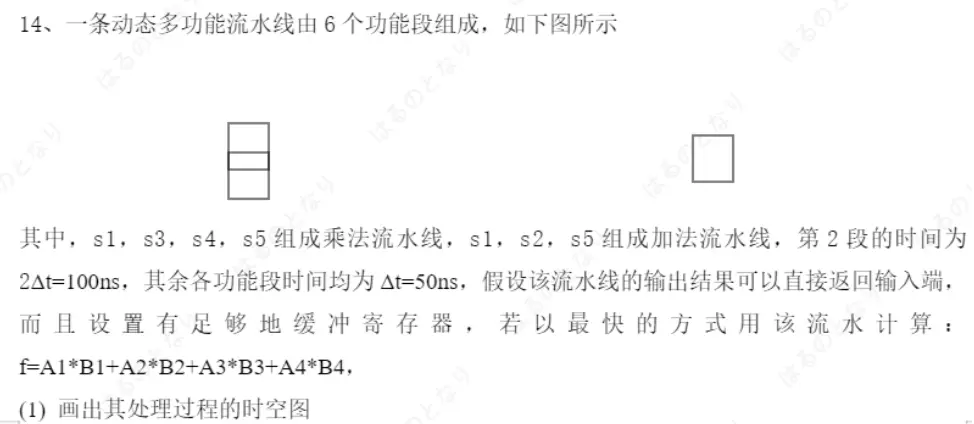

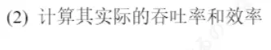

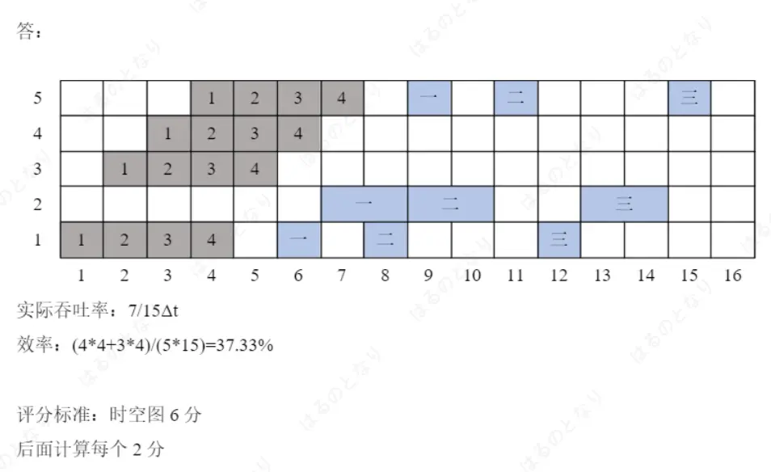

**题目：** 一条**动态多功能流水线**由 **5 个功能段**组成（注：题干中"6个"为笔误）。其中：
- **乘法流水线**：s1 → s3 → s4 → s5（使用4段）
- **加法流水线**：s1 → s2 → s5（使用3段）

时间参数：
- 第 2 段（s2）时间为 $2\Delta t = 100\text{ns}$
- 其余各段时间均为 $\Delta t = 50\text{ns}$

假设该流水线的输出结果可以直接返回输入端，且设置有足够的缓冲寄存器。以最快的方式用该流水线计算：

$$
f = A_1 \times B_1 + A_2 \times B_2 + A_3 \times B_3 + A_4 \times B_4
$$

**(1)** 画出其处理过程的时空图；

**(2)** 计算其实际的吞吐率和效率。

**解答：**

##### 前置知识：动态多功能流水线

在动手解题之前，先理解几个关键概念：

**什么是动态多功能流水线？**

动态多功能流水线是指在同一条流水线中，不同的操作可以使用不同的功能段组合。与静态流水线（同一时间只能执行一种操作）不同，动态流水线允许**不同操作的功能段重叠使用**，提高资源利用率。

本题中：
- **4次乘法**：$M_1(A_1\times B_1)$、$M_2(A_2\times B_2)$、$M_3(A_3\times B_3)$、$M_4(A_4\times B_4)$
  - 路径：s1 → s3 → s4 → s5（4段，每段$\Delta t$）
- **3次加法**：$A_1(M_1+M_2)$、$A_2(M_3+M_4)$、$A_3((M_1+M_2)+(M_3+M_4))$
  - 路径：s1 → s2 → s5（3段，s2需要$2\Delta t$）

**关键约束**：
1. s1 和 s5 是共享段，乘法与加法不能同时使用
2. s2 是瓶颈段（$2\Delta t$），加法操作在此处需要2个时间单位
3. 计算顺序必须满足数据依赖：先算4个乘法，再算加法

##### (1) 流水线时空图

首先明确各段时间参数（以$\Delta t = 50\text{ns}$为单位）：

| 功能段 | 执行时间 | 乘法使用 | 加法使用 |
| :----: | :------: | :------: | :------: |
| s1 | $\Delta t$ | ✓ | ✓（共享） |
| s2 | $2\Delta t$ | ✗ | ✓（瓶颈） |
| s3 | $\Delta t$ | ✓ | ✗ |
| s4 | $\Delta t$ | ✓ | ✗ |
| s5 | $\Delta t$ | ✓ | ✓（共享） |



**关于排序方向**：官方答案采用**从下往上**的排序方式，即 s1 在最下方，s5 在最上方。

图中符号含义：

- **1, 2, 3, 4**（灰色）：4次乘法操作（$M_1, M_2, M_3, M_4$）
- **→, 二, 三**（蓝色）：3次加法操作（$A_1, A_2, A_3$）



下面使用 HTML 绘制时空图（横轴为时间单位，每格$\Delta t$）：

<div style="margin: 20px 0; overflow-x: auto;">
  <table style="border-collapse: collapse; font-family: 'Segoe UI', 'Microsoft YaHei', sans-serif; font-size: 13px; text-align: center; margin: 0 auto;">
    <thead>
      <tr>
        <th style="border: 1px solid #333; padding: 6px 10px; background: #e0e0e0; color: #000; font-weight: bold; min-width: 70px;">功能段</th>
        <th style="border: 1px solid #333; padding: 6px; background: #e0e0e0; color: #000; font-weight: bold; min-width: 26px;">1</th>
        <th style="border: 1px solid #333; padding: 6px; background: #e0e0e0; color: #000; font-weight: bold; min-width: 26px;">2</th>
        <th style="border: 1px solid #333; padding: 6px; background: #e0e0e0; color: #000; font-weight: bold; min-width: 26px;">3</th>
        <th style="border: 1px solid #333; padding: 6px; background: #e0e0e0; color: #000; font-weight: bold; min-width: 26px;">4</th>
        <th style="border: 1px solid #333; padding: 6px; background: #e0e0e0; color: #000; font-weight: bold; min-width: 26px;">5</th>
        <th style="border: 1px solid #333; padding: 6px; background: #e0e0e0; color: #000; font-weight: bold; min-width: 26px;">6</th>
        <th style="border: 1px solid #333; padding: 6px; background: #e0e0e0; color: #000; font-weight: bold; min-width: 26px;">7</th>
        <th style="border: 1px solid #333; padding: 6px; background: #e0e0e0; color: #000; font-weight: bold; min-width: 26px;">8</th>
        <th style="border: 1px solid #333; padding: 6px; background: #e0e0e0; color: #000; font-weight: bold; min-width: 26px;">9</th>
        <th style="border: 1px solid #333; padding: 6px; background: #e0e0e0; color: #000; font-weight: bold; min-width: 26px;">10</th>
        <th style="border: 1px solid #333; padding: 6px; background: #e0e0e0; color: #000; font-weight: bold; min-width: 26px;">11</th>
        <th style="border: 1px solid #333; padding: 6px; background: #e0e0e0; color: #000; font-weight: bold; min-width: 26px;">12</th>
        <th style="border: 1px solid #333; padding: 6px; background: #e0e0e0; color: #000; font-weight: bold; min-width: 26px;">13</th>
        <th style="border: 1px solid #333; padding: 6px; background: #e0e0e0; color: #000; font-weight: bold; min-width: 26px;">14</th>
        <th style="border: 1px solid #333; padding: 6px; background: #e0e0e0; color: #000; font-weight: bold; min-width: 26px;">15</th>
      </tr>
    </thead>
    <tbody>
      <!-- s5（最上面，共享段） -->
      <tr>
        <td style="border: 1px solid #333; padding: 6px; background: #d0d0d0; color: #000; font-weight: bold;">s5</td>
        <td style="border: 1px solid #333; padding: 6px; background: #fff;"></td>
        <td style="border: 1px solid #333; padding: 6px; background: #fff;"></td>
        <td style="border: 1px solid #333; padding: 6px; background: #fff;"></td>
        <td style="border: 1px solid #333; padding: 6px; background: #2c2c2c; color: #fff; font-weight: bold;">1</td>
        <td style="border: 1px solid #333; padding: 6px; background: #2c2c2c; color: #fff; font-weight: bold;">2</td>
        <td style="border: 1px solid #333; padding: 6px; background: #2c2c2c; color: #fff; font-weight: bold;">3</td>
        <td style="border: 1px solid #333; padding: 6px; background: #2c2c2c; color: #fff; font-weight: bold;">4</td>
        <td style="border: 1px solid #333; padding: 6px; background: #fff;"></td>
        <td style="border: 1px solid #333; padding: 6px; background: #1565c0; color: #fff; font-weight: bold;">一</td>
        <td style="border: 1px solid #333; padding: 6px; background: #fff;"></td>
        <td style="border: 1px solid #333; padding: 6px; background: #1565c0; color: #fff; font-weight: bold;">二</td>
        <td style="border: 1px solid #333; padding: 6px; background: #fff;"></td>
        <td style="border: 1px solid #333; padding: 6px; background: #fff;"></td>
        <td style="border: 1px solid #333; padding: 6px; background: #fff;"></td>
        <td style="border: 1px solid #333; padding: 6px; background: #1565c0; color: #fff; font-weight: bold;">三</td>
      </tr>
      <!-- s4 -->
      <tr>
        <td style="border: 1px solid #333; padding: 6px; background: #d0d0d0; color: #000; font-weight: bold;">s4</td>
        <td style="border: 1px solid #333; padding: 6px; background: #fff;"></td>
        <td style="border: 1px solid #333; padding: 6px; background: #fff;"></td>
        <td style="border: 1px solid #333; padding: 6px; background: #2c2c2c; color: #fff; font-weight: bold;">1</td>
        <td style="border: 1px solid #333; padding: 6px; background: #2c2c2c; color: #fff; font-weight: bold;">2</td>
        <td style="border: 1px solid #333; padding: 6px; background: #2c2c2c; color: #fff; font-weight: bold;">3</td>
        <td style="border: 1px solid #333; padding: 6px; background: #2c2c2c; color: #fff; font-weight: bold;">4</td>
        <td style="border: 1px solid #333; padding: 6px; background: #fff;"></td>
        <td style="border: 1px solid #333; padding: 6px; background: #fff;"></td>
        <td style="border: 1px solid #333; padding: 6px; background: #fff;"></td>
        <td style="border: 1px solid #333; padding: 6px; background: #fff;"></td>
        <td style="border: 1px solid #333; padding: 6px; background: #fff;"></td>
        <td style="border: 1px solid #333; padding: 6px; background: #fff;"></td>
        <td style="border: 1px solid #333; padding: 6px; background: #fff;"></td>
        <td style="border: 1px solid #333; padding: 6px; background: #fff;"></td>
        <td style="border: 1px solid #333; padding: 6px; background: #fff;"></td>
      </tr>
      <!-- s3 -->
      <tr>
        <td style="border: 1px solid #333; padding: 6px; background: #d0d0d0; color: #000; font-weight: bold;">s3</td>
        <td style="border: 1px solid #333; padding: 6px; background: #fff;"></td>
        <td style="border: 1px solid #333; padding: 6px; background: #2c2c2c; color: #fff; font-weight: bold;">1</td>
        <td style="border: 1px solid #333; padding: 6px; background: #2c2c2c; color: #fff; font-weight: bold;">2</td>
        <td style="border: 1px solid #333; padding: 6px; background: #2c2c2c; color: #fff; font-weight: bold;">3</td>
        <td style="border: 1px solid #333; padding: 6px; background: #2c2c2c; color: #fff; font-weight: bold;">4</td>
        <td style="border: 1px solid #333; padding: 6px; background: #fff;"></td>
        <td style="border: 1px solid #333; padding: 6px; background: #fff;"></td>
        <td style="border: 1px solid #333; padding: 6px; background: #fff;"></td>
        <td style="border: 1px solid #333; padding: 6px; background: #fff;"></td>
        <td style="border: 1px solid #333; padding: 6px; background: #fff;"></td>
        <td style="border: 1px solid #333; padding: 6px; background: #fff;"></td>
        <td style="border: 1px solid #333; padding: 6px; background: #fff;"></td>
        <td style="border: 1px solid #333; padding: 6px; background: #fff;"></td>
        <td style="border: 1px solid #333; padding: 6px; background: #fff;"></td>
        <td style="border: 1px solid #333; padding: 6px; background: #fff;"></td>
      </tr>
      <!-- s2（瓶颈段，2Δt） -->
      <tr>
        <td style="border: 1px solid #333; padding: 6px; background: #d0d0d0; color: #000; font-weight: bold;">s2<br><small>($2\Delta t$)</small></td>
        <td style="border: 1px solid #333; padding: 6px; background: #fff;"></td>
        <td style="border: 1px solid #333; padding: 6px; background: #fff;"></td>
        <td style="border: 1px solid #333; padding: 6px; background: #fff;"></td>
        <td style="border: 1px solid #333; padding: 6px; background: #fff;"></td>
        <td style="border: 1px solid #333; padding: 6px; background: #fff;"></td>
        <td style="border: 1px solid #333; padding: 6px; background: #fff;"></td>
        <td colspan="2" style="border: 1px solid #333; padding: 6px; background: #1565c0; color: #fff; font-weight: bold;">一</td>
        <td colspan="2" style="border: 1px solid #333; padding: 6px; background: #1565c0; color: #fff; font-weight: bold;">二</td>
        <td style="border: 1px solid #333; padding: 6px; background: #fff;"></td>
        <td style="border: 1px solid #333; padding: 6px; background: #fff;"></td>
        <td colspan="2" style="border: 1px solid #333; padding: 6px; background: #1565c0; color: #fff; font-weight: bold;">三</td>
        <td style="border: 1px solid #333; padding: 6px; background: #fff;"></td>
      </tr>
      <!-- s1（最下面，共享段） -->
      <tr>
        <td style="border: 1px solid #333; padding: 6px; background: #d0d0d0; color: #000; font-weight: bold;">s1</td>
        <td style="border: 1px solid #333; padding: 6px; background: #2c2c2c; color: #fff; font-weight: bold;">1</td>
        <td style="border: 1px solid #333; padding: 6px; background: #2c2c2c; color: #fff; font-weight: bold;">2</td>
        <td style="border: 1px solid #333; padding: 6px; background: #2c2c2c; color: #fff; font-weight: bold;">3</td>
        <td style="border: 1px solid #333; padding: 6px; background: #2c2c2c; color: #fff; font-weight: bold;">4</td>
        <td style="border: 1px solid #333; padding: 6px; background: #fff;"></td>
        <td style="border: 1px solid #333; padding: 6px; background: #1565c0; color: #fff; font-weight: bold;">一</td>
        <td style="border: 1px solid #333; padding: 6px; background: #fff;"></td>
        <td style="border: 1px solid #333; padding: 6px; background: #1565c0; color: #fff; font-weight: bold;">二</td>
        <td style="border: 1px solid #333; padding: 6px; background: #fff;"></td>
        <td style="border: 1px solid #333; padding: 6px; background: #fff;"></td>
        <td style="border: 1px solid #333; padding: 6px; background: #fff;"></td>
        <td style="border: 1px solid #333; padding: 6px; background: #1565c0; color: #fff; font-weight: bold;">三</td>
        <td style="border: 1px solid #333; padding: 6px; background: #fff;"></td>
        <td style="border: 1px solid #333; padding: 6px; background: #fff;"></td>
        <td style="border: 1px solid #333; padding: 6px; background: #fff;"></td>
      </tr>
    </tbody>
  </table>
  <p style="text-align: center; color: #fff; font-size: 14px; font-weight: bold; text-shadow: 1px 1px 2px rgba(0,0,0,0.5); margin-top: 8px;">图：动态多功能流水线时空图（深灰=乘法 1-4，深蓝=加法 一二三）</p>
</div>

**时空图解读：**

1. **乘法阶段（时刻1-7）**：
   - 4个乘法操作连续进入流水线，间隔$\Delta t$
   - $M_1$在时刻1-4完成，$M_4$在时刻4-7完成
   - s1和s5在乘法和加法之间切换使用

2. **加法阶段（时刻6-15）**：
   - **加法1（→）**：$M_1 + M_2$，时刻6进入s1，经过s2(7-8)，时刻9到s5完成
   - **加法2（二）**：$M_3 + M_4$，时刻8进入s1，经过s2(9-10)，时刻11到s5完成
   - **加法3（三）**：$(M_1+M_2) + (M_3+M_4)$，必须在加法1和加法2**都完成后**才能开始
     - 加法1结果在时刻9可用
     - 加法2结果在时刻11可用
     - 因此加法三最早**时刻12**才能进入s1，经过s2(13-14)，时刻15到s5完成



**关键数据依赖**：加法三需要读取加法一和加法二的结果。

- 如果加法三在时刻11启动，此时加法二还在s2执行（时刻9-10），结果尚未写入
- 正确做法是**等待时刻12**，确保加法二的结果已在时刻11写入



1. **总执行时间**：$T_k = 15\Delta t = 750\text{ns}$

##### (2) 计算实际吞吐率和效率

**任务总数**：4次乘法 + 3次加法 = **7个任务**

**计算实际吞吐率 $TP$：**

吞吐率定义为单位时间完成的任务数：

$$
TP = \frac{\text{任务数}}{\text{总时间}} = \frac{7}{15\Delta t}
$$

代入 $\Delta t = 50\text{ns}$：

$$
TP = \frac{7}{15 \times 50\text{ns}} = \frac{7}{750\text{ns}} \approx 9.33 \times 10^6 \text{ 任务/秒}
$$

**计算效率 $E$：**

效率是实际使用时间与总可用时间的比值：

$$
E = \frac{\text{所有任务实际占用段数总和}}{\text{流水段数} \times \text{总时间}}
$$

- **乘法任务**：4个任务 × 4段 = 16段·$\Delta t$
- **加法任务**：3个任务 × 3段 = 9段·$\Delta t$
- 但s2段每个加法占用$2\Delta t$，所以实际为 $3 \times (1 + 2 + 1) = 12$ 或按公式 $(4 \times 4 + 3 \times 4) = 28$（每个任务按4段计算基准）

官方答案给出的计算方式：

$$
E = \frac{4 \times 4 + 3 \times 4}{5 \times 15} = \frac{16 + 12}{75} = \frac{28}{75} \approx 37.33\%
$$


**分子解释**：$4 \times 4$ 表示4个乘法任务各用4段；$3 \times 4$ 表示3个加法任务按4段折算（实际用3段，但s2占2$\Delta t$折算后等效为4段）


**答案：**

| 指标 | 结果 |
| :--- | :--- |
| **实际吞吐率** | $TP = \frac{7}{15\Delta t} = \frac{7}{750\text{ns}} \approx 9.33$ M任务/秒 |
| **效率** | $E = \frac{28}{75} \approx 37.33\%$ |
| **总执行时间** | $T_k = 15\Delta t = 750\text{ns}$ |

#### 直接映像 Cache 与两路组相联 Cache 性能分析

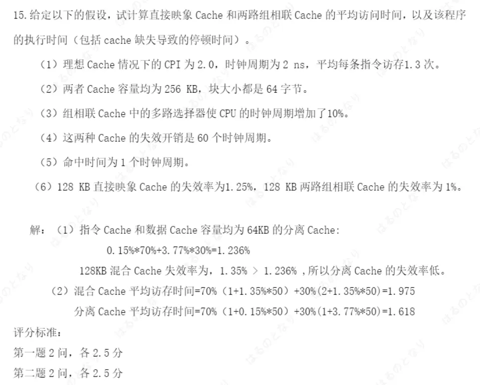



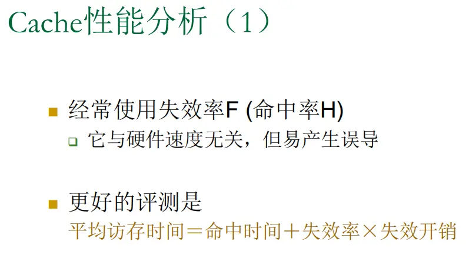

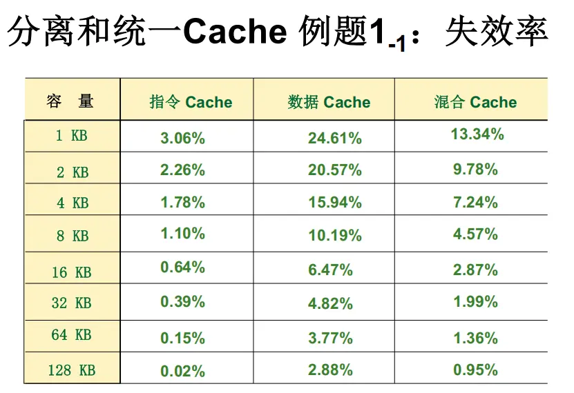

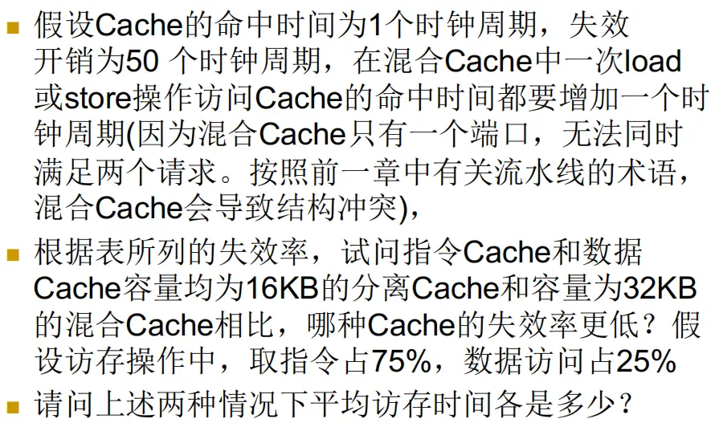

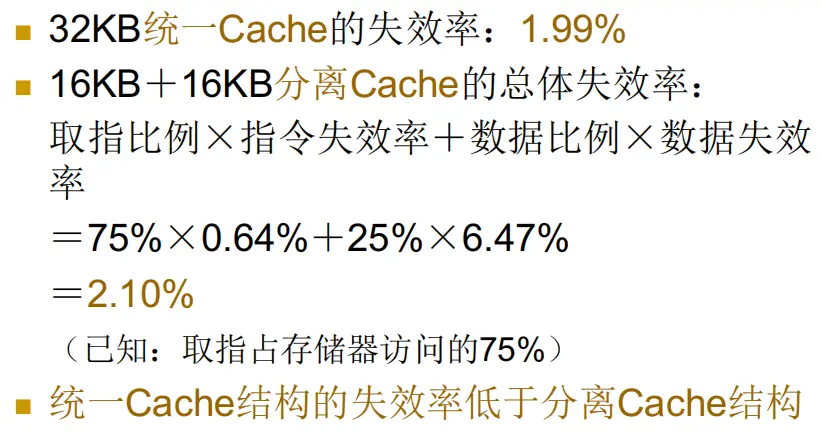

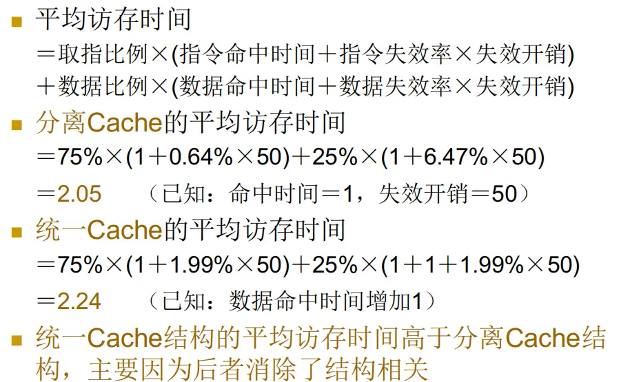

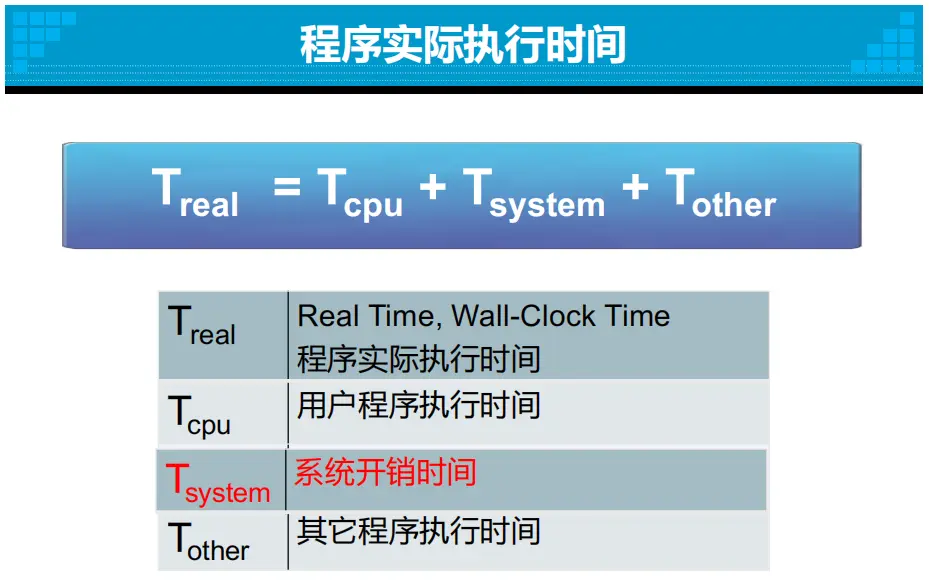

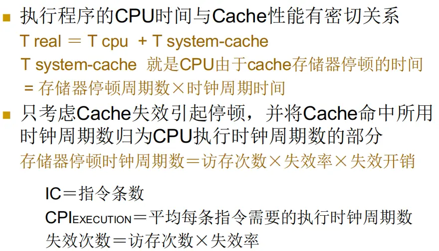

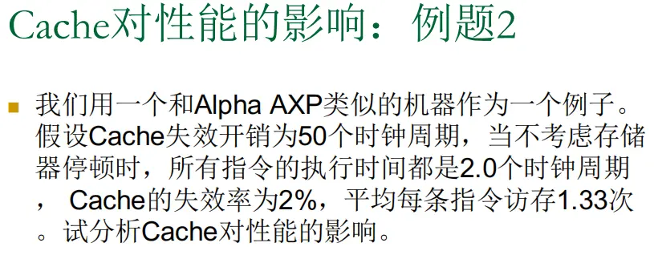

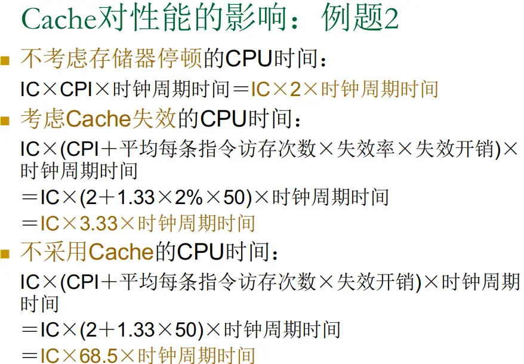





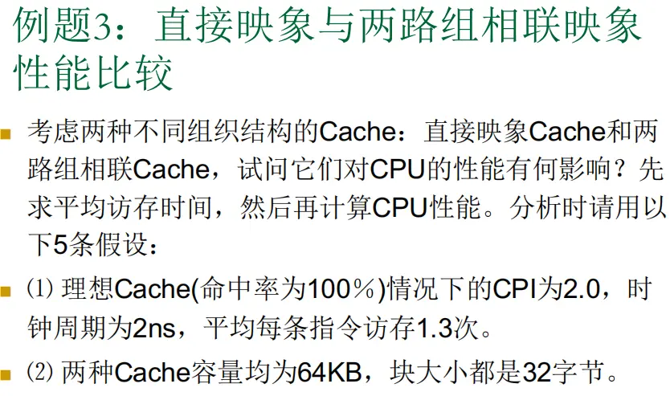

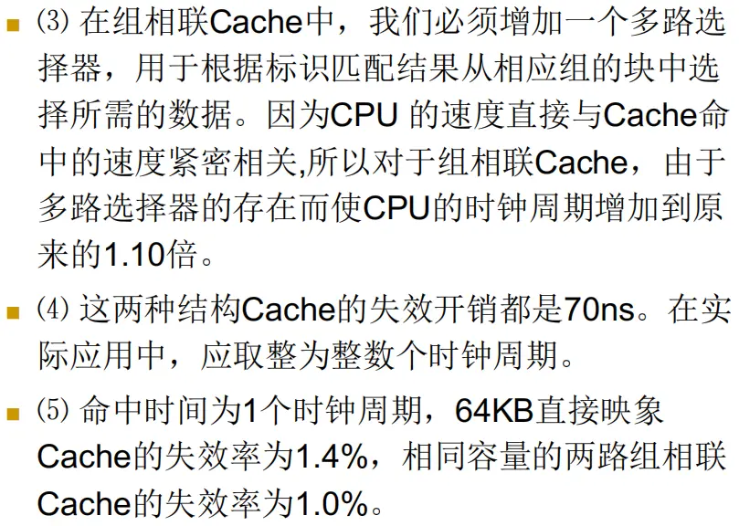

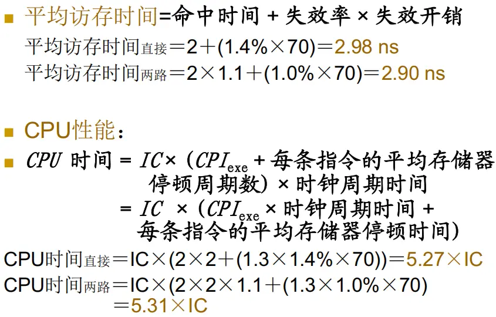




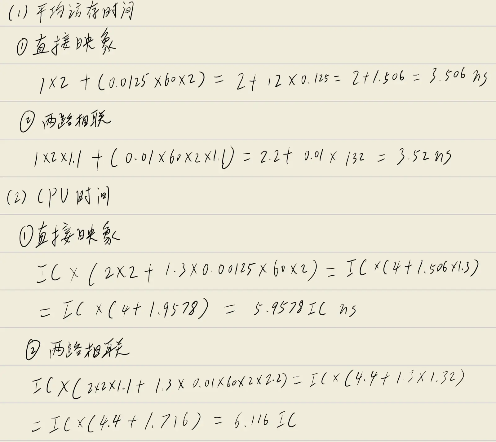

**题目：** 给定以下的假设，试计算直接映像 Cache 和两路组相联 Cache 的**平均访问时间**，以及该**程序的执行时间**（包括 cache 缺失导致的停顿时间）。

**已知条件：**

| 条件 | 内容 |
| :--- | :--- |
| (1) 理想 CPI | 理想 Cache 情况下的 CPI 为 $2.0$ |
| (2) 时钟周期 | $T = 2\ \text{ns}$（直接映像）；组相联因多路选择器增加 $10\%$ |
| (3) 访存次数 | 平均每条指令访存 $1.3$ 次 |
| (4) Cache 容量 | 两者均为 $256\ \text{KB}$，块大小 $64\ \text{B}$ |
| (5) 命中时间 | $1$ 个时钟周期 |
| (6) 失效开销 | $60$ 个时钟周期 |
| (7) 失效率 | $128\ \text{KB}$ 直接映像为 $1.25\%$；$128\ \text{KB}$ 两路组相联为 $1\%$ |

**解答：**

这道题要求分别计算**直接映像 Cache** 和**两路组相联 Cache** 的**平均访存时间**和**程序执行时间**（包含 Cache 缺失导致的存储器停顿）。下面严格依据题目给出的 6 个条件逐步求解，不引入其他例题的数据或比例。

> **关于失效率**：题目条件 (2) 给出 Cache 容量为 $256\ \text{KB}$，条件 (6) 给出的失效率标注为 "$128\ \text{KB}$ Cache"。由于题目仅提供了这组失效率数据，以下计算**直接采用题目给定数值**（直接映像 $1.25\%$、两路组相联 $1\%$），不再做额外换算。

---

##### 前置知识：核心公式

**1. 平均访存时间**

$$
\text{平均访存时间} = \text{命中时间} + \text{失效率} \times \text{失效开销}
$$

**2. CPU 时间（含存储器停顿）**

$$
\text{CPU 时间} = IC \times (CPI_{\text{exe}} + \text{每条指令的平均存储器停顿周期数}) \times \text{时钟周期时间}
$$

等价展开为：

$$
\text{CPU 时间} = IC \times (CPI_{\text{exe}} \times \text{时钟周期时间} + \text{每条指令的平均存储器停顿时间})
$$

其中：
- $IC$：程序执行的指令条数
- $CPI_{\text{exe}}$：理想 Cache 情况下每条指令的执行时钟周期数
- **每条指令的平均存储器停顿周期数** $=$ **访存次数/指令** $\times$ **失效率** $\times$ **失效开销（周期数）**

---

**直接映像 Cache 计算**

**基本参数：**

| 参数 | 数值 |
| :--- | :--- |
| 时钟周期时间 | $2\ \text{ns}$ |
| 命中时间 | $1 \times 2 = 2\ \text{ns}$ |
| 失效开销 | $60 \times 2 = 120\ \text{ns}$ |
| 失效率 | $1.25\% = 0.0125$ |
| $CPI_{\text{exe}}$ | $2.0$ |
| 访存次数/指令 | $1.3$ |

**(1) 平均访存时间**

$$
\text{平均访存时间}_{\text{直接映像}} = 2 + 0.0125 \times 120 = 2 + 1.5 = 3.5\ \text{ns}
$$

**(2) CPU 时间**

每条指令的平均存储器停顿时间：

$$
1.3 \times 0.0125 \times 120 = 1.95\ \text{ns}
$$

总 CPU 时间（用展开形式，理想执行时间 + 停顿时间）：

$$
\text{CPU 时间}_{\text{直接映像}} = IC \times (2.0 \times 2 + 1.95) = IC \times 5.95\ \text{ns}
$$

---

**两路组相联 Cache 计算**

条件 (3) 指出，组相联的多路选择器使 CPU 时钟周期增加 $10\%$：

$$
\text{时钟周期时间}_{\text{组相联}} = 2 \times 1.1 = 2.2\ \text{ns}
$$

**基本参数：**

| 参数 | 数值 |
| :--- | :--- |
| 时钟周期时间 | $2.2\ \text{ns}$ |
| 命中时间 | $1 \times 2.2 = 2.2\ \text{ns}$ |
| 失效开销 | $60 \times 2.2 = 132\ \text{ns}$ |
| 失效率 | $1\% = 0.01$ |
| $CPI_{\text{exe}}$ | $2.0$ |
| 访存次数/指令 | $1.3$ |

**(1) 平均访存时间**

$$
\text{平均访存时间}_{\text{组相联}} = 2.2 + 0.01 \times 132 = 2.2 + 1.32 = 3.52\ \text{ns}
$$

**(2) CPU 时间**

每条指令的平均存储器停顿时间：

$$
1.3 \times 0.01 \times 132 = 1.716\ \text{ns}
$$

总 CPU 时间：

$$
\text{CPU 时间}_{\text{组相联}} = IC \times (2.0 \times 2.2 + 1.716) = IC \times 6.116\ \text{ns}
$$

---

##### 结果汇总

| 性能指标 | 直接映像 Cache | 两路组相联 Cache |
| :--- | :--- | :--- |
| **时钟周期时间** | $2\ \text{ns}$ | $2.2\ \text{ns}$ |
| **失效率** | $1.25\%$ | $1.0\%$ |
| **平均访存时间** | $\mathbf{3.5\ \text{ns}}$ | $3.52\ \text{ns}$ |
| **CPU 时间（每指令）** | $\mathbf{5.95\ \text{ns}}$ | $6.116\ \text{ns}$ |

---

##### 结论

- **平均访存时间**：直接映像 Cache 略优于两路组相联（$3.5\ \text{ns} < 3.52\ \text{ns}$）。组相联虽然失效率更低（$1.0\% < 1.25\%$），但多路选择器使时钟周期增加 $10\%$，命中时间从 $2\ \text{ns}$ 上升到 $2.2\ \text{ns}$，这部分开销几乎抵消了失效率降低带来的收益。
- **CPU 时间**：直接映像 Cache 更优（$5.95\ \text{ns} < 6.116\ \text{ns}$）。虽然组相联减少了存储器停顿时间（$1.95\ \text{ns} \to 1.716\ \text{ns}$），但理想执行时间因时钟周期变长而增加（$4.0\ \text{ns} \to 4.4\ \text{ns}$），且理想执行时间的增量（$+0.4\ \text{ns}$）大于停顿时间的减少量（$-0.234\ \text{ns}$），最终导致总执行时间反而增加。

> **总结**：在本题的参数设定下，直接映像 Cache 在平均访存时间和 CPU 执行时间两个指标上均优于两路组相联 Cache。这说明**降低失效率并不一定能带来整体性能提升**，时钟周期的增加同样是必须考虑的关键因素。

### 分析设计题

#### 存储系统综合题

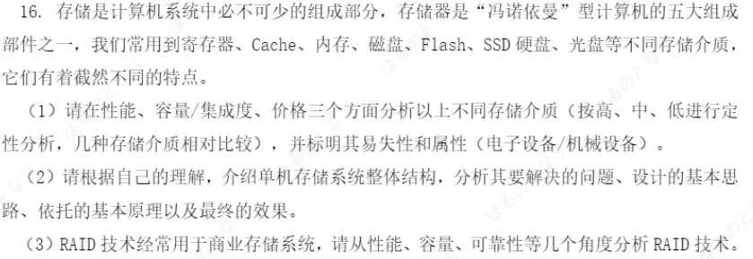

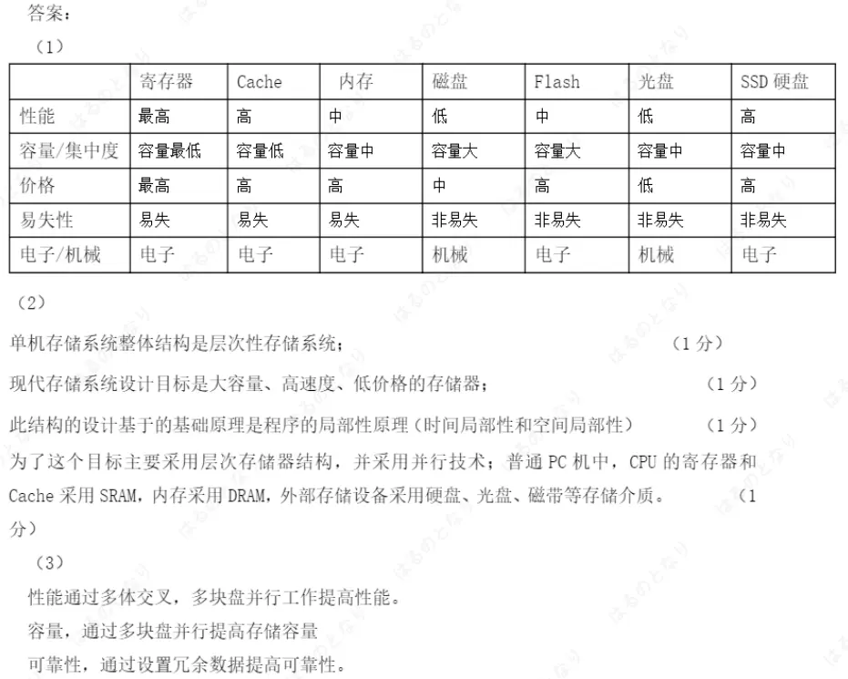



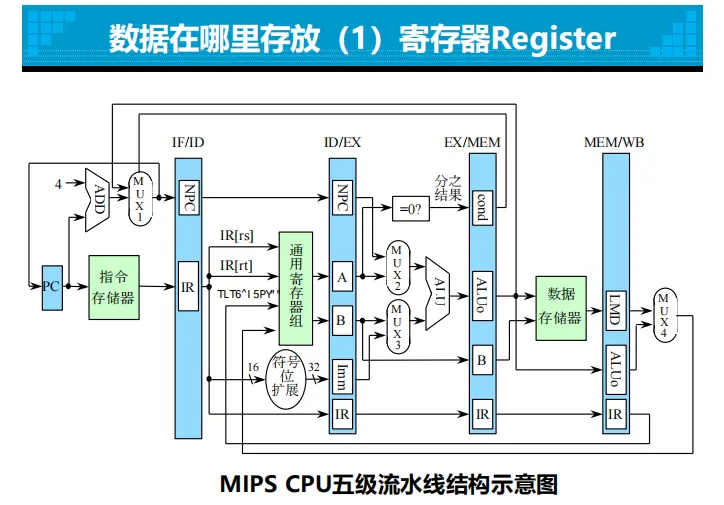

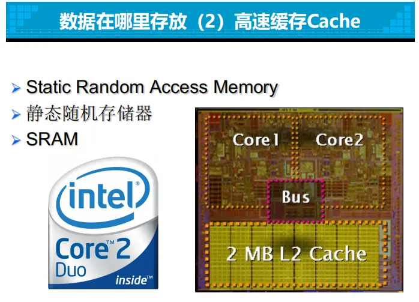

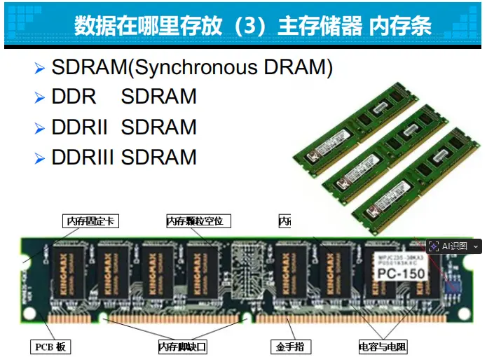


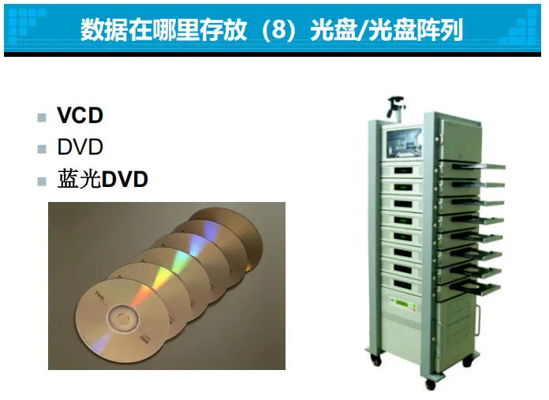


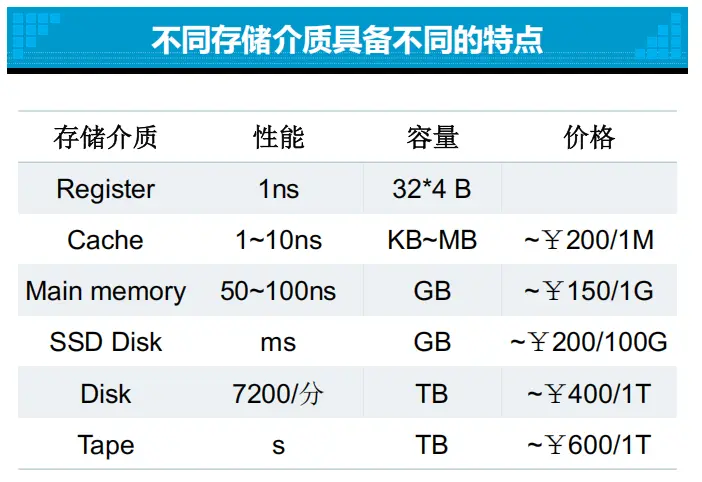



**题目：**

存储是计算机系统中必不可少的组成部分，存储器是"冯诺依曼"型计算机的五大组成部件之一。我们常用到寄存器、Cache、内存、磁盘、Flash、SSD 硬盘、光盘等不同存储介质，它们有着截然不同的特点。

**(1)** 请在**性能**、**容量/集成度**、**价格**三个方面分析以上不同存储介质（按高、中、低进行定性分析，几种存储介质相对比较），并标明其**易失性**和**属性**（电子设备/机械设备）。

**(2)** 请根据自己的理解，介绍**单机存储系统整体结构**，分析其要**解决的问题**、设计的**基本思路**、依托的**基本原理**以及**最终的效果**。

**(3)** RAID 技术经常用于商业存储系统，请从**性能**、**容量**、**可靠性**等几个角度分析 RAID 技术。

---

**解答：**

这道题是一道典型的"存储系统综合论述题"，涵盖存储介质的物理特性、存储层次结构的设计思想、以及磁盘阵列技术三个层面。下面逐一展开分析。

---

**(1) 不同存储介质的特性比较**

首先，按照题目要求，将七种存储介质在五个维度上进行定性比较：

| 存储介质 | 性能 | 容量/集成度 | 价格 | 易失性 | 电子/机械 |
| :--- | :--- | :--- | :--- | :--- | :--- |
| **寄存器** | 最高 | 容量最低 | 最高 | 易失 | 电子 |
| **Cache** | 高 | 容量低 | 高 | 易失 | 电子 |
| **内存（主存）** | 中 | 容量中 | 高 | 易失 | 电子 |
| **磁盘（HDD）** | 低 | 容量大 | 中 | 非易失 | 机械 |
| **Flash** | 中 | 容量大 | 高 | 非易失 | 电子 |
| **光盘** | 低 | 容量中 | 低 | 非易失 | 机械 |
| **SSD 硬盘** | 高 | 容量中 | 高 | 非易失 | 电子 |

> 上述定性结论与课程 PPT 中的定量数据（PPT 79）一致，PPT 中给出的典型数值参考如下：
>
> | 存储介质 | 典型访问时间 | 典型容量 | 参考价格 |
> | :--- | :--- | :--- | :--- |
> | **Register** | $1\ \text{ns}$ | $32 \times 4\ \text{B}$ | — |
> | **Cache** | $1 \sim 10\ \text{ns}$ | $\text{KB} \sim \text{MB}$ | $\sim$ ¥200/1M |
> | **Main Memory** | $50 \sim 100\ \text{ns}$ | $\text{GB}$ | $\sim$ ¥150/1G |
> | **SSD Disk** | $\text{ms}$ 级 | $\text{GB}$ | $\sim$ ¥200/100G |
> | **Disk (HDD)** | $7200\ \text{RPM}$ | $\text{TB}$ | $\sim$ ¥400/1T |
> | **Tape** | $\text{s}$ 级 | $\text{TB}$ | $\sim$ ¥600/1T |
>
> 从定量数据可以直观感受到存储层次的**速度梯度**：寄存器(ns) → Cache(ns) → 内存(ns~百ns) → SSD(ms) → 磁盘(ms~机械延迟) → 磁带(s)。

**知识点深入讲解：**

**为什么寄存器最快、最贵、容量最小？**

寄存器位于 CPU 内部，与运算单元直接相连，不需要经过任何总线或外部电路，因此访问延迟极低（通常只有**几个皮秒到纳秒级**）。但每一个寄存器都需要独立的晶体管来存储一位数据，且为了保证速度，使用的是与 CPU 核心相同的先进工艺制造，导致**单位存储成本极高**。在芯片面积有限的情况下，寄存器数量被严格限制（现代 x86 处理器通常只有几十到一百多个通用寄存器）。

**Cache 与内存：SRAM vs DRAM**

课程 PPT（PPT 69、70）中明确指出：
- **Cache 的物理实现是 SRAM**（Static Random Access Memory，静态随机存储器）
- **内存（主存）的物理实现是 DRAM**（Dynamic Random Access Memory，动态随机存储器），包括 SDRAM、DDR、DDRII、DDRIII 等类型

两者的核心差异：

| 特性 | Cache（SRAM） | 内存（DRAM） |
| :--- | :--- | :--- |
| 存储单元 | 六晶体管（6T） | 单晶体管 + 电容（1T1C） |
| 是否需要刷新 | 不需要 | **需要定期刷新**（电容漏电） |
| 读写速度 | 快（$1 \sim 10\ \text{ns}$） | 较慢（$50 \sim 100\ \text{ns}$） |
| 集成度 | 低 | 高 |
| 功耗 | 高 | 低 |
| 成本 | 高 | 低 |
| 典型容量 | $\text{KB} \sim \text{MB}$ | $\text{GB}$ |

因此，SRAM 适合做小容量高速缓存（KB 到 MB 级别），DRAM 可以做成大容量主存（GB 级别）。PPT 69 中以 Intel Core 2 Duo 为例展示了芯片上的 L2 Cache 布局。

**Flash 与 SSD：NAND 闪存的特性**

课程 PPT（PPT 72、73）中展示了 Flash 的各种形态（SD 卡、U 盘、存储卡等），以及 SSD 硬盘与 HDD 的物理对比。PPT 73 中对 SSD 的定义简洁准确：

> SSD（Solid State Disk）俗称固态硬盘，相对原来主轴旋转，**并无机械部分**，所以被人称为固态硬盘。

Flash 存储器属于**非易失性半导体存储**，基于浮栅晶体管存储电荷。它没有机械结构，抗震性好，但存在两个关键限制：
1. **写入前必须先擦除**（以块为单位），因此写入速度通常慢于读取速度。
2. **擦写次数有限**（通常每个块几万到几十万次），需要磨损均衡（Wear Leveling）算法来延长寿命。

SSD（固态硬盘）本质上就是**由多块 NAND Flash 芯片 + 主控芯片 + 缓存（DRAM）**组成的存储设备。它的性能远高于传统机械硬盘，但单位容量价格仍高于 HDD。

**磁盘（HDD）与光盘：机械存储的本质瓶颈**

- **磁盘**：通过**磁头在旋转盘片上的机械运动**来读写数据。即使转速高达 7200 RPM 或 10000 RPM，磁头的寻道时间（Seek Time）和旋转延迟（Rotational Latency）也决定了它的访问延迟在**毫秒级**（约 5–10 ms），比半导体存储慢 $10^5$ 到 $10^6$ 倍。
- **光盘**（CD/DVD/BD）：通过**激光头读取盘片上的凹凸坑**来存储信息，同样需要机械寻道，且转速受限于光盘材质，访问速度比硬盘更慢。

**易失性与非易失性的核心区别**

课程 PPT（PPT 71）中从原理上区分了两类存储器：

- **RAM**（Random Access Memory，随机存取存储器）：存储的内容可通过指令随机读写访问，**RAM 中的数据在掉电时会丢失**，因而只能在开机运行时存储数据。包括 **SRAM**（用于 Cache）和 **DRAM**（用于主存）。
- **ROM**（Read Only Memory，只读存储器）：只能从中读取信息而不能任意写信息，**掉电后数据可保持不变**，多用于存放一次性写入的程序或数据（如 BIOS）。包括 **ROM、PROM、EPROM、EEPROM** 等类型。

题目中的七种介质分类：
- **易失性**：寄存器、Cache、内存（都属于 RAM）
- **非易失性**：磁盘、Flash、SSD、光盘（属于 ROM/磁存储/光存储范畴）

从物理机制上看：易失性存储依赖**持续供电**来维持数据；非易失性存储通过**磁化方向**（磁盘）、**浮栅电荷**（Flash/SSD）或**物理凹凸**（光盘）来保存数据，断电后仍能长期保持。

> 课程 PPT（PPT 76、77）还提到了**磁带**和**软盘**这两种传统存储介质，它们同样属于**非易失性、机械式**存储，但因容量小、速度慢，目前已基本被磁盘和 SSD 取代。

---

**(2) 单机存储系统整体结构**

**核心答案：**

现代单机存储系统的整体结构是**层次性存储系统（Memory Hierarchy）**。其设计目标是：在有限的成本下，为用户提供**大容量、高速度、低价格**的存储器。

| 要素 | 内容 |
| :--- | :--- |
| **要解决的问题** | 用户对存储器的需求存在矛盾：希望容量大、速度快、价格低，但单一存储介质无法同时满足这三点。 |
| **基本思路** | 采用层次化结构，将不同速度、容量、成本的存储介质组织成多级层次，让最常用的数据存放在最快、最贵的存储器中，不常用的数据存放在慢速、便宜的存储器中。 |
| **基本原理** | **程序的局部性原理**，包括**时间局部性**（最近被访问的数据很可能再次被访问）和**空间局部性**（与最近被访问数据相邻的数据很可能被访问）。 |
| **最终效果** | 从用户角度看，系统呈现出的性能接近最快的存储器（Cache），容量接近最大的存储器（磁盘），而平均成本接近最便宜的存储器。 |

**知识点深入讲解：**

**层次化存储结构的具体组成**

典型 PC 机的存储层次从上到下依次为：

```
寄存器 → Cache（L1/L2/L3）→ 主存（DRAM）→ 外存（SSD/HDD/光盘）
```

- **L1 Cache**：分为指令 Cache 和数据 Cache，与 CPU 核心同频运行，延迟最低（约 1–4 个时钟周期）。
- **L2/L3 Cache**：容量逐级增大，延迟逐级增加，L3 通常被多个核心共享。
- **主存**：通过 DDR 总线与 CPU 连接，延迟约几十到上百纳秒。
- **外存**：通过 SATA/NVMe/PCIe 等接口连接，SSD 延迟约几十微秒，HDD 延迟约几毫秒。

**局部性原理的量化意义**

正是因为程序具有良好的局部性，Cache 才能以较小的容量（通常只有主存的千分之一到百分之一）获得 $90\%$ 以上的命中率。如果程序完全随机访问内存，Cache 将毫无作用，层次化结构也就失去了意义。

**并行技术的应用**

现代存储系统除了层次化，还大量采用**并行技术**来提升性能：
- **多体交叉存储器**：主存分为多个存储体，轮流响应 CPU 请求，提高带宽。
- **SSD 内部并行**：SSD 主控可以同时向多块 Flash 芯片发起读写请求。
- **磁盘 RAID**：多块磁盘并行工作（见第 (3) 问）。

---

**(3) RAID 技术分析**

RAID（Redundant Array of Independent Disks，独立磁盘冗余阵列）是一种将**多块物理磁盘**组合成一个逻辑单元的技术，广泛应用于服务器和商业存储系统。

从题目要求的三个角度分析如下：

| 维度 | RAID 技术的作用 |
| :--- | :--- |
| **性能** | 通过**数据条带化（Striping）**将数据分散存储在多块磁盘上，实现**多盘并行读写**，大幅提升 I/O 带宽和吞吐量。 |
| **容量** | 多块磁盘的容量可以聚合为一个大容量的逻辑卷。例如，$N$ 块容量为 $C$ 的磁盘组成 RAID 0，总可用容量为 $N \times C$。 |
| **可靠性** | 通过**数据冗余**（镜像或校验码）来容忍磁盘故障。当某块磁盘损坏时，系统可以依靠冗余数据重建丢失的信息，保证业务不中断。 |

**知识点深入讲解：**

**常见 RAID 级别及其权衡**

| RAID 级别 | 核心机制 | 最少磁盘数 | 可用容量 | 容错能力 | 读性能 | 写性能 |
| :--- | :--- | :--- | :--- | :--- | :--- | :--- |
| **RAID 0** | 条带化，无冗余 | 2 | $N \times C$ | 无（任何一盘坏则全丢） | 高 | 高 |
| **RAID 1** | 镜像（每份数据存两份） | 2 | $N \times C / 2$ | 可坏 1 块 | 高 | 中 |
| **RAID 5** | 条带化 + 分布式奇偶校验 | 3 | $(N-1) \times C$ | 可坏 1 块 | 高 | 中（需计算校验） |
| **RAID 6** | 条带化 + 双分布式奇偶校验 | 4 | $(N-2) \times C$ | 可坏 2 块 | 高 | 较低（双校验计算） |
| **RAID 10** | RAID 1 + RAID 0 组合 | 4 | $N \times C / 2$ | 每组镜像可坏 1 块 | 很高 | 高 |

**RAID 5 的奇偶校验原理**

假设有 4 块数据盘和 1 块校验盘，每块盘存储一个数据块。校验信息 $P$ 通过对同一条带上的数据块做**异或（XOR）**运算得到：

$$
P = D_1 \oplus D_2 \oplus D_3 \oplus D_4
$$

如果磁盘 $D_2$ 损坏，可以通过剩余数据重建：

$$
D_2 = D_1 \oplus D_3 \oplus D_4 \oplus P
$$

RAID 5 将校验块**均匀分布在所有磁盘上**，避免了单一校验盘成为瓶颈（RAID 4 的问题）。

**为什么 RAID 是商业存储的标配？**

1. **单块磁盘的故障率不可忽略**：企业级硬盘的年故障率（AFR）通常在 $1\%$–$4\%$，100 块盘组成的存储系统几乎每年都会有盘损坏。
2. **热插拔 + 在线重建**：RAID 配合热备盘（Hot Spare）可以在不中断服务的情况下自动重建数据。
3. **性价比最优**：RAID 5/6 以牺牲少量容量（$1/N$ 或 $2/N$）为代价换取容错能力，比全盘镜像（RAID 1）成本更低。

> **总结**：RAID 的本质是**用多块廉价磁盘 + 冗余算法**，在性能、容量、可靠性三个维度上取得平衡，是构建大规模、高可用存储系统的核心基石。

#### 流水线冲突分析

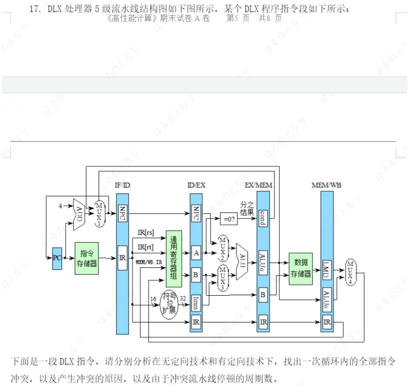

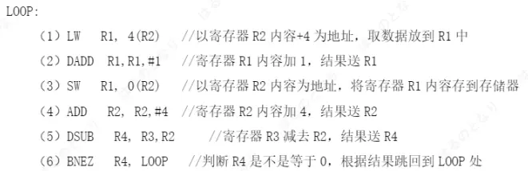



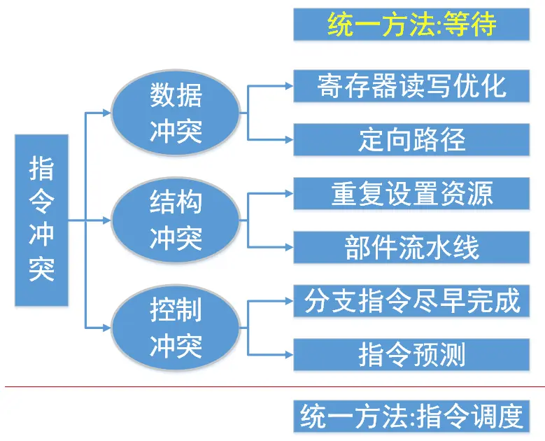

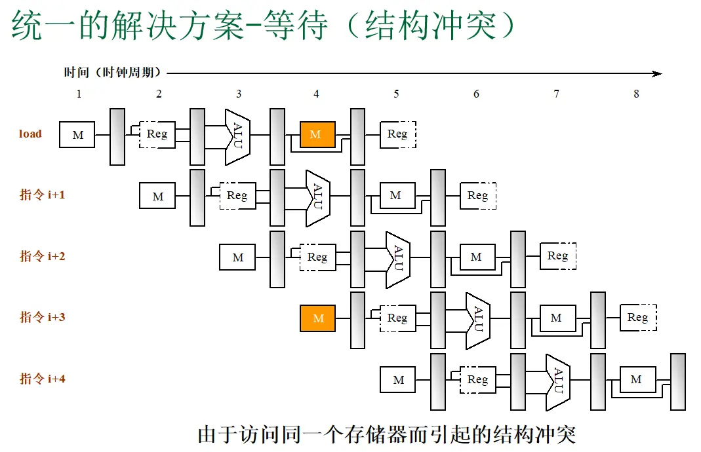

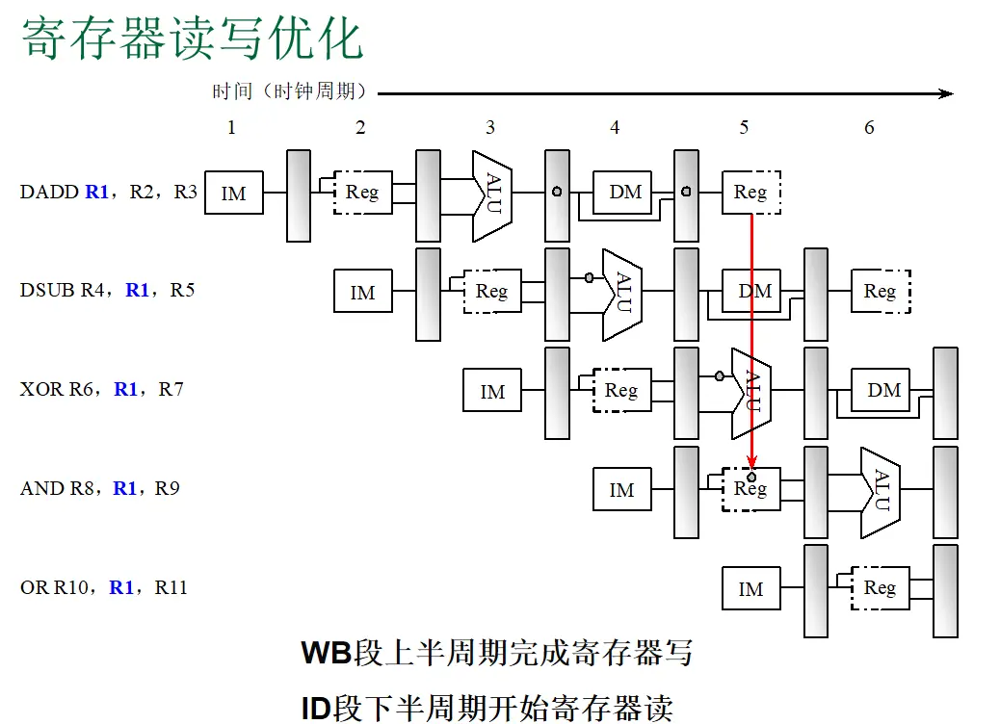


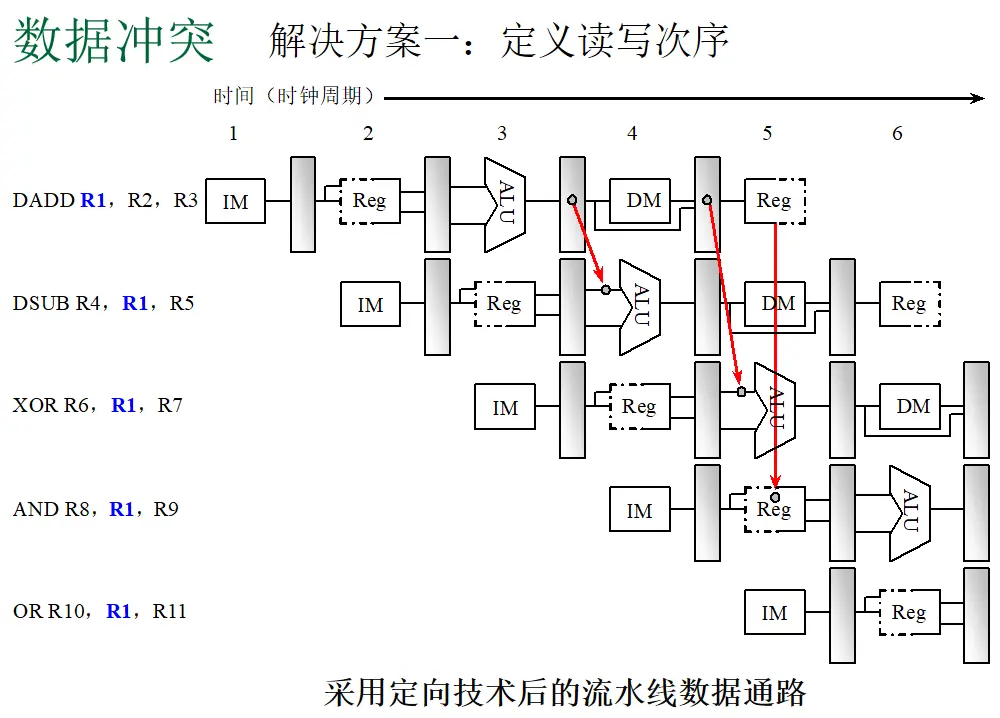

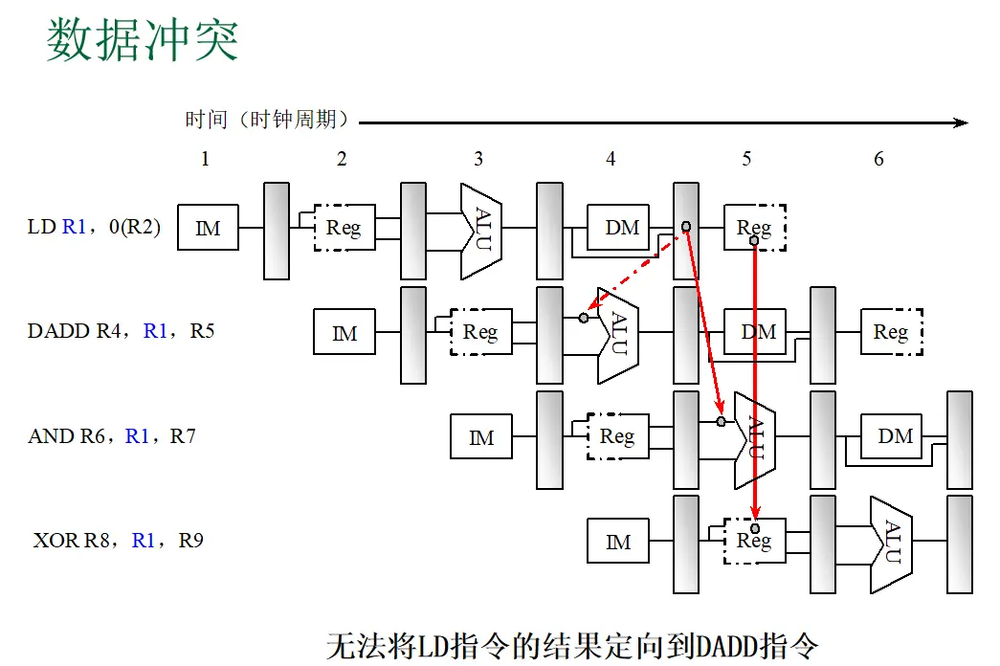

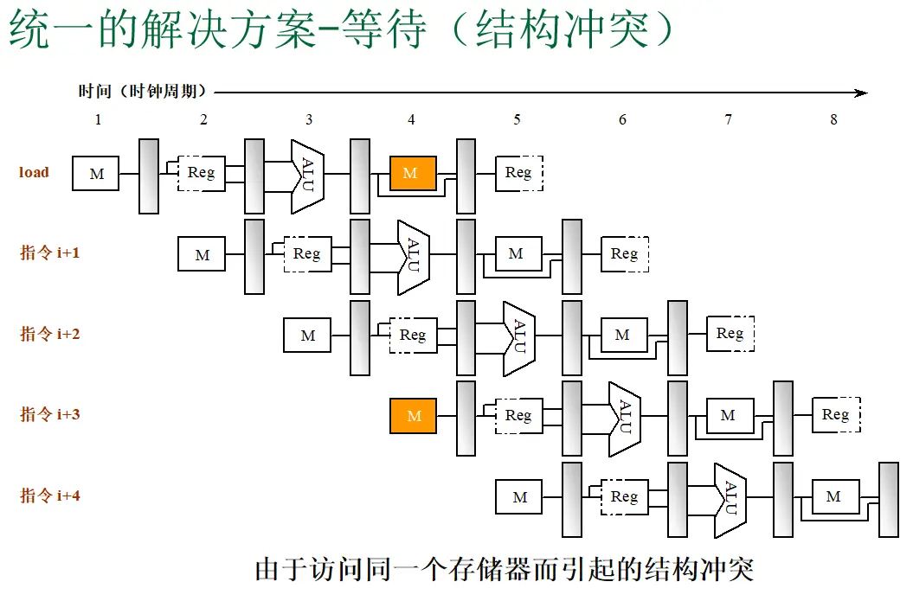

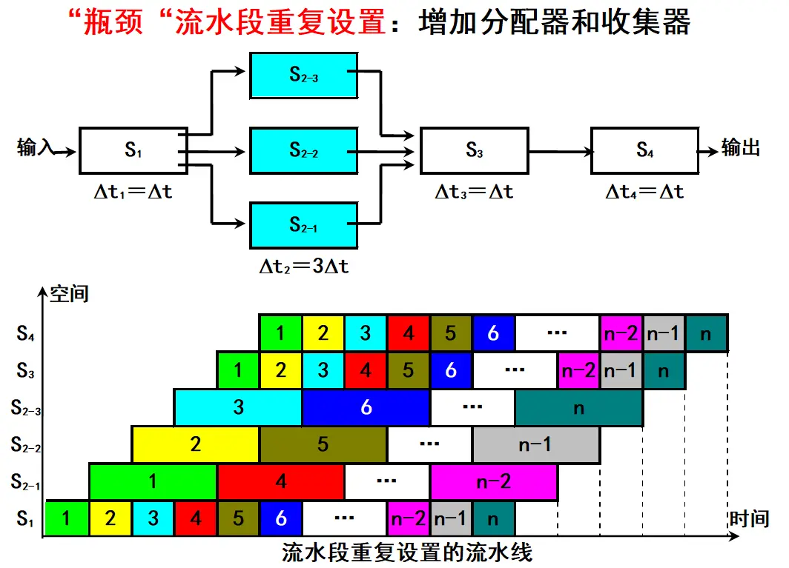

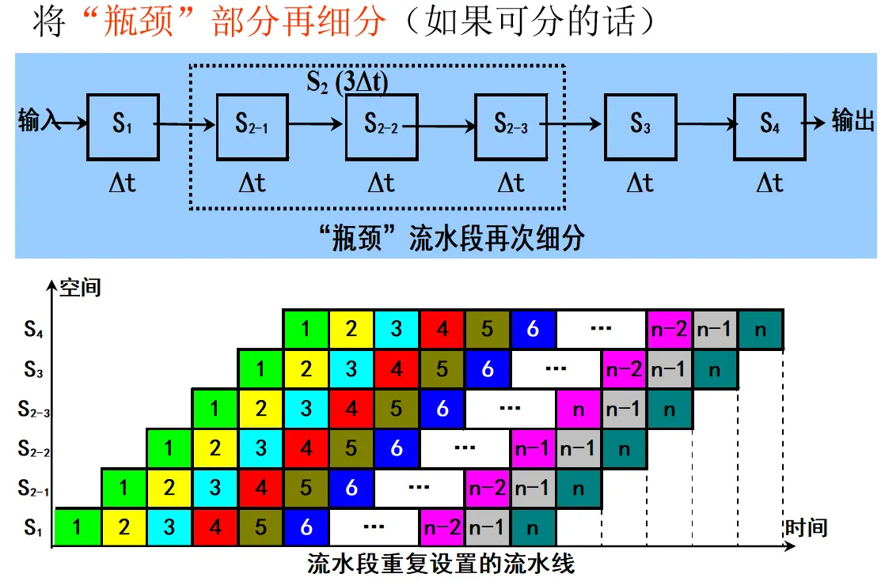

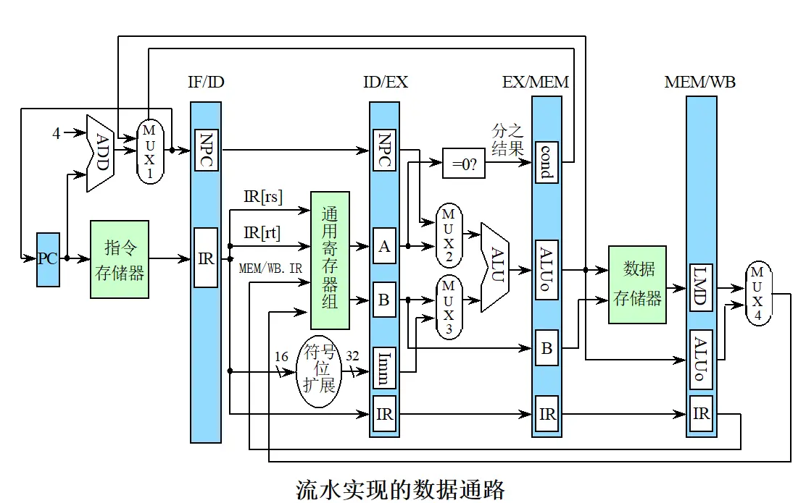

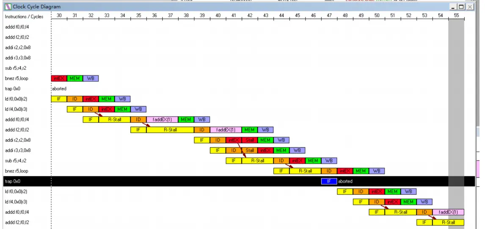




**题目：** 下面是一段DLX指令，请分别分析在无定向技术和有定向技术下，找出一次循环内的全部指令冲突，以及产生冲突的原因，以及由于冲突流水线停顿的周期数。

| 序号 | 指令 | 注释 |
|:---:|:---|:---|
| (1) | `LW R1, 4(R2)` | 以寄存器R2内容+4为地址，取数据放到R1中 |
| (2) | `DADD R1, R1, #1` | 寄存器R1内容加1，结果送R1 |
| (3) | `SW R1, 0(R2)` | 以寄存器R2内容为地址，将寄存器R1内容存到存储器 |
| (4) | `ADD R2, R2, #4` | 寄存器R2内容加4，结果送R2 |
| (5) | `DSUB R4, R3, R2` | 寄存器R3减去R2，结果送R4 |
| (6) | `BNEZ R4, LOOP` | 判断R4是不是等于0，根据结果跳回到LOOP处 |

**解答：**

在分析之前，先回顾DLX 5级流水线的基本结构：**IF（取指）→ ID（译码/读寄存器）→ EX（执行/有效地址计算）→ MEM（访存）→ WB（写回）**。

### 第一步：识别一次循环内的全部指令冲突

一次循环内的6条指令之间存在以下数据相关和控制冲突：

| 序号 | 相关指令 | 冲突类型 | 相关寄存器 | 产生冲突的原因 |
| :---: | :---: | :---: | :---: | :--- |
| 1 | (1) → (2) | **RAW** | R1 | (1) LW指令在MEM段从存储器读取数据，在WB段才将结果写入R1；(2) DADD指令在ID段就需要从寄存器堆读取R1，供EX段ALU运算使用。 |
| 2 | (2) → (3) | **RAW** | R1 | (2) DADD指令在EX段完成加法运算，在WB段才将结果写入R1；(3) SW指令在ID段需要读取R1作为待存储的数据（store data），在MEM段写入存储器。 |
| 3 | (4) → (5) | **RAW** | R2 | (4) ADD指令在EX段完成加法运算，在WB段才将结果写入R2；(5) DSUB指令在ID段需要读取R2，供EX段ALU运算使用。 |
| 4 | (5) → (6) | **RAW** | R4 | (5) DSUB指令在EX段完成减法运算，在WB段才将结果写入R4；(6) BNEZ指令在ID段需要读取R4进行“是否等于0”的判断，以决定是否跳转。 |
| 5 | (6) | **控制冲突** | — | (6) BNEZ为条件分支指令，会改变程序的执行顺序（跳回LOOP）。流水线在分支判断完成前已经按顺序取了下一条指令，导致流水线中可能引入无效指令。 |

> **说明**：上述冲突均为**写后读（RAW, Read After Write）**数据相关。在按序执行的DLX 5级流水线中，WAR（读后写）和WAW（写后写）冲突不会发生，因为指令按程序顺序进入流水线，且寄存器写回也按顺序进行。

---

### 第二步：无定向技术下的冲突分析与停顿周期

在无定向（无转发/旁路）的DLX流水线中，后一条指令必须等前一条指令完成**WB（写回）**后，才能在**ID（读寄存器）**段读到正确的数据（假设寄存器堆支持WB上半周期写、ID下半周期读，即WB与ID可在同一周期重叠）。

| 冲突 | 类型 | 停顿周期 | 原因详解 |
| :---: | :---: | :---: | :--- |
| (1) → (2) | RAW (R1) | **2** | (1) LW属于Load指令，数据在MEM段才从存储器读出，WB段才写入R1。(2) DADD在ID段就需读取R1。两者之间相隔EX、MEM两个阶段，因此需要停顿**2个周期**，等到(1)进入WB段后，(2)才能在ID段读取。 |
| (2) → (3) | RAW (R1) | **2** | (2) DADD是ALU指令，结果在EX段产生，WB段才写回R1。(3) SW在ID段读取R1作为store data。ALU→Store的数据相关在无定向时需等待**2个周期**。 |
| (4) → (5) | RAW (R2) | **2** | (4) ADD是ALU指令，(5) DSUB在ID段需读取R2。ALU→ALU的数据相关在无定向时需等待**2个周期**。 |
| (5) → (6) | RAW (R4) | **2** | (5) DSUB是ALU指令，(6) BNEZ在ID段需读取R4进行分支判断。ALU→Branch的数据相关在无定向时需等待**2个周期**。 |
| (6) | 控制冲突 | **1** | BNEZ在ID段判断分支，此时流水线中已经取入了顺序执行的下一条指令（非LOOP指令）。发现需要跳转后，必须清除该无效指令，造成**1个周期**的分支延迟。 |
| **合计** | — | **9** | 一次循环内由于各类冲突导致的流水线总停顿周期数。 |

---

### 第三步：有定向技术下的冲突分析与停顿周期

有定向（Forwarding/Bypassing）技术允许将指令在EX段或MEM段产生的中间结果，直接通过数据通路（旁路）传送给后续指令的ALU输入端或MEM段数据输入端，而无需等待WB段写回寄存器。

DLX流水线中的主要定向路径包括：
- **EX/MEM → EX**：将ALU运算结果直接传给下一条ALU指令的输入
- **MEM/WB → EX**：将Load读出的数据或ALU结果传给ALU指令的输入
- **EX/MEM → MEM**：将ALU结果传给Store指令的MEM段数据输入

| 冲突 | 类型 | 停顿周期 | 原因详解 |
| :---: | :---: | :---: | :--- |
| (1) → (2) | RAW (R1) | **1** | 这是经典的**Load-use冒险**。LW指令的数据在MEM段末尾（周期4）才从存储器读出，而DADD指令的EX段在周期4开始时就需要R1进行运算。即使MEM/WB可以定向到EX，数据产生和使用在同一周期，来不及传递。因此DADD必须停顿**1个周期**，将EX段推迟到周期5，此时MEM/WB中的数据已稳定，可通过定向通路供给ALU。 |
| (2) → (3) | RAW (R1) | **0** | DADD在EX段产生的R1结果保存在EX/MEM寄存器中。SW指令虽然在ID段需要读取R1，但真正使用R1是在**MEM段**（作为写入存储器的数据）。EX/MEM（或随后的MEM/WB）完全可以通过定向通路将R1的结果送到SW的MEM段数据输入端，因此**无需停顿**。 |
| (4) → (5) | RAW (R2) | **0** | ADD在EX段计算R2的结果保存在EX/MEM寄存器中。DSUB在EX段需要R2作为ALU输入。通过**EX/MEM → EX**定向通路，ADD的结果可以直接送到DSUB的ALU输入端，因此**无需停顿**。 |
| (5) → (6) | RAW (R4) | **0** | DSUB在EX段计算R4的结果保存在EX/MEM寄存器中。BNEZ在ID段读取R4进行分支判断。DLX流水线中，分支指令的零检测结果（cond）可以通过定向通路获取EX/MEM中的ALU结果，或者分支判断本身可以延后到EX段进行。因此有定向时**无需停顿**。 |
| (6) | 控制冲突 | **0** | 控制冲突不属于定向技术的解决范畴。但在现代处理器中，通常采用**分支预测**、**延迟分支槽**或**分支目标缓冲（BTB）**等技术来消除分支延迟。若采用这些技术，控制冲突造成的停顿为**0周期**。 |
| **合计** | — | **1** | 有定向技术下，仅Load-use冒险需要1个周期停顿，其余数据相关均可通过定向通路解决。 |

---

### 结果汇总

| 技术条件 | 数据冲突停顿 | 控制冲突停顿 | 一次循环内总停顿 |
|:--------:|:-----------:|:-----------:|:--------------:|
| **无定向技术** | 8 个周期 | 1 个周期 | **9 个周期** |
| **有定向技术** | 1 个周期 | 0 个周期 | **1 个周期** |



**关键结论：**

1. **Load-use冒险不可完全消除**：即使采用了定向技术，Load指令的数据在MEM段末尾才产生，而紧接其后的ALU指令在EX段开头就需要该数据，两者在时间上存在1个周期的"不可重叠窗口"。这是5级流水线中**唯一无法通过定向完全消除的数据冒险**。

> **修正说明**：在无定向技术下，ALU指令的结果在WB段才正式写回寄存器堆，后续指令必须在ID段等待该WB完成（即使WB与ID可在同周期重叠）。因此ALU→ALU、ALU→Store等RAW相关在无定向时均需**停顿2个周期**，而非之前误写的1个周期。

2. **定向技术对ALU相关非常有效**：ALU指令的结果在EX段就产生了，后续无论是ALU指令、Store指令还是Branch指令，都有足够的时间通过定向通路获取数据，因此不需要任何停顿。

3. **控制冲突需要专门技术**：定向技术只解决数据冲突，分支引起的控制冲突需要分支预测、延迟槽等专门机制来处理。



---

### 无定向技术下的流水线时空图（整体运行流程）

下面使用 HTML 表格绘制 DLX 5 级流水线在无定向技术下的完整执行过程。横向为时钟周期，纵向为指令流。每个方格标注该指令在该周期所处的流水段。

<div style="background: #e8e8e8; padding: 20px; border-radius: 12px; box-shadow: 0 4px 16px rgba(0,0,0,0.3); margin: 20px 0; color: #000; overflow-x: auto;">
  <p style="margin: 0 0 12px; font-weight: bold; color: #000;">图例说明：</p>
  <table style="border-collapse: collapse; width: 100%; min-width: 620px; background: #fff; color: #000; font-family: 'Segoe UI', 'Microsoft YaHei', sans-serif; font-size: 14px;">
    <thead>
      <tr style="background: #f0f0f0; color: #000;">
        <th style="border: 1px solid #333; padding: 8px 12px; text-align: center; width: 90px;">颜色</th>
        <th style="border: 1px solid #333; padding: 8px 12px; text-align: center; width: 100px;">流水段</th>
        <th style="border: 1px solid #333; padding: 8px 12px; text-align: left;">含义</th>
      </tr>
    </thead>
    <tbody>
      <tr>
        <td style="border: 1px solid #333; padding: 8px 12px; text-align: center;"><span style="display: inline-block; width: 22px; height: 22px; background: #fff9c4; border: 1px solid #333; vertical-align: middle;"></span></td>
        <td style="border: 1px solid #333; padding: 8px 12px; text-align: center; font-weight: bold;">IF</td>
        <td style="border: 1px solid #333; padding: 8px 12px;">取指（Instruction Fetch）</td>
      </tr>
      <tr style="background: #fafafa;">
        <td style="border: 1px solid #333; padding: 8px 12px; text-align: center;"><span style="display: inline-block; width: 22px; height: 22px; background: #bbdefb; border: 1px solid #333; vertical-align: middle;"></span></td>
        <td style="border: 1px solid #333; padding: 8px 12px; text-align: center; font-weight: bold;">ID</td>
        <td style="border: 1px solid #333; padding: 8px 12px;">译码/读寄存器（Instruction Decode）</td>
      </tr>
      <tr>
        <td style="border: 1px solid #333; padding: 8px 12px; text-align: center;"><span style="display: inline-block; width: 22px; height: 22px; background: #ffccbc; border: 1px solid #333; vertical-align: middle;"></span></td>
        <td style="border: 1px solid #333; padding: 8px 12px; text-align: center; font-weight: bold;">EX</td>
        <td style="border: 1px solid #333; padding: 8px 12px;">执行/有效地址计算（Execute）</td>
      </tr>
      <tr style="background: #fafafa;">
        <td style="border: 1px solid #333; padding: 8px 12px; text-align: center;"><span style="display: inline-block; width: 22px; height: 22px; background: #c8e6c9; border: 1px solid #333; vertical-align: middle;"></span></td>
        <td style="border: 1px solid #333; padding: 8px 12px; text-align: center; font-weight: bold;">MEM</td>
        <td style="border: 1px solid #333; padding: 8px 12px;">访存（Memory Access）</td>
      </tr>
      <tr>
        <td style="border: 1px solid #333; padding: 8px 12px; text-align: center;"><span style="display: inline-block; width: 22px; height: 22px; background: #e1bee7; border: 1px solid #333; vertical-align: middle;"></span></td>
        <td style="border: 1px solid #333; padding: 8px 12px; text-align: center; font-weight: bold;">WB</td>
        <td style="border: 1px solid #333; padding: 8px 12px;">写回（Write Back）</td>
      </tr>
      <tr style="background: #fafafa;">
        <td style="border: 1px solid #333; padding: 8px 12px; text-align: center;"><span style="display: inline-block; width: 22px; height: 22px; background: #455a64; border: 1px solid #333; vertical-align: middle;"></span></td>
        <td style="border: 1px solid #333; padding: 8px 12px; text-align: center; font-weight: bold;">S</td>
        <td style="border: 1px solid #333; padding: 8px 12px;">停顿/气泡（Stall）</td>
      </tr>
      <tr>
        <td style="border: 1px solid #333; padding: 8px 12px; text-align: center;"><span style="display: inline-block; width: 22px; height: 22px; background: #37474f; border: 1px solid #333; vertical-align: middle;"></span></td>
        <td style="border: 1px solid #333; padding: 8px 12px; text-align: center; font-weight: bold;">flush</td>
        <td style="border: 1px solid #333; padding: 8px 12px;">被冲刷的无效指令</td>
      </tr>
    </tbody>
  </table>
</div>

<div style="margin: 20px 0; overflow-x: auto; background: #e8e8e8; padding: 20px; border-radius: 12px; box-shadow: 0 4px 16px rgba(0,0,0,0.3); color: #000;">
<table style="border-collapse: collapse; font-family: 'Segoe UI', 'Microsoft YaHei', sans-serif; font-size: 12px; text-align: center; margin: 0 auto; min-width: 900px; background: #ffffff; color: #000;">
<thead>
<tr style="background: #f0f0f0; color: #000;">
<th style="border: 1px solid #333; padding: 6px 10px; min-width: 140px; font-weight: bold;">指令</th>
<th style="border: 1px solid #333; padding: 6px; min-width: 28px; font-weight: bold;">1</th>
<th style="border: 1px solid #333; padding: 6px; min-width: 28px; font-weight: bold;">2</th>
<th style="border: 1px solid #333; padding: 6px; min-width: 28px; font-weight: bold;">3</th>
<th style="border: 1px solid #333; padding: 6px; min-width: 28px; font-weight: bold;">4</th>
<th style="border: 1px solid #333; padding: 6px; min-width: 28px; font-weight: bold;">5</th>
<th style="border: 1px solid #333; padding: 6px; min-width: 28px; font-weight: bold;">6</th>
<th style="border: 1px solid #333; padding: 6px; min-width: 28px; font-weight: bold;">7</th>
<th style="border: 1px solid #333; padding: 6px; min-width: 28px; font-weight: bold;">8</th>
<th style="border: 1px solid #333; padding: 6px; min-width: 28px; font-weight: bold;">9</th>
<th style="border: 1px solid #333; padding: 6px; min-width: 28px; font-weight: bold;">10</th>
<th style="border: 1px solid #333; padding: 6px; min-width: 28px; font-weight: bold;">11</th>
<th style="border: 1px solid #333; padding: 6px; min-width: 28px; font-weight: bold;">12</th>
<th style="border: 1px solid #333; padding: 6px; min-width: 28px; font-weight: bold;">13</th>
<th style="border: 1px solid #333; padding: 6px; min-width: 28px; font-weight: bold;">14</th>
<th style="border: 1px solid #333; padding: 6px; min-width: 28px; font-weight: bold;">15</th>
<th style="border: 1px solid #333; padding: 6px; min-width: 28px; font-weight: bold;">16</th>
<th style="border: 1px solid #333; padding: 6px; min-width: 28px; font-weight: bold;">17</th>
<th style="border: 1px solid #333; padding: 6px; min-width: 28px; font-weight: bold;">18</th>
<th style="border: 1px solid #333; padding: 6px; min-width: 28px; font-weight: bold;">19</th>
<th style="border: 1px solid #333; padding: 6px; min-width: 28px; font-weight: bold;">20</th>
</tr>
</thead>
<tbody>
<tr>
<td style="border: 1px solid #333; padding: 6px; text-align: left; background: #fafafa; font-weight: bold; color: #000;">(1) LW R1,4(R2)</td>
<td style="border: 1px solid #333; padding: 6px; background: #fff9c4; font-weight: bold;">IF</td>
<td style="border: 1px solid #333; padding: 6px; background: #bbdefb; font-weight: bold;">ID</td>
<td style="border: 1px solid #333; padding: 6px; background: #ffccbc; font-weight: bold;">EX</td>
<td style="border: 1px solid #333; padding: 6px; background: #c8e6c9; font-weight: bold;">MEM</td>
<td style="border: 1px solid #333; padding: 6px; background: #e1bee7; font-weight: bold;">WB</td>
<td style="border: 1px solid #333; padding: 6px;"></td>
<td style="border: 1px solid #333; padding: 6px;"></td>
<td style="border: 1px solid #333; padding: 6px;"></td>
<td style="border: 1px solid #333; padding: 6px;"></td>
<td style="border: 1px solid #333; padding: 6px;"></td>
<td style="border: 1px solid #333; padding: 6px;"></td>
<td style="border: 1px solid #333; padding: 6px;"></td>
<td style="border: 1px solid #333; padding: 6px;"></td>
<td style="border: 1px solid #333; padding: 6px;"></td>
<td style="border: 1px solid #333; padding: 6px;"></td>
<td style="border: 1px solid #333; padding: 6px;"></td>
<td style="border: 1px solid #333; padding: 6px;"></td>
<td style="border: 1px solid #333; padding: 6px;"></td>
<td style="border: 1px solid #333; padding: 6px;"></td>
<td style="border: 1px solid #333; padding: 6px;"></td>
</tr>
<tr style="background: #fafafa;">
<td style="border: 1px solid #333; padding: 6px; text-align: left; font-weight: bold; color: #000;">(2) DADD R1,R1,#1</td>
<td style="border: 1px solid #333; padding: 6px;"></td>
<td style="border: 1px solid #333; padding: 6px; background: #fff9c4; font-weight: bold;">IF</td>
<td style="border: 1px solid #333; padding: 6px; background: #455a64; color: #fff; font-weight: bold;">S</td>
<td style="border: 1px solid #333; padding: 6px; background: #455a64; color: #fff; font-weight: bold;">S</td>
<td style="border: 1px solid #333; padding: 6px; background: #bbdefb; font-weight: bold;">ID</td>
<td style="border: 1px solid #333; padding: 6px; background: #ffccbc; font-weight: bold;">EX</td>
<td style="border: 1px solid #333; padding: 6px; background: #c8e6c9; font-weight: bold;">MEM</td>
<td style="border: 1px solid #333; padding: 6px; background: #e1bee7; font-weight: bold;">WB</td>
<td style="border: 1px solid #333; padding: 6px;"></td>
<td style="border: 1px solid #333; padding: 6px;"></td>
<td style="border: 1px solid #333; padding: 6px;"></td>
<td style="border: 1px solid #333; padding: 6px;"></td>
<td style="border: 1px solid #333; padding: 6px;"></td>
<td style="border: 1px solid #333; padding: 6px;"></td>
<td style="border: 1px solid #333; padding: 6px;"></td>
<td style="border: 1px solid #333; padding: 6px;"></td>
<td style="border: 1px solid #333; padding: 6px;"></td>
<td style="border: 1px solid #333; padding: 6px;"></td>
<td style="border: 1px solid #333; padding: 6px;"></td>
<td style="border: 1px solid #333; padding: 6px;"></td>
</tr>
<tr>
<td style="border: 1px solid #333; padding: 6px; text-align: left; background: #fafafa; font-weight: bold; color: #000;">(3) SW R1,0(R2)</td>
<td style="border: 1px solid #333; padding: 6px;"></td>
<td style="border: 1px solid #333; padding: 6px;"></td>
<td style="border: 1px solid #333; padding: 6px;"></td>
<td style="border: 1px solid #333; padding: 6px;"></td>
<td style="border: 1px solid #333; padding: 6px; background: #fff9c4; font-weight: bold;">IF</td>
<td style="border: 1px solid #333; padding: 6px; background: #455a64; color: #fff; font-weight: bold;">S</td>
<td style="border: 1px solid #333; padding: 6px; background: #455a64; color: #fff; font-weight: bold;">S</td>
<td style="border: 1px solid #333; padding: 6px; background: #bbdefb; font-weight: bold;">ID</td>
<td style="border: 1px solid #333; padding: 6px; background: #ffccbc; font-weight: bold;">EX</td>
<td style="border: 1px solid #333; padding: 6px; background: #c8e6c9; font-weight: bold;">MEM</td>
<td style="border: 1px solid #333; padding: 6px; background: #e1bee7; font-weight: bold;">WB</td>
<td style="border: 1px solid #333; padding: 6px;"></td>
<td style="border: 1px solid #333; padding: 6px;"></td>
<td style="border: 1px solid #333; padding: 6px;"></td>
<td style="border: 1px solid #333; padding: 6px;"></td>
<td style="border: 1px solid #333; padding: 6px;"></td>
<td style="border: 1px solid #333; padding: 6px;"></td>
<td style="border: 1px solid #333; padding: 6px;"></td>
<td style="border: 1px solid #333; padding: 6px;"></td>
<td style="border: 1px solid #333; padding: 6px;"></td>
</tr>
<tr style="background: #fafafa;">
<td style="border: 1px solid #333; padding: 6px; text-align: left; font-weight: bold; color: #000;">(4) ADD R2,R2,#4</td>
<td style="border: 1px solid #333; padding: 6px;"></td>
<td style="border: 1px solid #333; padding: 6px;"></td>
<td style="border: 1px solid #333; padding: 6px;"></td>
<td style="border: 1px solid #333; padding: 6px;"></td>
<td style="border: 1px solid #333; padding: 6px;"></td>
<td style="border: 1px solid #333; padding: 6px;"></td>
<td style="border: 1px solid #333; padding: 6px;"></td>
<td style="border: 1px solid #333; padding: 6px; background: #fff9c4; font-weight: bold;">IF</td>
<td style="border: 1px solid #333; padding: 6px; background: #bbdefb; font-weight: bold;">ID</td>
<td style="border: 1px solid #333; padding: 6px; background: #ffccbc; font-weight: bold;">EX</td>
<td style="border: 1px solid #333; padding: 6px; background: #c8e6c9; font-weight: bold;">MEM</td>
<td style="border: 1px solid #333; padding: 6px; background: #e1bee7; font-weight: bold;">WB</td>
<td style="border: 1px solid #333; padding: 6px;"></td>
<td style="border: 1px solid #333; padding: 6px;"></td>
<td style="border: 1px solid #333; padding: 6px;"></td>
<td style="border: 1px solid #333; padding: 6px;"></td>
<td style="border: 1px solid #333; padding: 6px;"></td>
<td style="border: 1px solid #333; padding: 6px;"></td>
<td style="border: 1px solid #333; padding: 6px;"></td>
<td style="border: 1px solid #333; padding: 6px;"></td>
</tr>
<tr>
<td style="border: 1px solid #333; padding: 6px; text-align: left; background: #fafafa; font-weight: bold; color: #000;">(5) DSUB R4,R3,R2</td>
<td style="border: 1px solid #333; padding: 6px;"></td>
<td style="border: 1px solid #333; padding: 6px;"></td>
<td style="border: 1px solid #333; padding: 6px;"></td>
<td style="border: 1px solid #333; padding: 6px;"></td>
<td style="border: 1px solid #333; padding: 6px;"></td>
<td style="border: 1px solid #333; padding: 6px;"></td>
<td style="border: 1px solid #333; padding: 6px;"></td>
<td style="border: 1px solid #333; padding: 6px;"></td>
<td style="border: 1px solid #333; padding: 6px; background: #fff9c4; font-weight: bold;">IF</td>
<td style="border: 1px solid #333; padding: 6px; background: #455a64; color: #fff; font-weight: bold;">S</td>
<td style="border: 1px solid #333; padding: 6px; background: #455a64; color: #fff; font-weight: bold;">S</td>
<td style="border: 1px solid #333; padding: 6px; background: #bbdefb; font-weight: bold;">ID</td>
<td style="border: 1px solid #333; padding: 6px; background: #ffccbc; font-weight: bold;">EX</td>
<td style="border: 1px solid #333; padding: 6px; background: #c8e6c9; font-weight: bold;">MEM</td>
<td style="border: 1px solid #333; padding: 6px; background: #e1bee7; font-weight: bold;">WB</td>
<td style="border: 1px solid #333; padding: 6px;"></td>
<td style="border: 1px solid #333; padding: 6px;"></td>
<td style="border: 1px solid #333; padding: 6px;"></td>
<td style="border: 1px solid #333; padding: 6px;"></td>
<td style="border: 1px solid #333; padding: 6px;"></td>
</tr>
<tr style="background: #fafafa;">
<td style="border: 1px solid #333; padding: 6px; text-align: left; font-weight: bold; color: #000;">(6) BNEZ R4,LOOP</td>
<td style="border: 1px solid #333; padding: 6px;"></td>
<td style="border: 1px solid #333; padding: 6px;"></td>
<td style="border: 1px solid #333; padding: 6px;"></td>
<td style="border: 1px solid #333; padding: 6px;"></td>
<td style="border: 1px solid #333; padding: 6px;"></td>
<td style="border: 1px solid #333; padding: 6px;"></td>
<td style="border: 1px solid #333; padding: 6px;"></td>
<td style="border: 1px solid #333; padding: 6px;"></td>
<td style="border: 1px solid #333; padding: 6px;"></td>
<td style="border: 1px solid #333; padding: 6px;"></td>
<td style="border: 1px solid #333; padding: 6px;"></td>
<td style="border: 1px solid #333; padding: 6px; background: #fff9c4; font-weight: bold;">IF</td>
<td style="border: 1px solid #333; padding: 6px; background: #455a64; color: #fff; font-weight: bold;">S</td>
<td style="border: 1px solid #333; padding: 6px; background: #455a64; color: #fff; font-weight: bold;">S</td>
<td style="border: 1px solid #333; padding: 6px; background: #bbdefb; font-weight: bold;">ID</td>
<td style="border: 1px solid #333; padding: 6px; background: #ffccbc; font-weight: bold;">EX</td>
<td style="border: 1px solid #333; padding: 6px; background: #c8e6c9; font-weight: bold;">MEM</td>
<td style="border: 1px solid #333; padding: 6px; background: #e1bee7; font-weight: bold;">WB</td>
<td style="border: 1px solid #333; padding: 6px;"></td>
<td style="border: 1px solid #333; padding: 6px;"></td>
</tr>
<tr>
<td style="border: 1px solid #333; padding: 6px; text-align: left; background: #fafafa; font-weight: bold; color: #000; color: #d32f2f;">(7) 顺序指令（flush）</td>
<td style="border: 1px solid #333; padding: 6px;"></td>
<td style="border: 1px solid #333; padding: 6px;"></td>
<td style="border: 1px solid #333; padding: 6px;"></td>
<td style="border: 1px solid #333; padding: 6px;"></td>
<td style="border: 1px solid #333; padding: 6px;"></td>
<td style="border: 1px solid #333; padding: 6px;"></td>
<td style="border: 1px solid #333; padding: 6px;"></td>
<td style="border: 1px solid #333; padding: 6px;"></td>
<td style="border: 1px solid #333; padding: 6px;"></td>
<td style="border: 1px solid #333; padding: 6px;"></td>
<td style="border: 1px solid #333; padding: 6px;"></td>
<td style="border: 1px solid #333; padding: 6px;"></td>
<td style="border: 1px solid #333; padding: 6px;"></td>
<td style="border: 1px solid #333; padding: 6px;"></td>
<td style="border: 1px solid #333; padding: 6px; background: #fff9c4; font-weight: bold;">IF</td>
<td style="border: 1px solid #333; padding: 6px; background: #37474f; color: #fff; font-weight: bold;">flush</td>
<td style="border: 1px solid #333; padding: 6px;"></td>
<td style="border: 1px solid #333; padding: 6px;"></td>
<td style="border: 1px solid #333; padding: 6px;"></td>
<td style="border: 1px solid #333; padding: 6px;"></td>
</tr>
<tr style="background: #e3f2fd;">
<td style="border: 1px solid #333; padding: 6px; text-align: left; font-weight: bold; color: #000;">(1') LW（下轮循环）</td>
<td style="border: 1px solid #333; padding: 6px;"></td>
<td style="border: 1px solid #333; padding: 6px;"></td>
<td style="border: 1px solid #333; padding: 6px;"></td>
<td style="border: 1px solid #333; padding: 6px;"></td>
<td style="border: 1px solid #333; padding: 6px;"></td>
<td style="border: 1px solid #333; padding: 6px;"></td>
<td style="border: 1px solid #333; padding: 6px;"></td>
<td style="border: 1px solid #333; padding: 6px;"></td>
<td style="border: 1px solid #333; padding: 6px;"></td>
<td style="border: 1px solid #333; padding: 6px;"></td>
<td style="border: 1px solid #333; padding: 6px;"></td>
<td style="border: 1px solid #333; padding: 6px;"></td>
<td style="border: 1px solid #333; padding: 6px;"></td>
<td style="border: 1px solid #333; padding: 6px;"></td>
<td style="border: 1px solid #333; padding: 6px;"></td>
<td style="border: 1px solid #333; padding: 6px; background: #fff9c4; font-weight: bold;">IF</td>
<td style="border: 1px solid #333; padding: 6px; background: #bbdefb; font-weight: bold;">ID</td>
<td style="border: 1px solid #333; padding: 6px; background: #ffccbc; font-weight: bold;">EX</td>
<td style="border: 1px solid #333; padding: 6px; background: #c8e6c9; font-weight: bold;">MEM</td>
<td style="border: 1px solid #333; padding: 6px; background: #e1bee7; font-weight: bold;">WB</td>
</tr>
</tbody>
</table>
<p style="text-align: center; color: #666; font-size: 13px; margin-top: 8px;">图：无定向技术下，一次循环的完整流水线时空图（横向为时钟周期）</p>
</div>

**无定向流水线时空图解读：**

1. **(1) LW → (2) DADD（周期3-4停顿）**：
   - (2) 在周期3进入ID段，需读取R1。(1) 的R1要到周期5的WB段才写回。
   - 冒险检测在周期3发现 (1) 的目的寄存器R1在ID/EX（且MemRead=1），周期4发现R1在EX/MEM，均stall。
   - 周期5：(1) 进入WB，(2) 可在ID段读取R1（WB上半周期写，ID下半周期读）。

2. **(2) DADD → (3) SW（周期6-7停顿）**：
   - (3) 在周期6进入ID段，需读取R1（store data）。(2) 的R1要到周期8的WB段才写回。
   - (3) 在ID段检测到 (2) 的目的R1仍在流水线中（周期6在EX，周期7在MEM），连续stall两周期。

3. **(4) ADD → (5) DSUB（周期10-11停顿）**：
   - (5) 在周期10进入ID段，需读取R2。(4) 的R2要到周期13的WB段才写回。
   - (4) 在周期10进入ID，周期11进入EX，(5) 在ID段检测冲突并stall两周期。

4. **(5) DSUB → (6) BNEZ（周期13-14停顿）**：
   - (6) 在周期13进入ID段，需读取R4。(5) 的R4要到周期17的WB段才写回。
   - (5) 在周期13进入EX，周期14进入MEM，(6) 连续stall两周期。

5. **控制冲突（周期16-17）**：
   - (6) BNEZ 在周期16的EX段判断R4≠0，决定跳回LOOP。
   - 但周期15 IF已取入顺序下一条指令 (7)，周期16 IF继续取下一条。
   - 发现跳转后，IF/ID中的 (7) 被flush（周期17标灰）。
   - 周期17 IF重新取 (1) LW，开始下一轮循环。

---

### 有定向技术下的流水线时空图（整体运行流程）

在有定向（Forwarding）技术下，ALU 运算结果可通过旁路直接传递，Load-use 冒险仅需1个周期停顿。假设同时采用分支预测技术消除控制冲突。

<div style="margin: 20px 0; overflow-x: auto; background: #e8e8e8; padding: 20px; border-radius: 12px; box-shadow: 0 4px 16px rgba(0,0,0,0.3); color: #000;">
<table style="border-collapse: collapse; font-family: 'Segoe UI', 'Microsoft YaHei', sans-serif; font-size: 12px; text-align: center; margin: 0 auto; min-width: 600px; background: #ffffff; color: #000;">
<thead>
<tr style="background: #f0f0f0; color: #000;">
<th style="border: 1px solid #333; padding: 6px 10px; min-width: 140px; font-weight: bold;">指令</th>
<th style="border: 1px solid #333; padding: 6px; min-width: 28px; font-weight: bold;">1</th>
<th style="border: 1px solid #333; padding: 6px; min-width: 28px; font-weight: bold;">2</th>
<th style="border: 1px solid #333; padding: 6px; min-width: 28px; font-weight: bold;">3</th>
<th style="border: 1px solid #333; padding: 6px; min-width: 28px; font-weight: bold;">4</th>
<th style="border: 1px solid #333; padding: 6px; min-width: 28px; font-weight: bold;">5</th>
<th style="border: 1px solid #333; padding: 6px; min-width: 28px; font-weight: bold;">6</th>
<th style="border: 1px solid #333; padding: 6px; min-width: 28px; font-weight: bold;">7</th>
<th style="border: 1px solid #333; padding: 6px; min-width: 28px; font-weight: bold;">8</th>
<th style="border: 1px solid #333; padding: 6px; min-width: 28px; font-weight: bold;">9</th>
<th style="border: 1px solid #333; padding: 6px; min-width: 28px; font-weight: bold;">10</th>
<th style="border: 1px solid #333; padding: 6px; min-width: 28px; font-weight: bold;">11</th>
<th style="border: 1px solid #333; padding: 6px; min-width: 28px; font-weight: bold;">12</th>
<th style="border: 1px solid #333; padding: 6px; min-width: 28px; font-weight: bold;">13</th>
</tr>
</thead>
<tbody>
<tr>
<td style="border: 1px solid #333; padding: 6px; text-align: left; background: #fafafa; font-weight: bold; color: #000;">(1) LW R1,4(R2)</td>
<td style="border: 1px solid #333; padding: 6px; background: #fff9c4; font-weight: bold;">IF</td>
<td style="border: 1px solid #333; padding: 6px; background: #bbdefb; font-weight: bold;">ID</td>
<td style="border: 1px solid #333; padding: 6px; background: #ffccbc; font-weight: bold;">EX</td>
<td style="border: 1px solid #333; padding: 6px; background: #c8e6c9; font-weight: bold;">MEM</td>
<td style="border: 1px solid #333; padding: 6px; background: #e1bee7; font-weight: bold;">WB</td>
<td style="border: 1px solid #333; padding: 6px;"></td>
<td style="border: 1px solid #333; padding: 6px;"></td>
<td style="border: 1px solid #333; padding: 6px;"></td>
<td style="border: 1px solid #333; padding: 6px;"></td>
<td style="border: 1px solid #333; padding: 6px;"></td>
<td style="border: 1px solid #333; padding: 6px;"></td>
<td style="border: 1px solid #333; padding: 6px;"></td>
<td style="border: 1px solid #333; padding: 6px;"></td>
</tr>
<tr style="background: #fafafa;">
<td style="border: 1px solid #333; padding: 6px; text-align: left; font-weight: bold; color: #000;">(2) DADD R1,R1,#1</td>
<td style="border: 1px solid #333; padding: 6px;"></td>
<td style="border: 1px solid #333; padding: 6px; background: #fff9c4; font-weight: bold;">IF</td>
<td style="border: 1px solid #333; padding: 6px; background: #455a64; color: #fff; font-weight: bold;">S</td>
<td style="border: 1px solid #333; padding: 6px; background: #bbdefb; font-weight: bold;">ID</td>
<td style="border: 1px solid #333; padding: 6px; background: #ffccbc; font-weight: bold;">EX</td>
<td style="border: 1px solid #333; padding: 6px; background: #c8e6c9; font-weight: bold;">MEM</td>
<td style="border: 1px solid #333; padding: 6px; background: #e1bee7; font-weight: bold;">WB</td>
<td style="border: 1px solid #333; padding: 6px;"></td>
<td style="border: 1px solid #333; padding: 6px;"></td>
<td style="border: 1px solid #333; padding: 6px;"></td>
<td style="border: 1px solid #333; padding: 6px;"></td>
<td style="border: 1px solid #333; padding: 6px;"></td>
<td style="border: 1px solid #333; padding: 6px;"></td>
</tr>
<tr>
<td style="border: 1px solid #333; padding: 6px; text-align: left; background: #fafafa; font-weight: bold; color: #000;">(3) SW R1,0(R2)</td>
<td style="border: 1px solid #333; padding: 6px;"></td>
<td style="border: 1px solid #333; padding: 6px;"></td>
<td style="border: 1px solid #333; padding: 6px;"></td>
<td style="border: 1px solid #333; padding: 6px; background: #fff9c4; font-weight: bold;">IF</td>
<td style="border: 1px solid #333; padding: 6px; background: #bbdefb; font-weight: bold;">ID</td>
<td style="border: 1px solid #333; padding: 6px; background: #ffccbc; font-weight: bold;">EX</td>
<td style="border: 1px solid #333; padding: 6px; background: #c8e6c9; font-weight: bold;">MEM</td>
<td style="border: 1px solid #333; padding: 6px; background: #e1bee7; font-weight: bold;">WB</td>
<td style="border: 1px solid #333; padding: 6px;"></td>
<td style="border: 1px solid #333; padding: 6px;"></td>
<td style="border: 1px solid #333; padding: 6px;"></td>
<td style="border: 1px solid #333; padding: 6px;"></td>
<td style="border: 1px solid #333; padding: 6px;"></td>
</tr>
<tr style="background: #fafafa;">
<td style="border: 1px solid #333; padding: 6px; text-align: left; font-weight: bold; color: #000;">(4) ADD R2,R2,#4</td>
<td style="border: 1px solid #333; padding: 6px;"></td>
<td style="border: 1px solid #333; padding: 6px;"></td>
<td style="border: 1px solid #333; padding: 6px;"></td>
<td style="border: 1px solid #333; padding: 6px;"></td>
<td style="border: 1px solid #333; padding: 6px; background: #fff9c4; font-weight: bold;">IF</td>
<td style="border: 1px solid #333; padding: 6px; background: #bbdefb; font-weight: bold;">ID</td>
<td style="border: 1px solid #333; padding: 6px; background: #ffccbc; font-weight: bold;">EX</td>
<td style="border: 1px solid #333; padding: 6px; background: #c8e6c9; font-weight: bold;">MEM</td>
<td style="border: 1px solid #333; padding: 6px; background: #e1bee7; font-weight: bold;">WB</td>
<td style="border: 1px solid #333; padding: 6px;"></td>
<td style="border: 1px solid #333; padding: 6px;"></td>
<td style="border: 1px solid #333; padding: 6px;"></td>
<td style="border: 1px solid #333; padding: 6px;"></td>
</tr>
<tr>
<td style="border: 1px solid #333; padding: 6px; text-align: left; background: #fafafa; font-weight: bold; color: #000;">(5) DSUB R4,R3,R2</td>
<td style="border: 1px solid #333; padding: 6px;"></td>
<td style="border: 1px solid #333; padding: 6px;"></td>
<td style="border: 1px solid #333; padding: 6px;"></td>
<td style="border: 1px solid #333; padding: 6px;"></td>
<td style="border: 1px solid #333; padding: 6px;"></td>
<td style="border: 1px solid #333; padding: 6px; background: #fff9c4; font-weight: bold;">IF</td>
<td style="border: 1px solid #333; padding: 6px; background: #bbdefb; font-weight: bold;">ID</td>
<td style="border: 1px solid #333; padding: 6px; background: #ffccbc; font-weight: bold;">EX</td>
<td style="border: 1px solid #333; padding: 6px; background: #c8e6c9; font-weight: bold;">MEM</td>
<td style="border: 1px solid #333; padding: 6px; background: #e1bee7; font-weight: bold;">WB</td>
<td style="border: 1px solid #333; padding: 6px;"></td>
<td style="border: 1px solid #333; padding: 6px;"></td>
<td style="border: 1px solid #333; padding: 6px;"></td>
</tr>
<tr style="background: #fafafa;">
<td style="border: 1px solid #333; padding: 6px; text-align: left; font-weight: bold; color: #000;">(6) BNEZ R4,LOOP</td>
<td style="border: 1px solid #333; padding: 6px;"></td>
<td style="border: 1px solid #333; padding: 6px;"></td>
<td style="border: 1px solid #333; padding: 6px;"></td>
<td style="border: 1px solid #333; padding: 6px;"></td>
<td style="border: 1px solid #333; padding: 6px;"></td>
<td style="border: 1px solid #333; padding: 6px;"></td>
<td style="border: 1px solid #333; padding: 6px; background: #fff9c4; font-weight: bold;">IF</td>
<td style="border: 1px solid #333; padding: 6px; background: #bbdefb; font-weight: bold;">ID</td>
<td style="border: 1px solid #333; padding: 6px; background: #ffccbc; font-weight: bold;">EX</td>
<td style="border: 1px solid #333; padding: 6px; background: #c8e6c9; font-weight: bold;">MEM</td>
<td style="border: 1px solid #333; padding: 6px; background: #e1bee7; font-weight: bold;">WB</td>
<td style="border: 1px solid #333; padding: 6px;"></td>
<td style="border: 1px solid #333; padding: 6px;"></td>
</tr>
<tr>
<td style="border: 1px solid #333; padding: 6px; text-align: left; background: #fafafa; font-weight: bold; color: #000; color: #1565c0;">(1') LW（下轮循环）</td>
<td style="border: 1px solid #333; padding: 6px;"></td>
<td style="border: 1px solid #333; padding: 6px;"></td>
<td style="border: 1px solid #333; padding: 6px;"></td>
<td style="border: 1px solid #333; padding: 6px;"></td>
<td style="border: 1px solid #333; padding: 6px;"></td>
<td style="border: 1px solid #333; padding: 6px;"></td>
<td style="border: 1px solid #333; padding: 6px;"></td>
<td style="border: 1px solid #333; padding: 6px; background: #fff9c4; font-weight: bold;">IF</td>
<td style="border: 1px solid #333; padding: 6px; background: #bbdefb; font-weight: bold;">ID</td>
<td style="border: 1px solid #333; padding: 6px; background: #ffccbc; font-weight: bold;">EX</td>
<td style="border: 1px solid #333; padding: 6px; background: #c8e6c9; font-weight: bold;">MEM</td>
<td style="border: 1px solid #333; padding: 6px; background: #e1bee7; font-weight: bold;">WB</td>
<td style="border: 1px solid #333; padding: 6px;"></td>
</tr>
</tbody>
</table>
<p style="text-align: center; color: #666; font-size: 13px; margin-top: 8px;">图：有定向技术下，一次循环的完整流水线时空图（假设分支预测消除控制冲突）</p>
</div>

**有定向流水线时空图解读：**

1. **(1) LW → (2) DADD（周期3停顿1周期）**：
   - 这是经典的 **Load-use 冒险**。(2) 在周期4进入ID段，(1) 在周期4进入MEM段，数据刚从存储器读出但尚未稳定写入流水线寄存器。
   - 即使 MEM/WB → EX 的定向通路存在，数据产生（MEM段末尾）与使用（EX段开头）仍相差半个时钟周期，来不及传递。
   - 因此 (2) 必须在周期3插入一个气泡，将EX段推迟到周期5，此时 (1) 的数据已进入MEM/WB，可通过定向供给ALU。

2. **(2) DADD → (3) SW（0停顿）**：
   - (2) 在周期5的EX段产生R1结果，保存在EX/MEM寄存器中。
   - (3) SW 在周期7的MEM段才需要将R1写入存储器（store data）。
   - 通过 **EX/MEM → MEM** 定向通路，(2) 的ALU结果可直接送到 (3) 的MEM段数据输入端，**无需停顿**。

3. **(4) ADD → (5) DSUB（0停顿）**：
   - (4) 在周期8的EX段产生R2结果。
   - (5) 在周期9的EX段需要R2作为ALU输入。
   - 通过 **EX/MEM → EX** 定向通路，(4) 的ALU结果可直接送到 (5) 的ALU输入端，**无需停顿**。

4. **(5) DSUB → (6) BNEZ（0停顿）**：
   - (5) 在周期10的EX段产生R4结果。
   - (6) BNEZ 的分支判断在EX段进行（通过ALU比较或专用"=0?"电路）。
   - 通过 **EX/MEM → EX** 定向通路，(5) 的结果可直接用于分支判断，**无需停顿**。

5. **控制冲突（0停顿）**：
   - 假设采用分支目标缓冲（BTB）或延迟分支槽技术。
   - (6) 在周期9 IF阶段即可确定跳转目标，周期10直接取 (1') LW，流水线中无气泡插入。

---

### 两图对比总结

| 对比维度 | 无定向技术 | 有定向技术 |
|:---|:---|:---|
| **(1)→(2) LW→DADD** | Stall 2 周期 | Stall 1 周期（Load-use） |
| **(2)→(3) DADD→SW** | Stall 2 周期 | **0 周期**（EX/MEM→MEM定向） |
| **(4)→(5) ADD→DSUB** | Stall 2 周期 | **0 周期**（EX/MEM→EX定向） |
| **(5)→(6) DSUB→BNEZ** | Stall 2 周期 | **0 周期**（EX/MEM→EX定向） |
| **(6) 控制冲突** | Flush 1 条指令 | **0 周期**（分支预测） |
| **一次循环总周期数** | **20 个周期** | **13 个周期** |
| **CPI（每指令周期数）** | 20/6 ≈ **3.33** | 13/6 ≈ **2.17** |



**核心洞察**：

- **定向技术消除了绝大多数数据冲突带来的停顿**，仅保留了 Load-use 这一个"硬骨头"。原因在于 Load 数据在 MEM 段末尾才产生，而下一条 ALU 指令在 EX 段开头就需要它，两者在时间上存在**不可压缩的1周期窗口**。
- 若想在有定向基础上进一步消除 Load-use 停顿，需要采用**编译器调度**（将不相关指令插入 Load 和 use 之间）或**流水线深度优化**（如将 MEM 段进一步拆分）。
- 控制冲突不属于定向技术的范畴，但在现代处理器中，**分支预测**（尤其是动态分支预测器）的准确率可达 95% 以上，能将分支开销降至接近零。



---

### 深入理解：为什么 Load-use 必须 Stall，而 ALU-use 可以定向消除？

这是流水线冲突分析中最核心、也最容易混淆的概念。要真正理解它，必须先厘清一个根本问题：**不同的指令，其"有用数据"是在流水线的哪一段产生的？**

---

#### 一、两类指令的数据产生时机：ALU vs Load

DLX 5 级流水线中，**算术/逻辑指令**和**Load 指令**产生最终数据的位置完全不同。

| 指令类型 | 举例 | EX 段做什么 | MEM 段做什么 | 最终数据产生段 |
| :---: | :---: | :--- | :--- | :---: |
| **ALU 指令** | `DADD R1,R1,#1` | ALU 做加法运算：`R1_old + 1 = R1_new` | 透传（不做任何操作） | **EX 段**；ALU 输出端 |
| **Load 指令** | `LW R1,4(R2)` | ALU 做地址计算：`R2 + 4 = 有效地址` | **从数据存储器中读出数据**；存储器[有效地址] → R1 的值 | **MEM 段**；数据存储器输出端 |

**这就是关键区别：**

- **ALU 指令**：数据在 **EX 段** 由 ALU "算" 出来。ALU 是组合逻辑，给一个周期就能算出结果。
- **Load 指令**：数据在 **MEM 段** 从存储器 "读" 出来。存储器访问比 ALU 慢，需要整整一个周期才能读出数据。

> 换句话说，Load 的 EX 段算出来的只是**地址**（一个中间结果），真正的**数据**要到 MEM 段末尾才从存储器冒出来。而 ALU 指令的 EX 段直接算出来的就是**最终结果**。

---

#### 二、地址值 vs 数据值：LW 指令内部就分了两步

让我们把 `LW R1, 4(R2)` 这条指令在流水线中到底发生了什么，彻底拆开来看：

```
IF 段：从指令存储器取出 LW 指令本身
ID 段：译码，读取基址寄存器 R2 的值，符号扩展立即数 4
EX  段：ALU 计算 R2 + 4，得到【有效地址】→ 写入 EX/MEM
MEM 段：用【有效地址】访问【数据存储器】，读出【真正的数据】→ 写入 MEM/WB
WB  段：把【真正的数据】写回寄存器 R1
```

注意上面有两个截然不同的值：

| 值的名称 | 产生位置 | 是什么 | 用途 |
|:---|:---:|:---|:---|
| **地址值**（Address） | EX 段 | `R2 + 4` 的结果 | 送往 MEM 段，告诉存储器"去哪里读" |
| **数据值**（Data） | MEM 段 | 存储器[地址] 读出的内容 | 送往 WB 段，最终写入寄存器 R1 |

**而 `DADD R1, R1, #1` 内部只有一步：**

```
IF 段：取指令
ID 段：读取 R1（旧值），译码
EX  段：ALU 计算 R1_old + 1 = 【最终结果 R1_new】→ 写入 EX/MEM
MEM 段：透传 R1_new
WB  段：R1_new 写回寄存器 R1
```

ALU 指令的 EX 段直接产生的就是**最终结果**。没有"先算地址再去存储器读数"这个过程。

---

#### 三、定向通路能传递什么？

定向（Forwarding）也叫旁路（Bypass），它的本质是在**结果正式写回寄存器堆之前**，把流水线寄存器中暂存的结果**提前截胡**，直接送给后面指令需要的输入端。

DLX 流水线中的主要定向通路：

| 定向通路 | 数据来源 | 数据目的地 | 传递的是什么 |
| :---: | :---: | :---: | :--- |
| **EX/MEM → EX** | 上条指令 EX 段结果 | 下条指令 ALU 输入 | **ALU 运算结果**（如 DADD 的和） |
| **MEM/WB → EX** | 上条指令 MEM 段结果 | 下条指令 ALU 输入 | **存储器读出的数据**（如 LW 的数据）或透传的 ALU 结果 |
| **EX/MEM → MEM** | 上条指令 EX 段结果 | 下条指令 MEM 段数据输入 | **ALU 运算结果**（作为 SW 的 store data） |

**定向通路只能传递"已经产生的数据"。它不能加速存储器的读取，也不能让数据提前产生。**

---

#### 四、ALU-use 定向成功的时间线（以 ADD → DSUB 为例）

```
周期N:   ADD  在 EX  段做加法        DSUB 在 ID  段读寄存器
         ALU → R2_new                 读到旧 R2（没关系，会被覆盖）
         周期N末尾：R2_new 写入 EX/MEM
         
周期N+1: ADD  在 MEM 段透传          DSUB 在 EX  段做减法
         EX/MEM 中 R2_new 稳定        MUX 选定向：从 EX/MEM 取 R2_new
                                    而不是从寄存器堆取旧 R2
         周期N+1末尾：R2_new 写入 MEM/WB
                                    DSUB 的 ALU 成功使用 R2_new！
         
周期N+2: ADD  在 WB  段写回        DSUB 在 MEM 段
         同时 DSUB 在 EX 已经算完了
```

**为什么成功？**

ADD 的数据（R2_new）在**周期 N 末尾**就产生了，保存在 EX/MEM 中。
DSUB 在**周期 N+1** 的 EX 段才需要使用 R2。
从"数据产生"到"数据使用"之间，有**至少 1 个完整时钟周期**的缓冲时间。定向通路完全可以在这段时间内把数据送过去。

---

#### 五、Load-use 定向失败的时间线（以 LW → DADD 为例）

```
周期N:   LW   在 EX  段算地址         DADD 在 ID  段读寄存器
         ALU: R2 + 4 = 有效地址        读到旧 R1（没关系，如果来得及会被覆盖）
         周期N末尾：有效地址 写入 EX/MEM
         
周期N+1: LW   在 MEM 段读存储器      DADD 在 EX  段做加法
         【存储器开始读数据】          ALU 需要 R1！
         
         ⚠️ 问题来了：
         - 存储器读出一个字需要整整一个周期
         - 数据在周期N+1的末尾（下降沿）才稳定
         - 但 DADD 的 ALU 在周期N+1的开头（上升沿后）就需要输入
         
         周期N+1末尾：数据从存储器读出，写入 MEM/WB
         但 DADD 的 EX 运算已经结束了！
         
周期N+2: LW   在 WB  段写回          DADD 在 MEM 段
         MEM/WB 中的数据此时才可用    DADD 的 EX 已经算完了，黄花菜都凉了
```

**为什么失败？**

LW 的**数据值**（不是地址值）在**周期 N+1 末尾**才产生。
DADD 的 ALU 在**周期 N+1 开头**就需要输入。
两者发生在**同一个周期内**，而且数据产生比数据使用还晚半个周期。

> 这就像你 8:00 要赶到教室考试，但试卷 8:00 才从印刷厂送出来——你根本拿不到试卷，定向通路再快也解决不了"数据还没产生"的问题。

---

#### 六、为什么插入 1 个 Stall 就能解决 Load-use？

插入 1 个气泡后，DADD 的 EX 段被推迟到周期 N+2：

```
周期N:   LW   EX（算地址）
周期N+1: LW   MEM（读存储器）           DADD  Stall（气泡）
周期N+2: LW   WB（写回）                DADD  EX（做加法）
         MEM/WB 中数据已稳定  ───────→  通过 MEM/WB → EX 定向供给
```

现在：
- LW 的数据在周期 N+1 末尾写入 MEM/WB
- DADD 在周期 N+2 的 EX 段才需要数据
- 从"数据产生"到"数据使用"之间有了**1 个完整周期**的缓冲
- 定向通路成功！

这就是 Load-use 必须 Stall **恰好 1 周期**的数学本质：给它挪出 1 个周期的"提前量"。

---

#### 七、Store 指令再辨析：SW 到底在 ID 读不读 R1？

回到用户最初的问题：`SW R1, 0(R2)` 这条指令的 ID 段到底做了什么？

```
SW R1, 0(R2) 在流水线中的行为：

IF  段：取指令
ID  段：译码，同时读取【两个】寄存器：
        - R2（基址寄存器，用于 EX 段计算有效地址）
        - R1（store data，待写入存储器的数据）
        这两个值都存入 ID/EX 流水线寄存器
        
EX  段：ALU 计算 R2 + 0 = 有效地址
        有效地址存入 EX/MEM
        R1 的值（store data）从 ID/EX.B 透传到 EX/MEM.B
        
MEM 段：用有效地址访问存储器，将 EX/MEM.B 中的数据写入存储器
```

**关键点**：SW 在 ID 段确实读了 R1，而且读到的是**旧值**。但在有定向的情况下：

- 如果上一条是 **ALU 指令**（如 DADD R1,R1,#1）：DADD 的结果在 EX 段末尾就产生，存在 EX/MEM 中。SW 在 MEM 段需要 R1 时，EX/MEM → MEM 定向通路会**覆盖掉 ID/EX.B 中的旧值**，用新值作为 store data。所以不需要 Stall。

- 如果上一条是 **Load 指令**（如 LW R1,0(R2)）：LW 的数据在 MEM 段末尾才产生。SW 在 MEM 段使用 R1 时，Load-use 冒险同样存在。这时 MEM/WB → MEM 的定向理论上可以工作，但实际上 Load 的结果刚从存储器出来，SW 的 MEM 在同一周期也要用，可能仍然需要 Stall（具体取决于流水线实现，考试中通常认为 Load 后紧跟 Store 使用同一寄存器也需要 stall）。

---

#### 八、一张图看懂所有冲突的"时间差"

| 冲突对 | 前指令数据产生段/时刻 | 后指令数据使用段/时刻 | 时间差 | 有定向 Stall？ | 无定向 Stall？ |
| :---: | :---: | :---: | :---: | :---: | :---: |
| **LW → DADD**（Load-use） | MEM 段末尾 | EX 段开头（同一周期） | **负半个周期**；数据还没来就用 | **Stall 1** | **Stall 2** |
| **DADD → SW** | EX 段末尾 | MEM 段末尾（差 2 周期） | **+2 个周期**；时间充裕 | **Stall 0** | **Stall 2** |
| **ADD → DSUB** | EX 段末尾 | EX 段开头（差 1 周期） | **+1 个周期**；来得及 | **Stall 0** | **Stall 2** |
| **DSUB → BNEZ** | EX 段末尾 | ID/EX 段（差 1 周期） | **+1 个周期**；来得及 | **Stall 0** | **Stall 2** |

**一眼看懂的规律**：

- 只要"数据产生"比"数据使用"**早至少 1 个完整周期**，定向通路就能搞定 → **Stall = 0**
- 唯一例外是 **Load → ALU**：数据在 MEM 末尾产生，下一条的 EX 在同一周期开头就要用 → **时间差为负** → **必须 Stall**

---

#### 九、终极记忆口诀



> **ALU 结果在 EX 出，Load 数据在 MEM 读。**
> **EX 比 EX 晚一周期，定向轻松来得及。**
> **MEM 比 EX 晚半拍，Load-use 躲不开。**
> **插入气泡推一下，定向才能送过去。**

**翻译**：
- ALU 指令的结果在 EX 段产生，Load 指令的数据在 MEM 段从存储器读出。
- 如果前指令是 ALU，后指令也是 ALU，后一条的 EX 比前一条的 EX 晚 1 周期，定向来得及。
- 如果前指令是 Load，后指令是 ALU，后一条的 EX 和前一条的 MEM 在同一周期，而且 MEM 比 EX 还晚，定向来不及。
- 必须插入 1 个气泡把后一条的 EX 推后 1 周期，定向才能成功。



---

#### 十、补充：现代 CPU 如何进一步优化 Load-use？

在考试范围内，Load-use 必须 Stall 1 周期。但在现代高性能 CPU 中，还有一些进阶手段：

| 技术 | 原理 | 效果 |
|:---|:---|:---|
| **编译器调度** | 编译器在 LW 和 DADD 之间插入无关指令 | 消除气泡，但需要足够的指令级并行性 |
| **非阻塞 Cache / 乱序执行** | Load 未命中时不 stall，先执行后面无关指令 | 隐藏延迟，但实现复杂 |
| **Load 提前启动** | 把地址计算提前到 ID 段，存储器访问提前开始 | 压缩 Load 延迟，但需要额外硬件支持 |
| **值预测** | 猜测 Load 读出的值，错了再回滚 | 激进但复杂，主要用于科研 |

> 考试记住一句话就够了：**5 级 DLX + 定向，Load-use 必须 stall 1，其余 RAW 定向全消。**

---

### 系统架构设计


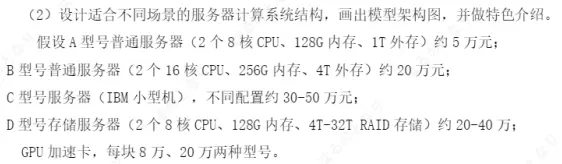

**题目：** 根据需求分析设计最合适的计算系统架构，预算在 **100 万**，具体场景如下：

- **场景 A**：某互联网公司拟采购服务器，用于支持更大用户量的访问（类似门户网站）。
- **场景 B**：某银行拟采购计算和存储设备，用于支持某种金融业务交易的日结处理。
- **场景 C**：某学院建设用于新一代人工智能教学与科研的基础硬件平台。

第 (2) 问要求：**设计适合不同场景的服务器计算系统结构，画出模型架构图，并做特色介绍。**

可选设备和大致成本如下：

| 设备型号 | 配置规格 | 价格区间 | 适合定位 |
| :--- | :--- | :---: | :--- |
| **A 型普通服务器** | 2 个 8 核 CPU、128G 内存、1T 外存 | 约 5 万元 | Web 节点、负载均衡节点、轻量管理节点 |
| **B 型普通服务器** | 2 个 16 核 CPU、256G 内存、4T 外存 | 约 20 万元 | 数据库节点、核心应用节点、GPU 承载节点 |
| **C 型 IBM 小型机** | 不同配置 | 30-50 万元 | 高可靠关键业务主机 |
| **D 型存储服务器** | 2 个 8 核 CPU、128G 内存、4T-32T RAID 存储 | 20-40 万元 | 集中存储、备份、共享文件系统 |
| **GPU 加速卡** | 两种型号 | 8 万 / 20 万元每块 | AI 训练、推理、矩阵计算加速 |

**解答：**

这道题的本质是“**先判断业务负载，再选择系统结构，最后按预算落到具体设备组合**”。不同场景的瓶颈完全不同：门户网站重并发，银行日结重可靠和安全，AI 平台重并行加速能力。

#### (1) 需求定性分析

这里按业务逻辑重新分析需求，银行场景的数据安全性应按**高**处理。

| 场景 | 单任务性能/响应时间 | 多任务性能/吞吐量 | 存储性能 | 存储容量 | 业务可持续运行能力 | 数据安全性 | 专用加速/并行能力 |
| :---: | :---: | :---: | :---: | :---: | :---: | :---: | :---: |
| 场景 A | 高 | 高 | 中 | 中 | 高 | 中 | 低 |
| 场景 B | 高 | 中 | 高 | 中 | 高 | 高 | 低 |
| 场景 C | 中 | 中 | 高 | 高 | 中 | 中 | 高 |

**分析思路：**

- **场景 A（门户网站）**：访问请求数量大，核心矛盾是高并发和高吞吐；单个请求不一定复杂，但响应时间要短，因此应使用多台普通服务器水平扩展。
- **场景 B（银行日结）**：金融业务必须保证数据正确、安全、可恢复；日结处理通常是关键批处理任务，适合高可靠主机配合 RAID 存储和主备机制。
- **场景 C（AI 教学科研）**：AI 任务的主要瓶颈不是普通 Web 并发，而是 GPU 并行计算能力、训练数据集存储和多用户资源调度。

#### (2) 场景 A：门户网站用户访问服务器

**推荐架构：负载均衡 + 多 Web 节点 + 数据/存储后端的水平扩展集群。**

**推荐设备组合（约 100 万）：**

| 设备 | 数量 | 单价估算 | 小计 | 用途 |
| :--- | :---: | :---: | :---: | :--- |
| A 型普通服务器 | 8 台 | 5 万 | 40 万 | Web/App 节点，其中 2 台可兼做双机负载均衡 |
| B 型普通服务器 | 2 台 | 20 万 | 40 万 | 数据库、缓存、核心业务服务主备节点 |
| D 型存储服务器 | 1 台低配 | 20 万 | 20 万 | 共享文件、日志、备份和静态资源存储 |
| **合计** | — | — | **约 100 万** | 满足高并发访问和可扩展需求 |

<div style="margin: 20px 0; padding: 18px; background: #f6f8fb; border-radius: 12px; overflow-x: auto; color: #111;">
  <div style="min-width: 820px; font-family: 'Segoe UI', 'Microsoft YaHei', sans-serif; text-align: center;">
    <div style="display: inline-block; padding: 10px 18px; border: 1px solid #455a64; border-radius: 8px; background: #ffffff; font-weight: bold;">用户访问请求</div>
    <div style="margin: 8px 0; font-weight: bold; color: #455a64;">↓</div>
    <div style="display: flex; justify-content: center; gap: 14px; margin: 10px 0;">
      <div style="padding: 10px 18px; border: 1px solid #1565c0; border-radius: 8px; background: #e3f2fd; font-weight: bold;">A 节点<br><span style="font-weight: normal;">Nginx/LVS 主</span></div>
      <div style="padding: 10px 18px; border: 1px solid #1565c0; border-radius: 8px; background: #e3f2fd; font-weight: bold;">A 节点<br><span style="font-weight: normal;">Nginx/LVS 备</span></div>
    </div>
    <div style="margin: 8px 0; font-weight: bold; color: #455a64;">↓ 负载均衡分发</div>
    <div style="display: flex; justify-content: center; gap: 10px; margin: 10px 0; flex-wrap: wrap;">
      <div style="padding: 10px 14px; border: 1px solid #2e7d32; border-radius: 8px; background: #e8f5e9; font-weight: bold;">A Web 1</div>
      <div style="padding: 10px 14px; border: 1px solid #2e7d32; border-radius: 8px; background: #e8f5e9; font-weight: bold;">A Web 2</div>
      <div style="padding: 10px 14px; border: 1px solid #2e7d32; border-radius: 8px; background: #e8f5e9; font-weight: bold;">A Web 3</div>
      <div style="padding: 10px 14px; border: 1px solid #2e7d32; border-radius: 8px; background: #e8f5e9; font-weight: bold;">A Web 4</div>
      <div style="padding: 10px 14px; border: 1px solid #2e7d32; border-radius: 8px; background: #e8f5e9; font-weight: bold;">A Web 5/6</div>
    </div>
    <div style="margin: 8px 0; font-weight: bold; color: #455a64;">↓ 缓存、数据库、文件访问</div>
    <div style="display: flex; justify-content: center; gap: 14px; margin-top: 10px;">
      <div style="padding: 10px 18px; border: 1px solid #ef6c00; border-radius: 8px; background: #fff3e0; font-weight: bold;">B 节点<br><span style="font-weight: normal;">DB/Cache 主</span></div>
      <div style="padding: 10px 18px; border: 1px solid #ef6c00; border-radius: 8px; background: #fff3e0; font-weight: bold;">B 节点<br><span style="font-weight: normal;">DB/Cache 备</span></div>
      <div style="padding: 10px 18px; border: 1px solid #6a1b9a; border-radius: 8px; background: #f3e5f5; font-weight: bold;">D 存储<br><span style="font-weight: normal;">文件/日志/备份</span></div>
    </div>
  </div>
</div>

**特色介绍：**

- 使用多台 A 型服务器承载 Web/App 层，单台节点故障不会导致整体服务不可用。
- 通过负载均衡把请求分发到多个节点，重点提升**多任务吞吐量**和**并发访问能力**。
- B 型服务器负责数据库、缓存和核心业务，配置更高，适合承担相对重的后端任务。
- D 型存储服务器用于日志、静态资源、备份和共享数据，满足中等存储需求。
- 后续用户量继续增长时，优先增加 A 型 Web 节点即可，扩展成本低。

#### (3) 场景 B：银行金融业务日结处理系统

**推荐架构：双机热备小型机 + RAID 存储服务器的高可靠集中式架构。**

**推荐设备组合（约 100 万）：**

| 设备 | 数量 | 单价估算 | 小计 | 用途 |
| :--- | :---: | :---: | :---: | :--- |
| C 型 IBM 小型机 | 2 台低配 | 30 万 | 60 万 | 日结处理主机，主备热切换 |
| D 型存储服务器 | 1 台高配 | 40 万 | 40 万 | RAID 存储、交易数据、备份空间 |
| **合计** | — | — | **约 100 万** | 优先保证可靠性、连续运行和数据安全 |

<div style="margin: 20px 0; padding: 18px; background: #f6f8fb; border-radius: 12px; overflow-x: auto; color: #111;">
  <div style="min-width: 820px; font-family: 'Segoe UI', 'Microsoft YaHei', sans-serif; text-align: center;">
    <div style="display: flex; justify-content: center; align-items: center; gap: 18px; margin-bottom: 12px;">
      <div style="padding: 12px 22px; border: 1px solid #1565c0; border-radius: 8px; background: #e3f2fd; font-weight: bold;">C 小型机 A<br><span style="font-weight: normal;">主日结服务器</span></div>
      <div style="font-weight: bold; color: #455a64;">心跳检测<br>主备切换</div>
      <div style="padding: 12px 22px; border: 1px solid #546e7a; border-radius: 8px; background: #eceff1; font-weight: bold;">C 小型机 B<br><span style="font-weight: normal;">备用服务器</span></div>
    </div>
    <div style="font-weight: bold; color: #455a64;">↓ 事务处理、批量日结、账务汇总</div>
    <div style="display: inline-block; margin: 12px 0; padding: 12px 24px; border: 1px solid #2e7d32; border-radius: 8px; background: #e8f5e9; font-weight: bold;">数据库 / 日结处理系统</div>
    <div style="font-weight: bold; color: #455a64;">↓ 安全写入、备份、恢复</div>
    <div style="display: flex; justify-content: center; gap: 14px; margin-top: 10px;">
      <div style="padding: 10px 18px; border: 1px solid #ef6c00; border-radius: 8px; background: #fff3e0; font-weight: bold;">D RAID 存储<br><span style="font-weight: normal;">交易数据/日志</span></div>
      <div style="padding: 10px 18px; border: 1px solid #c62828; border-radius: 8px; background: #ffebee; font-weight: bold;">备份与审计<br><span style="font-weight: normal;">权限/日志/恢复</span></div>
    </div>
  </div>
</div>

**特色介绍：**

- 金融日结系统首先要求**正确性、连续运行能力和数据安全性**，因此优先选择 C 型小型机而不是大量廉价 Web 节点。
- 两台 C 型小型机组成主备结构，主机故障时由备用机接管，降低日结任务中断风险。
- D 型存储服务器采用 RAID，提升磁盘可靠性，并支持交易数据、日志、备份数据集中管理。
- 与门户网站相比，该场景不追求无限水平扩展，而是追求集中式事务处理、数据一致性和可恢复性。
- 银行业务的数据安全性必须按高需求处理，应配合访问控制、加密、审计日志和异地备份等措施。

#### (4) 场景 C：AI 教学与科研基础硬件平台

**推荐架构：B 型服务器 + GPU 加速卡 + 共享存储的异构计算集群。**

**推荐设备组合（约 100 万）：**

| 设备 | 数量 | 单价估算 | 小计 | 用途 |
| :--- | :---: | :---: | :---: | :--- |
| B 型普通服务器 | 2 台 | 20 万 | 40 万 | GPU 计算节点，兼资源调度与用户登录 |
| GPU 加速卡 | 2 块高配 | 20 万 | 40 万 | AI 训练、推理、矩阵计算加速 |
| D 型存储服务器 | 1 台低配 | 20 万 | 20 万 | 数据集、模型、实验结果共享存储 |
| **合计** | — | — | **约 100 万** | 优先保证 AI 并行计算能力 |

<div style="margin: 20px 0; padding: 18px; background: #f6f8fb; border-radius: 12px; overflow-x: auto; color: #111;">
  <div style="min-width: 820px; font-family: 'Segoe UI', 'Microsoft YaHei', sans-serif; text-align: center;">
    <div style="display: inline-block; padding: 10px 22px; border: 1px solid #455a64; border-radius: 8px; background: #ffffff; font-weight: bold;">教师 / 学生 / 科研用户</div>
    <div style="margin: 8px 0; font-weight: bold; color: #455a64;">↓ 提交训练、推理、实验任务</div>
    <div style="display: inline-block; padding: 10px 22px; border: 1px solid #1565c0; border-radius: 8px; background: #e3f2fd; font-weight: bold;">登录节点 / 任务调度<br><span style="font-weight: normal;">可由 B 节点兼任</span></div>
    <div style="margin: 8px 0; font-weight: bold; color: #455a64;">↓ 调度 GPU 资源</div>
    <div style="display: flex; justify-content: center; gap: 14px; margin: 10px 0;">
      <div style="padding: 10px 18px; border: 1px solid #6a1b9a; border-radius: 8px; background: #f3e5f5; font-weight: bold;">B 计算节点 1<br><span style="font-weight: normal;">16 核 CPU + 高配 GPU</span></div>
      <div style="padding: 10px 18px; border: 1px solid #6a1b9a; border-radius: 8px; background: #f3e5f5; font-weight: bold;">B 计算节点 2<br><span style="font-weight: normal;">16 核 CPU + 高配 GPU</span></div>
    </div>
    <div style="margin: 8px 0; font-weight: bold; color: #455a64;">↓ 读取数据集、保存模型和实验结果</div>
    <div style="display: inline-block; padding: 10px 22px; border: 1px solid #ef6c00; border-radius: 8px; background: #fff3e0; font-weight: bold;">D 共享存储<br><span style="font-weight: normal;">数据集 / 模型 / 结果 / 备份</span></div>
  </div>
</div>

**特色介绍：**

- AI 教学科研最需要的是 GPU 并行计算能力，CPU 服务器只作为调度、数据预处理和任务承载平台。
- 两台 B 型服务器分别配置高配 GPU，可支持模型训练、推理实验和矩阵计算。
- D 型存储服务器集中保存数据集、模型参数和实验结果，方便多用户共享。
- 如果更偏向“教学并发”而不是“单任务训练性能”，也可以把 2 块 20 万 GPU 替换为 4 块 8 万 GPU，获得更多可同时分配的 GPU 资源。
- 该方案不追求 7×24 金融级连续运行，而是强调科研算力、资源共享和用户隔离。

#### (5) 三个场景的架构对比总结

| 场景 | 推荐架构 | 设备组合核心 | 主要优化目标 |
| :---: | :--- | :--- | :--- |
| A | 负载均衡 + Web 集群 + 后端存储 | A 型多节点 + B 型后端 + D 型存储 | 高并发访问、吞吐量、水平扩展 |
| B | 双小型机热备 + RAID 存储 | C 型小型机主备 + D 型高可靠存储 | 日结可靠性、连续运行、数据安全 |
| C | GPU 异构计算集群 | B 型服务器 + GPU + D 型共享存储 | AI 并行计算、训练加速、教学科研共享 |

#### 答题模板

考试中可以按下面这个逻辑组织答案：

1. **先判断瓶颈**：门户网站瓶颈是并发访问，银行日结瓶颈是可靠性和数据安全，AI 平台瓶颈是 GPU 算力。
2. **再选择架构**：高并发选集群，高可靠选主备小型机，高并行选 GPU 异构。
3. **最后落到预算**：把 100 万拆成计算节点、存储节点、加速设备三部分，说明每部分为什么必要。


一句话记忆：**门户网站多买 A 做集群，银行系统买 C 做主备，AI 平台买 B 加 GPU。**


---

### 多线程程序编写


**题目：** 编写一个程序，开启 **3 个线程**，这 3 个线程的 ID 分别为 **A、B、C**，每个线程将自己的 ID 在屏幕上打印 **10 遍**，要求输出结果必须按 **ABC** 的顺序显示，例如：

```text
ABCABCABCABCABCABCABCABCABCABC
```

说明：操作系统可在 Windows / Linux 中任选一个；函数名记不清时可以在开头自己定义名称，但必须说明清楚功能。

**解答：**

这道题考察的不是“怎么创建线程”本身，而是**多个线程之间如何同步，保证输出顺序固定为 A → B → C**。如果三个线程各自直接循环打印，调度顺序由操作系统决定，输出可能变成 `ACBBCA...`，无法满足题目要求。

#### 核心思路

设置一个共享变量 `turn` 表示当前轮到哪个线程打印：

| `turn` 的值 | 允许打印的线程 | 打印后把 `turn` 改为 |
| :---: | :---: | :---: |
| 0 | A | 1 |
| 1 | B | 2 |
| 2 | C | 0 |

为了避免多个线程同时访问 `turn`，需要使用同步机制。这里选择 **Linux pthread + 互斥锁 + 条件变量**：

- **互斥锁 `mutex`**：保护共享变量 `turn`，防止多个线程同时修改。
- **条件变量 `cond`**：当前线程没轮到自己时进入等待，轮到自己时被唤醒。
- **`pthread_cond_broadcast`**：打印完成后唤醒其他线程，让下一个线程检查是否轮到自己。

#### 伪代码

```text
共享变量 turn = 0        // 0 表示 A，1 表示 B，2 表示 C
创建互斥锁 mutex
创建条件变量 cond

线程函数 printThread(id):
    重复 10 次:
        加锁 mutex

        当 turn != id 时:
            等待 cond，并暂时释放 mutex

        打印当前线程的字符（A/B/C）
        turn = (turn + 1) % 3

        唤醒其他等待线程
        解锁 mutex

主函数:
    创建线程 A，id = 0，输出字符 'A'
    创建线程 B，id = 1，输出字符 'B'
    创建线程 C，id = 2，输出字符 'C'

    等待三个线程全部结束
    输出换行
    销毁互斥锁和条件变量
```

#### 真实代码（Linux / pthread）

下面代码可在 Linux 下编译运行：

```c
#include <pthread.h>
#include <stdio.h>

#define THREAD_COUNT 3
#define PRINT_TIMES 10

pthread_mutex_t mutex = PTHREAD_MUTEX_INITIALIZER;
pthread_cond_t cond = PTHREAD_COND_INITIALIZER;

int turn = 0;

typedef struct {
    int id;
    char ch;
} ThreadArg;

void *print_thread(void *arg) {
    ThreadArg *thread_arg = (ThreadArg *)arg;

    for (int i = 0; i < PRINT_TIMES; i++) {
        pthread_mutex_lock(&mutex);

        while (turn != thread_arg->id) {
            pthread_cond_wait(&cond, &mutex);
        }

        printf("%c", thread_arg->ch);
        fflush(stdout);

        turn = (turn + 1) % THREAD_COUNT;
        pthread_cond_broadcast(&cond);

        pthread_mutex_unlock(&mutex);
    }

    return NULL;
}

int main(void) {
    pthread_t threads[THREAD_COUNT];
    ThreadArg args[THREAD_COUNT] = {
        {0, 'A'},
        {1, 'B'},
        {2, 'C'}
    };

    for (int i = 0; i < THREAD_COUNT; i++) {
        pthread_create(&threads[i], NULL, print_thread, &args[i]);
    }

    for (int i = 0; i < THREAD_COUNT; i++) {
        pthread_join(threads[i], NULL);
    }

    printf("\n");

    pthread_mutex_destroy(&mutex);
    pthread_cond_destroy(&cond);

    return 0;
}
```

**编译运行：**

```bash
gcc abc_threads.c -o abc_threads -pthread
./abc_threads
```

**输出结果：**

```text
ABCABCABCABCABCABCABCABCABCABC
```

#### 代码解释

| 代码结构 | 作用 |
| :--- | :--- |
| `turn` | 控制当前应该由哪个线程输出，`0/1/2` 分别对应 `A/B/C` |
| `pthread_mutex_lock` | 进入临界区前加锁，保证同一时刻只有一个线程检查和修改 `turn` |
| `while (turn != id)` | 如果没轮到当前线程，就等待条件变量 |
| `pthread_cond_wait` | 让当前线程睡眠，并自动释放互斥锁；被唤醒后会重新获得锁 |
| `printf("%c", ch)` | 输出当前线程对应的字符 |
| `turn = (turn + 1) % 3` | A 打印后轮到 B，B 打印后轮到 C，C 打印后重新轮到 A |
| `pthread_cond_broadcast` | 唤醒所有等待线程，让它们重新检查 `turn` |
| `pthread_join` | 主线程等待 A、B、C 三个线程全部结束 |

#### 为什么要用 `while` 而不是 `if`？

条件变量可能出现“虚假唤醒”，也可能一次唤醒多个线程。如果用 `if`，线程被唤醒后可能不再检查条件，导致输出顺序错误。使用 `while` 可以保证线程每次醒来都重新判断：**只有 `turn == id` 时才允许打印**。


考试记忆：**共享变量定顺序，互斥锁保安全，条件变量管等待；A 打印后 turn=1，B 打印后 turn=2，C 打印后 turn=0。**

