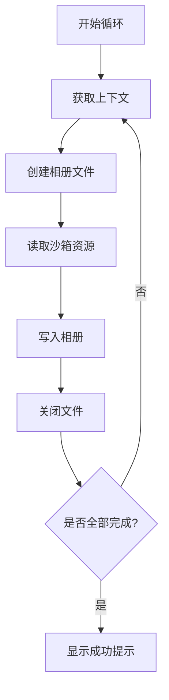

## 下载沙箱图片

```TS
import { fileIo } from '@kit.CoreFileKit'
import { photoAccessHelper } from '@kit.MediaLibraryKit';
import { promptAction } from '@kit.ArkUI';

@Entry
@ComponentV2
struct FileCopy {
  @Local
  list: Resource[] = [
    $r("app.media.001"),
    $r("app.media.002"),
    $r("app.media.003"),
    $r("app.media.004"),
    $r("app.media.005"),
    $r("app.media.006"),
    $r("app.media.007"),
    $r("app.media.008"),
    $r("app.media.009"),
    $r("app.media.010")
  ]


  // 保存沙箱图片到相册
  async saveImgToAssets() {
    try {
      let index = 0
      while (index < this.list.length) {
        let context = getContext();// 获取当前应用的上下文对象，用于访问系统资源。
        let phAccessHelper = photoAccessHelper.getPhotoAccessHelper(context);//通过上下文获取相册访问助手对象
        // Creating a Media File
        let uri = await phAccessHelper.createAsset(photoAccessHelper.PhotoType.IMAGE, 'jpg');//创建一个新的相册资源
        // Open the created media file and read the local file and convert it to ArrayBuffer for easy filling.
        let file = await fileIo.open(uri, fileIo.OpenMode.READ_WRITE);//打开刚刚创建的相册资源文件，模式为读写。
        let buffer = getContext(this).resourceManager.getMediaContentSync(this.list[index].id);//从沙箱中读取图片资源，返回一个 ArrayBuffer，表示图片的二进制数据。
        // Write the read ArrayBuffer to the new media file.
        let writeLen = await fileIo.write(file.fd, buffer.buffer);
        //调用 fileIo.write 方法，将读取到的图片数据（buffer.buffer）写入到相册文件中。
        // file.fd：文件描述符，用于标识打开的文件。
        await fileIo.close(file);
        index++
      }
      promptAction.showToast({ message: '下载成功' })

    } catch (err) {
      AlertDialog.show({ message: err.message })
    }
  }

  build() {
    Column({ space: 10 }) {
      Row() {
        SaveButton()
          .onClick((event, result: SaveButtonOnClickResult) => { // result是权限是否开启的结果
            if (result === SaveButtonOnClickResult.SUCCESS) {
              this.saveImgToAssets()
            }
          })
      }
      .justifyContent(FlexAlign.Center)
      .width('100%')
      GridRow({ columns: 2 }) {
        ForEach(this.list, (item: string) => {
          GridCol() {
            Image(item)
              .height(150)
              .height(150)
              .borderRadius(4)
          }
          .margin({
            top: 10
          })
        })
      }

    }

  }
}
```

### SaveButton组件

[安全控件SaveButton](https://developer.huawei.com/consumer/cn/doc/harmonyos-references-V13/ts-security-components-savebutton-V13)

```TS
SaveButton()
 .onClick((event, result: SaveButtonOnClickResult) => { // result是权限是否开启的结果
    if (result === SaveButtonOnClickResult.SUCCESS) {
      this.saveImgToAssets()
    }
  })
```

SaveButton组件是用于请求保存文件的权限，再点击该组件后会临时获取存储权限，而不需要权限弹框授权确认。
点击事件的参数中第一个是获取点击的位置、显示区域等数据的对象，而第二个参数则是获取存储权限的授权结果，授权时长为**10秒**，即触发点击后，可以在10秒之内**不限制次数**的调用特定媒体库接口，**超出10秒**的调用会**鉴权失败**。

### 异步事件处理函数saveImgToAssets

首先我们要明确为什么处理保存图片时间需要使用异步函数。
异步函数的核心思想在于防止程序在**等待某个操作完成**时陷入**长时间的等待状态**，将耗时包含不确定成分的**长耗时操作**抛出到**主线程之外**，防止主线程被阻塞，提高程序的**响应速度**和**用户体验**。

而在读取沙箱文件并保存到手机内的时候有多步耗时操作，所以我们需要进行异步编程。

#### 沙箱

首先解释一下什么是沙箱。
在鸿蒙（HarmonyOS）开发中，沙箱机制（Sandbox Mechanism）是保障系统安全性和应用隔离性的核心技术之一。它通过严格的资源隔离和权限控制，确保每个应用在独立的环境中运行，防止恶意行为或错误操作对其他应用或系统造成影响。以下从**核心原理**、**技术实现**和**应用场景**三个方面展开说明。

##### 核心原理

- 应用隔离
    鸿蒙为每个应用分配独立的运行环境，包括进程、文件系统、内存和权限等资源。应用间无法直接访问彼此的数据或资源，必须通过系统提供的安全接口进行通信。这种隔离机制有效防止了数据泄露或恶意代码扩散。

- 最小权限原则
    应用在安装或运行时，需明确声明所需权限（如访问摄像头、存储等），用户可动态授权。鸿蒙基于“最小权限”模型，仅授予应用完成功能所必需的权限，降低越权操作风险。

- 资源访问控制
    系统通过内核层和框架层的双重防护，对硬件资源（如传感器、网络）和软件资源（如数据文件）进行细粒度管控。例如，应用无法直接读写其他应用私有目录下的文件。

##### 技术实现

- 进程与数据沙箱

    独立进程空间：每个应用运行在独立的进程中，由系统调度资源。

    私有文件存储：应用数据默认存储在沙箱目录（如 /data/app/包名/），其他应用无权限访问。公共数据需通过用户授权或系统服务（如媒体库）共享。

- 权限动态管理
    鸿蒙支持权限的动态申请与撤销。例如，当应用需要使用定位功能时，需弹窗请求用户授权，用户可随时在设置中关闭权限。

- 分布式安全
    在鸿蒙的分布式架构中，跨设备调用需通过安全通道完成。设备间通信需要双向认证，数据加密传输，确保分布式场景下的沙箱隔离性。

- 微内核架构支持
    鸿蒙采用微内核设计，将核心功能（如进程调度、权限管理）与系统服务分离，减少攻击面。即使某个服务被攻击，沙箱机制也能限制其影响范围。

##### 应用场景

- 场景示例

    金融类应用：保护用户敏感数据（如支付信息）不被恶意应用窃取。

    多设备协同：在分布式场景中，确保智能家居设备间的指令传递安全。

    IoT 设备：防止资源受限的终端设备因单个应用崩溃导致系统瘫痪。

- 开发者优势

    降低开发复杂度：开发者无需自行实现安全隔离逻辑，专注于业务功能。
    
    增强用户信任：严格的权限控制可提升用户对应用安全性的信心。

#### 上下文对象

在鸿蒙（HarmonyOS）应用开发中，**上下文对象（Context）** 是连接应用与系统服务的核心桥梁，它封装了应用运行环境的关键信息，并提供了访问资源、权限、组件管理等功能的能力。以下是对上下文对象的详细解析：

---

##### 上下文对象的核心作用

1. **标识应用身份**  
   - 包含应用的 **包名**、**沙箱路径**、**权限状态** 等信息，用于系统验证操作合法性。

2. **访问系统服务**  
   - 通过上下文可获取系统级服务（如相册服务 `photoAccessHelper`），这些服务需基于应用身份进行权限控制。

3. **管理资源与组件**  
   - 支持访问私有资源（如 `$r("app.media.xxx")`）、启动其他 Ability（页面）等操作。

---

##### 代码中的上下文体现与解析

1. 获取相册访问助手（`photoAccessHelper`）

    ```ts
    let context = getContext(); // 获取当前上下文
    let phAccessHelper = photoAccessHelper.getPhotoAccessHelper(context); 
    ```

    getContext() 的作用:

    - 返回当前 Ability 或 UI 组件的上下文，用于标识操作来源。
    - 相册服务需要基于上下文验证权限（如 WRITE_IMAGEVIDEO）。

2. 访问沙箱内资源（`resourceManager`）

    ```ts
    let buffer = getContext().resourceManager.getMediaContentSync(this.list[index].id);
    ```

    资源隔离性:

    - resourceManager 仅能访问当前应用的沙箱资源（如 /data/app/包名/resources/）。

    - `$r("app.media.001")`由系统自动解析为沙箱内路径，避免硬编码。

#### 整体代码逻辑解析



上面的就是整个函数的流程图。

接下来我们将对整个流程详细解析。

1. 初始化循环与上下文获取

    ```typescript
        let index = 0
        while (index < this.list.length) {
          let context = getContext(); // [!code focus]
    ```

    - 作用：
    通过 getContext() 获取当前应用的上下文对象，用于后续访问系统服务和资源  管理器。

    - 沙箱关联：
    上下文对象隐含了当前应用的沙箱路径（如 /data/app/包名/），确保资源访问  限制在隔离环境中。

2. 创建相册资源文件

    ```typescript
    let phAccessHelper = photoAccessHelper.getPhotoAccessHelper(context);
    let uri = await phAccessHelper.createAsset(photoAccessHelper.PhotoType.IMAGE, 'jpg');
    ```

    - 关键对象：
    phAccessHelper：相册操作代理对象，需通过上下文验证应用权限。
    createAsset：在系统相册中创建空白图片文件，返回 uri 标识新文件位置。

    - 权限控制：
    需要 ohos.permission.WRITE_IMAGEVIDEO 权限，否则操作会被系统拦截。

3. 沙箱资源读取

    ```typescript
    let buffer = getContext().resourceManager.getMediaContentSync(this.list[index].id); // [!code focus]s
    ```

    - 资源路径：
    this.list[index].id 对应 $r("app.media.xxx")，实际指向沙箱目录 /data/app/包名/resources/。

    - 数据封闭性：
    通过 resourceManager 直接读取二进制数据（ArrayBuffer），不暴露实际文件路径。

4. 文件写入操作

    ```typescript
    let file = await fileIo.open(uri, fileIo.OpenMode.READ_WRITE);
    let writeLen = await fileIo.write(file.fd, buffer.buffer);
    await fileIo.close(file);
    ```

    - 关键步骤：

    fileIo.open：以读写模式打开相册文件，获取文件描述符 file.fd。

    fileIo.write：将沙箱图片二进制数据写入目标文件。

    fileIo.close：显式关闭文件，释放系统资源。

    - 安全设计：

    file.fd 是系统分配的文件句柄，其他应用无法通过此句柄操作同一文件。

    写入操作通过系统服务代理，避免直接操作相册文件系统。

5. 完成提示与异常处理

    ```typescript
    promptAction.showToast({ message: '下载成功' })
    } catch (err) {
      AlertDialog.show({ message: err.message })
    }
    ```

    - 用户反馈：
    showToast 显示操作成功的轻量提示，避免打断用户。

    - 错误隔离：
    通过 try-catch 捕获沙箱内外的操作异常（如权限拒绝、文件不存在），错误信息仅影响当前应用。
