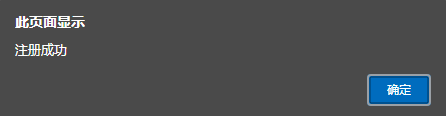
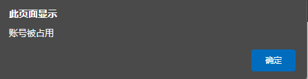
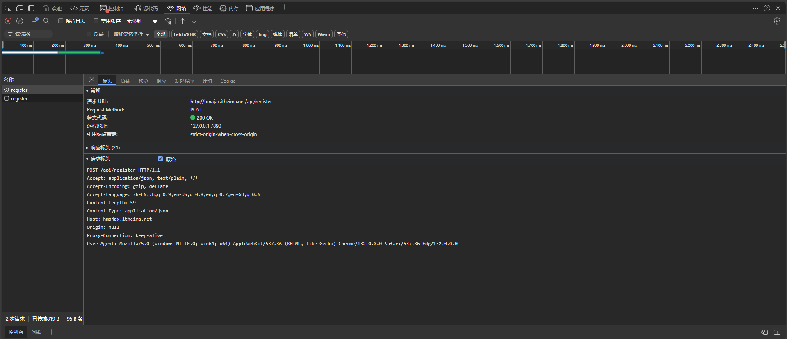
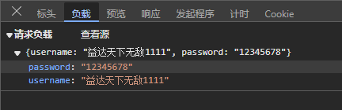
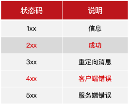
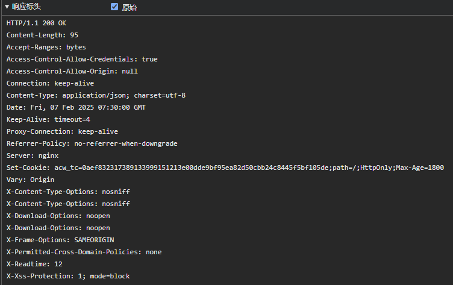
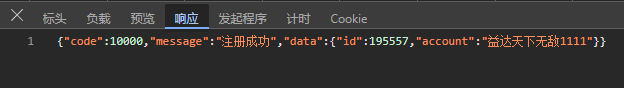
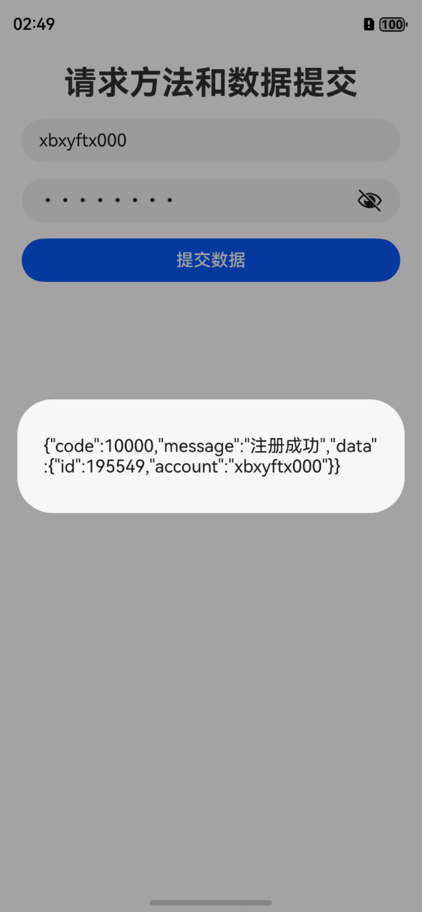
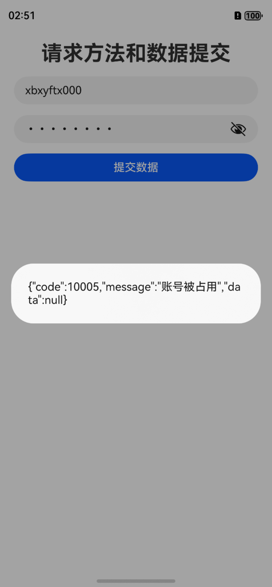

## 核心概念

### 服务器

在网络上提供服务器的一台电脑，比如提供数据服务

### http模块

鸿蒙内置的模块，专门用于处理http网络请求，用http协议与服务器进行交流

可以用 `import http from '@ohos.net.http'`来进行调用。

由于需要进行网络请求，所以我们还需要在配置文件 `module.json5`下添加如下代码

```TS
"requestPermissions": [
   {
      "name": "ohos.permission.INTERNET"
    }
 ],
```

完整代码如下

```TS
{
  "module": {
    "name": "entry",
    "type": "entry",
    "description": "$string:module_desc",
    "mainElement": "EntryAbility",
    "deviceTypes": [
      "phone",
      "tablet",
      "2in1"
    ],
    "deliveryWithInstall": true,
    "installationFree": false,
    "pages": "$profile:main_pages",
    "requestPermissions": [
      {
        "name": "ohos.permission.INTERNET"
      }
    ],
    "abilities": [
      {
        "name": "EntryAbility",
        "srcEntry": "./ets/entryability/EntryAbility.ets",
        "description": "$string:EntryAbility_desc",
        "icon": "$media:layered_image",
        "label": "$string:EntryAbility_label",
        "startWindowIcon": "$media:startIcon",
        "startWindowBackground": "$color:start_window_background",
        "exported": true,
        "skills": [
          {
            "entities": [
              "entity.system.home"
            ],
            "actions": [
              "action.system.home"
            ]
          }
        ]
      }
    ]
  }
}
```

### HTTP协议

协议基本可以理解为格式，类似于写信写邮件的格式规范，规定了客户端与服务器通信时的格式。

三者关系大致如下图所示。


### URL

URL（Uniform Resource Locator）统一资源定位符，相当于信封上目的地的地址，每一个有效的URL都指向着唯一的一个资源。

就比如我现在这篇博客的地址

```
https://xbxyftx.github.io/2025/01/27/%E9%B8%BF%E8%92%99http/
```

`https`是协议 `xbxyftx.github.io`是域名 `2025/01/27/%E9%B8%BF%E8%92%99http/`是资源地址。

域名指的是你要访问哪一台服务器，而一个服务器中会有很多的资源存放在不同的位置，所以需要在域名后加上资源地址来指向对应资源。
在URL的末尾我们可以再后缀上二外参数，比如`?name=XBXyftx&age=22`，这样就可以在URL的末尾添加参数。
参数的格式为`key=value`，多个参数之间用`&`连接。

#### URL参数案例

接口文档：[开心一笑接口文档](https://apifox.com/apidoc/shared-e3812a75-2d81-4388-abf4-af83a2758a9a/api-153085966)

##### 项目基础结构

```TS

import http from '@ohos.net.http';


const req = http.createHttp()

@Entry
@Component
struct Day01_03_QueryParams {
  @State pname: string = '';
  @State jokeNum: string = ''
  @State jokes: string[] = []
  @State cities: string[] = []

  build() {
    Column() {
      Column({ space: 10 }) {
        Text('开心一笑')
          .fontSize(30)
        TextInput({ placeholder: '输入笑话条数', text: $$this.jokeNum })
          .type(InputType.Number)
          .onSubmit(() => {
            // url：https://api-vue-base.itheima.net/api/joke/list
            // 参数: num 笑话数量
            AlertDialog.show({
              message: '输入的数值是:' + this.jokeNum
            })
          })
        ForEach(this.jokes, (joke: string) => {
          Text(joke)
        })
      }
      .layoutWeight(1)
      .width('100%')
      .padding(10)

      Divider()
        .color(Color.Pink)
        .strokeWidth(3)
      Column({ space: 10 }) {
        Text('省份城市查询')
          .fontSize(30)
        TextInput({ placeholder: '请输入查询的省份名', text: $$this.pname })// 键盘事件
          .onSubmit(e => {
            // url：https://hmajax.itheima.net/api/city
            // 参数: pname 省份名
            AlertDialog.show({
              message: '输入的省份名是:' + this.pname
            })
          })
        Grid() {
          ForEach(this.cities, (city: string) => {
            GridItem() {
              Text(city)
            }
            .border({ width: 1 })
          })
        }
        .columnsTemplate('1fr '.repeat(4))
        .columnsGap(10)
        .rowsGap(10)
      }
      .layoutWeight(1)
      .width('100%')
      .padding(10)
    }
    .height('100%')
  }
}
```

上半部分是输入笑话条数，下半部分是输入省份名，点击查询后会返回对应的城市。而根据这两个URL的文档可知

```
地址: https://api-vue-base.itheima.net/api/joke/list
根据查询参数获取若干条随机笑话
参数名: num
说明: 传递数量即可，比如 5

地址:http://hmajax.itheima.net/api/city
说明获取某个省所有的城市查询
参数名:pname
说明: 传递省份或直辖市名，比如 北京、广东省…
```

##### 笑话查询

由于我们并不清楚其返回值是什么所以我们先将获取的结果打印出来，并根据打印出json字符串来定义接口。

```TS
req.request(`https://api-vue-base.itheima.net/api/joke/list?num=${this.jokeNum}`)
  .then((res)=>{
    AlertDialog.show({
      message:res.result.toString()
    })
  })
```

打印出的结果如下


由此可知，我们可以定义一个接口来接收返回值。

```TS
interface JokeResponse {
  msg: string
  code: number
  data: string[]
}
```

然后我们就可以将请求到的结果转化为接口类型。

```TS
req.request(`https://api-vue-base.itheima.net/api/joke/list?num=${this.jokeNum}`)
  .then((res)=>{
      this.jokes = (JSON.parse(res.result.toString()) as JokeResponse).data
  })
```

##### 省份城市查询

同样的，我们先将获取的结果打印出来，并根据打印出json字符串来定义接口。

```TS
interface CityResponse {
  message: string
  list: string[]
}
```

然后我们就可以将请求到的结果转化为接口类型。

```TS
req.request(`http://hmajax.itheima.net/api/city?pname=${encodeURIComponent(this.pname)}`)
  .then(res => {
    const cityRes = JSON.parse(res.result.toString()) as CityResponse
    this.cities = cityRes.list
  })
```

由于用到了中文参数，所以需要进行编码，在TS中可以使用`encodeURIComponent()`方法来进行编码。

##### 完整代码和最终效果


```TS
import http from '@ohos.net.http';

interface JokeResponse {
  msg: string
  code: number
  data: string[]
}

interface CityResponse {
  message: string
  list: string[]
}

const req = http.createHttp()

@Entry
@Component
struct Day01_03_QueryParams {
  @State pname: string = '';
  @State jokeNum: string = ''
  @State jokes: string[] = []
  @State cities: string[] = []

  build() {
    Column() {
      Column({ space: 10 }) {
        Text('开心一笑')
          .fontSize(30)
        TextInput({ placeholder: '输入笑话条数', text: $$this.jokeNum })
          .type(InputType.Number)
          .onSubmit(() => {
            // url：https://api-vue-base.itheima.net/api/joke/list
            // 参数: num 笑话数量
            req.request(`https://api-vue-base.itheima.net/api/joke/list?num=${this.jokeNum}`)
              .then(res => {
                this.jokes = (JSON.parse(res.result.toString()) as JokeResponse).data
              })
          })
        ForEach(this.jokes, (joke: string) => {
          Text(joke)
        })
      }
      .layoutWeight(1)
      .width('100%')
      .padding(10)

      Divider()
        .color(Color.Pink)
        .strokeWidth(3)
      Column({ space: 10 }) {
        Text('省份城市查询')
          .fontSize(30)
        TextInput({ placeholder: '请输入查询的省份名', text: $$this.pname })// 键盘事件
          .onSubmit(e => {
            // url：https://hmajax.itheima.net/api/city
            // 参数: pname 省份名
            req.request(`http://hmajax.itheima.net/api/city?pname=${encodeURIComponent(this.pname)}`)
              .then(res => {
                const cityRes = JSON.parse(res.result.toString()) as CityResponse
                this.cities = cityRes.list
              })
          })
        Grid() {
          ForEach(this.cities, (city: string) => {
            GridItem() {
              Text(city)
            }
            .border({ width: 1 })
          })
        }
        .columnsTemplate('1fr '.repeat(4))
        .columnsGap(10)
        .rowsGap(10)
      }
      .layoutWeight(1)
      .width('100%')
      .padding(10)
    }
    .height('100%')
  }
}
```

##### 升级V2

```TS
import http from '@ohos.net.http';

interface JokeResponse {
  msg: string
  code: number
  data: string[]
}

interface CityResponse {
  message: string
  list: string[]
}

const req = http.createHttp()

@Entry
@ComponentV2
struct Day01_03_QueryParams {
  @Local pname: string = '';
  @Local jokeNum: string = ''
  @Local jokes: string[] = []
  @Local cities: string[] = []

  build() {
    Column() {
      Column({ space: 10 }) {
        Text('开心一笑')
          .fontSize(30)
        TextInput({ placeholder: '输入笑话条数', text: $$this.jokeNum })
          .type(InputType.Number)
          .onSubmit(() => {
            // url：https://api-vue-base.itheima.net/api/joke/list
            // 参数: num 笑话数量
            req.request(`https://api-vue-base.itheima.net/api/joke/list?num=${this.jokeNum}`)
              .then(res => {
                this.jokes = (JSON.parse(res.result.toString()) as JokeResponse).data
              })
          })
        ForEach(this.jokes, (joke: string) => {
          Text(joke)
        })
      }
      .layoutWeight(1)
      .width('100%')
      .padding(10)

      Divider()
        .color(Color.Pink)
        .strokeWidth(3)
      Column({ space: 10 }) {
        Text('省份城市查询')
          .fontSize(30)
        TextInput({ placeholder: '请输入查询的省份名', text: $$this.pname })// 键盘事件
          .onSubmit(e => {
            // url：https://hmajax.itheima.net/api/city
            // 参数: pname 省份名
            req.request(`http://hmajax.itheima.net/api/city?pname=${encodeURIComponent(this.pname)}`)
              .then(res => {
                const cityRes = JSON.parse(res.result.toString()) as CityResponse
                this.cities = cityRes.list
              })
          })
        Grid() {
          ForEach(this.cities, (city: string) => {
            GridItem() {
              Text(city)
            }
            .border({ width: 1 })
          })
        }
        .columnsTemplate('1fr '.repeat(4))
        .columnsGap(10)
        .rowsGap(10)
      }
      .layoutWeight(1)
      .width('100%')
      .padding(10)
    }
    .height('100%')
  }
}
```

#### 中文参数

由于URL中不能包含中文，所以需要进行编码，在TS中可以使用`encodeURIComponent()`方法来进行编码。

### HTTP请求

HTTP请求是客户端向服务器发送请求的一种方式，常见的请求方式有GET和POST。
GET请求是客户端向服务器发送请求，请求服务器返回对应资源。
POST请求是客户端向服务器发送请求，请求服务器接收数据。

#### HTTP请求报文

HTTP请求报文是客户端向服务器发送请求时，发送的请求信息。
请求报文的格式大致为以下几点：

1. **请求行**：请求方法、请求URL、HTTP版本
2. **请求头**：请求头信息
3. **空行**：分割请求头和请求体
4. **请求体**：请求体信息

而想看到请求报文我们可以利用浏览器的开发者工具来查看。
所以这里简单编写一段前端代码来模拟请求报文。

```html
<!DOCTYPE html>
<html lang="en">
<head>
    <meta charset="UTF-8">
    <meta name="viewport" content="width=device-width, initial-scale=1.0">
    <title>Document</title>
</head>
<body>
    <input type="text" placeholder="用户名" id="input1">
    <input type="password" placeholder="密码" id="input2">
    <button id="btn1">注册</button>
    <script src="https://cdn.staticfile.net/axios/1.6.5/axios.min.js"></script>
    <script>
        var btn = document.getElementById('btn1');
        btn.onclick = function(){
            var input1 = document.getElementById('input1');
            var input2 = document.getElementById('input2');
            var username = input1.value;
            var password = input2.value;
            axios({
                method:'post',
                url:'http://hmajax.itheima.net/api/register',
                data:{
                    username:username,
                    password:password
                }
            })
            .then((res)=>{
                alert(res.data.message);
            }).catch((err)=>{
                alert(err.response.data.message);
            })
        }
    </script>
</body>
</html>
```





效果和下面详细讲解`Post`的TS效果一样。
而具体的报文内容如下：



这张图片展示了请求行和请求头。



这张图片展示了请求体。

### HTTP响应

HTTP响应是服务器向客户端返回响应的一种方式，常见的响应方式有200和404。
200表示请求成功，404表示请求失败。

#### HTTP响应状态码

主要的响应码有以下几种：

* **1xx**：表示请求已被接收，需要继续处理
* **2xx**：表示请求已成功被服务器接收、理解、并接受
* **3xx**：表示需要进一步的操作才能完成请求
* **4xx**：表示请求含有语法错误或无法完成请求
* **5xx**：表示服务器在处理请求的过程中发生了错误


日常开发中，不同接口表示错误的方式不同：

1. 有的通过状态码来标识
2. 有的通过响应体中的信息来标识

根据实际情况来选择使用哪种来判断

#### HTTP响应报文

HTTP响应报文是服务器向客户端返回响应时，返回的响应信息。
响应报文的格式大致为以下几点：

1. **状态行**：HTTP版本、状态码、状态码描述
2. **响应头**：响应头信息
3. **空行**：分割响应头和响应体
4. **响应体**：响应体信息

而想看到响应报文我们可以利用浏览器的开发者工具来查看。




这两张图片分别展示了响应行和响应头以及响应体。
在响应中最重要的是响应体，因为这是服务器返回给客户端的信息。

### JSON

[JSON](https://developer.mozilla.org/zh-CN/docs/Glossary/JSON) 是一种按照 JavaScript 对象语法的数据格式，虽然它是基于 JavaScript 语法，但它独立于 JavaScript，许多程序环境能够读取（解读）和生成 JSON。

目前json主要分为两种，json和json5。json5的诞生主要是为了解决json不支持添加注释的问题，两者功能类似。在鸿蒙的stage模型的工程文件中包含了大量的json5文件，是鸿蒙原生应用的重要组成部分。

其语法规则大致为以下几点：

1. **是一个字符串（配置文件中两边可以不写引号）**
2. **属性名用双引号包裹，**
3. **属性值如果是字符串也必须用双引号包裹**
4. **对象** **{}**,**数组** **[]**

就像是以下格式就是一个标准的json字符串

```TS
{
	"name":"XBXyftx",
	"age":22,
	"fruits":["apple","pear","grape"]
}
```

当然json经常被拿来和xml进行比较，就比如上面的json字符串，转化为xml就是这样：

```xml
<root>
	<name>XBXyftx</name>
	<age>22</age>
	<fruits>apple</fruits>
	<fruits>pear</fruits>
	<fruits>grape</fruits>
</root>
```

而json相对于xml的主要优势在于：

* 没有结束标签,长度更短,读写更快
* 能够直接被JavaScript解释器解析
* 可以使用数组

#### json与对象的互相转化

在鸿蒙中，我们可以使用`JSON.parse()`方法来解析json字符串。

```TS
interface IPeople{
  name:string
  age:number
  fruits:string[]
}
const json:IPeople = JSON.parse('{"name":"XBXyftx","age":22,"fruits":["apple","pear","grape"]}') as IPeople
console.log(json.name)
console.log(json.age.toString())
console.log(json.fruits.join())
```

输出结果如下

```TS
XBXyftx
22
apple,pear,grape
```

而当我们需要将对象转化成json字符串时，可以使用`JSON.stringify()`方法。

```TS
const json2:IPeople = {
  name:'A',
  age:18,
  fruits:['苹果','香蕉']
}
console.log(JSON.stringify(json2))
```

输出结果如下：

```TS
{"name":"A","age":18,"fruits":["苹果","香蕉"]}
```

#### json和字符串数组的互相转化

也可以用来解析字符串数组

```TS
const jsonArr = '["hello","西兰花"]'
const obj:string[] = JSON.parse(jsonArr) as string[]
console.log(obj.join())
```

输出结果如下：

```TS
hello,西兰花
```

**注意：**`JSON.parse(jsonArr) as string[]`中最后的`as string[]`是用来指定返回值的类型的，因为`JSON.parse()`方法的返回值是`any`类型，所以我们需要手动指定返回值的类型。
如果将`as string[]`改为`as []`，则会对类型推断造成干扰。所以最好写全。

## http模块的使用

### 默认请求（Get）

```TS
//导入http模块
import { http } from '@kit.NetworkKit';
//创建http请求模块
const req = http.createHttp()
//发送请求到指定URL
req.request('https://api-vue-base.itheima.net/api/joke')
  .then((res:http.HttpResponse)=>{
    AlertDialog.show({
      message:JSON.stringify(res)
    })
  })
```

then事件用于处理http请求接收到的响应数据，当成功获取到响应后就会进入到then代码块中。

获取到的数据如下图所示。


分析获取到的数据可知我们所需要的笑话的键值为 `"result"`，由此我们就可以使用`res.result.toString()`

```TS
import http from '@ohos.net.http';
@Entry
@Component
struct Notebook_use {
  @State message: string = 'Hello World';
  build() {
    Row() {
      Column() {
        Text(this.message)
          .fontSize(20)
        Button('看笑话')
          .onClick(() => {
            const req = http.createHttp()
            req.request('https://api-vue-base.itheima.net/api/joke')
              .then((res: http.HttpResponse) => {
                // AlertDialog.show({ message: JSON.stringify(res) })
                this.message = res.result.toString()
              })
          })
      }
      .width('100%')
    }
    .height('100%')
  }
}
```

这样我们就可以根据返回的json数据来进行UI显示了。
这就是一个简单的http网络请求，和在本地写好数据集来进行UI显示的效果是一样的，整体思路是不变的。

### 提交数据请求（Post）

```TS
  const req = http.createHttp()
  req.request('请求地址', {
    method: http.RequestMethod.POST, // 通过枚举的方式设置请求方法，如果是 get 可以省略
    extraData: {} // 数据写在 extraData 中 支持 对象 字符串 ArrayBuffer（二进制数据）
    extraData:'key=value&key2=value2'// 字符串的话 写成 'key=value&key2=value2'....
    // 对象的话需要额外设置其他参数
  })
```

这是其基础格式，下面我们来进行一个简单的注册请求。

```TS
import http from '@ohos.net.http'

const req = http.createHttp()

@Entry
@ComponentV2
struct Day01_05_SubmitData {
  @Local username: string = ''
  @Local password: string = ''

  build() {
    Column({ space: 15 }) {
      Text('请求方法和数据提交')
        .fontSize(30)
        .fontWeight(FontWeight.Bold)
      TextInput({ text: $$this.username, placeholder: '用户名' })
      TextInput({ text: $$this.password, placeholder: '密码' })
        .type(InputType.Password)

      Button('提交数据')
        .width('100%')
        .onClick(() => {
          AlertDialog.show({
            message: `用户名:${this.username}| 密码:${this.password}`
          })
          req.request('http://hmajax.itheima.net/api/register',{
            method:http.RequestMethod.POST,
            extraData: `username=${this.username}&password=${this.password}`
          })
            .then((res)=>{
              AlertDialog.show({
                message:res.result.toString()
              })
            })
        })
    }
    .width('100%')
    .height('100%')
    .padding(20)
  }
}
```



根据是否注册过后端会自动回传不同的数据。



#### 修改请求头

在实际应用开发中，大多数网络请求所发送的数据格式都是`JSON`格式的，所以我们需要修改请求头。来将我们的数据格式修改为`JSON`格式。

目标API文档：[注册账号-JSON](https://apifox.com/apidoc/shared-e3812a75-2d81-4388-abf4-af83a2758a9a/api-153059638)

UI我们继续沿用上一个案例的UI。
我们重点需要掌握的是发送网络请求时如何修改请求头。

```TS
Button('提交数据')
  .width('100%')
  .onClick(() => {
    req.request('http://hmajax.itheima.net/api/register',{
      method:http.RequestMethod.POST,
      header:{
        contentType:'application/json'
      },
      extraData: {
        username:this.username,
        password:this.password
      }
    })
      .then((res)=>{
        AlertDialog.show({
          message:res.result.toString()
        })
      })
  })
```

## 异步编程

### 什么是异步编程

在鸿蒙中，由于网络请求是一个耗时操作，所以我们不能直接在主线程中进行网络请求，否则会导致主线程卡死，所以我们需要使用异步编程来进行网络请求。
异步编程的核心思想就是将耗时操作放在子线程中执行，当子线程执行完毕后再将结果返回给主线程。
在鸿蒙中，我们可以使用`async`和`await`关键字来进行异步编程。
`async`关键字用于声明一个异步函数，`await`关键字用于等待异步操作的完成。

**同步代码**：逐行执行，需原地等待结果后，才继续向下执行
**异步代码**：调用后耗时，不阻塞代码继续执行，将来完成后，触发回调函数传递结果
**划重点**：异步代码的结果，通过 `回调函数` 获取

```TS
 /**
   * 1. 同步代码
   * */
  console.log(1)
  const num = 1 + 1
  console.log(num)    // 12

  /**
   * 2. 同步+异步（定时器）
   * */
  console.log(1+'')
  setTimeout(() => {
    console.log(2+'')
  }, 1000)
  console.log(3+'')   // 132

  /**
   * 3. 同步+异步（网络请求）
   * */
  console.log('1')

  const req = http.createHttp()
  req.request('https://api-vue-base.itheima.net/api/joke')
    .then((res: http.HttpResponse) => {
      console.log('3')
    })

  console.log('2')    // 123
```

这就是一个同步异步代码的简单示例，我们可以看到同步代码是逐行执行的，而异步代码则是在主线程中执行完毕后再将结果返回给主线程。

### Promise

Promise是一种用于处理异步操作的对象，可以将异步操作转换为类似于同步操作的风格，以方便代码编写和维护
**简而言之**：Promise 用来管理异步，方便编码。

实际开发中如果异步操作用到了 Promise 来进行管理那么：

1. 那么获取异步操作结果（成功 or 失败）的方式都是一样的
2. 能够解决回调函数地狱（多层回调函数嵌套）的问题

```TS
  const p = new Promise<string>((resolve,reject) => {
      // 执行任意代码，主要是异步
      setTimeout(() => {
        // 比如：获取随机数
        const randomNum = Math.floor(Math.random() * 100)
        resolve(randomNum.toString())
        reject(randomNum.toString())
      })
    })

    p.then(res => {
      console.log('res:', res)
    },(err:string)=>{
      console.log('err:',err)
    })
```
这段代码中包含了一个Promise对象，Promise对象的构造函数中包含了一个回调函数，这个回调函数中包含了两个参数，`resolve`和`reject`，`resolve`用于将异步操作的结果返回给主线程，`reject`用于将异步操作的错误返回给主线程。
异步函数的状态有三种：

* `pending`：初始状态，不是成功或失败状态
* `fulfilled`：意味着操作成功完成
* `rejected`：意味着操作失败

当异步操作成功时，会调用`resolve`函数，将异步操作的结果返回给主线程，当异步操作失败时，会调用`reject`函数，将异步操作的错误返回给主线程。
**划重点**：异步函数状态不可逆，只能由`pending`变为`fulfilled`或`rejected`。
成功和失败之间不可互转。
上面这段代码的最终输出结果为`res: 40`40是一个随机数，而res则说明进入的是res成功的代码块中。
如果将`resolve(randomNum.toString())`注释掉改为以下样式

```TS
const p = new Promise<string>((resolve,reject) => {
  // 执行任意代码，主要是异步
  setTimeout(() => {
    // 比如：获取随机数
    const randomNum = Math.floor(Math.random() * 100)
    // resolve(randomNum.toString())
    reject(randomNum.toString())
  })
})

p.then(res => {
  console.log('res:', res)
},(err:string)=>{
  console.log('err:',err)
})
```

则最终输出结果为`err: 40`，说明进入的是err失败的代码块中，这就是Promise的基本用法。
