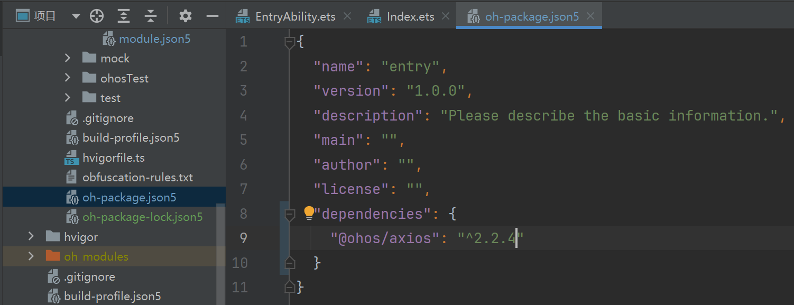

## 核心概念

### 服务器

在网络上提供服务器的一台电脑，比如提供数据服务

### http模块

鸿蒙内置的模块，专门用于处理http网络请求，用http协议与服务器进行交流

可以用 `import http from '@ohos.net.http'`来进行调用。

由于需要进行网络请求，所以我们还需要在配置文件 `module.json5`下添加如下代码

```json
"requestPermissions": [
   {
      "name": "ohos.permission.INTERNET"
    }
 ],
```

完整代码如下

```json
{
  "module": {
    "name": "entry",
    "type": "entry",
    "description": "$string:module_desc",
    "mainElement": "EntryAbility",
    "deviceTypes": [
      "phone",
      "tablet",
      "2in1"
    ],
    "deliveryWithInstall": true,
    "installationFree": false,
    "pages": "$profile:main_pages",
    "requestPermissions": [
      {
        "name": "ohos.permission.INTERNET"
      }
    ],
    "abilities": [
      {
        "name": "EntryAbility",
        "srcEntry": "./ets/entryability/EntryAbility.ets",
        "description": "$string:EntryAbility_desc",
        "icon": "$media:layered_image",
        "label": "$string:EntryAbility_label",
        "startWindowIcon": "$media:startIcon",
        "startWindowBackground": "$color:start_window_background",
        "exported": true,
        "skills": [
          {
            "entities": [
              "entity.system.home"
            ],
            "actions": [
              "action.system.home"
            ]
          }
        ]
      }
    ]
  }
}
```

### HTTP协议

协议基本可以理解为格式，类似于写信写邮件的格式规范，规定了客户端与服务器通信时的格式。

三者关系大致如下图所示。


### URL

URL（Uniform Resource Locator）统一资源定位符，相当于信封上目的地的地址，每一个有效的URL都指向着唯一的一个资源。

就比如我现在这篇博客的地址

```
https://xbxyftx.github.io/2025/01/27/%E9%B8%BF%E8%92%99http/
```

`https`是协议 `xbxyftx.github.io`是域名 `2025/01/27/%E9%B8%BF%E8%92%99http/`是资源地址。

域名指的是你要访问哪一台服务器，而一个服务器中会有很多的资源存放在不同的位置，所以需要在域名后加上资源地址来指向对应资源。
在URL的末尾我们可以再后缀上二外参数，比如`?name=XBXyftx&age=22`，这样就可以在URL的末尾添加参数。
参数的格式为`key=value`，多个参数之间用`&`连接。

#### URL参数案例

接口文档：[开心一笑接口文档](https://apifox.com/apidoc/shared-e3812a75-2d81-4388-abf4-af83a2758a9a/api-153085966)

##### 项目基础结构

```TS

import http from '@ohos.net.http';


const req = http.createHttp()

@Entry
@Component
struct Day01_03_QueryParams {
  @State pname: string = '';
  @State jokeNum: string = ''
  @State jokes: string[] = []
  @State cities: string[] = []

  build() {
    Column() {
      Column({ space: 10 }) {
        Text('开心一笑')
          .fontSize(30)
        TextInput({ placeholder: '输入笑话条数', text: $$this.jokeNum })
          .type(InputType.Number)
          .onSubmit(() => {
            // url：https://api-vue-base.itheima.net/api/joke/list
            // 参数: num 笑话数量
            AlertDialog.show({
              message: '输入的数值是:' + this.jokeNum
            })
          })
        ForEach(this.jokes, (joke: string) => {
          Text(joke)
        })
      }
      .layoutWeight(1)
      .width('100%')
      .padding(10)

      Divider()
        .color(Color.Pink)
        .strokeWidth(3)
      Column({ space: 10 }) {
        Text('省份城市查询')
          .fontSize(30)
        TextInput({ placeholder: '请输入查询的省份名', text: $$this.pname })// 键盘事件
          .onSubmit(e => {
            // url：https://hmajax.itheima.net/api/city
            // 参数: pname 省份名
            AlertDialog.show({
              message: '输入的省份名是:' + this.pname
            })
          })
        Grid() {
          ForEach(this.cities, (city: string) => {
            GridItem() {
              Text(city)
            }
            .border({ width: 1 })
          })
        }
        .columnsTemplate('1fr '.repeat(4))
        .columnsGap(10)
        .rowsGap(10)
      }
      .layoutWeight(1)
      .width('100%')
      .padding(10)
    }
    .height('100%')
  }
}
```

上半部分是输入笑话条数，下半部分是输入省份名，点击查询后会返回对应的城市。而根据这两个URL的文档可知

```
地址: https://api-vue-base.itheima.net/api/joke/list
根据查询参数获取若干条随机笑话
参数名: num
说明: 传递数量即可，比如 5

地址:http://hmajax.itheima.net/api/city
说明获取某个省所有的城市查询
参数名:pname
说明: 传递省份或直辖市名，比如 北京、广东省…
```

##### 笑话查询

由于我们并不清楚其返回值是什么所以我们先将获取的结果打印出来，并根据打印出json字符串来定义接口。

```TS
req.request(`https://api-vue-base.itheima.net/api/joke/list?num=${this.jokeNum}`)
  .then((res)=>{
    AlertDialog.show({
      message:res.result.toString()
    })
  })
```

打印出的结果如下


由此可知，我们可以定义一个接口来接收返回值。

```TS
interface JokeResponse {
  msg: string
  code: number
  data: string[]
}
```

然后我们就可以将请求到的结果转化为接口类型。

```TS
req.request(`https://api-vue-base.itheima.net/api/joke/list?num=${this.jokeNum}`)
  .then((res)=>{
      this.jokes = (JSON.parse(res.result.toString()) as JokeResponse).data
  })
```

##### 省份城市查询

同样的，我们先将获取的结果打印出来，并根据打印出json字符串来定义接口。

```TS
interface CityResponse {
  message: string
  list: string[]
}
```

然后我们就可以将请求到的结果转化为接口类型。

```TS
req.request(`http://hmajax.itheima.net/api/city?pname=${encodeURIComponent(this.pname)}`)
  .then(res => {
    const cityRes = JSON.parse(res.result.toString()) as CityResponse
    this.cities = cityRes.list
  })
```

由于用到了中文参数，所以需要进行编码，在TS中可以使用`encodeURIComponent()`方法来进行编码。

##### 完整代码和最终效果


```TS
import http from '@ohos.net.http';

interface JokeResponse {
  msg: string
  code: number
  data: string[]
}

interface CityResponse {
  message: string
  list: string[]
}

const req = http.createHttp()

@Entry
@Component
struct Day01_03_QueryParams {
  @State pname: string = '';
  @State jokeNum: string = ''
  @State jokes: string[] = []
  @State cities: string[] = []

  build() {
    Column() {
      Column({ space: 10 }) {
        Text('开心一笑')
          .fontSize(30)
        TextInput({ placeholder: '输入笑话条数', text: $$this.jokeNum })
          .type(InputType.Number)
          .onSubmit(() => {
            // url：https://api-vue-base.itheima.net/api/joke/list
            // 参数: num 笑话数量
            req.request(`https://api-vue-base.itheima.net/api/joke/list?num=${this.jokeNum}`)
              .then(res => {
                this.jokes = (JSON.parse(res.result.toString()) as JokeResponse).data
              })
          })
        ForEach(this.jokes, (joke: string) => {
          Text(joke)
        })
      }
      .layoutWeight(1)
      .width('100%')
      .padding(10)

      Divider()
        .color(Color.Pink)
        .strokeWidth(3)
      Column({ space: 10 }) {
        Text('省份城市查询')
          .fontSize(30)
        TextInput({ placeholder: '请输入查询的省份名', text: $$this.pname })// 键盘事件
          .onSubmit(e => {
            // url：https://hmajax.itheima.net/api/city
            // 参数: pname 省份名
            req.request(`http://hmajax.itheima.net/api/city?pname=${encodeURIComponent(this.pname)}`)
              .then(res => {
                const cityRes = JSON.parse(res.result.toString()) as CityResponse
                this.cities = cityRes.list
              })
          })
        Grid() {
          ForEach(this.cities, (city: string) => {
            GridItem() {
              Text(city)
            }
            .border({ width: 1 })
          })
        }
        .columnsTemplate('1fr '.repeat(4))
        .columnsGap(10)
        .rowsGap(10)
      }
      .layoutWeight(1)
      .width('100%')
      .padding(10)
    }
    .height('100%')
  }
}
```

##### 升级V2

```TS
import http from '@ohos.net.http';

interface JokeResponse {
  msg: string
  code: number
  data: string[]
}

interface CityResponse {
  message: string
  list: string[]
}

const req = http.createHttp()

@Entry
@ComponentV2
struct Day01_03_QueryParams {
  @Local pname: string = '';
  @Local jokeNum: string = ''
  @Local jokes: string[] = []
  @Local cities: string[] = []

  build() {
    Column() {
      Column({ space: 10 }) {
        Text('开心一笑')
          .fontSize(30)
        TextInput({ placeholder: '输入笑话条数', text: $$this.jokeNum })
          .type(InputType.Number)
          .onSubmit(() => {
            // url：https://api-vue-base.itheima.net/api/joke/list
            // 参数: num 笑话数量
            req.request(`https://api-vue-base.itheima.net/api/joke/list?num=${this.jokeNum}`)
              .then(res => {
                this.jokes = (JSON.parse(res.result.toString()) as JokeResponse).data
              })
          })
        ForEach(this.jokes, (joke: string) => {
          Text(joke)
        })
      }
      .layoutWeight(1)
      .width('100%')
      .padding(10)

      Divider()
        .color(Color.Pink)
        .strokeWidth(3)
      Column({ space: 10 }) {
        Text('省份城市查询')
          .fontSize(30)
        TextInput({ placeholder: '请输入查询的省份名', text: $$this.pname })// 键盘事件
          .onSubmit(e => {
            // url：https://hmajax.itheima.net/api/city
            // 参数: pname 省份名
            req.request(`http://hmajax.itheima.net/api/city?pname=${encodeURIComponent(this.pname)}`)
              .then(res => {
                const cityRes = JSON.parse(res.result.toString()) as CityResponse
                this.cities = cityRes.list
              })
          })
        Grid() {
          ForEach(this.cities, (city: string) => {
            GridItem() {
              Text(city)
            }
            .border({ width: 1 })
          })
        }
        .columnsTemplate('1fr '.repeat(4))
        .columnsGap(10)
        .rowsGap(10)
      }
      .layoutWeight(1)
      .width('100%')
      .padding(10)
    }
    .height('100%')
  }
}
```

#### 中文参数

由于URL中不能包含中文，所以需要进行编码，在TS中可以使用`encodeURIComponent()`方法来进行编码。

### HTTP请求

HTTP请求是客户端向服务器发送请求的一种方式，常见的请求方式有GET和POST。
GET请求是客户端向服务器发送请求，请求服务器返回对应资源。
POST请求是客户端向服务器发送请求，请求服务器接收数据。

#### HTTP请求报文

HTTP请求报文是客户端向服务器发送请求时，发送的请求信息。
请求报文的格式大致为以下几点：

1. **请求行**：请求方法、请求URL、HTTP版本
2. **请求头**：请求头信息
3. **空行**：分割请求头和请求体
4. **请求体**：请求体信息

而想看到请求报文我们可以利用浏览器的开发者工具来查看。
所以这里简单编写一段前端代码来模拟请求报文。

```html
<!DOCTYPE html>
<html lang="en">
<head>
    <meta charset="UTF-8">
    <meta name="viewport" content="width=device-width, initial-scale=1.0">
    <title>Document</title>
</head>
<body>
    <input type="text" placeholder="用户名" id="input1">
    <input type="password" placeholder="密码" id="input2">
    <button id="btn1">注册</button>
    <script src="https://cdn.staticfile.net/axios/1.6.5/axios.min.js"></script>
    <script>
        var btn = document.getElementById('btn1');
        btn.onclick = function(){
            var input1 = document.getElementById('input1');
            var input2 = document.getElementById('input2');
            var username = input1.value;
            var password = input2.value;
            axios({
                method:'post',
                url:'http://hmajax.itheima.net/api/register',
                data:{
                    username:username,
                    password:password
                }
            })
            .then((res)=>{
                alert(res.data.message);
            }).catch((err)=>{
                alert(err.response.data.message);
            })
        }
    </script>
</body>
</html>
```


效果和下面详细讲解`Post`的TS效果一样。
而具体的报文内容如下：


这张图片展示了请求行和请求头。


这张图片展示了请求体。

### HTTP响应

HTTP响应是服务器向客户端返回响应的一种方式，常见的响应方式有200和404。
200表示请求成功，404表示请求失败。

#### HTTP响应状态码

主要的响应码有以下几种：

* **1xx**：表示请求已被接收，需要继续处理
* **2xx**：表示请求已成功被服务器接收、理解、并接受
* **3xx**：表示需要进一步的操作才能完成请求
* **4xx**：表示请求含有语法错误或无法完成请求
* **5xx**：表示服务器在处理请求的过程中发生了错误


日常开发中，不同接口表示错误的方式不同：

1. 有的通过状态码来标识
2. 有的通过响应体中的信息来标识

根据实际情况来选择使用哪种来判断

#### HTTP响应报文

HTTP响应报文是服务器向客户端返回响应时，返回的响应信息。
响应报文的格式大致为以下几点：

1. **状态行**：HTTP版本、状态码、状态码描述
2. **响应头**：响应头信息
3. **空行**：分割响应头和响应体
4. **响应体**：响应体信息

而想看到响应报文我们可以利用浏览器的开发者工具来查看。


这两张图片分别展示了响应行和响应头以及响应体。
在响应中最重要的是响应体，因为这是服务器返回给客户端的信息。

### JSON

[JSON](https://developer.mozilla.org/zh-CN/docs/Glossary/JSON) 是一种按照 JavaScript 对象语法的数据格式，虽然它是基于 JavaScript 语法，但它独立于 JavaScript，许多程序环境能够读取（解读）和生成 JSON。

目前json主要分为两种，json和json5。json5的诞生主要是为了解决json不支持添加注释的问题，两者功能类似。在鸿蒙的stage模型的工程文件中包含了大量的json5文件，是鸿蒙原生应用的重要组成部分。

其语法规则大致为以下几点：

1. **是一个字符串（配置文件中两边可以不写引号）**
2. **属性名用双引号包裹，**
3. **属性值如果是字符串也必须用双引号包裹**
4. **对象** **{}**,**数组** **[]**

就像是以下格式就是一个标准的json字符串

```TS
{
 "name":"XBXyftx",
 "age":22,
 "fruits":["apple","pear","grape"]
}
```

当然json经常被拿来和xml进行比较，就比如上面的json字符串，转化为xml就是这样：

```xml
<root>
 <name>XBXyftx</name>
 <age>22</age>
 <fruits>apple</fruits>
 <fruits>pear</fruits>
 <fruits>grape</fruits>
</root>
```

而json相对于xml的主要优势在于：

* 没有结束标签,长度更短,读写更快
* 能够直接被JavaScript解释器解析
* 可以使用数组

#### json与对象的互相转化

在鸿蒙中，我们可以使用`JSON.parse()`方法来解析json字符串。

```TS
interface IPeople{
  name:string
  age:number
  fruits:string[]
}
const json:IPeople = JSON.parse('{"name":"XBXyftx","age":22,"fruits":["apple","pear","grape"]}') as IPeople
console.log(json.name)
console.log(json.age.toString())
console.log(json.fruits.join())
```

输出结果如下

```TS
XBXyftx
22
apple,pear,grape
```

而当我们需要将对象转化成json字符串时，可以使用`JSON.stringify()`方法。

```TS
const json2:IPeople = {
  name:'A',
  age:18,
  fruits:['苹果','香蕉']
}
console.log(JSON.stringify(json2))
```

输出结果如下：

```TS
{"name":"A","age":18,"fruits":["苹果","香蕉"]}
```

#### json和字符串数组的互相转化

也可以用来解析字符串数组

```TS
const jsonArr = '["hello","西兰花"]'
const obj:string[] = JSON.parse(jsonArr) as string[]
console.log(obj.join())
```

输出结果如下：

```TS
hello,西兰花
```

**注意：**`JSON.parse(jsonArr) as string[]`中最后的`as string[]`是用来指定返回值的类型的，因为`JSON.parse()`方法的返回值是`any`类型，所以我们需要手动指定返回值的类型。
如果将`as string[]`改为`as []`，则会对类型推断造成干扰。所以最好写全。

## http模块的使用

### 默认请求（Get）

```TS
//导入http模块
import { http } from '@kit.NetworkKit';
//创建http请求模块
const req = http.createHttp()
//发送请求到指定URL
req.request('https://api-vue-base.itheima.net/api/joke')
  .then((res:http.HttpResponse)=>{
    AlertDialog.show({
      message:JSON.stringify(res)
    })
  })
```

then事件用于处理http请求接收到的响应数据，当成功获取到响应后就会进入到then代码块中。

获取到的数据如下图所示。


分析获取到的数据可知我们所需要的笑话的键值为 `"result"`，由此我们就可以使用`res.result.toString()`

```TS
import http from '@ohos.net.http';
@Entry
@Component
struct Notebook_use {
  @State message: string = 'Hello World';
  build() {
    Row() {
      Column() {
        Text(this.message)
          .fontSize(20)
        Button('看笑话')
          .onClick(() => {
            const req = http.createHttp()
            req.request('https://api-vue-base.itheima.net/api/joke')
              .then((res: http.HttpResponse) => {
                // AlertDialog.show({ message: JSON.stringify(res) })
                this.message = res.result.toString()
              })
          })
      }
      .width('100%')
    }
    .height('100%')
  }
}
```

这样我们就可以根据返回的json数据来进行UI显示了。
这就是一个简单的http网络请求，和在本地写好数据集来进行UI显示的效果是一样的，整体思路是不变的。

### 提交数据请求（Post）

```TS
  const req = http.createHttp()
  req.request('请求地址', {
    method: http.RequestMethod.POST, // 通过枚举的方式设置请求方法，如果是 get 可以省略
    extraData: {} // 数据写在 extraData 中 支持 对象 字符串 ArrayBuffer（二进制数据）
    extraData:'key=value&key2=value2'// 字符串的话 写成 'key=value&key2=value2'....
    // 对象的话需要额外设置其他参数
  })
```

这是其基础格式，下面我们来进行一个简单的注册请求。

```TS
import http from '@ohos.net.http'

const req = http.createHttp()

@Entry
@ComponentV2
struct Day01_05_SubmitData {
  @Local username: string = ''
  @Local password: string = ''

  build() {
    Column({ space: 15 }) {
      Text('请求方法和数据提交')
        .fontSize(30)
        .fontWeight(FontWeight.Bold)
      TextInput({ text: $$this.username, placeholder: '用户名' })
      TextInput({ text: $$this.password, placeholder: '密码' })
        .type(InputType.Password)

      Button('提交数据')
        .width('100%')
        .onClick(() => {
          AlertDialog.show({
            message: `用户名:${this.username}| 密码:${this.password}`
          })
          req.request('http://hmajax.itheima.net/api/register',{
            method:http.RequestMethod.POST,
            extraData: `username=${this.username}&password=${this.password}`
          })
            .then((res)=>{
              AlertDialog.show({
                message:res.result.toString()
              })
            })
        })
    }
    .width('100%')
    .height('100%')
    .padding(20)
  }
}
```


根据是否注册过后端会自动回传不同的数据。


#### 修改请求头

在实际应用开发中，大多数网络请求所发送的数据格式都是`JSON`格式的，所以我们需要修改请求头。来将我们的数据格式修改为`JSON`格式。

目标API文档：[注册账号-JSON](https://apifox.com/apidoc/shared-e3812a75-2d81-4388-abf4-af83a2758a9a/api-153059638)

UI我们继续沿用上一个案例的UI。
我们重点需要掌握的是发送网络请求时如何修改请求头。

```TS
Button('提交数据')
  .width('100%')
  .onClick(() => {
    req.request('http://hmajax.itheima.net/api/register',{
      method:http.RequestMethod.POST,
      header:{
        contentType:'application/json'
      },
      extraData: {
        username:this.username,
        password:this.password
      }
    })
      .then((res)=>{
        AlertDialog.show({
          message:res.result.toString()
        })
      })
  })
```

## 异步编程

### 什么是异步编程

在鸿蒙中，由于网络请求是一个耗时操作，所以我们不能直接在主线程中进行网络请求，否则会导致主线程卡死，所以我们需要使用异步编程来进行网络请求。
异步编程的核心思想就是将耗时操作放在子线程中执行，当子线程执行完毕后再将结果返回给主线程。
在鸿蒙中，我们可以使用`async`和`await`关键字来进行异步编程。
`async`关键字用于声明一个异步函数，`await`关键字用于等待异步操作的完成。

**同步代码**：逐行执行，需原地等待结果后，才继续向下执行
**异步代码**：调用后耗时，不阻塞代码继续执行，将来完成后，触发回调函数传递结果
**划重点**：异步代码的结果，通过 `回调函数` 获取

在鸿蒙系统中，异步执行机制的核心是`事件循环（Event Loop）`，它负责管理和调度任务队列中的任务。以下是详细解释：

1. 事件循环机制
  事件循环是鸿蒙系统中异步编程的核心机制，它运行在主线程中，负责**不断检查任务队列**（Task Queue），并将任务按照**优先级**和**顺序**执行。
  任务队列：任务队列是一个**存储待执行任务的队列**，任务可以是**用户界面事件**（如点击、按键）、**系统事件**（如定时器到期）、**异步操作回调**（如网络请求完成）等。
  事件循环：事件循环会不断检查任务队列，当**主线程空闲时**，从任务队列中取出任务并执行。如果任务队列中有**高优先级**任务，事件循环会**优先处理**这些任务。
2. 异步任务的挂起与恢复
  当一个异步任务（如网络请求、文件读写）被挂起时，事件循环会继续执行其他任务，直到该异步任务可以继续执行。
  
    * 挂起：异步任务在执行到**需要等待**的操作（如 I/O 操作、定时器）时会被挂起，事件循环会将该**任务的回调函数**放入任务队列。
    * 恢复：当**异步操作完成**（如网络请求返回结果），事件循环会将该任务的**回调函数**从任务队列中**取出**，并在**主线程**中执行。

3. 任务优先级与调度
  事件循环会根据任务的优先级和调度算法，从任务队列中取出任务进行执行。高优先级任务会优先执行，确保关键任务能够及时处理。
    * 优先级队列：任务队列可以分为多个优先级队列，高优先级任务会优先被调度执行。
    * 调度算法：事件循环会根据调度算法（如优先级、防饥饿机制）从任务队列中取出任务，确保任务的**公平性和高效性**。
4. 异步执行的优势
  提高**并发处理能力**：事件循环机制允许在**同一时间段内处理多个任务**，**避免**了单个任务**阻塞主线程**，提高了系统的并发处理能力。
  避免阻塞主线程：通过将耗时任务（如网络请求、文件读写）交给异步机制处理，主线程可以继续响应用户操作和更新 UI，**避免应用卡顿**。

```TS
 /**
   * 1. 同步代码
   * */
  console.log(1)
  const num = 1 + 1
  console.log(num)    // 12

  /**
   * 2. 同步+异步（定时器）
   * */
  console.log(1+'')
  setTimeout(() => {
    console.log(2+'')
  }, 1000)
  console.log(3+'')   // 132

  /**
   * 3. 同步+异步（网络请求）
   * */
  console.log('1')

  const req = http.createHttp()
  req.request('https://api-vue-base.itheima.net/api/joke')
    .then((res: http.HttpResponse) => {
      console.log('3')
    })

  console.log('2')    // 123
```

这就是一个同步异步代码的简单示例，我们可以看到同步代码是逐行执行的，而异步代码则是在主线程中执行完毕后再将结果返回给主线程。

### Promise

Promise是一种用于处理异步操作的对象，可以将异步操作转换为类似于同步操作的风格，以方便代码编写和维护
**简而言之**：Promise 用来管理异步，方便编码。

实际开发中如果异步操作用到了 Promise 来进行管理那么：

1. 那么获取异步操作结果（成功 or 失败）的方式都是一样的
2. 能够解决回调函数地狱（多层回调函数嵌套）的问题

回调函数地域主要是在多次网络请求时有相互依赖关系，像是省、市、地区，需要在省的回调函数中发送获取市的网络请求，在市的回调函数中发送获取地区的网络请求，这样就会出现回调函数地狱的问题。**非常难以维护！！！**

```TS
  const p = new Promise<string>((resolve,reject) => {
      // 执行任意代码，主要是异步
      setTimeout(() => {
        // 比如：获取随机数
        const randomNum = Math.floor(Math.random() * 100)
        resolve(randomNum.toString())
        reject(randomNum.toString())
      })
    })

    p.then(res => {
      console.log('res:', res)
    },(err:string)=>{
      console.log('err:',err)
    })
```

这段代码中包含了一个Promise对象，Promise对象的构造函数中包含了一个回调函数，这个回调函数中包含了两个参数，`resolve`和`reject`，`resolve`用于将异步操作的结果返回给主线程，`reject`用于将异步操作的错误返回给主线程。
异步函数的状态有三种：

* `pending`：初始状态，不是成功或失败状态
* `fulfilled`：意味着操作成功完成
* `rejected`：意味着操作失败

当异步操作成功时，会调用`resolve`函数，将异步操作的结果返回给主线程，当异步操作失败时，会调用`reject`函数，将异步操作的错误返回给主线程。


**划重点**：异步函数状态不可逆，只能由`pending`变为`fulfilled`或`rejected`，随后会**凝固状态**。
成功和失败之间不可互转。
上面这段代码的最终输出结果为`res: 40`40是一个随机数，而res则说明进入的是res成功的代码块中。
如果将`resolve(randomNum.toString())`注释掉改为以下样式

```TS
const p = new Promise<string>((resolve,reject) => {
  // 执行任意代码，主要是异步
  setTimeout(() => {
    // 比如：获取随机数
    const randomNum = Math.floor(Math.random() * 100)
    // resolve(randomNum.toString())
    reject(randomNum.toString())
  })
})

p.then(res => {
  console.log('res:', res)
},(err:string)=>{
  console.log('err:',err)
})
```

则最终输出结果为`err: 40`，说明进入的是err失败的代码块中，这就是Promise的基本用法。

#### Promise的链式调用

当一个函数的返回值是一个`Promise`对象时，我们可以使用链式调用的方式来处理这个`Promise`对象。


```TS
function randomNum(delay: number): Promise<string> {
  return new Promise<string>((resolve, reject) => {
    const num = Math.floor(Math.random() * 100)
    resolve(num.toString())
  })
}

randomNum(1000)
  .then(res => {
    console.log('随机数1：', res)
    return randomNum(2000)
  })
  .then(res => {
    console.log('随机数2：', res)
    return randomNum(3000)
  })
  .then(res => {
    console.log('随机数3：', res)
    return randomNum(3000)
  })
```

输出结果为


#### 链式编程的实际应用

直接一次性写好每次`Promise`的逻辑很显然不现实，在实际用用中，我们每一步的异步逻辑大概率都是不一样的，发送请求的URL，参数类型等都不尽相同。所有我们可以再每一个`then`函数中返回下一个`then`函数所需的`Promise`对象，这样就可以实现链式编程。

#### Promise的静态方法

日常开发中除了使用 Promise 对象以外，还可以通过 Promise 提供的静态方法来管理多个异步操作。

```TS
Promise.all() // 多个Promise，全部成功，某一个失败
Promsie.race() // 多个 Promise，第一个成功 or 失败
Promise.resolve() // 成功状态的 Promise 对象
Promise.reject()  // 失败状态的 Promise 对象
```

##### Promise.all()

这个用的最多，多个 Promise，返回全部成功的结果，或者返回第一个失败的结果。

```TS
const p1 = new Promise<string>((resolve, reject) => {
  setTimeout(() => {
    resolve('1')
  }, 2000)
})
const p2 = new Promise<string>((resolve, reject) => {
  setTimeout(() => {
    reject('2')
  }, 1000)
})
Promise.all([p1, p2, 'yes'])
  .then((res) => {
    console.log('res:', res)
  }, (err: string) => {
    console.log('err:', err)
  })
```


这里捕获了第一个失败的`Promise`对象，并返回了失败的结果。

如果全部成功则会返回一个数组，数组中包含了所有`Promise`对象的返回值。


##### Promise.resolve()

快速创建一个成功的`Promise`对象。
这里不做过多赘述，直接看图就行了


##### Promise.reject()

快速创建一个失败的`Promise`对象。


##### Promise.race()

传入 Promise 数组，返回第一个成功或者失败的结果。用于判断哪个`Promise`对象最快出结果。


在这段代码中，`Promise.race()`方法传入了一个包含三个`Promise`对象的数组。但第三个仅是一个字符串，并没有额外的操作。因此，`Promise.race()`方法会立即返回第一个成功的操作结果，其值为字符串`yes`。

而当我们将数组内全部改成`Promise`对象时，就会返回第一个成功的`Promise`对象。


这个结果的原因显而易见，就是`p2`的时间更短得出结果的速度更快。

### async/await

`async/await`是一种用于**处理异步操作**的`Promise`语法糖，使得编写异步代码变得更加简单和易读。通过使用`async`关键字**声明一个函数为异步函数**，并使用`await`关键字等待`Promise`的解析（完成或拒绝），以同步的方式编写异步操作的代码。

```TS
import http from '@ohos.net.http';

interface IResponse {
  message: string
  list: string[]
}


@Entry
@ComponentV2
struct Day03_06_AreaChange {
  @Local message: string = '居住地选择';
  @Local range: string[][] = [['北京'], ['北京市'], ['东城区']]
  @Local selected: number[] = [0, 0, 0]
  // values中设置的内容必须 在 range 中存在，否则会崩溃
  @Local values: string[] = ['北京', '北京市', '东城区']//当前选中的值
  // 请求对象
  req: http.HttpRequest = http.createHttp()
  @Local showSheet: boolean = false
  // 定时器 id
  timeId: number = -1

  // 获取省市区数据
  async getAllData() {
    const res1 = await this.req.request('https://hmajax.itheima.net/api/province')
    const proRes = JSON.parse(res1.result.toString()) as IResponse

    // 获取第一个省对应的城市
    const res2 = await this.req.request('https://hmajax.itheima.net/api/city?pname=' + encodeURIComponent(proRes.list[0]))

    const cityRes = JSON.parse(res2.result.toString()) as IResponse

    // url?key=value&key2=value2 格式不要写错啦
    const res3 = await this.req.request(`https://hmajax.itheima.net/api/area?pname=${encodeURIComponent(proRes.list[0])}&cname=${encodeURIComponent(cityRes.list[0])}`)
    const areaRes = JSON.parse(res3.result.toString()) as IResponse
    this.range[0] = proRes.list
    this.range[1] = cityRes.list
    this.range[2] = areaRes.list
  }

  // 链式编程写法
  aboutToAppear(): void {
    this.getAllData()
  }

  build() {
    Column({ space: 10 }) {
      Text(this.message)
        .fontSize(30)
        .fontWeight(FontWeight.Bold)
        .textAlign(TextAlign.Center)
        .width('100%')
        .margin({ bottom: 20 })
      Row({ space: 10 }) {
        Text('居住地:')
          .fontWeight(FontWeight.Bold)
        Text(this.values.join('/'))
          .layoutWeight(1)
          .fontColor(Color.Gray)
          .onClick(() => {
            this.showSheet = true
          })
        Image($r('app.media.ic_public_arrow_right'))
          .width(20)
      }

      Divider()
      Blank()


    }
    .height('100%')
    .width('100%')
    .alignItems(HorizontalAlign.Start)
    .padding(20)
    .bindSheet($$this.showSheet, this.areaSheet(), {
      height: 500
    })
  }

  @Builder
  areaSheet() {
    Column() {
      TextPicker({
        range: this.range,
        selected: $$this.selected,
        // value: $$this.values //
      })
        .canLoop(false)
        .onChange(async (value, index) => {
          // this.values = value as string[]
          // 获取最新选中的省市区
          const _pname = value[0]
          const _cname = value[1]
          const _aname = value[2]
          // 基于省份 获取最新的市
          clearTimeout(this.timeId)
          // 没有开启定时器 开启定时器 并保存 id
          this.timeId = setTimeout(async () => {

            // 基于省 获取最新的市
            // 如果省 发生改变，那么重新获取对应的市区 并将选中值设置为 0
            if (_pname !== this.values[0]) {
              const res2 = await this.req.request('https://hmajax.itheima.net/api/city?pname=' + encodeURIComponent(_pname))
              const cityRes = JSON.parse(res2.result.toString()) as IResponse
              this.range[1] = cityRes.list
              this.values[0] = _pname
              this.selected[1] = 0
              // 市区应该是第一个
              this.values[1] = cityRes.list[0]
              // 基于最新的市区 获取 对应的地区
              const res3 = await this.req.request(`https://hmajax.itheima.net/api/area?pname=${encodeURIComponent(this.values[0])}&cname=${encodeURIComponent(this.values[1])}`)
              const areaRes = JSON.parse(res3.result.toString()) as IResponse
              this.range[2] = areaRes.list
              // 默认选中第一个
              this.selected[2] = 0
              // 保存最新的地区
              this.values[2] = areaRes.list[0]
              return
            }

            // 省份没变，但是 市变了
            if (_cname !== this.values[1]) {
              const res3 = await this.req.request(`https://hmajax.itheima.net/api/area?pname=${encodeURIComponent(this.values[0])}&cname=${encodeURIComponent(_cname)}`)
              const areaRes = JSON.parse(res3.result.toString()) as IResponse
              this.range[2] = areaRes.list
              this.values[1] = _cname
              // 默认选中第一个
              this.selected[2] = 0
              // 保存最新的地区
              this.values[2] = areaRes.list[0]
              return
            }

            this.values[2] = _aname

          }, 200)
        })
    }
  }
}
```

这段代码的核心思想在于注明当前选择的省市区`@Local values`，然后与用户新选择的省区市进行比较来处理不同的选择情况。
如果不记录已经选择的省区市，直接在每次数据有改变时就去获取一遍完整的数据则会导致一些奇怪的bug。

比如说在滑动选择了新的省后，我们重新获取包括省在内的完整数据，就导致闪烁一下后，选择的省市区又回到了初始状态。
这是因为在检测到用户进行的活动操作后发送的请求是根据状态变量的正确数据，但由于再一次获取并**覆盖**了`@Local range`的值，就导致省的数据**又变回了默认的北京**，导致数据发生**二次变化**，所有就又会再次执行获取完整数据的逻辑。
这样获取到的数据就又都是默认值了。才导致闪烁的效果。

因此我们要进行**分类讨论**，省在初始化后就不再改变，而当**省变化时**，只获取市和区的数据，当**市变化时**，只获取区的数据，当**区变化时**，只更新区的数据。

<video width="100%" controls>
  <source src="17.mp4" type="video/mp4">
  您的浏览器不支持视频标签。
</video>

在这段代码中我们使用了`async/await`关键字来处理异步操作，使得整个代码看起来更像是同步的。
同时由于在选择省市时容易出现短时间内反复变动的情况，如果在短时间内发送大量网络请求去获取数据会导致性能的大幅下降以及崩溃，所以我们使用了定时器来进行优化，进行**代码防抖**处理。


每次省市区出现变动时就先清楚上一次的定时器然后设定本次处理的定时器，在一段时间内选择的数据没有变化时才会进行数据的更新处理，这样就避免了短时间内反复变动的情况。

### async/await与Promise静态方法综合实践

这里我们来做一个综合案例，通过结合`async/await`与`Promise`静态方法来处理一个复杂的异步操作。

我们要针对于`https://hmajax.itheima.net/api/category/top`这个接口获取一级数据分类结果然后再通过获取的每类数据的ID获取二级数据。

#### 一级数据分类结果

首先我们先针对于一级数据分类的结果进行结构分析。

```json
{
  "message": "获取顶级分类成功",
  "data": [
    {
      "id": "1005000",
      "name": "居家",
      "picture": "http://yjy-xiaotuxian-dev.oss-cn-beijing.aliyuncs.com/picture/2021-05-06/201516e3-25d0-48f5-bcee-7f0cafb14176.png"
    },
    {
      "id": "1005002",
      "name": "美食",
      "picture": "http://yjy-xiaotuxian-dev.oss-cn-beijing.aliyuncs.com/picture/2021-05-06/cf82e5b4-bf1b-4c68-aa86-96f66e8e5282.png"
    },
    {
      "id": "1010000",
      "name": "服饰",
      "picture": "http://yjy-xiaotuxian-dev.oss-cn-beijing.aliyuncs.com/picture/2021-05-06/33e1f5de-0fdb-4cfa-9ba9-781233024b53.png"
    },
    {
      "id": "1011000",
      "name": "母婴",
      "picture": "http://yjy-xiaotuxian-dev.oss-cn-beijing.aliyuncs.com/picture/2021-05-06/b514a526-4010-4ce8-8cb9-757ed382f84a.png"
    },
    {
      "id": "1013001",
      "name": "个护",
      "picture": "http://yjy-xiaotuxian-dev.oss-cn-beijing.aliyuncs.com/picture/2021-05-06/d38a73b8-cd03-48aa-a60b-e7c4e16667ed.png"
    },
    {
      "id": "1019000",
      "name": "严选",
      "picture": "http://yjy-xiaotuxian-dev.oss-cn-beijing.aliyuncs.com/picture/2021-05-06/4b02f01f-a365-4b6c-9f7a-8b0f591dda02.png"
    },
    {
      "id": "1043000",
      "name": "数码",
      "picture": "http://yjy-xiaotuxian-dev.oss-cn-beijing.aliyuncs.com/picture/2021-05-06/9660870d-6a59-4624-8064-b3a8cbf50d5c.png"
    },
    {
      "id": "109243029",
      "name": "运动",
      "picture": "http://yjy-xiaotuxian-dev.oss-cn-beijing.aliyuncs.com/picture/2021-05-06/7d19752c-baff-49b6-bd02-5ece1d729214.png"
    },
    {
      "id": "19999999",
      "name": "杂项",
      "picture": "http://yjy-xiaotuxian-dev.oss-cn-beijing.aliyuncs.com/picture/2021-05-06/4ff20b9e-8150-4bd3-87a3-0cd6766938dd.png"
    }
  ]
}
```

整体结构比较简单，整体由一个包含了请求状态信息和返回信息的对象组成。

由此我们可以定义接口如下

```TS
//一级分类结果
interface TopCategoryResponse {
  message: string
  data: CategoryData[]
}
//每项分类结果
interface CategoryData {
  id: string
  name: string
  picture: string
  children?: CategoryData[]
}
```

UI界面这里就不在过多赘述了，只讲关键代码。

```TS
  req = http.createHttp()

  async aboutToAppear() {
    const res = await this.req.request('https://hmajax.itheima.net/api/category/top')
    //一级分类结果
    const topData = (JSON.parse(res.result.toString()) as TopCategoryResponse).data
    //TODO
    //基于一级分类的结果去发送请求获取二级分类的结果
    //每一次请求的速度都不一致，为了统一获取数据就可以调用
  }
```

我们首先利用鸿蒙的网络请求模块创建了一个请求对象，随后将`aboutToAppear`生命周期钩子函数重构为**异步函数**，在函数中发送请求获取一级分类的结果，然后将结果解析为`TopCategoryResponse`类型的对象，最后将一级分类的结果赋值给`topData`变量。

#### 配合Promise静态方法获取二级数据分类结果

为了能消除网络请求带来的时间差异，同时获取到所有ID下的二级分类结果，我们可以使用`Promise.all`方法来同一控制多个异步请求进程。

为此我们首先需要生成一个Promise数组，来保存所有的Promise对象，然后将这个数组作为参数传递给`Promise.all`方法，这样就可以同时控制多个异步请求进程。

```TS
    const promiseList = topData.map((item)=>{
      return this.req.request(`https://hmajax.itheima.net/api/category/sub?id=${item.id}`)
    })
    const resultArr = await Promise.all(promiseList)
```

`map`方法会遍历`topData`数组，并将每一个元素作为参数传递给回调函数，回调函数中会返回一个Promise对象，这个Promise对象会发送一个请求，请求的URL由一级分类的ID组成，最后将所有的Promise对象组成一个数组，并赋值给`promiseList`变量。随后将`promiseList`数组作为参数传递给`Promise.all`方法，这样就可以同时控制多个异步请求进程，最后将所有的请求结果组成一个数组，并赋值给`resultArr`变量。

然后我们针对于二级数据分类结果的数据结构进行分析并定义接口。

```json
{
  "message": "获取子级分类成功",
  "data": {
    "id": "1005000",
    "name": "居家",
    "picture": "http://yjy-xiaotuxian-dev.oss-cn-beijing.aliyuncs.com/picture/2021-05-06/201516e3-25d0-48f5-bcee-7f0cafb14176.png",
    "children": [
      {
        "id": "1005009",
        "name": "茶咖酒具",
        "picture": "https://yanxuan.nosdn.127.net/3102b963e7a3c74b9d2ae90e4380da65.png?quality=95&imageView"
      },
      {
        "id": "1007000",
        "name": "水具杯壶",
        "picture": "https://yanxuan.nosdn.127.net/45b50d5f8afbd6fdef97314647dcb7db.png?quality=95&imageView"
      },
      {
        "id": "1017000",
        "name": "宠物食品",
        "picture": "https://yanxuan.nosdn.127.net/b42a85ef15f856081ea9f49e5f6893e2.png?quality=95&imageView"
      },
      {
        "id": "109248004",
        "name": "宠物用品",
        "picture": "https://yanxuan.nosdn.127.net/e766b09029ca00680d1e651b5cdc42bd.png?quality=95&imageView"
      }
    ]
  }
}
```

整体结构与一级分类结果类似，只是多了一个`children`属性，这个属性是一个数组，数组中包含了二级分类的结果。

由此我们可以定义接口如下

```TS
//二级分类结果
interface CategoryResponse {
  message: string
  data: CategoryData
}

//每项分类结果
interface CategoryData {
  id: string
  name: string
  picture: string
  children?: CategoryData[]
}
```

这样的接口结构也算是复习了一下递归定义的方法。

---

##### 递归定义接口方法分析

我们可以看到在二级数据分类结果的返回值结构中`"id""name""picture"`这三个字段与一级数据分类结果的返回数据对象的结构是一样的，而`"children"`字段中的对象也包含了`"id""name""picture"`这三个字段，所以我们可以将`"children"`字段的类型定义为`CategoryData[]`，同时因为一级数据分类结果以及二级分类结果的`data`对象并没有`children`字段，所以我们可以将`"children"`字段定义为**可选的**，这样就可以将一级数据分类结果以及二级分类结果的`data`对象都定义为`CategoryData`类型。

---

#### 二级数据分类结果处理

利用内置JSON解析函数解系数据并赋值给渲染数据列表即可。

```TS
    this.topCategoryList = resultArr.map((item)=>{
      return (JSON.parse(item.result.toString()) as CategoryResponse).data
    })
```

<video width="100%" controls>
  <source src="24.mp4" type="video/mp4">
  您的浏览器不支持视频标签。
</video>

至此本案例关键代码编写完成。

## 请求库-axios

Axios 是一个基于 Promise 的 HTTP 客户端，用于浏览器和 Node.js 环境。
它支持多种功能，如**拦截请求和响应、转换请求数据和响应数据、取消请求**等。
在 OpenHarmony 中，@ohos/axios 是对 Axios 的适配版本，使其能够在 OpenHarmony 的运行环境中工作。

### ohpm

OHPM（OpenHarmony Package Manager）是 OpenHarmony 生态系统中的包管理工具，用于管理和共享 OpenHarmony 的第三方库。它由三方库中心仓网站、命令行工具和三方库中心仓仓库三个部分组成。

### 安装axios

[@ohos/axios](https://ohpm.openharmony.cn/#/cn/detail/@ohos%2Faxios)
这是`@ohos/axios`的第三方库地址。

#### 命令行安装

```bash
# 安装
ohpm i @ohos/axios

# 卸载
ohpm uninstall @ohos/axios

```

当然有可能遇到以下状况，一些奇怪的配置问题总是会缠绕着我们。


就需要用另一种方式来进行安装了。

#### 配置文件安装



打开图示配置文件，添加我们所需的第三方库名称以及版本号。

#### 仓颉组件冲突

我在试图解决`无法将“ohpm”项识别为 cmdlet、函数、脚本文件或可运行程序的名称`的问题时意外的在官网的论坛上看到了这样一条帖子：[传送门](https://developer.huawei.com/consumer/cn/forum/topic/0209157906052806276?fid=0109140870620153026)


（啊？？？不儿。）我虽然很震惊，但也很惊喜，至少找到一个看起来很靠谱的解决方案了。
我马上进行了尝试，将仓颉插件禁用然后重启DevEcoStudio，发现果然可以了。


我们可以看到在第三方库的管理包中已经包含了我们所需的`@ohos/axios`库了。

enm...自家产品打架属实难蚌，希望华为快快修复吧，这还是挺影响开发的。

### axios的使用

首先axios的方法需要配置三个泛型参数，这主要是因为其默认类型为any，但ArkTS中并不支持Any类型。

而对于这三个参数官方的解释是这样的：


* `T`：响应数据的类型。
* `R`：响应对象的类型。
* `D`：请求数据的类型。

通过阅读源码我们可以知道第一个泛型参数`T`会直接传入到第二个泛型参数`R`的泛型参数中。

```TS
// 源码
request<T = any, R = AxiosResponse<T>, D = any>(config: AxiosRequestConfig<D>): Promise<R>;
  get<T = any, R = AxiosResponse<T>, D = any>(url: string, config?: AxiosRequestConfig<D>): Promise<R>;
  delete<T = any, R = AxiosResponse<T>, D = any>(url: string, config?: AxiosRequestConfig<D>): Promise<R>;
  head<T = any, R = AxiosResponse<T>, D = any>(url: string, config?: AxiosRequestConfig<D>): Promise<R>;
  options<T = any, R = AxiosResponse<T>, D = any>(url: string, config?: AxiosRequestConfig<D>): Promise<R>;
  post<T = any, R = AxiosResponse<T>, D = any>(url: string, data?: D, config?: AxiosRequestConfig<D>): Promise<R>;
  put<T = any, R = AxiosResponse<T>, D = any>(url: string, data?: D, config?: AxiosRequestConfig<D>): Promise<R>;
  postForm<T = any, R = AxiosResponse<T>, D = any>(url: string, data?: D, config?: AxiosRequestConfig<D>): Promise<R>;
  putForm<T = any, R = AxiosResponse<T>, D = any>(url: string, data?: D, config?: AxiosRequestConfig<D>): Promise<R>;
  patchForm<T = any, R = AxiosResponse<T>, D = any>(url: string, data?: D, config?: AxiosRequestConfig<D>): Promise<R>;
```

通过源码可知，第一个泛型参数`T`仅仅是我们请求所需的数据的类型，而第二个泛型参数`R`则是我们请求返回的响应对象的类型，其中还包含了其他的响应体信息，比如状态码，状态文字，头部信息等。

而对于第三个泛型参数`D`则是我们发送网络请求时所需携带的额外数据。

```TS
Button('获取笑话')
  .onClick(()=>{
    axios.get<string,AxiosResponse<string>,null>('https://api-vue-base.itheima.net/api/joke')
      .then((res:AxiosResponse<string>)=>{
        this.joke = res.data
      })
  })
```

通过上述代码我们可以看到，我们请求的返回值类型为`string`，而响应对象的类型为`AxiosResponse<string>`，而发送网络请求时我们并没有携带任何额外的数据，所以第三个泛型参数为`null`。

在直接使用鸿蒙的网络请求模块时我们获取数据后还需要分析数据结构**手动定义接口**，用内置的JSON进行数据解析，但axios会帮助我们处理除了我们所需的有效数据以外的**全部响应数据**解析工作，我们只需要关注我们所需要的数据即可。

如果像是直接使用网络请求模块去定义一个变量获取数据，我们所获取到的是`Promise`对象。
而axios则是一个`AxiosResponse`对象。

```TS
  .onClick(async ()=>{
    // axios.get<string,AxiosResponse<string>,null>('https://api-vue-base.itheima.net/api/joke')
    //   .then((res:AxiosResponse<string>)=>{
    //     this.joke = res.data
    //   })
    const jokeRes:AxiosResponse<string> = await axios.get('https://api-vue-base.itheima.net/api/joke')
    this.joke = jokeRes.data
  })
```

我们可以看到，这种写法与用then函数的结果是一摸一样的，而且由于在定义变量时就锁定了他的返回值类型，所以我们就不需要再去传泛型参数了。

#### get方法传参

```TS
  Button('获取江西省的城市')
    .onClick(async () => {
      const cityRes: AxiosResponse<CityRes> = await axios.get('https://hmajax.itheima.net/api/city', {
        params: {
          "pname":'江西省'
        }
      })
      promptAction.showToast({message:cityRes.data.message})
      this.text=cityRes.data.message
      this.cityList = cityRes.data.list
    })
  Text(this.text)
  List({space:10}){
    ForEach(this.cityList,(item:string,i)=>{
      ListItem(){
        Text(item)
      }
    })
  }
```

我们可以看到在我们传递中文参数时我们无需使用`encodeURIComponent`函数进行编码，axios会自动帮我们进行编码。

同时对于嵌入在Url中的参数axios也提供了两种方式：

* 一种是像用网络请求模块时一样直接拼接字符串或是模板字符串来将参数拼接在Url中。
  **注意在用模板字符串时要使用`encondURIComponent`函数进行编码!!!**

* 另一种方式则是将所有的参数字段都以一个对象的方式传入第二个参数的`params`属性中。这样就可以由axios自动帮我们填入参数并进行编码。
  **推荐使用第二种方式**
