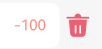

# BH\_NoteBook

## 记账本项目简介

**项目名称**：BH\_NoteBook(记账本)

**项目作者**：薛博璇

**项目开源地址**：https://github.com/XBXyftx/BH\_NoteBook

**项目简介**：一款界面清新可爱的记账本软件，支持分事件类型的支出收入记账。

## 开发笔记

### 基本结构：

整体分为两个页面，首页和记账页。

工程结构在原有stagestage模型上新增components和data文件夹。


#### components

该文件夹存储的是各个核心页面组件，利于进行数据解耦。

#### data

该文件夹中存储的是工具接口和数据。在BillData文件中定义了每个账单事件的工具接口BillItem，其中包括了四个属性。

```
// 订单
export interface BillItem {
  id: number
  type: BillType
  money: number
  useFor: UseForItem
}

// 账单项
export interface UseForItem {
  id: number
  icon: ResourceStr
  name: string
}

// 支付类型 枚举
export enum BillType {
  Pay,
  InCome
}
```

这四个属性分别代表了账单的id，收入或是支出，金额数量以及具体的账单类型。

针对于账单类型，BillData文件利用const定义了两个个常量对象数组，用于定义一些常见的支出收入类型，供用户选择。

```
// 支出的类型分类
export const payBillCategoryList: UseForCategory[] = [
  {
    title: '餐饮',
    items: [
      {
        id: 1, icon: $r('app.media.food'), name: '餐费'
      },
      {
        id: 2, icon: $r('app.media.drinks'), name: '酒水饮料'
      },
      {
        id: 3, icon: $r('app.media.dessert'), name: '甜品零食'
      },
    ]
  },
  {
    title: '出行交通',
    items: [
      {
        id: 4, icon: $r('app.media.taxi'), name: '打车租车'
      },
      {
        id: 5, icon: $r('app.media.longdistance'), name: '旅行票费'
      },
    ]
  },
  {
    title: '休闲娱乐',
    items: [
      {
        id: 6, icon: $r('app.media.bodybuilding'), name: '运动健身'
      },
      {
        id: 7, icon: $r('app.media.game'), name: '休闲玩乐'
      },
      {
        id: 8, icon: $r('app.media.audio'), name: '媒体影音'
      },
      {
        id: 9, icon: $r('app.media.travel'), name: '旅游度假'
      },
    ],
  },
  {
    title: '日常支出',
    items: [
      {
        id: 10, icon: $r('app.media.clothes'), name: '衣服裤子'
      },
      {
        id: 11, icon: $r('app.media.bag'), name: '鞋帽包包'
      },
      {
        id: 12, icon: $r('app.media.book'), name: '知识学习'
      },
      {
        id: 13, icon: $r('app.media.promote'), name: '能力提升'
      },
      {
        id: 14, icon: $r('app.media.home'), name: '家装布置'
      },
    ],
  },
  {
    title: '其他支出',
    items: [{ id: 15, icon: $r('app.media.community'), name: '社区缴费' }]
  }
]

// 收入的类型分类
export const inComBillCategoryList: UseForCategory[] = [
  {
    title: '个人收入',
    items: [
      { id: 16, icon: $r('app.media.salary'), name: '工资' },
      { id: 17, icon: $r('app.media.overtimepay'), name: '加班' },
      { id: 18, icon: $r('app.media.bonus'), name: '奖金' },
    ],
  },
  {
    title: '其他收入',
    items: [
      { id: 19, icon: $r('app.media.financial'), name: '理财收入' },
      { id: 20, icon: $r('app.media.cashgift'), name: '礼金收入' },
    ],
  },
]
```

#### 支出收入高亮切换

```
@State billType:BillType = BillType.Pay
```

设置标志性状态变量，配合三元运算符实现


#### 切换账单类型渲染

在添加新账单时会选择账单所属的支出或收入类型，而每类账单类型又有许多子类，所以在渲染类型列表时采用双重ForEach来进行渲染，而每个大类的子类数量不一，所以采用flex组件来实现弹性布局，自动换行。

每个类型的显示都是由一个图片和一个字符串组成，所以将其封装为自定义组件IconCom，通过将带渲染对象传入来进行渲染。同时根据selectedID标识符来切换选中状态。

```
// 订单
List({ space: 10 }) {
  ForEach(this.billType === BillType.Pay ? payBillCategoryList : inComBillCategoryList,
    (item: UseForCategory, index: number) => {
      ListItem() {
        Column({ space: 20 }) {
          Text(item.title)
            .alignSelf(ItemAlign.Start)
            .fontColor(Color.Gray)
            .fontSize(14)

          Flex({ wrap: FlexWrap.Wrap, direction: FlexDirection.Row,space:{main:LengthMetrics.vp(30),cross:LengthMetrics.vp(20)} }) {
            ForEach(item.items, (useForItem: UseForItem) => {
              if (this.selectedID === useForItem.id) {
                IconCom({ useForItem: useForItem })
                  .borderRadius(5)// 选中的高亮样式
                  .border({ width: 1, color: '#5b8161' })
                  .backgroundColor('#dcf1e4')
                  .onClick(()=>{
                    this.selectedID=useForItem.id
                  })
              } else {
                IconCom({ useForItem: useForItem })
                  .borderRadius(5)// 默认的样式
                  .border({ width: 1, color: Color.Transparent })
                  .backgroundColor(Color.Transparent)
                  .onClick(()=>{
                    this.selectedID=useForItem.id
                  })
              }
            })
          }
          .alignSelf(ItemAlign.Start)

        }
        .width('100%')
      }
    })

}
.padding(15)
.width('100%')
.borderRadius(25)
.height(500)
.backgroundColor(Color.White)
```


#### 持久化

```
PersistentStorage.persistProp<BillItem[]>('list',[])
```

#### 添加账单

在添加按钮绑定点击事件，判断金额是否为0防止错账出现。若金额正常则获取AppStorage中的帐单列表索引，利用unshift内置函数来将新账单插入到数组表头。

```
export function addItem(item:BillItem){
  if (item.money=== 0) {
    AlertDialog.show({
      message:'金额不能为空'
    })
    return
  }else {
    const list = AppStorage.link<BillItem[]>('list')
    list.get().unshift(item)
  }
}
```

而由于在页面的状态变量inputNum处只获取到了对应Item的id索引所以还需要一个函数来处理索引到Item对象的转换。

```
export function getSelectedItemById(index:number){
  // 遍历支出分类
  for (const category of payBillCategoryList) {
    const item = category.items.find((item) => item.id === index);
    if (item) return item;
  }

  // 遍历收入分类
  for (const category of inComBillCategoryList) {
    const item = category.items.find((item) => item.id === index);
    if (item) return item;
  }
  return null
}

Button('保 存')
  .width('80%')
  .type(ButtonType.Capsule)
  .backgroundColor(Color.Transparent)
  .fontColor('#5b8161')
  .border({ width: 1, color: '#5b8161' })
  .margin(10)
  .onClick(()=>{
    addItem({
      id:Number(new Date().toUTCString()+Math.floor(Math.random()*100)),
      type:this.billType,
      money:this.inputNum,
      useFor:getSelectedItemById(this.selectedID)!
    })
  })
```

getSelectedItemById函数的返回值是UseForItem|null的联合类型，所以此处要使用！进行非空断言。

**在后续开发中我意识到账单金额存在正负数问题，用户很可能不会正确的按照正负数来进行输入，为防止存入的数据发生错误导致数据失真，这里针对于点击事件进行修改。无视用户所输入的正负号，直接根据当前账单类型billType来对用户输入数字的绝对值添加正负号。**

```
.onClick(()=>{
  if (this.billType===BillType.Pay) {
    addItem({
      id:Number(new Date().toUTCString()+Math.floor(Math.random()*100)),
      type:this.billType,
      money:-Math.abs(Number(this.inputNum)),
      useFor:getSelectedItemById(this.selectedID)!
    })
  }else if (this.billType===BillType.InCome){
    addItem({
      id:Number(new Date().toUTCString()+Math.floor(Math.random()*100)),
      type:this.billType,
      money:Math.abs(Number(this.inputNum)),
      useFor:getSelectedItemById(this.selectedID)!
    })
  }

  this.clean
})
```

#### 金额判定bug

而在实际测试时发现虽然inputNum的类型设置成number时可以顺利的实现与TextInput组件的双向绑定，但在输入框输入内容又删除后，addItem函数无法正确判断钱的数值是否为0，所以又将inputNum的类型改回了string。对应的点击事件也进行了微调。

同时更改了事件id的命名格式。

```
.onClick(()=>{
  if (this.billType===BillType.Pay) {
    addItem({
      id:Number(new Date().getTime()+Math.floor(Math.random()*100)),
      type:this.billType,
      money:-Math.abs(Number(this.inputNum)),
      useFor:getSelectedItemById(this.selectedID)!
    })
  }else if (this.billType===BillType.InCome){
    addItem({
      id:Number(new Date().getTime()+Math.floor(Math.random()*100)),
      type:this.billType,
      money:Math.abs(Number(this.inputNum)),
      useFor:getSelectedItemById(this.selectedID)!
    })
  }

  this.clean
})
```

#### 金额统计

在首页最上方会统计全部的账单信息并给出支出和收入的金额数字。所以这里定义三个函数来获取收入支出以及余额。

```
export function getPaySumNum():number{
  const list = AppStorage.link<BillItem[]>('list')
  const payItemList = list.get().filter((billItem:BillItem)=>{
    return billItem.type===BillType.Pay
  })
  const paySum = payItemList.reduce((a,b)=>{
    return a + b.money
  },0)
  return paySum
}

export function getIncomeSumNum():number{
  const list = AppStorage.link<BillItem[]>('list')
  const IncomeItemList = list.get().filter((billItem:BillItem)=>{
    return billItem.type===BillType.InCome
  })
  const IncomeSum = IncomeItemList.reduce((a,b)=>{
    return a + b.money
  },0)
  return IncomeSum
}

export function getBillSumMoney():number{
  return getPaySumNum()+getIncomeSumNum()
}
```


#### 删除订单

利用ListItem组件的swipeAction属性来实现滑动账单组件拉出删除按钮来进行账单的删除操作。



定义函数deleteItem用于处理删除事件，直接通过id进行筛选删除即可。

```TypeScript
export function deleteItem(id: number) {
  const list = AppStorage.link<BillItem[]>('list')
  list.set(list.get().filter(item => item.id != id))
}
```
